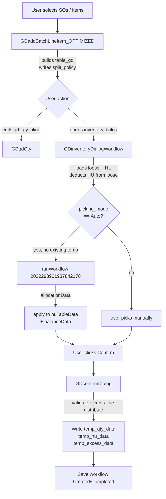

# Goods Delivery — Handling Unit + Auto Allocation Guide

> **Audience:** mobile engineers re-implementing the Goods Delivery (GD) flow on a native platform.
>
> **Scope:** explains how Handling Units (HU) work end-to-end inside GD, how the three split policies (`ALLOW_SPLIT`, `FULL_HU_PICK`, `NO_SPLIT`) change behavior, and how the new workflow-driven auto-allocation contract replaces the old in-page allocator.
>
> **Source files covered (full code in Part 12):**
> 1. `GDaddBatchLineItem_OPTIMIZED.js`
> 2. `GDinventoryDialogWorkflow.js`
> 3. `GDconfirmDialog.js`
> 4. `GDgdQty.js`

---

## Table of Contents

1. [Big Picture](#part-1--big-picture)
2. [Core Data Model](#part-2--core-data-model)
3. [Split Policies](#part-3--split-policies)
4. [Handling Unit Loading Pipeline](#part-4--handling-unit-loading-pipeline)
5. [Auto Allocation via Workflow](#part-5--auto-allocation-via-workflow)
6. [UOM Conversion Rules](#part-6--uom-conversion-rules)
7. [Confirm Flow (GDconfirmDialog)](#part-7--confirm-flow-gdconfirmdialog)
8. [gd_qty Change Handler (GDgdQty)](#part-8--gd_qty-change-handler-gdgdqty)
9. [Initial Table Build (GDaddBatchLineItem_OPTIMIZED)](#part-9--initial-table-build-gdaddbatchlineitem_optimized)
10. [Mobile Implementation Cheat Sheet](#part-10--mobile-implementation-cheat-sheet)
11. [Edge Cases and Gotchas](#part-11--edge-cases-and-gotchas)
12. [Full Source Code](#part-12--full-source-code)

---

## Part 1 — Big Picture

### Why this exists

BladeX is a low-code ERP platform. Functions in this repo run inside the low-code runtime (`this.setData`, `this.getValues`, `this.runWorkflow`, etc.) and are wired to form events. The Goods Delivery (GD) module turns Sales Orders into picked, packed, ready-to-ship records.

A **Handling Unit (HU)** is a physical container (carton, pallet, tote) that holds one or more materials in known quantities at a known bin. Picking from an HU means committing the *whole* HU or part of it depending on the **split policy** configured for the plant.

A **Sales Order (SO)** drives demand. SO lines reserve stock (`on_reserved_gd` rows with `status: "Pending"`). When GD is created, those pending reservations are converted into `Allocated` reservations and eventually consumed at post-delivery time.

The desktop UI used to compute allocations in the browser. That logic was moved to a **server-side workflow** (`runWorkflow("2032298961937842178", params, ...)`) which now decides which loose balance rows and which HU items satisfy a requested quantity, honoring strategy + split policy + priority.

### The 4 files at a glance

| File | Role |
|---|---|
| `GDaddBatchLineItem_OPTIMIZED.js` | Runs after the user picks SOs/items. Batches every prep query (Item, balances, picking_setup, batch, pending reservations, HU presence) into 5-6 round-trips, builds `table_gd`, writes the plant's `split_policy` to the form. Allocation is **not** done here. |
| `GDinventoryDialogWorkflow.js` | Runs when the user opens the per-line inventory dialog. Loads loose balance rows, loads HUs, deducts HU qty from loose to avoid double-count, overwrites `reserved_qty` with SO-line-specific reservations, calls the workflow for auto allocation, marks disabled HUs by policy. |
| `GDconfirmDialog.js` | Runs on the dialog's Confirm button. Validates, builds `temp_qty_data` / `temp_hu_data` / `temp_excess_data`, performs cross-line distribution for non-`ALLOW_SPLIT` policies, recomputes line price and grand total. |
| `GDgdQty.js` | Runs when the user edits the `gd_qty` field inline. For GDPP mode rescales pre-picked data. For regular GD, runs the single-balance-record manual allocation shortcut; bails out if any HU exists for the material. |

### End-to-end flow



### Glossary

| Term | Meaning |
|---|---|
| **Loose stock** | Balance rows in `item_balance` / `item_batch_balance` / `item_serial_balance` not tied to any HU. Shown in the "loose" tab of the inventory dialog. |
| **HU** | Handling Unit; row in `handling_unit` collection with a `table_hu_items` array. Each item carries `material_id`, `quantity` (base UOM), optional `batch_id`. |
| **HU header row** | A row in `gd_item_balance.table_hu` with `row_type: "header"` representing one whole HU. Carries `hu_select`, `handling_no`, total `item_quantity`. |
| **HU item row** | A row in `gd_item_balance.table_hu` with `row_type: "item"`. One per material inside the HU. Carries `deliver_quantity` (the user's pick), `item_quantity` (display, alt UOM for current material), `item_quantity_base` (base UOM). |
| **Split policy** | Plant-level rule from `picking_setup.split_policy`. One of `ALLOW_SPLIT`, `FULL_HU_PICK`, `NO_SPLIT`. Decides whether the user can take *part* of an HU, or must take whole HUs only. |
| **GDPP mode** | "GD from Picking Plan." When `is_select_picking === 1`, the line was pre-allocated by an upstream Picking Plan; the dialog and `gd_qty` handler skip DB fetches and rescale existing `temp_qty_data`. |
| **Pending reserved** | `on_reserved_gd` row with `status: "Pending"`. Stock reserved for an SO line but not yet committed to a specific GD. Available to "use" for the GD created from that SO. |
| **Cross-GD reservation** | `on_reserved_gd` row with `status: "Allocated"` belonging to a *different* GD document. Display logic subtracts these so the user doesn't see stock that's already committed elsewhere. |
| **`temp_qty_data`** | JSON string on each `table_gd` row. Combined loose + HU allocations. HU entries identified by non-null `handling_unit_id`. |
| **`temp_hu_data`** | JSON string on each `table_gd` row. The HU-only view (item rows from the dialog's HU tab) preserved so the dialog can re-render the user's prior HU picks on reopen. |
| **`temp_excess_data`** | JSON string on each `table_gd` row. Records excess quantity when `FULL_HU_PICK` or `NO_SPLIT` forces over-pick (whole-HU > demand) or includes a foreign material with no matching GD line. |
| **`view_stock`** | Human-readable summary text shown on the GD line ("Total: 10 PCS\n\nDETAILS:\n1. BIN-A: 10 PCS"). |
| **Foreign item** | An HU contains material X, but the current dialog row is for material Y. The X item is "foreign" with respect to the current line. |

---

## Part 2 — Core Data Model

The mobile UI must mirror these shapes; field names match what `setData` writes and `getValues` reads.

### `table_gd[i]` — one row per GD line

| Field | Type | Units | Source | Notes |
|---|---|---|---|---|
| `material_id` | string | — | `Item.id` | Empty for description-only lines. |
| `material_name` | string | — | `Item.material_name` | |
| `gd_order_quantity` | number | alt UOM | SO line | Original demand. |
| `gd_initial_delivered_qty` | number | alt UOM | SO line | Already delivered before this GD. |
| `gd_delivered_qty` | number | alt UOM | computed | `gd_initial_delivered_qty + gd_qty`. |
| `gd_qty` | number | alt UOM | dialog / handler | Quantity this GD line will deliver. |
| `base_qty` | number | base UOM | dialog / handler | `gd_qty` converted via `table_uom_conversion`. |
| `gd_order_uom_id` | string | — | SO line | The alt UOM for this line. May be rewritten to base UOM for serialized items. |
| `good_delivery_uom_id` | string | — | same as above | |
| `so_line_item_id` | string | — | SO | Used to look up pending reservations + workflow `parent_line_id`. |
| `temp_qty_data` | JSON string | mixed | Confirm / gd_qty | Combined loose + HU allocations. |
| `temp_hu_data` | JSON string | alt UOM (display) | Confirm | HU rows from dialog for restoration. |
| `temp_excess_data` | JSON string | base | Confirm | Excess records (FULL_HU_PICK / NO_SPLIT only). |
| `view_stock` | string | — | Confirm / gd_qty | Display summary. |
| `gd_price`, `price_per_item`, `total_price` | number | — | Confirm | Line money. |
| `over_delivery_tolerance` | (from Item) | % | Item master | Read inside Confirm for limit math. |

### `gd_item_balance.table_item_balance` — loose tab

| Field | Units | Notes |
|---|---|---|
| `location_id` | — | Bin location. |
| `batch_id` | — | Null if not batch-managed. |
| `serial_number` | — | Only for serialized items. |
| `unrestricted_qty` | alt UOM (dialog display) | After HU deduction + UOM conversion. |
| `reserved_qty` | alt UOM | Rewritten to SO-line-specific reserved by dialog. |
| `balance_quantity` | alt UOM | After HU deduction + UOM conversion. |
| `block_qty`, `qualityinsp_qty`, `intransit_qty` | alt UOM | Display only. |
| `gd_quantity` | alt UOM | The user's pick on this row. |

### `gd_item_balance.table_hu` — HU tab

| Field | Applies to | Notes |
|---|---|---|
| `row_type` | both | `"header"` or `"item"`. |
| `hu_select` | header | 0/1 checkbox; only meaningful for `FULL_HU_PICK` / `NO_SPLIT`. |
| `handling_unit_id` | both | Same id on the header and all its item rows. |
| `handling_no` | header | Display code. |
| `storage_location_id` | both | |
| `location_id` | both | Bin under the HU. |
| `material_id`, `material_name` | item | Foreign items keep their own material here. |
| `batch_id` | item | Null if not batch-managed. |
| `item_quantity` | item (header = sum) | **Display qty** — alt UOM for current material, base UOM for foreign items. |
| `item_quantity_base` | item | **Always base UOM.** Used when sending to workflow. |
| `deliver_quantity` | item | User's pick. Header carries 0; total derived from sum of item rows. |
| `expired_date`, `manufacturing_date` | item | Pass-through from `table_hu_items`. |
| `balance_id` | item | Pass-through. |
| `hu_disabled` | header (mostly) | 1 if the HU is unpickable in current policy. |
| `hu_disabled_reason` | header | Free text — "Contains items not in this delivery", "Already allocated". |

### Form-level keys

| Key | Set by | Used by | Notes |
|---|---|---|---|
| `split_policy` | `GDaddBatchLineItem_OPTIMIZED` | `GDinventoryDialogWorkflow`, `GDconfirmDialog` | Single source of truth after initial load. |
| `is_select_picking` | upstream (Picking Plan) | all four files | `1` → GDPP mode. |
| `plant_id` | `GDonChangePlant` | all | Scope. |
| `organization_id` | mount | all | Scope. |
| `gd_status` | save flows | `GDinventoryDialogWorkflow` | `"Draft"` vs `"Created"` affects which `Allocated` reservations are included in display. |
| `id` (doc id) | platform | dialog workflow + auto-alloc | Used to filter *own* vs *other-GD* reservations. |
| `currency_code`, `customer_name`, `so_no`, `so_id`, `reference_type` | `GDaddBatchLineItem_OPTIMIZED` | display | |

---

## Part 3 — Split Policies

`split_policy` is read from `picking_setup` keyed by `plant_id` (and `picking_after === "Goods Delivery"`). It is then written to the form so dialogs/Confirm can read a single value.

### Comparison matrix

| Behavior | `ALLOW_SPLIT` | `FULL_HU_PICK` | `NO_SPLIT` |
|---|---|---|---|
| Foreign items inside an HU | Hidden (filter to current material only) | Shown | Shown |
| HU with foreign items disabled? | N/A | Only if `allow_mixed_item === 0` | Always |
| `hu_select` checkbox visible? | Hidden | Visible | Visible |
| `deliver_quantity` field editable? | Header disabled, items editable | All disabled (auto-set by checkbox) | All disabled (auto-set by checkbox) |
| Over-pick beyond GD line allowed? | No (tolerance enforced) | Yes (whole HU may exceed demand) | No (tolerance strictly enforced) |
| Cross-line distribution on Confirm? | No | Yes | Yes |
| `temp_excess_data` populated? | No | Yes (`over_pick`, `no_gd_line`) | Yes (`over_pick` only) |
| Tolerance enforced on Confirm? | Yes | Skipped | Yes — strict, returns early |
| HUs allocated by another GD line in same form | Visible, qty already deducted | Disabled with reason "Already allocated" | Disabled with reason "Already allocated" |

### How the matrix lands in code

- **HU item filter:** `GDinventoryDialogWorkflow.js` → `fetchHandlingUnits` → `itemsToShow = splitPolicy === "ALLOW_SPLIT" ? items.filter(material_id === materialId) : allActiveItems`.
- **`hu_select` visibility:** dialog workflow toggles `this.hide` vs `this.display` on the column based on policy.
- **`deliver_quantity` editability:** dialog workflow disables headers under `ALLOW_SPLIT` and disables *every* deliver_quantity under the other two.
- **Foreign-HU disable:** dialog workflow sets `hu_disabled = 1` when `splitPolicy === "NO_SPLIT"` or (`FULL_HU_PICK` AND `allow_mixed_item === 0`) and the HU contains items not in the GD.
- **Tolerance skip / strict:** `GDconfirmDialog.js`: NO_SPLIT block runs the strict check first; the global `orderLimit < totalDeliveredQty` check skips only for FULL_HU_PICK.
- **Cross-line distribution:** `GDconfirmDialog.js` runs the distribution loop when `splitPolicy !== "ALLOW_SPLIT"`.

### Worked example — HU `HU-001` contains 10 PCS of Material A + 6 PCS of Material B. GD line 1 demands 8 PCS of A; line 2 demands 4 PCS of B.

**ALLOW_SPLIT**

- Dialog for line 1 shows `HU-001` with one item row: Material A, item_quantity = 10.
- Foreign Material B is filtered out of the HU table for this dialog.
- User edits deliver_quantity = 8 on the A row, confirms.
- `temp_hu_data` on line 1 holds `{material_id: A, deliver_quantity: 8}`.
- Dialog for line 2 shows `HU-001` with one item row: Material B, item_quantity = 6.
- User edits deliver_quantity = 4, confirms.
- `temp_hu_data` on line 2 holds `{material_id: B, deliver_quantity: 4}`. No excess.

**FULL_HU_PICK** (assume `allow_mixed_item = 1`)

- Dialog for line 1 shows `HU-001` with two item rows: A (item_quantity = 10) and B (item_quantity = 6). All `deliver_quantity` fields are disabled.
- User ticks `hu_select`. Platform-side handler sets deliver_quantity = item_quantity on every item row in the HU.
- Confirm runs. Material A: 10 picked vs 8 demanded → 2 over_pick → `temp_excess_data` on line 1 gets one record (reason `"over_pick"`).
- Material B is foreign for line 1; cross-line distribution finds line 2 needs 4 of B → 4 PCS pushed into line 2's `temp_qty_data` + `temp_hu_data`. Remaining 6-4 = 2 of B → `temp_excess_data` on line 1 gets one record (reason `"over_pick"`).
- Line 2's gd_qty in the form is *not* incremented by this distribution — only its temp data.

If `allow_mixed_item = 0`, `HU-001` is disabled in line 1's dialog because B isn't in the same GD (well it is in line 2 here, but the check is *every* item must be in the GD). Adjust example: if HU also contained Material C with no GD line, then the HU becomes disabled.

**NO_SPLIT**

- Same as FULL_HU_PICK behavior for whole-HU checkbox, but:
  - Tolerance is strict — if 10 PCS of A would exceed line 1's `gd_order_quantity * (1 + tolerance/100) - initialDelivered`, Confirm returns early with an alert.
  - HUs containing foreign items not in the GD are always disabled (no `allow_mixed_item` override).
  - `temp_excess_data` records only `over_pick`, never `no_gd_line` (since foreign items are blocked upstream).

---

## Part 4 — Handling Unit Loading Pipeline

This is what `fetchHandlingUnits` (inside `GDinventoryDialogWorkflow.js`) does every time the inventory dialog opens.

### Step 1 — Load all HUs for plant + org

```js
db.collection("handling_unit")
  .where({ plant_id, organization_id, is_deleted: 0 })
  .get();
```

One query. Returns `handling_unit` rows, each with a `table_hu_items` array of `{material_id, material_name, quantity, batch_id, location_id, balance_id, expired_date, manufacturing_date, is_deleted, ...}`.

### Step 2 — Filter HUs that contain the current material

```js
const allActiveItems = (hu.table_hu_items || []).filter(item => item.is_deleted !== 1);
const hasCurrentMaterial = allActiveItems.some(item => item.material_id === materialId);
if (!hasCurrentMaterial) continue;
```

### Step 3 — Decide which items to render

```js
const itemsToShow = splitPolicy === "ALLOW_SPLIT"
  ? allActiveItems.filter(item => item.material_id === materialId)
  : allActiveItems;
```

`ALLOW_SPLIT` hides foreign items. The other policies need to *see* them so the checkbox commitment is visible.

### Step 4 — Push header row (placeholder)

```js
const headerRow = {
  row_type: "header",
  hu_select: 0,
  handling_unit_id: hu.id,
  handling_no: hu.handling_no,
  material_id: "",
  material_name: "",
  storage_location_id: hu.storage_location_id,
  location_id: hu.location_id,
  batch_id: null,
  item_quantity: 0,         // filled after items processed
  deliver_quantity: 0,
  remark: hu.remark || "",
  balance_id: "",
};
```

### Step 5 — For each item, compute display quantity

```js
const baseQty = parseFloat(huItem.quantity) || 0;          // DB qty, base UOM
const isForeignItem = huItem.material_id !== materialId;
let displayQty = isForeignItem
  ? baseQty                                                 // foreign stays in base
  : convertBaseToAlt(baseQty, itemData, altUOM);            // current material → alt UOM
```

Then subtract:

1. **`otherLinesHuAllocations`** — qty this same HU already gave to other GD lines *in the same form*. Pre-collected from `data.table_gd` by iterating other rows' `temp_hu_data`.
2. **`crossGdReserved`** — qty pre-allocated on `on_reserved_gd` for this HU+material+batch by other GDs (status `"Allocated"`, `doc_id !== currentDocId`).

```js
if (otherLineAlloc) displayQty -= otherLineAlloc.deliver_quantity;
if (crossGdReserved > 0) displayQty -= crossGdReserved;
if (displayQty <= 0) continue;       // skip exhausted items
```

### Step 6 — Push item row, accumulate header total

```js
headerItemTotal += displayQty;
huTableData.push({
  row_type: "item",
  handling_unit_id: hu.id,
  material_id: huItem.material_id,
  material_name: huItem.material_name,
  storage_location_id: hu.storage_location_id,
  location_id: huItem.location_id || hu.location_id,
  batch_id: huItem.batch_id || null,
  item_quantity: displayQty,                // alt UOM (current) or base (foreign)
  item_quantity_base: baseQty,              // base UOM always
  deliver_quantity: 0,
  remark: "",
  balance_id: huItem.balance_id || "",
  expired_date: huItem.expired_date || null,
  manufacturing_date: huItem.manufacturing_date || null,
  create_time: huItem.create_time || hu.create_time,
});
```

After the items loop:

```js
headerRow.item_quantity = Math.round(headerItemTotal * 1000) / 1000;
```

### Step 7 — Drop empty HU headers

After the loop, any HU whose items were all skipped (fully reserved elsewhere) has its header culled:

```js
const huIdsWithItems = new Set(
  huTableData.filter(r => r.row_type === "item").map(r => r.handling_unit_id),
);
huTableData = huTableData.filter(
  r => r.row_type === "item" || huIdsWithItems.has(r.handling_unit_id),
);
```

### Step 8 — Restore prior allocations from `temp_hu_data`

If the user already touched this line before, restore their `deliver_quantity` values:

```js
const parsedTempHu = JSON.parse(line.temp_hu_data || "[]");
for (const tempItem of parsedTempHu) {
  const match = huTableData.find(row =>
    row.row_type === "item" &&
    row.handling_unit_id === tempItem.handling_unit_id &&
    row.material_id === tempItem.material_id &&
    (row.batch_id || "") === (tempItem.batch_id || "")
  );
  if (match) match.deliver_quantity = tempItem.deliver_quantity || 0;
}
```

For `FULL_HU_PICK` / `NO_SPLIT`, every header whose HU has any restored allocation gets `hu_select = 1` so the checkbox shows ticked.

### Step 9 — Deduct HU qty from loose balance (very important)

This is a separate concern, done inside `processRegularMode`. HU items physically live in `item_balance.unrestricted_qty` too — the warehouse counts them once. So if the dialog showed *both* the HU qty and the full loose qty, the user could double-pick.

```js
// fetchHuQtyByLocation collapses HU contents into a Map keyed by location[-batch].
for (const row of freshDbData) {
  const key = isBatchManaged
    ? `${row.location_id}-${row.batch_id || "no_batch"}`
    : `${row.location_id}`;
  const huQty = huQtyMap.get(key) || 0;
  row.unrestricted_qty = Math.max(0, row.unrestricted_qty - huQty);
  row.balance_quantity = Math.max(0, row.balance_quantity - huQty);
}
```

Skipped for serialized items (HU items don't carry serial numbers, so no overlap).

### Step 10 — SO-line-specific reserved overwrite

Each loose row's `reserved_qty` is normally a total across all reservations. The dialog rewrites it to *only* the portion reserved for the current SO line, converted into the dialog's display UOM. This drives the validation rule: `available = unrestricted + reserved_qty (SO-line-specific)`.

`gd_status`-aware filter:
- **Draft GD**: include only `Pending` rows (SO/Production reserved that this GD has not yet claimed).
- **Created GD**: include `Pending` + this GD's own `Allocated` rows (this delivery's already-claimed stock).
- **Other GD's `Allocated`**: never included.

Loose rows ending up with both `unrestricted_qty = 0` and `reserved_qty = 0` are filtered out before display.

### Step 11 — Tab visibility

```js
if (huTableData.length > 0) showTab("handling_unit"); else hideTab("handling_unit");
if (looseRowsFinal.length === 0) {
  hideTab("loose");
  if (huRowsFinal.length > 0) activateTab("handling_unit");
}
```

This is the only DOM-coupled bit. On mobile, just hide the tab if the array is empty.

---

## Part 5 — Auto Allocation via Workflow

### Why workflow

Allocation needs the latest server state (other concurrent GDs, fresh reservations) and uses the same strategy logic the server uses for batch operations. Doing it in the browser would either lag or duplicate logic.

### Trigger conditions

All four must be true (from `GDinventoryDialogWorkflow.js`, around the `applyAutoAllocation` call site):

```js
if (
  !hasExistingAllocation &&           // line has no temp_qty_data and no temp_hu_data
  requestedQty > 0 &&                 // user wants something
  organizationId &&                   // scoping available
  pickingSetup.picking_mode === "Auto"
) {
  await applyAutoAllocation(...);
}
```

`hasExistingAllocation` is derived from BOTH `temp_qty_data` (loose) and `temp_hu_data` (HU). Either present → skip auto-alloc; the user already committed something.

### Workflow contract

```js
this.runWorkflow(
  "2032298961937842178",
  workflowParams,
  (res) => resolve(res),
  (err) => reject(err),
);
```

**Params (`workflowParams`):**

| Key | Type | Notes |
|---|---|---|
| `material_id` | string | Item id (`itemData.id`). |
| `quantity` | number | Requested qty in **alt UOM** (matches `gd_qty`). |
| `plant_id`, `organization_id` | string | Scope. |
| `allocationType` | string | Hard-coded `"GD"`. |
| `allocationStrategy` | string | `picking_setup.default_strategy_id` (e.g. `"RANDOM"`, `"FIFO"`). Fallback `"RANDOM"`. |
| `isPending` | 0 / 1 | `1` if line has `so_line_item_id` (SO-driven), else `0` (manual GD). |
| `parent_line_id` | string | `so_line_item_id` or `""`. |
| `existingAllocationData` | array | Other-line allocations on the same form, for double-allocation prevention. Shape: `{ location_id, batch_id, handling_unit_id, quantity }`. |
| `huData` | array | The whole `huTableData` (header+item rows). **Crucially**, every `row_type === "item"` row has its `item_quantity` rewritten to `item_quantity_base` so the workflow gets base UOM. |
| `huPriority` | string | `picking_setup.hu_priority` — usually `"HU First"` (try HU before loose) or the inverse. |
| `currentDocId` | string | Current GD id or `""`. Lets the workflow ignore reservations it already made for this GD. |
| `orderUomId` | string | `altUOM` — so the workflow can convert results back. |
| `splitPolicy` | string | `"ALLOW_SPLIT"` \| `"FULL_HU_PICK"` \| `"NO_SPLIT"`. Drives workflow's HU-first vs loose-first picks. |
| `allowMixedItem` | 0 / 1 | Only meaningful for `FULL_HU_PICK`. |
| `lineMaterials` | array | All GD line `material_id`s. Used by workflow for `NO_SPLIT` material-set checks. |

**Result shape** (`workflowResult.data || workflowResult`):

```js
{
  allocationData: [
    {
      source: "hu" | "loose",
      handling_unit_id: "...",     // present when source === "hu"
      location_id: "...",
      batch_id: "..." | null,
      material_id: "...",
      gd_quantity: 5                // amount allocated, in alt UOM (or base for serialized)
    },
    ...
  ],
  message: "..."                    // diagnostic
}
```

### Apply allocations back to the UI

```js
// HU allocations → write deliver_quantity on matching HU item row
for (const alloc of allocationData) {
  if (alloc.source === "hu" && alloc.handling_unit_id) {
    const huItem = huTableData.find(row =>
      row.row_type === "item" &&
      row.handling_unit_id === alloc.handling_unit_id &&
      row.material_id === (alloc.material_id || "") &&
      (row.batch_id || "") === (alloc.batch_id || "")
    );
    if (huItem) huItem.deliver_quantity = alloc.gd_quantity || 0;
  }
}

// Loose allocations → sum by (location_id, batch_id) and assign per balance row
const looseAllocations = allocationData.filter(a => a.source !== "hu");
const allocationMap = new Map();
for (const alloc of looseAllocations) {
  const key = isBatchManaged
    ? `${alloc.location_id}-${alloc.batch_id || "no_batch"}`
    : `${alloc.location_id}`;
  allocationMap.set(key, (allocationMap.get(key) || 0) + (alloc.gd_quantity || 0));
}
for (const balance of balanceData) {
  const key = ...;
  balance.gd_quantity = allocationMap.get(key) || 0;
}
```

> **Trust the workflow.** Do NOT cap `gd_quantity` against `unrestricted_qty` after applying. The workflow already accounted for reserved stock + UOM conversions; the dialog's `unrestricted_qty` doesn't show reserved.

### Post-application policy bookkeeping

For `FULL_HU_PICK` / `NO_SPLIT`, after auto-alloc, mark HU headers as selected so the checkbox reflects the result:

```js
if (splitPolicy !== "ALLOW_SPLIT") {
  const autoAllocatedHuIds = new Set(
    huTableData.filter(r => r.row_type === "item" && r.deliver_quantity > 0)
              .map(r => r.handling_unit_id)
  );
  for (const row of huTableData) {
    if (row.row_type === "header" && autoAllocatedHuIds.has(row.handling_unit_id)) {
      row.hu_select = 1;
    }
  }
}
```

### Then mark disabled HUs

After auto-alloc (or even when picking_mode is Manual), the dialog calculates which HUs are *unpickable* in current policy:

- `NO_SPLIT`: any HU with foreign items is disabled.
- `FULL_HU_PICK + allow_mixed_item === 0`: same.
- Non-`ALLOW_SPLIT`: HUs already used by another GD line on the same form (from collected `allocatedHuIds`) are disabled too.

Disabled rows get `hu_disabled = 1` and `hu_disabled_reason` set.

---

## Part 6 — UOM Conversion Rules

### The two universes

| Universe | Used by | Example |
|---|---|---|
| **Alt UOM** | SO line, GD line `gd_qty`, dialog display | `BOX` (1 BOX = 12 PCS) |
| **Base UOM** | `Item.based_uom`, HU `table_hu_items.quantity`, balance rows internally, workflow input/output (serialized always) | `PCS` |

### Conversion helpers

| Helper | Direction | Defined in |
|---|---|---|
| `convertToBaseUOM(qty, altUOM, itemData)` | alt → base | `GDaddBatchLineItem_OPTIMIZED.js`, also re-implemented inline in `GDconfirmDialog.js` |
| `convertBaseToAlt(baseQty, itemData, altUOM)` | base → alt | `GDinventoryDialogWorkflow.js` (called `convertBaseToAlt`) |
| `convertFromBaseUOM(qty, altUOM)` | base → alt | `GDconfirmDialog.js` (closure-bound `itemData`) |
| `convertGdToDialogUOM(qty)` | GD-line UOM → dialog UOM | `GDconfirmDialog.js` |

All use `Item.table_uom_conversion[].base_qty` (how many base units per 1 alt unit).

### Where each unit lives

| Field | UOM |
|---|---|
| `gd_qty`, `gd_order_quantity`, `gd_delivered_qty`, `gd_initial_delivered_qty` | Alt UOM (except serialized items, which are rewritten to base UOM by `checkInventoryWithDuplicates`) |
| `base_qty` | Base UOM (always) |
| `Item.based_uom` | The base UOM id |
| `handling_unit.table_hu_items[].quantity` (DB) | Base UOM |
| `gd_item_balance.table_hu[].item_quantity` (display) | Alt UOM for current material; base for foreign items |
| `gd_item_balance.table_hu[].item_quantity_base` | Base UOM (always) |
| `gd_item_balance.table_item_balance[].unrestricted_qty` (display) | Alt UOM (converted by `processItemBalanceData`) |
| `on_reserved_gd.open_qty` | The UOM stored on the row (`item_uom`); converted on read |
| Workflow input `huData[].item_quantity` | Base UOM (rewritten before send) |
| Workflow output `allocationData[].gd_quantity` | Alt UOM (for non-serialized); base UOM (for serialized) |

### Serialized item special case

When `item.serial_number_management === 1`, `checkInventoryWithDuplicates` rewrites the GD line so `gd_order_quantity`, `gd_delivered_qty`, etc. are stored in **base UOM** and `gd_order_uom_id` / `good_delivery_uom_id` point to `itemData.based_uom`. From that point on, the rest of the pipeline treats serialized lines as base-UOM-native. No further conversion needed in Confirm.

---

## Part 7 — Confirm Flow (GDconfirmDialog)

The Confirm handler does *much* more than persist — it's where cross-line distribution and excess accounting happen.

### Step-by-step

1. **Read state.**
   ```js
   const temporaryData = data.gd_item_balance.table_item_balance;   // loose tab
   const huData = data.gd_item_balance.table_hu || [];               // HU tab
   const rowIndex = data.gd_item_balance.row_index;
   const selectedUOM = data.gd_item_balance.material_uom;            // user-selected dialog UOM
   const goodDeliveryUOM = data.table_gd[rowIndex].gd_order_uom_id;  // line's original UOM
   const splitPolicy = data.split_policy || "ALLOW_SPLIT";
   ```

2. **Detect item flavor.** Fetch `Item` once; cache `isSerializedItem`, `isBatchManagedItem`, `itemData`.

3. **UOM normalisation for tolerance math.** `convertGdToDialogUOM` walks GD-line qty → base → dialog UOM. Used so `gd_order_quantity` and `gd_initial_delivered_qty` are comparable to dialog quantities even if the user changed the dialog's UOM.

4. **Compute totals.**
   ```js
   const balanceTotal = sum(item.gd_quantity > 0 ? gd_quantity : 0);
   const filteredHuData = huData.filter(r => r.row_type === "item" && r.deliver_quantity > 0);
   const totalHuQuantity = sum(filteredHuData[].deliver_quantity);
   const totalDialogQuantity = balanceTotal + totalHuQuantity;
   const totalDeliveredQty = initialDeliveredQty + totalDialogQuantity;
   ```

5. **NO_SPLIT strict tolerance** (early exit if violated):
   ```js
   if (splitPolicy === "NO_SPLIT") {
     const maxAllowed = gd_order_quantity * (1 + tolerance/100);
     const remainingCapacity = maxAllowed - initialDeliveredQty;
     if (totalDialogQuantity > remainingCapacity) { alert(...); return; }
   }
   ```

6. **Per-row validation.** For each loose row with `gd_quantity > 0`:
   - **GDPP mode** (`is_select_picking === 1`): only check `gd_quantity <= to_quantity`. Serialized: check whole units + serial present.
   - **Regular**:
     - Serialized: serial present, whole units, `availableQty (= unrestricted + reserved_qty) >= quantity`.
     - Non-serialized: `availableQty >= quantity` where `availableQty = unrestricted + reserved` when SO line exists, else only `unrestricted`.

7. **HU validation.** For each HU item with `deliver_quantity > 0`: `deliver_quantity <= item_quantity`.

8. **Global tolerance check** (skipped for FULL_HU_PICK; NO_SPLIT was already handled): `if (orderLimit > 0 && orderLimit < totalDeliveredQty) return`.

9. **UOM back-conversion** if user switched dialog UOM mid-edit: rewrite every quantity field on `temporaryData` from `selectedUOM` back to `goodDeliveryUOM`.

10. **Filter zero-qty rows.** `filteredData = processedTemporaryData.filter(item => item.gd_quantity > 0)`.

11. **Build `view_stock` summary text** by fetching bin location names + batch names (parallel). Layout differs when there's both loose + HU:
    ```
    Total: 14 PCS

    LOOSE STOCK:
    1. BIN-A-01: 6 PCS
    2. BIN-A-02: 0 PCS    (filtered)

    HANDLING UNIT:
    1. HU-001: 8 PCS
       [Batch: BATCH-X]
    ```

12. **Combine into single `temp_qty_data`.** HU items are coerced to balance-row shape and concatenated:
    ```js
    const huAsBalanceData = filteredHuData.map(huItem => ({
      material_id: huItem.material_id,
      location_id: huItem.location_id,
      batch_id: huItem.batch_id || null,
      balance_id: huItem.balance_id || "",
      gd_quantity: parseFloat(huItem.deliver_quantity),
      handling_unit_id: huItem.handling_unit_id,
      plant_id: data.plant_id,
      organization_id: data.organization_id,
      is_deleted: 0,
    }));
    const combinedQtyData = [...filteredData, ...huAsBalanceData];
    ```

13. **Build `temp_excess_data`** (non-ALLOW_SPLIT only):
    - **`over_pick`**: `currentMaterialHuTotal > gd_qty` → push `{handling_unit_id, material_id, quantity: excess, ...reason: "over_pick"}`.
    - **`no_gd_line`** (FULL_HU_PICK only): for HU items whose `material_id` is in *no* GD line, push `{...reason: "no_gd_line"}`.

14. **Cross-line distribution** (non-ALLOW_SPLIT only, this is the trickiest bit).

    **Goal:** when an HU is picked whole, its foreign-material items must flow to *other* GD lines that demand those materials.

    **Algorithm:**
    ```
    1. Build gdMaterialMap: { material_id -> [{ lineIndex, remainingNeed }] }
       computed from data.table_gd, skipping current rowIndex,
       and subtracting each line's already-allocated qty (parsed from its temp_qty_data).
    
    2. Create empty crossLineAccum: { lineIndex -> { tempQty: [], tempHu: [] } }
       (Accumulator pattern — avoids re-reading stale data.table_gd between writes.)
    
    3. For each HU item with deliver_quantity > 0 AND material_id != current material:
       a. Look up matching lines in gdMaterialMap.
       b. Distribute remainingHuQty greedily across matching lines (in order).
       c. For each line that takes some, push two entries to crossLineAccum[lineIndex]:
            tempQty.push({ material_id, location_id, batch_id, balance_id,
                           gd_quantity: allocQty, handling_unit_id, ... })
            tempHu.push({ row_type: "item", handling_unit_id, material_id,
                          location_id, batch_id, balance_id,
                          deliver_quantity: allocQty, item_quantity })
       d. After distribution, any leftover remainingHuQty becomes excess (over_pick).
    
    4. After processing all HU items, write each lineIndex's accumulated arrays back:
         this.setData({
           [`table_gd.${idx}.temp_qty_data`]: JSON.stringify(accum.tempQty),
           [`table_gd.${idx}.temp_hu_data`]: JSON.stringify(accum.tempHu),
         });
    ```

    > The accumulator pattern matters: if you read `data.table_gd[idx].temp_qty_data`, mutate, write, then read again on the next iteration, the read sees the *original* snapshot from `getValues()` — not your prior write. So the original snapshot is loaded once into `crossLineAccum` and all subsequent additions go to the accumulator.

15. **Persist on current row.**
    ```js
    this.setData({
      [`table_gd.${rowIndex}.temp_qty_data`]: JSON.stringify(combinedQtyData),
      [`table_gd.${rowIndex}.temp_hu_data`]: JSON.stringify(filteredHuData),
      [`table_gd.${rowIndex}.temp_excess_data`]: JSON.stringify(tempExcessData),
      [`table_gd.${rowIndex}.view_stock`]: formattedString,
      [`gd_item_balance.table_item_balance`]: [],   // clear dialog state
      [`gd_item_balance.table_hu`]: [],
    });
    ```

16. **Update GD line money + delivery qty.**
    ```js
    const totalGdQuantity = filteredDataTotal + filteredHuDataTotal;
    const deliveredQty = initialDeliveredQty + totalGdQuantity;
    const pricePerItem = totalPrice / orderQuantity;
    const currentRowPrice = pricePerItem * totalGdQuantity;
    this.setData({
      [`table_gd.${rowIndex}.gd_delivered_qty`]: deliveredQty,
      [`table_gd.${rowIndex}.gd_qty`]: totalGdQuantity,
      [`table_gd.${rowIndex}.base_qty`]: totalGdQuantity,   // serialized assumed base
      [`table_gd.${rowIndex}.gd_price`]: currentRowPrice,
      [`table_gd.${rowIndex}.price_per_item`]: pricePerItem,
    });
    ```

    > Note: `base_qty` here is set equal to `totalGdQuantity` because for non-serialized items the dialog already coerced quantities into the line's `goodDeliveryUOM` and the persist step expects base parity. (Serialized lines have alt = base already.) Mobile clients should re-convert if needed at save time using `table_uom_conversion`.

17. **Recompute grand total.** Loop every `table_gd` row, compute `(total_price / order_quantity) * gd_qty`, sum, write to `gd_total`.

18. **Close dialog.**

---

## Part 8 — gd_qty Change Handler (GDgdQty)

Fired when the user types into `table_gd.${rowIndex}.gd_qty` directly (not via dialog). Two execution paths.

### Path A — GDPP mode (`is_select_picking === 1`)

Pre-condition: line has existing `temp_qty_data` from upstream Picking Plan, with each entry carrying `to_quantity`.

1. Parse `temp_qty_data`.
2. Compute `totalToQuantity = sum(entry.to_quantity)`.
3. **Cap check:** if new `gd_qty > totalToQuantity`, reset gd_qty to `totalToQuantity`, alert, return.
4. Rescale each entry proportionally:
   ```js
   updatedTempData = tempDataArray.map(item => ({
     ...item,
     gd_quantity: roundQty((item.to_quantity / totalToQuantity) * quantity),
   }));
   ```
5. Rebuild `view_stock` summary (fetch location + batch names).
6. Persist:
   ```js
   this.setData({
     [`table_gd.${rowIndex}.gd_delivered_qty`]: totalDeliveredQty,
     [`table_gd.${rowIndex}.gd_undelivered_qty`]: orderedQty - totalDeliveredQty,
     [`table_gd.${rowIndex}.view_stock`]: summary,
     [`table_gd.${rowIndex}.temp_qty_data`]: JSON.stringify(updatedTempData),
     [`table_gd.${rowIndex}.base_qty`]: quantity * baseQtyFactor,
   });
   ```

### Path B — Regular GD, single-balance shortcut

The handler only auto-fills `temp_qty_data` when allocation is *unambiguous*. If there are multiple balance rows, it bails (user must use the dialog).

Guards in order:

1. **Description-only line** (no `itemCode`): just write `view_stock = "Total: 5 BOX"`, update delivered qty.
2. **HU exists for material**: `db.handling_unit_atu7sreg_sub.where({material_id, is_deleted: 0})`. If any row, return — force the dialog.
3. **Existing HU allocation guard**: parse `temp_qty_data`; if any entry has `handling_unit_id`, return without modifying — preserves the dialog's whole-HU pick.

Single-balance shortcuts (each requires exactly one match, else return):

- **Serialized** (`item.serial_number_management === 1`):
  - `orderedQty > 1` → return (mismatch with single-serial assumption).
  - Optional batch path: must have exactly 1 batch.
  - Exactly 1 `item_serial_balance` row with `unrestricted_qty > 0`.
  - `quantity === 1` (else write a hint message into `view_stock` saying "Please use allocation dialog").
  - Push one `temp_qty_data` record: `{material_id, serial_number, location_id, ...qtys, gd_quantity: 1}`.

- **Batch-managed** (`item_batch_management === 1`):
  - Exactly 1 batch.
  - Exactly 1 `item_batch_balance` row.
  - Push one `temp_qty_data` record carrying `batch_id`.

- **Regular**:
  - Exactly 1 `item_balance` row.
  - Push one `temp_qty_data` record.

For each, also fetch `bin_location.bin_location_combine` to build `view_stock`:

```
Total: 5 PCS

DETAILS:
1. WH1-A-01: 5 PCS
[Batch: BATCH-X]     (if batch)
```

Then `setData` the line's `gd_delivered_qty`, `gd_undelivered_qty`, `view_stock`, `temp_qty_data`, `base_qty`.

### What this means for mobile

The mobile inline-edit field should mirror this: in 95% of real cases (one bin, no HUs) the user types a number and the form is complete. The dialog is the escape hatch when allocation is ambiguous.

---

## Part 9 — Initial Table Build (GDaddBatchLineItem_OPTIMIZED)

Triggered when the user finishes the "select sales order / select item" dialog. Two responsibilities: build `table_gd` and prime `split_policy`.

### Execution outline

1. **Validation** — at least one item selected, all SOs same customer, customer didn't change from prior state, reference type didn't change.
2. **Build `allItems` array** — normalises both reference modes (`Document` and `Item`) into a common shape with `itemId`, `orderedQty`, `altUOM`, `sourceItem`, `deliveredQtyFromSource`, `plannedQtyFromSource`, `original_so_id`, `so_no`, `so_line_item_id`, `item_category_id`.
3. **Dedup** — drop items whose `deliveredQtyFromSource === orderedQty` or already in `existingGD`.
4. **Call `createTableGdWithBaseUOM(allItems)`** — converts serialized items to base UOM eagerly; non-serialized stays in alt.
5. **Initial `setData`** — writes `table_gd`, `customer_name`, `currency_code`, `so_no`, `so_id`, `reference_type`, empty insufficient dialog table.
6. **`setTimeout(200ms)` → `checkInventoryWithDuplicates(newItems, plantId, existingGD.length)`** — the heavyweight inventory + allocation check.

### Inside `checkInventoryWithDuplicates`

The optimisation: every prep query is batched. 500+ queries (one per row) collapse into 5-6 plant-wide queries.

```js
const [
  itemDataMap,           // Map<materialId, Item row>
  balanceDataMaps,       // { serial, batch, regular } each Map<materialId, balance[]>
  pickingSetup,          // { pickingMode, defaultStrategy, fallbackStrategy, splitPolicy }
  batchDataMap,          // Map<materialId, batch[]>
  pendingReservedMap,    // Map<so_line_item_id, on_reserved_gd[]>
  huMaterialSet,         // Set<materialId> — materials known to have HU
] = await Promise.all([
  batchFetchItems(materialIds),
  batchFetchBalanceData(materialIds, plantId),
  fetchPickingSetup(plantId),
  batchFetchBatchData(materialIds, plantId),
  batchFetchPendingReserved(allSoLineItemIds, plantId),
  fetchHUData(),
]);
```

Then a `batchFetchBinLocations` over every distinct `location_id` from those balance rows. All results are stored on `window.cachedXxx` so downstream code can reuse them without re-querying.

### Demand vs availability

For each material:
- `totalUnrestrictedQtyBase = sum(balance.unrestricted_qty)` — UNrestricted only (zero-stock rows are filtered out before this).
- `totalPendingReservedQtyBase = sum(open_qty in base UOM)` from `pendingReservedMap` for these SO lines. Reserved for *this* SO line is available *to* this SO line.
- `totalPreviousAllocations` = sum of qty already committed by other rows in the same form (tracked in `window.globalAllocationTracker`).
- `availableStockAfterAllocations = max(0, unrestricted + pendingReserved - previousAllocations)`.

`totalDemandBase` is computed across this material's lines as `max(0, undeliveredQty - plannedQty)` converted to base UOM.

If `totalDemandBase > availableStockAfterAllocations` → insufficient → record entries into `dialog_insufficient.table_insufficient` and *do not* fill `gd_qty`.

### When to skip the single-balance auto-fill

```js
const materialHasHU = huMaterialSet.has(materialId);
if (balanceData.length === 1 && !materialHasHU) {
  // enable gd_qty for inline edit
}
```

If any HU exists for the material, the inline-edit shortcut (the same logic mirrored in `GDgdQty.js`) is suppressed and the user is steered to the dialog.

### Final write

```js
await this.setData({
  table_gd: tableGdArray,
  split_policy: pickingSetup.splitPolicy || "ALLOW_SPLIT",
});
```

One write. From now on, every other file reads `data.split_policy` from the form.

---

## Part 10 — Mobile Implementation Cheat Sheet

- [ ] Read `picking_setup` once at form open; cache `picking_mode`, `default_strategy_id`, `hu_priority`, `split_policy`, `allow_mixed_item`.
- [ ] Treat `split_policy` as the form's source of truth — write it once, read it from form state everywhere.
- [ ] When listing HU items, always filter `is_deleted !== 1`.
- [ ] HU items live in *both* `handling_unit.table_hu_items` and `item_balance.unrestricted_qty` — subtract HU qty (`fetchHuQtyByLocation` logic) from loose-balance display per (location, batch) key.
- [ ] Skip the HU-deduction step for serialized items (no overlap).
- [ ] When showing HU contents, deduct same-form `otherLinesHuAllocations` and cross-GD `on_reserved_gd` (`status: "Allocated"`, `doc_id !== currentDocId`, `open_qty > 0`).
- [ ] HU item display qty: convert base→alt for current material only; foreign items render in base UOM.
- [ ] Always carry both `item_quantity` (display) and `item_quantity_base` (storage) on HU item rows.
- [ ] Rewrite `reserved_qty` per balance row to *SO-line-specific* reserved before validation.
- [ ] Auto-alloc workflow trigger: `picking_mode === "Auto"` AND no existing `temp_qty_data` / `temp_hu_data` AND `gd_qty > 0` AND `organization_id` present.
- [ ] Send `huData[].item_quantity` in **base UOM** to the workflow (rewrite from `item_quantity_base`).
- [ ] Workflow id is `"2032298961937842178"`.
- [ ] Trust workflow `gd_quantity` results — don't cap against dialog `unrestricted_qty` (which excludes reserved).
- [ ] On Confirm, NO_SPLIT enforces tolerance strictly (early return); FULL_HU_PICK skips it; ALLOW_SPLIT enforces the global limit.
- [ ] `temp_qty_data` mixes loose and HU rows; HU rows carry `handling_unit_id`.
- [ ] `temp_hu_data` is HU-only, used by the dialog to re-render prior picks.
- [ ] `temp_excess_data` only meaningful for non-ALLOW_SPLIT (`over_pick`, `no_gd_line`).
- [ ] Cross-line distribution: use an accumulator keyed by `lineIndex`; never re-read `table_gd` between writes within one Confirm pass.
- [ ] Persist `gd_qty` in alt UOM, `base_qty` in base UOM. Serialized lines store both in base.
- [ ] Hide the loose tab if it ends up empty after deductions; hide the HU tab if no HUs match.
- [ ] On `gd_qty` inline edit: if HUs exist for the material → bail out and force dialog use.

---

## Part 11 — Edge Cases and Gotchas

### HU containing only foreign items disappears
When `splitPolicy === "ALLOW_SPLIT"`, foreign items are filtered out of `itemsToShow`. If an HU has *only* foreign items, all its item rows are skipped, the header gets culled by the post-loop filter, and the user never sees that HU in this dialog session. This is intentional.

### Empty HU after cross-GD deduction
Similarly, if every item row gets `displayQty <= 0` after deducting `otherLinesHuAllocations` + `crossGdReserved`, the header is culled. The HU is fully committed elsewhere.

### Serialized items use base UOM end-to-end
`checkInventoryWithDuplicates` rewrites `gd_order_quantity`, `gd_delivered_qty`, `gd_initial_delivered_qty`, `gd_order_uom_id`, `good_delivery_uom_id` to base for serialized items. Downstream code shouldn't re-convert.

### `gd_status` flips reservation visibility
| `gd_status` | Reservations shown |
|---|---|
| `Draft` | `Pending` only (SO/Production reservations the user can claim). |
| `Created` | `Pending` + this GD's own `Allocated`. |
| Other GDs' `Allocated` | Never shown. |

The dialog logic for SO-line reserved overwrite filters this.

### `existingAllocationData` is *other-line* only
When the dialog collects `existingAllocationData` for the workflow, it skips `idx === rowIndex`. The workflow accounts for the current line's own allocation by reading the dialog's `huData` + `requestedQty`.

### `temp_qty_data` row identity
A row with `handling_unit_id` is an HU pick; without is a loose pick. Downstream save logic relies on this. When mutating `temp_qty_data` (e.g. during cross-line distribution), preserve `handling_unit_id` exactly.

### Accumulator vs `getValues()` snapshot
`this.getValues()` returns a snapshot at call time. Subsequent `this.setData` calls update the form but don't mutate the snapshot. So the cross-line distribution loop *must* track running totals locally; reading `data.table_gd[idx].temp_qty_data` after writing it returns the original.

### Tab auto-switching
The dialog hides the loose tab when `table_item_balance` ends up empty after all deductions. If HU rows exist, it programmatically clicks the HU tab so the user doesn't land on a hidden tab. Mobile: just don't render the empty tab.

### `picking_setup` fallback
If no row matches `plant_id + picking_after === "Goods Delivery"`, defaults are:
```js
{ pickingMode: "Manual", defaultStrategy: "RANDOM", fallbackStrategy: "RANDOM", splitPolicy: "ALLOW_SPLIT" }
```
The `FULL_HU_PICK`/`NO_SPLIT` dialog code further reads a *second* `picking_setup` query (by org, not plant) for `allow_mixed_item` — note the inconsistency.

### `temp_hu_data` shape mismatch
`temp_hu_data` stores `filteredHuData` directly — HU table rows in their full shape (`row_type: "item"`, `item_quantity`, `deliver_quantity`, etc.). When restoring on dialog reopen, only `row_type === "item"` entries are matched back; header restoration is implicit.

### Whole-HU over_pick reason
`reason: "over_pick"` appears in two distinct sites:
1. Current-material HU total > GD line need (top of `tempExcessData` block).
2. Foreign-material HU remainder after cross-line distribution didn't find a home.

Both use the same reason string; save logic should treat them identically.

### `view_stock` is display-only
It's purely cosmetic — never parsed back. Mobile can render whatever format suits the device; just keep it human-readable and consistent with desktop.

---

## Part 12 — Full Source Code

Each file is reproduced unmodified.

### File 1 — `Goods Delivery/GDaddBatchLineItem_OPTIMIZED.js`

```js
// ============================================================================
// OPTIMIZED VERSION - Performance improvements for 50+ items
// Key optimizations:
// 1. Batch queries - ALL data fetched upfront in 4-5 queries instead of 500+
// 2. Single setData call - Build entire table data, then update once
// 3. Cached data reuse - Allocation phase uses pre-fetched data
// 4. Batch bin location query - Single query for all locations
// ============================================================================

// FIX: Helper function to round quantities to 3 decimal places to avoid floating-point precision issues
const roundQty = (value) => Math.round((parseFloat(value) || 0) * 1000) / 1000;

// ============================================================================
// BATCH QUERY HELPER FUNCTIONS
// ============================================================================

const batchFetchItems = async (materialIds) => {
  if (!materialIds || materialIds.length === 0) return new Map();
  const uniqueIds = [
    ...new Set(materialIds.filter((id) => id && id !== "undefined")),
  ];
  if (uniqueIds.length === 0) return new Map();

  try {
    // Fetch all items in SINGLE query using filter with "in" operator
    const result = await db
      .collection("Item")
      .filter([
        {
          type: "branch",
          operator: "all",
          children: [
            {
              prop: "id",
              operator: "in",
              value: uniqueIds,
            },
            {
              prop: "is_deleted",
              operator: "equal",
              value: 0,
            },
          ],
        },
      ])
      .get();

    const itemMap = new Map();
    (result.data || []).forEach((item) => {
      itemMap.set(item.id, item);
    });

    console.log(
      `✅ Batch fetched ${itemMap.size} items in SINGLE query (was ${uniqueIds.length} queries)`,
    );
    return itemMap;
  } catch (error) {
    console.error("Error batch fetching items:", error);
    return new Map();
  }
};

const batchFetchBalanceData = async (materialIds, plantId) => {
  if (!materialIds || materialIds.length === 0) {
    return { serial: new Map(), batch: new Map(), regular: new Map() };
  }

  const uniqueIds = [
    ...new Set(materialIds.filter((id) => id && id !== "undefined")),
  ];
  if (uniqueIds.length === 0) {
    return { serial: new Map(), batch: new Map(), regular: new Map() };
  }

  try {
    // Fetch all balance types in parallel - 3 queries total (was 150 queries)
    const [serialResult, batchResult, regularResult] = await Promise.all([
      db
        .collection("item_serial_balance")
        .filter([
          {
            type: "branch",
            operator: "all",
            children: [
              { prop: "material_id", operator: "in", value: uniqueIds },
              { prop: "plant_id", operator: "equal", value: plantId },
              { prop: "is_deleted", operator: "equal", value: 0 },
            ],
          },
        ])
        .get(),
      db
        .collection("item_batch_balance")
        .filter([
          {
            type: "branch",
            operator: "all",
            children: [
              { prop: "material_id", operator: "in", value: uniqueIds },
              { prop: "plant_id", operator: "equal", value: plantId },
              { prop: "is_deleted", operator: "equal", value: 0 },
            ],
          },
        ])
        .get(),
      db
        .collection("item_balance")
        .filter([
          {
            type: "branch",
            operator: "all",
            children: [
              { prop: "material_id", operator: "in", value: uniqueIds },
              { prop: "plant_id", operator: "equal", value: plantId },
              { prop: "is_deleted", operator: "equal", value: 0 },
            ],
          },
        ])
        .get(),
    ]);

    const serialMap = new Map();
    const batchMap = new Map();
    const regularMap = new Map();

    // Group serial balances by material_id
    (serialResult.data || []).forEach((balance) => {
      if (!serialMap.has(balance.material_id)) {
        serialMap.set(balance.material_id, []);
      }
      serialMap.get(balance.material_id).push(balance);
    });

    // Group batch balances by material_id
    (batchResult.data || []).forEach((balance) => {
      if (!batchMap.has(balance.material_id)) {
        batchMap.set(balance.material_id, []);
      }
      batchMap.get(balance.material_id).push(balance);
    });

    // Group regular balances by material_id
    (regularResult.data || []).forEach((balance) => {
      if (!regularMap.has(balance.material_id)) {
        regularMap.set(balance.material_id, []);
      }
      regularMap.get(balance.material_id).push(balance);
    });

    console.log(
      `✅ Batch fetched balance data: ${serialMap.size} serial, ${
        batchMap.size
      } batch, ${regularMap.size} regular in 3 queries (was ${
        uniqueIds.length * 3
      } queries)`,
    );
    return { serial: serialMap, batch: batchMap, regular: regularMap };
  } catch (error) {
    console.error("Error batch fetching balance data:", error);
    return { serial: new Map(), batch: new Map(), regular: new Map() };
  }
};

const fetchPickingSetup = async (plantId) => {
  try {
    const response = await db
      .collection("picking_setup")
      .where({ plant_id: plantId, picking_after: "Goods Delivery" })
      .get();

    if (!response?.data?.length) {
      return {
        pickingMode: "Manual",
        defaultStrategy: "RANDOM",
        fallbackStrategy: "RANDOM",
        splitPolicy: "ALLOW_SPLIT",
      };
    }

    const setup = response.data[0];
    return {
      pickingMode: setup.picking_mode || "Manual",
      defaultStrategy: setup.default_strategy_id || "RANDOM",
      fallbackStrategy: setup.fallback_strategy_id || "RANDOM",
      splitPolicy: setup.split_policy || "ALLOW_SPLIT",
    };
  } catch (error) {
    console.error("Error fetching picking setup:", error);
    return {
      pickingMode: "Manual",
      defaultStrategy: "RANDOM",
      fallbackStrategy: "RANDOM",
      splitPolicy: "ALLOW_SPLIT",
    };
  }
};

const batchFetchBinLocations = async (locationIds) => {
  if (!locationIds || locationIds.length === 0) return new Map();
  const uniqueIds = [...new Set(locationIds.filter((id) => id))];
  if (uniqueIds.length === 0) return new Map();

  try {
    // Fetch all bin locations in SINGLE query using filter with "in" operator
    const result = await db
      .collection("bin_location")
      .filter([
        {
          type: "branch",
          operator: "all",
          children: [
            { prop: "id", operator: "in", value: uniqueIds },
            { prop: "is_deleted", operator: "equal", value: 0 },
          ],
        },
      ])
      .get();

    const binMap = new Map();
    (result.data || []).forEach((bin) => {
      binMap.set(bin.id, bin);
    });

    console.log(
      `✅ Batch fetched ${binMap.size} bin locations in SINGLE query (was ${uniqueIds.length} queries)`,
    );
    return binMap;
  } catch (error) {
    console.error("Error batch fetching bin locations:", error);
    return new Map();
  }
};

const batchFetchBatchData = async (materialIds, plantId) => {
  if (!materialIds || materialIds.length === 0) return new Map();
  const uniqueIds = [
    ...new Set(materialIds.filter((id) => id && id !== "undefined")),
  ];
  if (uniqueIds.length === 0) return new Map();

  try {
    // Fetch all batch data in SINGLE query using filter with "in" operator
    const result = await db
      .collection("batch")
      .filter([
        {
          type: "branch",
          operator: "all",
          children: [
            { prop: "material_id", operator: "in", value: uniqueIds },
            { prop: "plant_id", operator: "equal", value: plantId },
            { prop: "is_deleted", operator: "equal", value: 0 },
          ],
        },
      ])
      .get();

    const batchMap = new Map();
    (result.data || []).forEach((batch) => {
      if (!batchMap.has(batch.material_id)) {
        batchMap.set(batch.material_id, []);
      }
      batchMap.get(batch.material_id).push(batch);
    });

    console.log(
      `✅ Batch fetched batch data for ${batchMap.size} materials in SINGLE query (was ${uniqueIds.length} queries)`,
    );
    return batchMap;
  } catch (error) {
    console.error("Error batch fetching batch data:", error);
    return new Map();
  }
};

// 🔧 NEW: Batch fetch pending reserved data for all SO line items
const batchFetchPendingReserved = async (soLineItemIds, plantId) => {
  if (!soLineItemIds || soLineItemIds.length === 0) return new Map();
  const uniqueIds = [
    ...new Set(soLineItemIds.filter((id) => id && id !== "undefined")),
  ];
  if (uniqueIds.length === 0) return new Map();

  try {
    const result = await db
      .collection("on_reserved_gd")
      .filter([
        {
          type: "branch",
          operator: "all",
          children: [
            { prop: "parent_line_id", operator: "in", value: uniqueIds },
            { prop: "plant_id", operator: "equal", value: plantId },
            { prop: "status", operator: "equal", value: "Pending" },
          ],
        },
      ])
      .get();

    // Group by parent_line_id (so_line_item_id)
    const reservedMap = new Map();
    (result.data || []).forEach((reserved) => {
      if (!reservedMap.has(reserved.parent_line_id)) {
        reservedMap.set(reserved.parent_line_id, []);
      }
      reservedMap.get(reserved.parent_line_id).push(reserved);
    });

    console.log(
      `✅ Batch fetched pending reserved data for ${reservedMap.size} SO lines in SINGLE query`,
    );
    return reservedMap;
  } catch (error) {
    console.error("Error batch fetching pending reserved data:", error);
    return new Map();
  }
};

// Helper function to convert quantity from alt UOM to base UOM
const convertToBaseUOM = (quantity, altUOM, itemData) => {
  if (!altUOM || altUOM === itemData.based_uom) {
    return quantity;
  }

  const uomConversion = itemData.table_uom_conversion?.find(
    (conv) => conv.alt_uom_id === altUOM,
  );

  if (uomConversion && uomConversion.base_qty) {
    return quantity * uomConversion.base_qty;
  }

  return quantity;
};

// ============================================================================
// OPTIMIZED MAIN INVENTORY CHECK FUNCTION
// ============================================================================

const checkInventoryWithDuplicates = async (
  allItems,
  plantId,
  existingRowCount = 0,
) => {
  console.log("🚀 OPTIMIZED VERSION: Starting inventory check");
  const overallStart = Date.now();

  // Group items by material_id to find duplicates
  const materialGroups = {};

  allItems.forEach((item, index) => {
    const materialId = item.itemId;
    if (!materialGroups[materialId]) {
      materialGroups[materialId] = [];
    }
    materialGroups[materialId].push({
      ...item,
      originalIndex: index + existingRowCount,
    });
  });

  console.log("Material groups:", materialGroups);

  const insufficientItems = [];
  const insufficientDialogData = []; // Build insufficient dialog table entries

  // ========================================================================
  // STEP 1: Batch fetch ALL data upfront (replaces 100s of individual queries)
  // ========================================================================
  const materialIds = Object.keys(materialGroups).filter(
    (id) => id !== "undefined",
  );

  // Collect all SO line item IDs for pending reserved fetch
  const allSoLineItemIds = [];
  Object.values(materialGroups).forEach((items) => {
    items.forEach((item) => {
      if (item.so_line_item_id) {
        allSoLineItemIds.push(item.so_line_item_id);
      }
    });
  });

  console.log(`🚀 Fetching data for ${materialIds.length} unique materials...`);
  const fetchStart = Date.now();

  // Fetch HU sub-items to check which materials have handling units
  const fetchHUData = async () => {
    const huResults = await Promise.all(
      materialIds.map((id) =>
        db
          .collection("handling_unit_atu7sreg_sub")
          .where({ material_id: id, is_deleted: 0 })
          .get(),
      ),
    );

    const huMaterialSet = new Set();
    huResults.forEach((res, idx) => {
      if (res.data && res.data.length > 0) {
        huMaterialSet.add(materialIds[idx]);
      }
    });
    return huMaterialSet;
  };

  const [
    itemDataMap,
    balanceDataMaps,
    pickingSetup,
    batchDataMap,
    pendingReservedMap,
    huMaterialSet,
  ] = await Promise.all([
    batchFetchItems(materialIds),
    batchFetchBalanceData(materialIds, plantId),
    fetchPickingSetup(plantId),
    batchFetchBatchData(materialIds, plantId),
    batchFetchPendingReserved(allSoLineItemIds, plantId),
    fetchHUData(),
  ]);

  console.log(
    `✅ All data fetched in ${
      Date.now() - fetchStart
    }ms (was 500+ queries, now 5-6 queries)`,
  );

  // Extract for easier access
  const { pickingMode } = pickingSetup;

  // ========================================================================
  // STEP 2: Collect all location IDs for batch bin location fetch
  // ========================================================================
  const allLocationIds = new Set();
  balanceDataMaps.serial.forEach((balances) => {
    balances.forEach((b) =>
      allLocationIds.add(b.location_id || b.bin_location_id),
    );
  });
  balanceDataMaps.batch.forEach((balances) => {
    balances.forEach((b) => allLocationIds.add(b.location_id));
  });
  balanceDataMaps.regular.forEach((balances) => {
    balances.forEach((b) => allLocationIds.add(b.location_id));
  });

  // Batch fetch ALL bin locations (replaces 250+ individual queries)
  const binLocationMap = await batchFetchBinLocations([...allLocationIds]);

  // Store globally for allocation phase
  window.cachedBinLocationMap = binLocationMap;
  window.cachedItemDataMap = itemDataMap;
  window.cachedBalanceDataMaps = balanceDataMaps;
  window.cachedBatchDataMap = batchDataMap;
  window.cachedPickingSetup = pickingSetup;
  window.cachedPendingReservedMap = pendingReservedMap;

  // ========================================================================
  // STEP 3: Process each material and build table data in memory
  // ========================================================================
  const tableGdArray = this.getValue("table_gd") || [];
  const fieldsToDisable = [];
  const fieldsToEnable = [];

  for (const [materialId, items] of Object.entries(materialGroups)) {
    console.log("Processing materialID:", materialId);

    // Handle undefined material IDs
    if (materialId === "undefined") {
      console.log(`Skipping item with null materialId`);
      items.forEach((item) => {
        const index = item.originalIndex;
        const orderedQty = parseFloat(item.orderedQty) || 0;
        const deliveredQty = parseFloat(item.deliveredQtyFromSource) || 0;
        const plannedQty = parseFloat(item.plannedQtyFromSource) || 0;
        const undeliveredQty = roundQty(orderedQty - deliveredQty);
        const suggestedQty = roundQty(Math.max(0, undeliveredQty - plannedQty));

        tableGdArray[index] = {
          ...tableGdArray[index],
          material_id: "",
          material_name: item.itemName || "",
          gd_material_desc: item.sourceItem.so_desc || "",
          gd_order_quantity: orderedQty,
          gd_delivered_qty: deliveredQty,
          gd_initial_delivered_qty: deliveredQty,
          gd_order_uom_id: item.altUOM,
          good_delivery_uom_id: item.altUOM,
          more_desc: item.sourceItem.more_desc || "",
          line_remark_1: item.sourceItem.line_remark_1 || "",
          line_remark_2: item.sourceItem.line_remark_2 || "",
          line_remark_3: item.sourceItem.line_remark_3 || "",
          base_uom_id: "",
          unit_price: item.sourceItem.so_item_price || 0,
          total_price: item.sourceItem.so_amount || 0,
          item_costing_method: "",
          gd_qty: suggestedQty,
          base_qty: suggestedQty, // no item data → no UOM conversion possible
        };

        fieldsToDisable.push(`table_gd.${index}.gd_delivery_qty`);
        fieldsToEnable.push(`table_gd.${index}.gd_qty`);
      });
      continue;
    }

    // Get item data from cache
    const itemData = itemDataMap.get(materialId);
    if (!itemData) {
      console.error(`Item not found in cache: ${materialId}`);
      continue;
    }

    // Handle items with stock_control = 0
    if (itemData.stock_control === 0 && itemData.show_delivery === 0) {
      console.log(`Skipping item ${materialId} due to stock_control settings`);
      items.forEach((item) => {
        const index = item.originalIndex;
        const orderedQty = parseFloat(item.orderedQty) || 0;
        const deliveredQty = parseFloat(item.deliveredQtyFromSource) || 0;
        const plannedQty = parseFloat(item.plannedQtyFromSource) || 0;
        const undeliveredQty = roundQty(orderedQty - deliveredQty);
        const suggestedQty = roundQty(Math.max(0, undeliveredQty - plannedQty));

        tableGdArray[index] = {
          ...tableGdArray[index],
          material_id: materialId,
          material_name: item.itemName,
          gd_material_desc: item.sourceItem.so_desc || "",
          gd_order_quantity: orderedQty,
          gd_delivered_qty: roundQty(deliveredQty + undeliveredQty),
          gd_initial_delivered_qty: deliveredQty,
          gd_order_uom_id: item.altUOM,
          good_delivery_uom_id: item.altUOM,
          more_desc: item.sourceItem.more_desc || "",
          line_remark_1: item.sourceItem.line_remark_1 || "",
          line_remark_2: item.sourceItem.line_remark_2 || "",
          line_remark_3: item.sourceItem.line_remark_3 || "",
          base_uom_id: itemData.based_uom || "",
          unit_price: item.sourceItem.so_item_price || 0,
          total_price: item.sourceItem.so_amount || 0,
          item_costing_method: itemData.material_costing_method,
          gd_qty: suggestedQty,
          base_qty: roundQty(
            convertToBaseUOM(suggestedQty, item.altUOM, itemData),
          ),
          gd_undelivered_qty: 0,
        };

        if (suggestedQty <= 0) {
          fieldsToDisable.push(
            `table_gd.${index}.gd_qty`,
            `table_gd.${index}.gd_delivery_qty`,
          );
        } else {
          fieldsToDisable.push(`table_gd.${index}.gd_delivery_qty`);
          fieldsToEnable.push(`table_gd.${index}.gd_qty`);
        }
      });
      continue;
    }

    // Get balance data from cache
    let balanceData = [];
    let collectionUsed = "";

    if (itemData.serial_number_management === 1) {
      balanceData = balanceDataMaps.serial.get(materialId) || [];
      collectionUsed = "item_serial_balance";
    } else if (itemData.item_batch_management === 1) {
      balanceData = balanceDataMaps.batch.get(materialId) || [];
      collectionUsed = "item_batch_balance";
    } else {
      balanceData = balanceDataMaps.regular.get(materialId) || [];
      collectionUsed = "item_balance";
    }

    // Filter out zero-stock balance rows so UI branching (single vs multi
    // balance) and allocation only consider rows with usable stock.
    balanceData = balanceData.filter(
      (b) =>
        (parseFloat(b.unrestricted_qty) || 0) > 0 &&
        (parseFloat(b.balance_quantity) || 0) > 0,
    );

    // Calculate total available stock (unrestricted + pending reserved for these SO lines)
    const totalUnrestrictedQtyBase = balanceData.reduce(
      (sum, balance) => sum + (balance.unrestricted_qty || 0),
      0,
    );

    // 🔧 FIXED: Calculate total pending reserved qty WITH UOM conversion to base
    // Reserved stock for a specific SO is AVAILABLE for that SO
    let totalPendingReservedQtyBase = 0;
    items.forEach((item) => {
      if (item.so_line_item_id) {
        const reservedData = pendingReservedMap.get(item.so_line_item_id) || [];
        reservedData.forEach((reserved) => {
          const altQty = parseFloat(reserved.open_qty || 0);
          const altUOM = reserved.item_uom;
          // Convert to base UOM before summing
          const baseQty = convertToBaseUOM(altQty, altUOM, itemData);
          totalPendingReservedQtyBase += baseQty;
        });
      }
    });

    // Subtract existing allocations
    let totalPreviousAllocations = 0;
    if (
      window.globalAllocationTracker &&
      window.globalAllocationTracker.has(materialId)
    ) {
      const materialAllocations =
        window.globalAllocationTracker.get(materialId);
      materialAllocations.forEach((rowAllocations) => {
        rowAllocations.forEach((qty) => {
          totalPreviousAllocations += qty;
        });
      });
    }

    // Available = unrestricted + reserved (for this SO) - previous allocations
    const availableStockAfterAllocations = Math.max(
      0,
      totalUnrestrictedQtyBase +
        totalPendingReservedQtyBase -
        totalPreviousAllocations,
    );

    console.log(
      `Material ${materialId}: Unrestricted=${totalUnrestrictedQtyBase}, PendingReserved=${totalPendingReservedQtyBase}, Available=${availableStockAfterAllocations}, Collection=${collectionUsed}`,
    );

    // Handle UI controls based on balance data length
    // Skip auto-enabling gd_qty if HUs exist for this material (user must use inventory dialog)
    const materialHasHU = huMaterialSet.has(materialId);
    if (balanceData.length === 1 && !materialHasHU) {
      items.forEach((item) => {
        fieldsToDisable.push(`table_gd.${item.originalIndex}.gd_delivery_qty`);
        fieldsToEnable.push(`table_gd.${item.originalIndex}.gd_qty`);
      });
    }

    // Calculate total demand (only unplanned portion needs stock)
    let totalDemandBase = 0;
    items.forEach((item) => {
      const undeliveredQty = roundQty(
        (parseFloat(item.orderedQty) || 0) -
          (parseFloat(item.deliveredQtyFromSource) || 0),
      );
      const plannedQty = parseFloat(item.plannedQtyFromSource) || 0;
      const remainingDemandQty = roundQty(
        Math.max(0, undeliveredQty - plannedQty),
      );
      let remainingDemandQtyBase = remainingDemandQty;
      if (item.altUOM !== itemData.based_uom) {
        const uomConversion = itemData.table_uom_conversion?.find(
          (conv) => conv.alt_uom_id === item.altUOM,
        );
        if (uomConversion && uomConversion.base_qty) {
          remainingDemandQtyBase = remainingDemandQty * uomConversion.base_qty;
        }
      }
      totalDemandBase += remainingDemandQtyBase;

      // Set basic item data
      const index = item.originalIndex;
      tableGdArray[index] = {
        ...tableGdArray[index],
        material_id: materialId,
        material_name: item.itemName,
        gd_material_desc: item.sourceItem.so_desc || "",
        gd_order_quantity: item.orderedQty,
        gd_delivered_qty: item.deliveredQtyFromSource,
        gd_initial_delivered_qty: item.deliveredQtyFromSource,
        gd_order_uom_id: item.altUOM,
        good_delivery_uom_id: item.altUOM,
        more_desc: item.sourceItem.more_desc || "",
        line_remark_1: item.sourceItem.line_remark_1 || "",
        line_remark_2: item.sourceItem.line_remark_2 || "",
        line_remark_3: item.sourceItem.line_remark_3 || "",
        base_uom_id: itemData.based_uom || "",
        unit_price: item.sourceItem.so_item_price || 0,
        total_price: item.sourceItem.so_amount || 0,
        item_costing_method: itemData.material_costing_method,
      };
    });

    console.log(
      `Material ${materialId}: Available=${availableStockAfterAllocations}, Total Remaining Demand (after planned)=${totalDemandBase}`,
    );

    // Check if insufficient stock
    const totalShortfallBase = totalDemandBase - availableStockAfterAllocations;

    if (totalShortfallBase > 0) {
      console.log(
        `❌ Insufficient stock for material ${materialId}: Shortfall=${totalShortfallBase}`,
      );

      // Handle insufficient stock (serialized vs non-serialized)
      if (itemData.serial_number_management === 1) {
        // Serialized items - handle in base UOM
        let remainingSerialCount = balanceData.length;

        items.forEach((item) => {
          const index = item.originalIndex;
          const orderedQty = parseFloat(item.orderedQty) || 0;
          const deliveredQty = parseFloat(item.deliveredQtyFromSource) || 0;
          const plannedQty = parseFloat(item.plannedQtyFromSource) || 0;
          const undeliveredQty = roundQty(orderedQty - deliveredQty);
          const remainingDemandQty = roundQty(
            Math.max(0, undeliveredQty - plannedQty),
          );

          const orderedQtyBase = roundQty(
            convertToBaseUOM(orderedQty, item.altUOM, itemData),
          );
          const deliveredQtyBase = roundQty(
            convertToBaseUOM(deliveredQty, item.altUOM, itemData),
          );
          const undeliveredQtyBase = roundQty(
            convertToBaseUOM(undeliveredQty, item.altUOM, itemData),
          );
          const remainingDemandQtyBase = roundQty(
            convertToBaseUOM(remainingDemandQty, item.altUOM, itemData),
          );

          let availableQtyBase = 0;
          if (remainingSerialCount > 0 && remainingDemandQtyBase > 0) {
            const requiredUnitsBase = Math.floor(remainingDemandQtyBase);
            availableQtyBase = Math.min(
              remainingSerialCount,
              requiredUnitsBase,
            );
            remainingSerialCount -= availableQtyBase;
          }

          // Add to insufficient dialog data (in base UOM for serialized items)
          insufficientDialogData.push({
            material_id: materialId,
            material_name: item.itemName,
            material_uom: itemData.based_uom,
            order_quantity: orderedQtyBase,
            undelivered_qty: undeliveredQtyBase,
            remaining_demand_qty: remainingDemandQtyBase,
            available_qty: availableQtyBase,
            shortfall_qty: roundQty(remainingDemandQtyBase - availableQtyBase),
            fm_key:
              Date.now().toString(36) + Math.random().toString(36).substr(2, 5),
          });

          // Update table array with base UOM
          tableGdArray[index] = {
            ...tableGdArray[index],
            gd_order_quantity: orderedQtyBase,
            gd_delivered_qty: deliveredQtyBase,
            gd_initial_delivered_qty: deliveredQtyBase,
            gd_order_uom_id: itemData.based_uom,
            good_delivery_uom_id: itemData.based_uom,
          };

          // Insufficient stock - don't fill gd_qty
          tableGdArray[index].gd_qty = 0;
          tableGdArray[index].base_qty = 0;
        });
      } else {
        // Non-serialized items
        let remainingStockBase = Math.max(0, availableStockAfterAllocations);

        items.forEach((item) => {
          const index = item.originalIndex;
          const orderedQty = parseFloat(item.orderedQty) || 0;
          const deliveredQty = parseFloat(item.deliveredQtyFromSource) || 0;
          const plannedQty = parseFloat(item.plannedQtyFromSource) || 0;
          const undeliveredQty = roundQty(orderedQty - deliveredQty);
          const remainingDemandQty = roundQty(
            Math.max(0, undeliveredQty - plannedQty),
          );

          let availableQtyAlt = 0;
          if (remainingStockBase > 0 && remainingDemandQty > 0) {
            let remainingDemandQtyBase = remainingDemandQty;
            if (item.altUOM !== itemData.based_uom) {
              const uomConversion = itemData.table_uom_conversion?.find(
                (conv) => conv.alt_uom_id === item.altUOM,
              );
              if (uomConversion && uomConversion.base_qty) {
                remainingDemandQtyBase =
                  remainingDemandQty * uomConversion.base_qty;
              }
            }

            const allocatedBase = Math.min(
              remainingStockBase,
              remainingDemandQtyBase,
            );
            const uomConversion = itemData.table_uom_conversion?.find(
              (conv) => conv.alt_uom_id === item.altUOM,
            );
            availableQtyAlt = roundQty(
              item.altUOM !== itemData.based_uom
                ? allocatedBase / (uomConversion?.base_qty || 1)
                : allocatedBase,
            );

            remainingStockBase -= allocatedBase;
          }

          // Add to insufficient dialog data
          insufficientDialogData.push({
            material_id: materialId,
            material_name: item.itemName,
            material_uom: item.altUOM,
            order_quantity: orderedQty,
            undelivered_qty: undeliveredQty,
            remaining_demand_qty: remainingDemandQty,
            available_qty: availableQtyAlt,
            shortfall_qty: roundQty(remainingDemandQty - availableQtyAlt),
            fm_key:
              Date.now().toString(36) + Math.random().toString(36).substr(2, 5),
          });

          // Insufficient stock - don't fill gd_qty
          tableGdArray[index].gd_qty = 0;
          tableGdArray[index].base_qty = 0;
        });
      }

      insufficientItems.push({
        itemId: materialId,
        itemName: items[0].itemName,
        soNo: items.map((item) => item.so_no).join(", "),
        lineCount: items.length,
      });
    } else {
      // Sufficient stock
      console.log(`✅ Sufficient stock for material ${materialId}`);

      items.forEach((item) => {
        const index = item.originalIndex;
        const orderedQty = parseFloat(item.orderedQty) || 0;
        const deliveredQty = parseFloat(item.deliveredQtyFromSource) || 0;
        const plannedQty = parseFloat(item.plannedQtyFromSource) || 0;

        const undeliveredQty = roundQty(orderedQty - deliveredQty);
        const suggestedQty = roundQty(Math.max(0, undeliveredQty - plannedQty));
        // Use suggested qty directly - allocation logic handles sourcing from
        // pending reserved + unrestricted stock during save workflow
        const finalQty = suggestedQty;

        if (finalQty <= 0) {
          fieldsToDisable.push(
            `table_gd.${index}.gd_qty`,
            `table_gd.${index}.gd_delivery_qty`,
          );
          tableGdArray[index].gd_qty = 0;
          tableGdArray[index].base_qty = 0;
        } else {
          if (itemData.serial_number_management === 1) {
            // Serialized - use base UOM
            const orderedQtyBase = roundQty(
              convertToBaseUOM(orderedQty, item.altUOM, itemData),
            );
            const deliveredQtyBase = roundQty(
              convertToBaseUOM(deliveredQty, item.altUOM, itemData),
            );
            const finalQtyBase = roundQty(
              convertToBaseUOM(finalQty, item.altUOM, itemData),
            );

            tableGdArray[index] = {
              ...tableGdArray[index],
              gd_order_quantity: orderedQtyBase,
              gd_delivered_qty: deliveredQtyBase,
              gd_initial_delivered_qty: deliveredQtyBase,
              gd_order_uom_id: itemData.based_uom,
              good_delivery_uom_id: itemData.based_uom,
            };

            // Sufficient stock - fill gd_qty only (allocation deferred to workflow)
            if (pickingMode === "Manual") {
              tableGdArray[index].gd_qty =
                balanceData.length === 1 ? finalQtyBase : 0;
            } else {
              tableGdArray[index].gd_qty = finalQtyBase;
            }
            // Serialized: gd_qty already in base UOM
            tableGdArray[index].base_qty = tableGdArray[index].gd_qty;
          } else {
            // Non-serialized - fill gd_qty only (allocation deferred to workflow)
            if (pickingMode === "Manual") {
              tableGdArray[index].gd_qty =
                balanceData.length === 1 ? finalQty : 0;
            } else {
              tableGdArray[index].gd_qty = finalQty;
            }
            tableGdArray[index].base_qty = roundQty(
              convertToBaseUOM(
                tableGdArray[index].gd_qty,
                item.altUOM,
                itemData,
              ),
            );
          }
        }
      });
    }
  }

  // ========================================================================
  // STEP 4: Single setData call with complete table array
  // ========================================================================
  console.log(
    "🚀 OPTIMIZATION: Applying all updates in single setData call...",
  );
  await this.setData({
    table_gd: tableGdArray,
    split_policy: pickingSetup.splitPolicy || "ALLOW_SPLIT",
  });

  // Apply insufficient dialog data if any
  if (insufficientDialogData.length > 0) {
    await this.setData({
      "dialog_insufficient.table_insufficient": insufficientDialogData,
    });
    console.log(
      `✅ Updated insufficient dialog with ${insufficientDialogData.length} items`,
    );
  }

  // Apply field enable/disable
  if (fieldsToDisable.length > 0) {
    this.disabled(fieldsToDisable, true);
  }
  if (fieldsToEnable.length > 0) {
    this.disabled(fieldsToEnable, false);
  }

  console.log(`✅ All ${tableGdArray.length} rows updated in single operation`);

  console.log(
    `✅ OPTIMIZATION COMPLETE: Total time ${Date.now() - overallStart}ms`,
  );
  console.log(
    "Stock checking completed. Allocation will be performed during save workflow.",
  );
  return insufficientItems;
};

// ============================================================================
// ALLOCATION FUNCTIONS REMOVED
// Allocation logic has been moved to the workflow (runs during GD save)
// This improves performance and centralizes allocation logic
// ============================================================================

// Initialize global tracker
if (!window.globalAllocationTracker) {
  window.globalAllocationTracker = new Map();
}

// ============================================================================
// TABLE CREATION HELPER (Keep existing)
// ============================================================================

const createTableGdWithBaseUOM = async (allItems) => {
  const processedItems = [];

  for (const item of allItems) {
    let itemData = null;
    if (item.itemId) {
      try {
        const res = await db
          .collection("Item")
          .where({ id: item.itemId })
          .get();
        itemData = res.data?.[0];
      } catch (error) {
        console.error(`Error fetching item data for ${item.itemId}:`, error);
      }
    }

    if (itemData?.serial_number_management === 1) {
      const orderedQtyBase = convertToBaseUOM(
        item.orderedQty,
        item.altUOM,
        itemData,
      );
      const deliveredQtyBase = convertToBaseUOM(
        item.deliveredQtyFromSource,
        item.altUOM,
        itemData,
      );

      processedItems.push({
        material_id: item.itemId || "",
        material_name: item.itemName || "",
        gd_material_desc: item.itemDesc || "",
        gd_order_quantity: orderedQtyBase,
        gd_delivered_qty: deliveredQtyBase,
        gd_undelivered_qty:
          Math.round((orderedQtyBase - deliveredQtyBase) * 1000) / 1000,
        gd_order_uom_id: itemData.based_uom,
        good_delivery_uom_id: itemData.based_uom,
        unit_price: item.sourceItem.so_item_price || 0,
        total_price: item.sourceItem.so_amount || 0,
        more_desc: item.sourceItem.more_desc || "",
        line_remark_1: item.sourceItem.line_remark_1 || "",
        line_remark_2: item.sourceItem.line_remark_2 || "",
        line_remark_3: item.sourceItem.line_remark_3 || "",
        line_so_no: item.so_no,
        line_so_id: item.original_so_id,
        so_line_item_id: item.so_line_item_id,
        item_category_id: item.item_category_id,
        base_uom_id: itemData.based_uom,
      });
    } else {
      processedItems.push({
        material_id: item.itemId || "",
        material_name: item.itemName || "",
        gd_material_desc: item.itemDesc || "",
        gd_order_quantity: item.orderedQty,
        gd_delivered_qty: item.deliveredQtyFromSource,
        gd_undelivered_qty:
          Math.round((item.orderedQty - item.sourceItem.delivered_qty) * 1000) /
          1000,
        gd_order_uom_id: item.altUOM,
        good_delivery_uom_id: item.altUOM,
        unit_price: item.sourceItem.so_item_price || 0,
        total_price: item.sourceItem.so_amount || 0,
        more_desc: item.sourceItem.more_desc || "",
        line_remark_1: item.sourceItem.line_remark_1 || "",
        line_remark_2: item.sourceItem.line_remark_2 || "",
        line_remark_3: item.sourceItem.line_remark_3 || "",
        line_so_no: item.so_no,
        line_so_id: item.original_so_id,
        so_line_item_id: item.so_line_item_id,
        item_category_id: item.item_category_id,
      });
    }
  }

  return processedItems;
};

// ============================================================================
// MAIN EXECUTION (Keep existing)
// ============================================================================

(async () => {
  const referenceType = this.getValue(`dialog_select_item.reference_type`);
  const previousReferenceType = this.getValue("reference_type");
  const currentItemArray = this.getValue(`dialog_select_item.item_array`);
  let existingGD = this.getValue("table_gd");
  const customerName = this.getValue("customer_name");

  if (!window.globalAllocationTracker) {
    window.globalAllocationTracker = new Map();
  } else if (!existingGD || existingGD.length === 0) {
    window.globalAllocationTracker.clear();
  }

  let allItems = [];
  let salesOrderNumber = [];
  let soId = [];

  if (currentItemArray.length === 0) {
    this.$alert("Please select at least one sales order / item.", "Error", {
      confirmButtonText: "OK",
      type: "error",
    });
    return;
  }

  if (previousReferenceType && previousReferenceType !== referenceType) {
    await this.$confirm(
      `You've selected a different reference type than previously used. <br><br>Current Reference Type: ${referenceType} <br>Previous Reference Type: ${previousReferenceType} <br><br>Switching will <strong>reset all items</strong> in this document. Do you want to proceed?`,
      "Different Reference Type Detected",
      {
        confirmButtonText: "Proceed",
        cancelButtonText: "Cancel",
        type: "error",
        dangerouslyUseHTMLString: true,
      },
    ).catch(() => {
      console.log("User clicked Cancel or closed the dialog");
      throw new Error();
    });

    existingGD = [];
  }

  const uniqueCustomer = new Set(
    currentItemArray.map((so) =>
      referenceType === "Document" ? so.customer_id : so.customer_id.id,
    ),
  );
  const allSameCustomer = uniqueCustomer.size === 1;

  if (!allSameCustomer) {
    this.$alert(
      "Deliver item(s) to more than two different customers is not allowed.",
      "Error",
      {
        confirmButtonText: "OK",
        type: "error",
      },
    );
    return;
  }

  if (customerName && customerName !== [...uniqueCustomer][0]) {
    await this.$confirm(
      `You've selected a different customer than previously used. <br><br>Switching will <strong>reset all items</strong> in this document. Do you want to proceed?`,
      "Different Customer Detected",
      {
        confirmButtonText: "Proceed",
        cancelButtonText: "Cancel",
        type: "error",
        dangerouslyUseHTMLString: true,
      },
    ).catch(() => {
      console.log("User clicked Cancel or closed the dialog");
      throw new Error();
    });

    existingGD = [];
  }

  this.closeDialog("dialog_select_item");
  this.showLoading();

  switch (referenceType) {
    case "Document":
      for (const so of currentItemArray) {
        for (const soItem of so.table_so) {
          allItems.push({
            itemId: soItem.item_name,
            itemName: soItem.item_id,
            itemDesc: soItem.so_desc,
            orderedQty: parseFloat(soItem.so_quantity || 0),
            altUOM: soItem.so_item_uom || "",
            sourceItem: soItem,
            deliveredQtyFromSource: parseFloat(soItem.delivered_qty || 0),
            plannedQtyFromSource: parseFloat(soItem.planned_qty || 0),
            original_so_id: so.sales_order_id,
            so_no: so.sales_order_number,
            so_line_item_id: soItem.id,
            item_category_id: soItem.item_category_id,
          });
        }
      }
      break;

    case "Item":
      for (const soItem of currentItemArray) {
        allItems.push({
          itemId: soItem.item.id,
          itemName: soItem.item.material_name,
          itemDesc: soItem.so_desc,
          orderedQty: parseFloat(soItem.so_quantity || 0),
          altUOM: soItem.so_item_uom || "",
          sourceItem: soItem,
          deliveredQtyFromSource: parseFloat(soItem.delivered_qty || 0),
          plannedQtyFromSource: parseFloat(soItem.planned_qty || 0),
          original_so_id: soItem.sales_order.id,
          so_no: soItem.sales_order.so_no,
          so_line_item_id: soItem.sales_order_line_id,
          item_category_id: soItem.item.item_category,
        });
      }
      break;
  }

  console.log("allItems", allItems);
  allItems = allItems.filter(
    (gd) =>
      gd.deliveredQtyFromSource !== gd.orderedQty &&
      !existingGD.find(
        (gdItem) => gdItem.so_line_item_id === gd.so_line_item_id,
      ),
  );

  console.log("allItems after filter", allItems);

  let newTableGd = await createTableGdWithBaseUOM(allItems);

  const latestTableGD = [...existingGD, ...newTableGd];

  soId = [...new Set(latestTableGD.map((gr) => gr.line_so_id))];
  salesOrderNumber = [...new Set(latestTableGD.map((gr) => gr.line_so_no))];

  await this.setData({
    currency_code:
      referenceType === "Document"
        ? currentItemArray[0].currency
        : currentItemArray[0].sales_order.so_currency,
    customer_name:
      referenceType === "Document"
        ? currentItemArray[0].customer_id
        : currentItemArray[0].customer_id.id,
    table_gd: latestTableGD,
    so_no: salesOrderNumber.join(", "),
    so_id: soId,
    reference_type: referenceType,
    dialog_insufficient: {
      table_insufficient: [], // Will be populated by checkInventoryWithDuplicates
    },
  });

  setTimeout(async () => {
    try {
      const plantId = this.getValue("plant_id");
      const newItems = allItems.filter((item) => {
        return !existingGD.find(
          (gdItem) => gdItem.so_line_item_id === item.so_line_item_id,
        );
      });

      const insufficientItems = await checkInventoryWithDuplicates(
        newItems,
        plantId,
        existingGD.length,
      );

      if (insufficientItems.length > 0) {
        console.log(
          "Materials with insufficient inventory:",
          insufficientItems,
        );
        this.openDialog("dialog_insufficient");
      }

      console.log("Finished populating table_gd items");
    } catch (error) {
      console.error("Error in inventory check:", error);
    }
  }, 200);

  this.hideLoading();
})();
```

### File 2 — `Goods Delivery/GDinventoryDialogWorkflow.js`

```js
(async () => {
  try {
    this.showLoading("Loading inventory data...");

    const data = this.getValues();
    const lineItemData = arguments[0]?.row;
    const rowIndex = arguments[0]?.rowIndex;

    if (!lineItemData) {
      console.error("Missing line item data");
      this.hideLoading();
      return;
    }

    const isSelectPicking = data.is_select_picking === 1;
    const splitPolicy = data.split_policy || "ALLOW_SPLIT";
    let allowMixedItem = 1; // default: allow mixed items in HU
    const materialId = lineItemData.material_id;
    const altUOM = lineItemData.gd_order_uom_id;
    const plantId = data.plant_id;
    const tempQtyData = lineItemData.temp_qty_data;
    const tempHuData = lineItemData.temp_hu_data;

    console.log("lineItemData", lineItemData);

    if (!materialId || !plantId) {
      console.error("Missing required material_id or plant_id");
      return;
    }

    this.hide("gd_item_balance.table_item_balance.serial_number");

    if (isSelectPicking) {
      console.log("GDPP mode: Showing to_quantity, hiding balance columns");
      this.display("gd_item_balance.table_item_balance.to_quantity");
      this.hide([
        "gd_item_balance.table_item_balance.unrestricted_qty",
        "gd_item_balance.table_item_balance.block_qty",
        "gd_item_balance.table_item_balance.reserved_qty",
        "gd_item_balance.table_item_balance.qualityinsp_qty",
        "gd_item_balance.table_item_balance.intransit_qty",
        "gd_item_balance.table_item_balance.balance_quantity",
      ]);
    } else {
      console.log(
        "Regular GD mode: Hiding to_quantity, showing balance columns",
      );
      this.hide("gd_item_balance.table_item_balance.to_quantity");
    }

    const fetchUomData = async (uomIds) => {
      if (!Array.isArray(uomIds) || uomIds.length === 0) {
        console.warn("No UOM IDs provided to fetchUomData");
        return [];
      }

      try {
        const resUOM = await Promise.all(
          uomIds.map((id) =>
            db.collection("unit_of_measurement").where({ id }).get(),
          ),
        );

        const uomData = resUOM
          .map((response) => response.data?.[0])
          .filter(Boolean);

        return uomData;
      } catch (error) {
        console.error("Error fetching UOM data:", error);
        return [];
      }
    };

    const convertBaseToAlt = (baseQty, itemData, altUOM) => {
      if (
        !baseQty ||
        !Array.isArray(itemData.table_uom_conversion) ||
        itemData.table_uom_conversion.length === 0 ||
        !altUOM
      ) {
        return baseQty || 0;
      }

      const uomConversion = itemData.table_uom_conversion.find(
        (conv) => conv.alt_uom_id === altUOM,
      );

      if (!uomConversion || !uomConversion.base_qty) {
        return baseQty;
      }

      return Math.round((baseQty / uomConversion.base_qty) * 1000) / 1000;
    };

    const processItemBalanceData = (
      itemBalanceData,
      itemData,
      altUOM,
      baseUOM,
    ) => {
      if (!Array.isArray(itemBalanceData)) {
        return [];
      }

      return itemBalanceData.map((record) => {
        const processedRecord = { ...record };

        if (altUOM !== baseUOM) {
          const quantityFields = [
            "block_qty",
            "reserved_qty",
            "unrestricted_qty",
            "qualityinsp_qty",
            "intransit_qty",
            "balance_quantity",
          ];

          quantityFields.forEach((field) => {
            if (processedRecord[field]) {
              processedRecord[field] = convertBaseToAlt(
                processedRecord[field],
                itemData,
                altUOM,
              );
            }
          });
        }

        return processedRecord;
      });
    };

    const generateRecordKey = (item, itemData) => {
      if (itemData.serial_number_management === 1) {
        if (itemData.item_batch_management === 1) {
          return `${item.location_id}-${item.serial_number || "no_serial"}-${
            item.batch_id || "no_batch"
          }`;
        } else {
          return `${item.location_id}-${item.serial_number || "no_serial"}`;
        }
      } else if (itemData.item_batch_management === 1) {
        return `${item.location_id}-${item.batch_id || "no_batch"}`;
      } else {
        return `${item.location_id}`;
      }
    };

    const mergeWithTempData = (freshDbData, tempDataArray, itemData) => {
      if (!Array.isArray(tempDataArray) || tempDataArray.length === 0) {
        console.log("No temp data to merge, using fresh DB data");
        return freshDbData.map((item) => ({ ...item, gd_quantity: 0 }));
      }

      console.log("Merging fresh DB data with existing temp data");

      const tempDataMap = new Map();
      tempDataArray.forEach((tempItem) => {
        const key = generateRecordKey(tempItem, itemData);
        tempDataMap.set(key, tempItem);
      });

      if (itemData.serial_number_management === 1) {
        this.display("gd_item_balance.table_item_balance.serial_number");
      }

      const mergedData = freshDbData.map((dbItem) => {
        const key = generateRecordKey(dbItem, itemData);
        const tempItem = tempDataMap.get(key);

        if (tempItem) {
          console.log(
            `Merging data for ${key}: DB unrestricted=${dbItem.unrestricted_qty}, temp gd_quantity=${tempItem.gd_quantity}`,
          );
          return {
            ...dbItem,
            gd_quantity: tempItem.gd_quantity,
            remarks: tempItem.remarks || dbItem.remarks,
          };
        } else {
          return {
            ...dbItem,
            gd_quantity: 0,
          };
        }
      });

      tempDataArray.forEach((tempItem) => {
        const tempKey = generateRecordKey(tempItem, itemData);

        const existsInDb = freshDbData.some((dbItem) => {
          const dbKey = generateRecordKey(dbItem, itemData);
          return dbKey === tempKey;
        });

        if (!existsInDb) {
          console.log(`Adding temp-only data for ${tempKey}`);
          mergedData.push(tempItem);
        }
      });

      return mergedData;
    };

    const processTempQtyDataOnly = (
      tempDataArray,
      itemData,
      altUOM,
      baseUOM,
    ) => {
      console.log("GDPP mode: Using temp_qty_data directly without DB fetch");

      if (!Array.isArray(tempDataArray) || tempDataArray.length === 0) {
        console.log("No temp data available");
        return [];
      }

      return tempDataArray.map((record) => {
        const processedRecord = { ...record };

        if (altUOM !== baseUOM) {
          if (processedRecord.unrestricted_qty) {
            processedRecord.unrestricted_qty = convertBaseToAlt(
              processedRecord.unrestricted_qty,
              itemData,
              altUOM,
            );
          }
          if (processedRecord.balance_quantity) {
            processedRecord.balance_quantity = convertBaseToAlt(
              processedRecord.balance_quantity,
              itemData,
              altUOM,
            );
          }
        }

        return processedRecord;
      });
    };

    const filterZeroQuantityRecords = (data, itemData) => {
      if (!Array.isArray(data)) {
        return [];
      }

      return data.filter((record) => {
        if (itemData.serial_number_management === 1) {
          const hasValidSerial =
            record.serial_number && record.serial_number.trim() !== "";

          if (!hasValidSerial) {
            return false;
          }

          const hasQuantity =
            (record.block_qty && record.block_qty > 0) ||
            (record.reserved_qty && record.reserved_qty > 0) ||
            (record.unrestricted_qty && record.unrestricted_qty > 0) ||
            (record.qualityinsp_qty && record.qualityinsp_qty > 0) ||
            (record.intransit_qty && record.intransit_qty > 0) ||
            (record.balance_quantity && record.balance_quantity > 0);

          console.log(
            `Serial ${record.serial_number}: hasQuantity=${hasQuantity}, unrestricted=${record.unrestricted_qty}, reserved=${record.reserved_qty}, balance=${record.balance_quantity}`,
          );

          return hasQuantity;
        }

        const hasQuantity =
          (record.block_qty && record.block_qty > 0) ||
          (record.reserved_qty && record.reserved_qty > 0) ||
          (record.unrestricted_qty && record.unrestricted_qty > 0) ||
          (record.qualityinsp_qty && record.qualityinsp_qty > 0) ||
          (record.intransit_qty && record.intransit_qty > 0) ||
          (record.balance_quantity && record.balance_quantity > 0);

        return hasQuantity;
      });
    };

    // Auto allocation via global workflow (handles both HU + loose in one call)
    const applyAutoAllocation = async (
      huTableData,
      balanceData,
      itemData,
      plantId,
      organizationId,
      requestedQty,
      allocationStrategy,
      existingAllocations,
      soLineItemId,
      huPriority,
      splitPolicy,
      lineMaterials,
    ) => {
      const isBatchManaged = itemData.item_batch_management === 1;
      const isPending = soLineItemId ? 1 : 0;

      const workflowParams = {
        material_id: itemData.id,
        quantity: requestedQty,
        plant_id: plantId,
        organization_id: organizationId,
        allocationType: "GD",
        allocationStrategy: allocationStrategy,
        isPending: isPending,
        parent_line_id: soLineItemId || "",
        existingAllocationData: existingAllocations,
        // Pass base UOM quantities to workflow (un-deducted) — workflow deducts via huReservedMap
        huData: huTableData.map((row) =>
          row.row_type === "item" && row.item_quantity_base != null
            ? { ...row, item_quantity: row.item_quantity_base }
            : row,
        ),
        huPriority: huPriority,
        currentDocId: data.id || "",
        orderUomId: altUOM || "",
        splitPolicy: splitPolicy || "ALLOW_SPLIT",
        allowMixedItem: allowMixedItem ?? 1,
        lineMaterials: lineMaterials || [],
      };

      console.log(
        "Calling auto allocation workflow with params:",
        workflowParams,
      );

      let workflowResult;
      try {
        workflowResult = await new Promise((resolve, reject) => {
          this.runWorkflow(
            "2032298961937842178",
            workflowParams,
            (res) => resolve(res),
            (err) => reject(err),
          );
        });
      } catch (err) {
        console.error("Auto allocation workflow failed:", err);
        return;
      }

      console.log("Workflow result:", workflowResult);

      const allocationResult = workflowResult?.data || workflowResult;

      if (
        !allocationResult ||
        !allocationResult.allocationData ||
        allocationResult.allocationData.length === 0
      ) {
        console.log(
          "Workflow returned no allocation:",
          allocationResult?.message,
        );
        balanceData.forEach((b) => (b.gd_quantity = 0));
        return;
      }

      const allocationData = allocationResult.allocationData;

      // Split results: HU allocations vs loose allocations
      const generateKey = (locationId, batchId) => {
        if (isBatchManaged) {
          return `${locationId}-${batchId || "no_batch"}`;
        }
        return `${locationId}`;
      };

      // Apply HU allocations back to huTableData
      for (const alloc of allocationData) {
        if (alloc.source === "hu" && alloc.handling_unit_id) {
          const huItem = huTableData.find(
            (row) =>
              row.row_type === "item" &&
              row.handling_unit_id === alloc.handling_unit_id &&
              row.material_id === (alloc.material_id || "") &&
              (row.batch_id || "") === (alloc.batch_id || ""),
          );
          if (huItem) {
            huItem.deliver_quantity = alloc.gd_quantity || 0;
          }
        }
      }

      // Apply loose allocations back to balanceData
      const looseAllocations = allocationData.filter((a) => a.source !== "hu");
      const allocationMap = new Map();
      for (const alloc of looseAllocations) {
        const key = generateKey(alloc.location_id, alloc.batch_id);
        const existing = allocationMap.get(key) || 0;
        allocationMap.set(key, existing + (alloc.gd_quantity || 0));
      }

      const remainingAllocation = new Map(allocationMap);
      for (const balance of balanceData) {
        const key = generateKey(balance.location_id, balance.batch_id);
        const remaining = remainingAllocation.get(key) || 0;

        if (remaining > 0) {
          // Trust the workflow's allocation amount — it already validated availability
          // including reserved qty and UOM conversions. Don't cap against dialog's
          // unrestricted_qty which may not include reserved stock.
          balance.gd_quantity = remaining;
          remainingAllocation.set(key, 0);
        } else {
          balance.gd_quantity = 0;
        }
      }

      const totalHu = huTableData
        .filter((r) => r.row_type === "item")
        .reduce((sum, r) => sum + (r.deliver_quantity || 0), 0);
      const totalLoose = balanceData.reduce(
        (sum, r) => sum + (r.gd_quantity || 0),
        0,
      );
      console.log(
        `Auto allocation complete (${allocationStrategy}): HU=${totalHu}, Loose=${totalLoose}`,
      );
    };

    const parseTempQtyData = (tempQtyData) => {
      if (!tempQtyData) {
        return [];
      }

      try {
        const parsed = JSON.parse(tempQtyData);
        console.log("Parsed temp data:", parsed);
        return Array.isArray(parsed) ? parsed : [];
      } catch (error) {
        console.error("Error parsing temp_qty_data:", error);
        return [];
      }
    };

    const fetchHandlingUnits = async (
      plantId,
      organizationId,
      materialId,
      tempHuDataStr,
      itemData,
      altUOM,
      otherLinesHuAllocations,
      splitPolicy,
    ) => {
      try {
        // Single query: fetch all HUs for this plant/org, filter items by material in JS
        const responseHU = await db
          .collection("handling_unit")
          .where({
            plant_id: plantId,
            organization_id: organizationId,
            is_deleted: 0,
          })
          .get();

        const allHUs = responseHU.data || [];
        const huTableData = [];

        // Fetch cross-GD HU reservations for display deduction
        const huReservationRes = await db
          .collection("on_reserved_gd")
          .where({
            plant_id: plantId,
            organization_id: organizationId,
            material_id: materialId,
            status: "Allocated",
            is_deleted: 0,
          })
          .get();

        const currentDocId = data.id || "";
        const huReservations = (huReservationRes.data || []).filter(
          (r) =>
            r.handling_unit_id &&
            parseFloat(r.open_qty) > 0 &&
            (!currentDocId || r.doc_id !== currentDocId),
        );

        for (const hu of allHUs) {
          const allActiveItems = (hu.table_hu_items || []).filter(
            (item) => item.is_deleted !== 1,
          );
          const hasCurrentMaterial = allActiveItems.some(
            (item) => item.material_id === materialId,
          );
          if (!hasCurrentMaterial) continue;

          const itemsToShow =
            splitPolicy === "ALLOW_SPLIT"
              ? allActiveItems.filter((item) => item.material_id === materialId)
              : allActiveItems;

          // Header row placeholder — item_quantity updated after processing items
          const headerRow = {
            row_type: "header",
            hu_select: 0,
            handling_unit_id: hu.id,
            handling_no: hu.handling_no,
            material_id: "",
            material_name: "",
            storage_location_id: hu.storage_location_id,
            location_id: hu.location_id,
            batch_id: null,
            item_quantity: 0,
            deliver_quantity: 0,
            remark: hu.remark || "",
            balance_id: "",
          };
          huTableData.push(headerRow);

          // Item rows — convert quantity to alt UOM for display
          let headerItemTotal = 0;
          for (const huItem of itemsToShow) {
            const baseQty = parseFloat(huItem.quantity) || 0;
            const isForeignItem = huItem.material_id !== materialId;
            // For foreign items: show raw base qty (UOM conversion is for current material only)
            let displayQty = isForeignItem
              ? baseQty
              : convertBaseToAlt(baseQty, itemData, altUOM);

            // Deduct other lines' HU allocations for same HU item
            const otherLineAlloc = otherLinesHuAllocations.find(
              (a) =>
                a.handling_unit_id === hu.id &&
                a.material_id === huItem.material_id &&
                (a.batch_id || "") === (huItem.batch_id || ""),
            );
            if (otherLineAlloc) {
              displayQty = Math.max(
                0,
                displayQty - (otherLineAlloc.deliver_quantity || 0),
              );
            }

            // Deduct cross-GD HU reservations from on_reserved_gd
            const crossGdReserved = huReservations
              .filter(
                (r) =>
                  r.handling_unit_id === hu.id &&
                  String(r.material_id || "") ===
                    String(huItem.material_id || "") &&
                  (r.batch_id || "") === (huItem.batch_id || ""),
              )
              .reduce((sum, r) => sum + parseFloat(r.open_qty || 0), 0);
            if (crossGdReserved > 0) {
              displayQty = Math.max(0, displayQty - crossGdReserved);
            }

            // Skip items with zero available quantity (fully reserved elsewhere)
            if (displayQty <= 0) continue;

            headerItemTotal += displayQty;
            huTableData.push({
              row_type: "item",
              handling_unit_id: hu.id,
              handling_no: "",
              material_id: huItem.material_id,
              material_name: huItem.material_name,
              storage_location_id: hu.storage_location_id,
              location_id: huItem.location_id || hu.location_id,
              batch_id: huItem.batch_id || null,
              item_quantity: displayQty,
              item_quantity_base: baseQty,
              deliver_quantity: 0,
              remark: "",
              balance_id: huItem.balance_id || "",
              expired_date: huItem.expired_date || null,
              manufacturing_date: huItem.manufacturing_date || null,
              create_time: huItem.create_time || hu.create_time,
            });
          }

          // Update header with sum of visible item quantities (after deductions)
          headerRow.item_quantity = Math.round(headerItemTotal * 1000) / 1000;
        }

        // Remove header rows that have no item rows (fully reserved HU)
        const huIdsWithItems = new Set(
          huTableData
            .filter((r) => r.row_type === "item")
            .map((r) => r.handling_unit_id),
        );
        const filteredHuTableData = huTableData.filter(
          (r) =>
            r.row_type === "item" || huIdsWithItems.has(r.handling_unit_id),
        );
        huTableData.length = 0;
        huTableData.push(...filteredHuTableData);

        // Merge with existing temp_hu_data (restore deliver_quantity on re-open)
        const parsedTempHu = parseTempQtyData(tempHuDataStr);
        const huIdsWithAllocation = new Set();
        for (const tempItem of parsedTempHu) {
          if (tempItem.row_type !== "item") continue;
          const match = huTableData.find(
            (row) =>
              row.row_type === "item" &&
              row.handling_unit_id === tempItem.handling_unit_id &&
              row.material_id === tempItem.material_id &&
              (row.batch_id || "") === (tempItem.batch_id || ""),
          );
          if (match) {
            match.deliver_quantity = tempItem.deliver_quantity || 0;
            if (tempItem.deliver_quantity > 0) {
              huIdsWithAllocation.add(tempItem.handling_unit_id);
            }
          }
        }

        // For FULL_HU_PICK/NO_SPLIT: set hu_select = 1 on headers with existing allocations
        if (splitPolicy !== "ALLOW_SPLIT" && huIdsWithAllocation.size > 0) {
          for (const row of huTableData) {
            if (
              row.row_type === "header" &&
              huIdsWithAllocation.has(row.handling_unit_id)
            ) {
              row.hu_select = 1;
            }
          }
        }

        console.log(
          `Found ${huTableData.length} HU rows for material ${materialId}`,
        );
        return huTableData;
      } catch (error) {
        console.error("Error fetching handling units:", error);
        return [];
      }
    };

    const setTableBalanceData = async (
      filteredData,
      includeRawData = false,
    ) => {
      const finalData = filteredData;

      await this.setData({
        [`gd_item_balance.table_item_balance`]: finalData,
      });

      if (includeRawData) {
        this.setData({
          [`gd_item_balance.table_item_balance_raw`]:
            JSON.stringify(filteredData),
        });
      }
    };

    const processGDPPMode = (
      tempQtyData,
      itemData,
      altUOM,
      baseUOM,
      includeRawData = false,
    ) => {
      const tempDataArray = parseTempQtyData(tempQtyData);
      const finalData = processTempQtyDataOnly(
        tempDataArray,
        itemData,
        altUOM,
        baseUOM,
      );

      console.log("Final data (GDPP):", finalData);
      setTableBalanceData(finalData, includeRawData);
    };

    const fetchHuQtyByLocation = async (
      materialId,
      plantId,
      organizationId,
      isBatchManaged,
    ) => {
      try {
        const huRes = await db
          .collection("handling_unit")
          .where({
            plant_id: plantId,
            organization_id: organizationId,
            is_deleted: 0,
          })
          .get();

        const huQtyMap = new Map();
        for (const hu of huRes.data || []) {
          const items = (hu.table_hu_items || []).filter(
            (item) => item.is_deleted !== 1 && item.material_id === materialId,
          );
          for (const item of items) {
            const locationId = item.location_id || hu.location_id;
            const key = isBatchManaged
              ? `${locationId}-${item.batch_id || "no_batch"}`
              : `${locationId}`;
            const qty = parseFloat(item.quantity) || 0;
            huQtyMap.set(key, (huQtyMap.get(key) || 0) + qty);
          }
        }
        return huQtyMap;
      } catch (error) {
        console.error("Error fetching HU quantities:", error);
        return new Map();
      }
    };

    const processRegularMode = async (
      collectionName,
      materialId,
      plantId,
      tempQtyData,
      itemData,
      altUOM,
      baseUOM,
      includeRawData = false,
    ) => {
      try {
        const response = await db
          .collection(collectionName)
          .where({
            material_id: materialId,
            plant_id: plantId,
          })
          .get();

        console.log(`response ${collectionName}`, response);

        const freshDbData = response.data || [];

        // Deduct HU-bound qty from loose stock so the Inventory tab shows
        // only non-HU stock. HU contents are double-counted in item_balance
        // because reservations don't decrement unrestricted_qty.
        // Skip serialized items — HU items don't carry serial_number.
        if (itemData.serial_number_management !== 1) {
          const isBatchManaged = itemData.item_batch_management === 1;
          const huQtyMap = await fetchHuQtyByLocation(
            materialId,
            plantId,
            data.organization_id,
            isBatchManaged,
          );

          for (const row of freshDbData) {
            const key = isBatchManaged
              ? `${row.location_id}-${row.batch_id || "no_batch"}`
              : `${row.location_id}`;
            const huQty = huQtyMap.get(key) || 0;
            if (huQty > 0) {
              row.unrestricted_qty = Math.max(
                0,
                (row.unrestricted_qty || 0) - huQty,
              );
              row.balance_quantity = Math.max(
                0,
                (row.balance_quantity || 0) - huQty,
              );
            }
          }
        }

        const processedFreshData = processItemBalanceData(
          freshDbData,
          itemData,
          altUOM,
          baseUOM,
        );
        const tempDataArray = parseTempQtyData(tempQtyData);
        // Filter out HU records — they are handled separately via table_hu
        const balanceTempData = tempDataArray.filter(
          (item) => !item.handling_unit_id,
        );
        let finalData = mergeWithTempData(
          processedFreshData,
          balanceTempData,
          itemData,
        );

        const filteredData = filterZeroQuantityRecords(finalData, itemData);

        console.log("Final filtered data:", filteredData);
        setTableBalanceData(filteredData, includeRawData);
      } catch (error) {
        console.error(`Error fetching ${collectionName} data:`, error);
      }
    };

    const response = await db
      .collection("Item")
      .where({ id: materialId })
      .get();

    console.log("response item", response);

    if (!response.data || response.data.length === 0) {
      console.error("Item not found:", materialId);
      return;
    }

    const itemData = response.data[0];
    const baseUOM = itemData.based_uom;
    const organizationId = data.organization_id;
    const requestedQty = parseFloat(lineItemData.gd_qty) || 0;

    // Collect existing allocations from other line items with the same material
    // so the workflow can deduct them from available balances (prevent double-allocation)
    const existingAllocationData = [];
    if (data.table_gd) {
      data.table_gd.forEach((line, idx) => {
        if (idx === rowIndex) return;
        if (line.material_id !== materialId) return;

        const tempData = line.temp_qty_data;
        if (!tempData || tempData === "[]" || tempData.trim() === "") return;

        try {
          const parsed = JSON.parse(tempData);
          if (Array.isArray(parsed)) {
            parsed.forEach((alloc) => {
              if (alloc.gd_quantity > 0) {
                existingAllocationData.push({
                  location_id: alloc.location_id,
                  batch_id: alloc.batch_id || null,
                  handling_unit_id: alloc.handling_unit_id || null,
                  quantity: alloc.gd_quantity,
                });
              }
            });
          }
        } catch (e) {
          console.warn(`Failed to parse temp_qty_data for row ${idx}`);
        }
      });
    }

    if (existingAllocationData.length > 0) {
      console.log(
        `Found ${existingAllocationData.length} existing allocations from other line items`,
      );
    }

    const altUoms =
      itemData.table_uom_conversion?.map((data) => data.alt_uom_id) || [];
    const uomOptions = await fetchUomData(altUoms);
    await this.setOptionData([`gd_item_balance.material_uom`], uomOptions);

    this.setData({
      [`gd_item_balance.material_code`]: itemData.material_code,
      [`gd_item_balance.material_name`]: itemData.material_name,
      [`gd_item_balance.row_index`]: rowIndex,
      [`gd_item_balance.material_uom`]: altUOM,
    });

    this.setData({
      [`gd_item_balance.table_item_balance`]: [],
      [`gd_item_balance.table_hu`]: [],
    });

    if (itemData.serial_number_management === 1) {
      console.log(
        "Processing serialized item (may also have batch management)",
      );

      this.display("gd_item_balance.table_item_balance.serial_number");
      this.display("gd_item_balance.search_serial_number");
      this.display("gd_item_balance.confirm_search");
      this.display("gd_item_balance.reset_search");

      if (itemData.item_batch_management === 1) {
        this.display([
          "gd_item_balance.table_item_balance.batch_id",
          "gd_item_balance.table_item_balance.expired_date",
          "gd_item_balance.table_item_balance.manufacturing_date",
        ]);
        console.log(
          "Serialized item with batch management - showing both serial and batch columns",
        );
      } else {
        this.hide([
          "gd_item_balance.table_item_balance.batch_id",
          "gd_item_balance.table_item_balance.expired_date",
          "gd_item_balance.table_item_balance.manufacturing_date",
        ]);
        console.log(
          "Serialized item without batch management - hiding batch column",
        );
      }

      if (isSelectPicking) {
        console.log("GDPP mode: Skipping item_serial_balance fetch");
        processGDPPMode(tempQtyData, itemData, altUOM, baseUOM, true);
      } else {
        await processRegularMode(
          "item_serial_balance",
          materialId,
          plantId,
          tempQtyData,
          itemData,
          altUOM,
          baseUOM,
          true,
        );
      }
    } else if (itemData.item_batch_management === 1) {
      console.log("Processing batch item (non-serialized)");

      this.display([
        "gd_item_balance.table_item_balance.batch_id",
        "gd_item_balance.table_item_balance.expired_date",
        "gd_item_balance.table_item_balance.manufacturing_date",
      ]);
      this.hide("gd_item_balance.table_item_balance.serial_number");

      if (isSelectPicking) {
        console.log("GDPP mode: Skipping item_batch_balance fetch");
        processGDPPMode(tempQtyData, itemData, altUOM, baseUOM, false);
      } else {
        await processRegularMode(
          "item_batch_balance",
          materialId,
          plantId,
          tempQtyData,
          itemData,
          altUOM,
          baseUOM,
          false,
        );
      }
    } else {
      console.log("Processing regular item (no batch, no serial)");

      this.hide([
        "gd_item_balance.table_item_balance.batch_id",
        "gd_item_balance.table_item_balance.expired_date",
        "gd_item_balance.table_item_balance.manufacturing_date",
      ]);
      this.hide("gd_item_balance.table_item_balance.serial_number");

      if (isSelectPicking) {
        console.log("GDPP mode: Skipping item_balance fetch");
        processGDPPMode(tempQtyData, itemData, altUOM, baseUOM, false);
      } else {
        await processRegularMode(
          "item_balance",
          materialId,
          plantId,
          tempQtyData,
          itemData,
          altUOM,
          baseUOM,
          false,
        );
      }
    }

    // Tab helpers for hiding/showing HU tab
    const hideTab = (tabName) => {
      const tab = document.querySelector(`.el-tabs__item#tab-${tabName}`);
      if (tab) {
        tab.style.display = "none";
      }
    };

    const showTab = (tabName) => {
      const tab = document.querySelector(`.el-tabs__item#tab-${tabName}`);
      if (tab) {
        tab.style.display = "flex";
        tab.setAttribute("aria-disabled", "false");
        tab.classList.remove("is-disabled");
      }
    };

    const activateTab = (tabName) => {
      const tab = document.querySelector(`.el-tabs__item#tab-${tabName}`);
      if (tab) {
        tab.click();
      }
    };

    // Collect already-allocated HU IDs from other GD lines (for FULL_HU_PICK / NO_SPLIT)
    const allocatedHuIds = new Set();
    if (splitPolicy !== "ALLOW_SPLIT") {
      const tableGd = data.table_gd || [];
      tableGd.forEach((line, idx) => {
        if (idx === rowIndex) return;
        if (line.temp_hu_data && line.temp_hu_data !== "[]") {
          try {
            const lineHuData = JSON.parse(line.temp_hu_data);
            lineHuData.forEach((hu) => {
              if (hu.handling_unit_id) allocatedHuIds.add(hu.handling_unit_id);
            });
          } catch (e) {
            /* ignore */
          }
        }
      });
    }

    // Collect other lines' HU allocations for the same material (prevent double HU allocation)
    const otherLinesHuAllocations = [];
    if (data.table_gd) {
      data.table_gd.forEach((line, idx) => {
        if (idx === rowIndex) return;
        if (line.material_id !== materialId) return;

        const huStr = line.temp_hu_data;
        if (!huStr || huStr === "[]" || huStr.trim() === "") return;

        try {
          const parsed = JSON.parse(huStr);
          if (Array.isArray(parsed)) {
            parsed.forEach((alloc) => {
              if (
                alloc.row_type === "item" &&
                parseFloat(alloc.deliver_quantity) > 0
              ) {
                otherLinesHuAllocations.push(alloc);
              }
            });
          }
        } catch (e) {
          console.warn(`Failed to parse temp_hu_data for row ${idx}`);
        }
      });
    }

    // Fetch and populate HU table (skip in GDPP mode)
    if (!isSelectPicking) {
      // Fetch allow_mixed_item from picking_setup for FULL_HU_PICK
      if (splitPolicy === "FULL_HU_PICK") {
        const pickingSetupForConfig = await db
          .collection("picking_setup")
          .where({ organization_id: data.organization_id, is_deleted: 0 })
          .get();
        if (pickingSetupForConfig.data?.[0]) {
          allowMixedItem = pickingSetupForConfig.data[0].allow_mixed_item ?? 1;
        }
      }

      // Fetch SO-line reserved data for accurate reserved_qty display
      const soLineItemId = lineItemData.so_line_item_id || "";
      const currentDocId = data.id || "";
      const gdStatus = data.gd_status;
      if (soLineItemId) {
        const reservedQuery = {
          plant_id: plantId,
          material_id: materialId,
          parent_line_id: soLineItemId,
        };
        const reservedRes = await db
          .collection("on_reserved_gd")
          .where(reservedQuery)
          .get();
        // Draft: only Pending (SO/Production reserved — user's own stock to use)
        // Created: Pending + this GD's own Allocated records (what system already reserved for this delivery)
        // Never include other GDs' Allocated records (those belong to other deliveries)
        const soLineReservedData = (reservedRes.data || []).filter((r) => {
          if (parseFloat(r.open_qty) <= 0) return false;
          if (r.status === "Cancelled") return false;
          if (r.status === "Pending") return true;
          if (r.status === "Allocated") {
            // Only include Allocated from THIS GD (current document)
            return (
              gdStatus === "Created" &&
              currentDocId &&
              r.doc_id === currentDocId
            );
          }
          return false;
        });

        // Update balance table: replace total reserved_qty with SO-line-specific qty
        {
          const currentData = this.getValues();
          const balanceData =
            currentData.gd_item_balance?.table_item_balance || [];

          for (const balance of balanceData) {
            const matchingPending = soLineReservedData.filter((r) => {
              const locationMatch = r.bin_location === balance.location_id;
              if (itemData.item_batch_management === 1) {
                return (
                  locationMatch &&
                  (r.batch_id || "") === (balance.batch_id || "")
                );
              }
              return locationMatch;
            });

            if (matchingPending.length > 0) {
              // Sum and convert pending open_qty to dialog's display UOM
              let pendingQtyDisplay = 0;
              for (const pending of matchingPending) {
                const qty = parseFloat(pending.open_qty || 0);
                const pendingUom = pending.item_uom;
                if (pendingUom === altUOM) {
                  pendingQtyDisplay += qty;
                } else {
                  // Convert: pending UOM → base → alt UOM
                  const pendingConv = itemData.table_uom_conversion?.find(
                    (c) => c.alt_uom_id === pendingUom,
                  );
                  const altConv = itemData.table_uom_conversion?.find(
                    (c) => c.alt_uom_id === altUOM,
                  );
                  if (pendingConv && altConv) {
                    const baseQty = qty * pendingConv.base_qty;
                    pendingQtyDisplay += baseQty / altConv.base_qty;
                  } else {
                    pendingQtyDisplay += qty;
                  }
                }
              }
              balance.reserved_qty =
                Math.round(pendingQtyDisplay * 1000) / 1000;
            } else {
              balance.reserved_qty = 0;
            }
          }

          // After SO-line reserved overwrite + earlier HU deduction, a row may
          // have nothing pickable left (unrestricted = reserved = 0). Hide those.
          const filteredBalanceData = balanceData.filter(
            (r) =>
              (parseFloat(r.unrestricted_qty) || 0) > 0 ||
              (parseFloat(r.reserved_qty) || 0) > 0,
          );

          await this.setData({
            [`gd_item_balance.table_item_balance`]: filteredBalanceData,
          });
        }
      }

      const huTableData = await fetchHandlingUnits(
        plantId,
        organizationId,
        materialId,
        tempHuData,
        itemData,
        altUOM,
        otherLinesHuAllocations,
        splitPolicy,
      );

      // ================================================================
      // AUTO ALLOCATION (runs for both HU + loose, or loose-only)
      // ================================================================
      const tempDataArray = parseTempQtyData(tempQtyData);
      const balanceTempData = tempDataArray.filter(
        (item) => !item.handling_unit_id,
      );
      const huTempData = parseTempQtyData(tempHuData);
      const hasExistingAllocation =
        (balanceTempData && balanceTempData.length > 0) ||
        (huTempData && huTempData.length > 0);

      if (!hasExistingAllocation && requestedQty > 0 && organizationId) {
        const pickingSetupRes = await db
          .collection("picking_setup")
          .where({ organization_id: organizationId, is_deleted: 0 })
          .get();

        const pickingSetup = pickingSetupRes.data?.[0];

        if (pickingSetup && pickingSetup.picking_mode === "Auto") {
          const allocationStrategy =
            pickingSetup.default_strategy_id || "RANDOM";
          const huPriorityConfig = pickingSetup.hu_priority || "HU First";
          const splitPolicy = pickingSetup.split_policy || "ALLOW_SPLIT";

          const currentData = this.getValues();
          const balanceData =
            currentData.gd_item_balance?.table_item_balance || [];

          // Build GD line material IDs for NO_SPLIT filtering
          const lineMaterials = (currentData.table_gd || [])
            .map((line) => line.material_id)
            .filter(Boolean);

          await applyAutoAllocation(
            huTableData,
            balanceData,
            itemData,
            plantId,
            organizationId,
            requestedQty,
            allocationStrategy,
            existingAllocationData,
            lineItemData.so_line_item_id || "",
            huPriorityConfig,
            splitPolicy,
            lineMaterials,
          );

          // Update loose table with allocation results
          await this.setData({
            [`gd_item_balance.table_item_balance`]: balanceData.map((r) => ({
              ...r,
            })),
          });

          // For FULL_HU_PICK/NO_SPLIT: set hu_select = 1 on headers where auto-alloc assigned deliver_quantity
          if (splitPolicy !== "ALLOW_SPLIT") {
            const autoAllocatedHuIds = new Set();
            for (const row of huTableData) {
              if (row.row_type === "item" && row.deliver_quantity > 0) {
                autoAllocatedHuIds.add(row.handling_unit_id);
              }
            }
            for (const row of huTableData) {
              if (
                row.row_type === "header" &&
                autoAllocatedHuIds.has(row.handling_unit_id)
              ) {
                row.hu_select = 1;
              }
            }
          }
        }
      }

      // ================================================================
      // SPLIT POLICY: Mark disabled HUs (foreign items + already-allocated)
      // NO_SPLIT: always disable HUs with foreign items
      // FULL_HU_PICK + allow_mixed_item=0: also disable HUs with foreign items
      // ================================================================
      const shouldDisableForeignHUs =
        splitPolicy === "NO_SPLIT" ||
        (splitPolicy === "FULL_HU_PICK" && allowMixedItem === 0);

      if (shouldDisableForeignHUs) {
        const gdMaterialIds = new Set(
          (data.table_gd || []).map((line) => line.material_id).filter(Boolean),
        );

        const huItemsByHu = {};
        for (const row of huTableData) {
          if (row.row_type === "item") {
            if (!huItemsByHu[row.handling_unit_id])
              huItemsByHu[row.handling_unit_id] = [];
            huItemsByHu[row.handling_unit_id].push(row);
          }
        }

        const disabledHuIds = new Set();
        for (const [huId, items] of Object.entries(huItemsByHu)) {
          const hasForeignItem = items.some(
            (item) => !gdMaterialIds.has(item.material_id),
          );
          if (hasForeignItem) disabledHuIds.add(huId);
        }

        for (const row of huTableData) {
          if (disabledHuIds.has(row.handling_unit_id)) {
            row.hu_disabled = 1;
            row.hu_disabled_reason = "Contains items not in this delivery";
          }
        }
      }

      // Mark HUs already allocated by other GD lines as disabled (FULL_HU_PICK / NO_SPLIT)
      if (splitPolicy !== "ALLOW_SPLIT") {
        for (const row of huTableData) {
          if (allocatedHuIds.has(row.handling_unit_id)) {
            row.hu_disabled = 1;
            row.hu_disabled_reason = "Already allocated";
          }
        }
      }

      // ================================================================
      // SET HU TABLE DATA + TAB VISIBILITY
      // ================================================================
      if (huTableData.length > 0) {
        showTab("handling_unit");

        // Set HU table data once (with allocation results already applied)
        console.log("Final huTableData:", JSON.stringify(huTableData));
        await this.setData({ [`gd_item_balance.table_hu`]: huTableData });

        // Show/hide hu_select checkbox based on policy
        if (splitPolicy === "ALLOW_SPLIT") {
          this.hide("gd_item_balance.table_hu.hu_select");
        } else {
          this.display("gd_item_balance.table_hu.hu_select");
        }

        // Disable fields based on split policy
        huTableData.forEach((row, idx) => {
          if (splitPolicy === "ALLOW_SPLIT") {
            // Existing behavior: disable header deliver_quantity only
            if (row.row_type === "header") {
              this.disabled(
                [`gd_item_balance.table_hu.${idx}.deliver_quantity`],
                true,
              );
            }
          } else {
            // FULL_HU_PICK or NO_SPLIT: disable ALL deliver_quantity fields (qty is auto-set via checkbox)
            this.disabled(
              [`gd_item_balance.table_hu.${idx}.deliver_quantity`],
              true,
            );

            if (row.row_type === "item") {
              // Item rows: disable hu_select (only headers are clickable)
              this.disabled(
                [`gd_item_balance.table_hu.${idx}.hu_select`],
                true,
              );
            } else if (row.row_type === "header" && row.hu_disabled) {
              // Disabled HU headers: disable the checkbox
              this.disabled(
                [`gd_item_balance.table_hu.${idx}.hu_select`],
                true,
              );
            }
          }
        });

        // FULL_HU_PICK / NO_SPLIT checkbox behavior (requires platform-side event handler):
        // When hu_select checkbox is checked on a header row:
        //   - Set deliver_quantity = item_quantity for all item rows in this HU
        // When hu_select checkbox is unchecked:
        //   - Set deliver_quantity = 0 for all item rows in this HU
        // This is a preview only — cross-line distribution happens on Confirm (GDconfirmDialog.js)
      } else {
        hideTab("handling_unit");
        activateTab("loose");
      }
    } else {
      hideTab("handling_unit");
      activateTab("loose");
    }

    // Hide the loose tab when the loose table ended up empty after all filters
    // (HU deduction, SO-line reserved overwrite + filter). If HU has data, switch
    // active tab to handling_unit so the user doesn't land on a hidden tab.
    {
      const finalState = this.getValues();
      const looseRowsFinal =
        finalState.gd_item_balance?.table_item_balance || [];
      const huRowsFinal = finalState.gd_item_balance?.table_hu || [];
      if (looseRowsFinal.length === 0) {
        hideTab("loose");
        if (huRowsFinal.length > 0) {
          activateTab("handling_unit");
        }
      }
    }

    window.validationState = window.validationState || {};

    setTimeout(() => {
      const currentData = this.getValues();
      const rowCount =
        currentData.gd_item_balance?.table_item_balance?.length || 0;

      for (let i = 0; i < rowCount; i++) {
        window.validationState[i] = true;
      }

      console.log(`Initialized validation state for ${rowCount} rows`);
    }, 100);

    this.hideLoading();
  } catch (error) {
    console.error("Error in GD inventory dialog:", error);
    this.hideLoading();
  }
})();
```

### File 3 — `Goods Delivery/GDconfirmDialog.js`

```js
(async () => {
  // FIX: Helper function to round quantities to 3 decimal places to avoid floating-point precision issues
  const roundQty = (value) => Math.round((parseFloat(value) || 0) * 1000) / 1000;

  const data = this.getValues();
  const temporaryData = data.gd_item_balance.table_item_balance;
  const huData = data.gd_item_balance.table_hu || [];
  const rowIndex = data.gd_item_balance.row_index;
  const selectedUOM = data.gd_item_balance.material_uom;
  const materialId = data.table_gd[rowIndex].material_id;
  const goodDeliveryUOM = data.table_gd[rowIndex].gd_order_uom_id;
  const isSelectPicking = data.is_select_picking;
  const splitPolicy = data.split_policy || "ALLOW_SPLIT";

  const gdUOM = await db
    .collection("unit_of_measurement")
    .where({ id: goodDeliveryUOM })
    .get()
    .then((res) => {
      return res.data[0].uom_name;
    });

  // Get item data to check if it's serialized
  let isSerializedItem = false;
  let isBatchManagedItem = false;
  let itemData = null;

  if (materialId) {
    const resItem = await db.collection("Item").where({ id: materialId }).get();
    if (resItem.data && resItem.data[0]) {
      itemData = resItem.data[0];
      isSerializedItem = itemData.serial_number_management === 1;
      isBatchManagedItem = itemData.item_batch_management === 1;
    }
  }

  // Helper function to convert quantity from alt UOM to base UOM
  const convertToBaseUOM = (quantity, altUOM) => {
    if (!itemData || !altUOM || altUOM === itemData.based_uom) {
      return quantity;
    }

    const uomConversion = itemData.table_uom_conversion?.find(
      (conv) => conv.alt_uom_id === altUOM,
    );

    if (uomConversion && uomConversion.base_qty) {
      return quantity * uomConversion.base_qty;
    }

    return quantity;
  };

  // Helper function to convert quantity from base UOM to alt UOM
  const convertFromBaseUOM = (quantity, altUOM) => {
    if (!itemData || !altUOM || altUOM === itemData.based_uom) {
      return quantity;
    }

    const uomConversion = itemData.table_uom_conversion?.find(
      (conv) => conv.alt_uom_id === altUOM,
    );

    if (uomConversion && uomConversion.base_qty) {
      return quantity / uomConversion.base_qty;
    }

    return quantity;
  };

  console.log(
    `Item type: Serialized=${isSerializedItem}, Batch=${isBatchManagedItem}`,
  );

  // Re-validate all rows with quantities > 0 before confirming
  const gdStatus = data.gd_status;
  const currentDialogUOM = data.gd_item_balance.current_table_uom || selectedUOM;

  // Convert GD line quantities to current dialog UOM for accurate comparison
  const convertGdToDialogUOM = (qty) => {
    if (!qty || goodDeliveryUOM === currentDialogUOM) return qty;
    if (!itemData || !itemData.table_uom_conversion) return qty;
    const tableUOM = itemData.table_uom_conversion;
    const baseUOM = itemData.based_uom;
    // GD line UOM → base
    let baseQty = qty;
    if (goodDeliveryUOM !== baseUOM) {
      const fromConv = tableUOM.find((c) => c.alt_uom_id === goodDeliveryUOM);
      if (fromConv && fromConv.base_qty) baseQty = qty * fromConv.base_qty;
    }
    // base → dialog UOM
    if (currentDialogUOM === baseUOM) return roundQty(baseQty);
    const toConv = tableUOM.find((c) => c.alt_uom_id === currentDialogUOM);
    if (toConv && toConv.base_qty) return roundQty(baseQty / toConv.base_qty);
    return qty;
  };

  const rawOrderQty = parseFloat(data.table_gd[rowIndex].gd_order_quantity || 0);
  const rawInitialDeliveredQty = parseFloat(data.table_gd[rowIndex].gd_initial_delivered_qty || 0);
  const gd_order_quantity = convertGdToDialogUOM(rawOrderQty);
  const initialDeliveredQty = convertGdToDialogUOM(rawInitialDeliveredQty);

  let orderLimit = 0;
  if (materialId) {
    orderLimit =
      (gd_order_quantity * (100 + (itemData?.over_delivery_tolerance || 0))) /
      100;
  }

  // Calculate total quantity from all rows with gd_quantity > 0
  const balanceTotal = roundQty(temporaryData.reduce((sum, item) => {
    return sum + (item.gd_quantity > 0 ? parseFloat(item.gd_quantity || 0) : 0);
  }, 0));

  // Filter HU item rows with deliver_quantity > 0
  const filteredHuData = huData.filter(
    (item) => item.row_type === "item" && parseFloat(item.deliver_quantity) > 0,
  );

  const totalHuQuantity = roundQty(filteredHuData.reduce(
    (sum, item) => sum + parseFloat(item.deliver_quantity || 0),
    0,
  ));

  const totalDialogQuantity = roundQty(balanceTotal + totalHuQuantity);
  const totalDeliveredQty = roundQty(initialDeliveredQty + totalDialogQuantity);

  // For NO_SPLIT: validate tolerance — no over-pick allowed beyond delivery tolerance
  // For FULL_HU_PICK: skip — whole-HU excess is inherent, tracked in temp_excess_data
  if (splitPolicy === "NO_SPLIT" && materialId) {
    const tolerance = itemData?.over_delivery_tolerance || 0;
    const maxAllowed = roundQty(gd_order_quantity * (1 + tolerance / 100));
    const remainingCapacity = roundQty(maxAllowed - initialDeliveredQty);

    if (totalDialogQuantity > remainingCapacity) {
      alert(
        `Total picked quantity (${totalDialogQuantity}) exceeds remaining delivery capacity (${remainingCapacity}). ` +
          `Order: ${gd_order_quantity}, Already delivered: ${initialDeliveredQty}, Tolerance: ${tolerance}%`,
      );
      return;
    }
  }

  console.log("Re-validation check:");
  console.log("Order limit with tolerance:", orderLimit);
  console.log("Initial delivered quantity:", initialDeliveredQty);
  console.log("Balance total:", balanceTotal);
  console.log("HU total:", totalHuQuantity);
  console.log("Total dialog quantity:", totalDialogQuantity);
  console.log("Total delivered quantity:", totalDeliveredQty);

  // Get SO line item ID for pending reserved check
  const soLineItemId = data.table_gd[rowIndex].so_line_item_id;

  // Check each row for validation
  for (let idx = 0; idx < temporaryData.length; idx++) {
    const item = temporaryData[idx];
    const quantity = parseFloat(item.gd_quantity || 0);

    // Skip rows with quantity <= 0
    if (quantity <= 0) {
      console.log(`Row ${idx} has quantity <= 0, skipping validation`);
      continue;
    }

    // GDPP mode: Only validate against to_quantity
    if (isSelectPicking === 1) {
      console.log(
        `Row ${idx}: GDPP mode validation - checking against to_quantity`,
      );

      const to_quantity_field = item.to_quantity;

      if (to_quantity_field < quantity) {
        console.log(`Row ${idx} validation failed: Exceeds picked quantity`);
        alert(
          `Row ${
            idx + 1
          }: Quantity exceeds picked quantity from Picking (${to_quantity_field})`,
        );
        return;
      }

      // For serialized items, still check serial number and whole units
      if (isSerializedItem) {
        if (!item.serial_number || item.serial_number.trim() === "") {
          console.log(`Row ${idx} validation failed: Serial number missing`);
          alert(
            `Row ${idx + 1}: Serial number is required for serialized items`,
          );
          return;
        }

        if (quantity !== Math.floor(quantity)) {
          console.log(
            `Row ${idx} validation failed: Serialized items must be whole units`,
          );
          alert(
            `Row ${idx + 1}: Serialized items must be delivered in whole units`,
          );
          return;
        }
      }
    } else {
      // Regular GD mode: Validate against balance quantities
      console.log(
        `Row ${idx}: Regular GD mode validation - checking against balance`,
      );

      // For serialized items, validate differently
      if (isSerializedItem) {
        // For serialized items, check if serial number exists and is valid
        if (!item.serial_number || item.serial_number.trim() === "") {
          console.log(`Row ${idx} validation failed: Serial number missing`);
          alert(
            `Row ${idx + 1}: Serial number is required for serialized items`,
          );
          return;
        }

        // For serialized items, quantity should typically be 1 (whole units)
        if (quantity !== Math.floor(quantity)) {
          console.log(
            `Row ${idx} validation failed: Serialized items must be whole units`,
          );
          alert(
            `Row ${idx + 1}: Serialized items must be delivered in whole units`,
          );
          return;
        }

        // Check quantity for serialized items against displayed balance
        const unrestricted_field = item.unrestricted_qty;
        const reserved_field = item.reserved_qty || 0;
        const availableQty = soLineItemId
          ? roundQty(unrestricted_field + reserved_field)
          : roundQty(unrestricted_field);

        if (availableQty < quantity) {
          console.log(
            `Row ${idx} validation failed: Serial item quantity insufficient (available: ${availableQty}, requested: ${quantity})`,
          );
          alert(
            `Row ${idx + 1}: Serial number ${
              item.serial_number
            } quantity is insufficient`,
          );
          return;
        }
      } else {
        // For non-serialized items: validate against displayed balance
        // reserved_qty now shows SO-line-specific reserved (set by dialog workflow)
        const unrestricted_field = item.unrestricted_qty;
        const reserved_field = item.reserved_qty;

        // With SO: reserved_qty is SO-specific, so unrestricted + reserved = total available
        // Without SO: only check unrestricted (reserved belongs to other documents)
        const availableQty = soLineItemId
          ? roundQty(unrestricted_field + reserved_field)
          : roundQty(unrestricted_field);

        if (availableQty < quantity) {
          console.log(
            `Row ${idx} validation failed: Quantity is not enough (available: ${availableQty}, requested: ${quantity})`,
          );
          alert(`Row ${idx + 1}: Quantity is not enough`);
          return;
        }
      }
    }

    console.log(`Row ${idx} validation: passed`);
  }

  // Validate HU item rows
  for (const huItem of filteredHuData) {
    const deliverQty = parseFloat(huItem.deliver_quantity || 0);
    const availableQty = parseFloat(huItem.item_quantity || 0);

    if (deliverQty > availableQty) {
      const huHeader = huData.find(
        (row) =>
          row.row_type === "header" &&
          row.handling_unit_id === huItem.handling_unit_id,
      );
      const huName = huHeader?.handling_no || huItem.handling_unit_id;
      console.log(
        `HU validation failed: ${huName} deliver quantity ${deliverQty} exceeds available ${availableQty}`,
      );
      alert(
        `HU ${huName}: Deliver quantity (${deliverQty}) exceeds available quantity (${availableQty})`,
      );
      return;
    }
  }

  // Check total delivery limit (skip for FULL_HU_PICK only — NO_SPLIT enforces tolerance)
  if (splitPolicy !== "FULL_HU_PICK" && orderLimit > 0 && orderLimit < totalDeliveredQty) {
    console.log("Validation failed: Total quantity exceeds delivery limit");
    alert("Total quantity exceeds delivery limit");
    return;
  }

  console.log("All validations passed, proceeding with confirm");

  // Convert quantities back to goodDeliveryUOM if user changed UOM
  let processedTemporaryData = temporaryData;

  if (selectedUOM !== goodDeliveryUOM) {
    console.log(
      "Converting quantities back from selectedUOM to goodDeliveryUOM",
    );
    console.log("From UOM:", selectedUOM, "To UOM:", goodDeliveryUOM);

    // Use itemData already fetched at top of function (no redundant DB call)
    const tableUOMConversion = itemData.table_uom_conversion;
    const baseUOM = itemData.based_uom;

    const convertQuantityFromTo = (
      value,
      table_uom_conversion,
      fromUOM,
      toUOM,
      baseUOM,
    ) => {
      if (!value || fromUOM === toUOM) return value;

      // First convert from current UOM back to base UOM
      let baseQty = value;
      if (fromUOM !== baseUOM) {
        const fromConversion = table_uom_conversion.find(
          (conv) => conv.alt_uom_id === fromUOM,
        );
        if (fromConversion && fromConversion.base_qty) {
          baseQty = value * fromConversion.base_qty;
        }
      }

      // Then convert from base UOM to target UOM
      if (toUOM !== baseUOM) {
        const toConversion = table_uom_conversion.find(
          (conv) => conv.alt_uom_id === toUOM,
        );
        if (toConversion && toConversion.base_qty) {
          return Math.round((baseQty / toConversion.base_qty) * 1000) / 1000;
        }
      }

      return baseQty;
    };

    const quantityFields = [
      "block_qty",
      "reserved_qty",
      "unrestricted_qty",
      "qualityinsp_qty",
      "intransit_qty",
      "balance_quantity",
      "gd_quantity", // Include gd_quantity in conversion
      "to_quantity", // Include to_quantity for GDPP mode
    ];

    processedTemporaryData = temporaryData.map((record, index) => {
      const convertedRecord = { ...record };

      quantityFields.forEach((field) => {
        if (convertedRecord[field]) {
          const originalValue = convertedRecord[field];
          convertedRecord[field] = convertQuantityFromTo(
            convertedRecord[field],
            tableUOMConversion,
            selectedUOM,
            goodDeliveryUOM,
            baseUOM,
          );
          console.log(
            `Record ${index} ${field}: ${originalValue} -> ${convertedRecord[field]}`,
          );
        }
      });

      return convertedRecord;
    });

    console.log(
      "Converted temporary data back to goodDeliveryUOM:",
      processedTemporaryData,
    );
  }

  // Filter out items where gd_quantity is less than or equal to 0
  const filteredData = processedTemporaryData.filter(
    (item) => item.gd_quantity > 0,
  );
  console.log("Filtered data (excluding gd_quantity <= 0):", filteredData);

  const formatFilteredData = async (filteredData) => {
    // Get unique location IDs
    const locationIds = [
      ...new Set(filteredData.map((item) => item.location_id)),
    ];

    // Get unique batch IDs (filter out null/undefined values)
    const batchIds = [
      ...new Set(
        filteredData
          .map((item) => item.batch_id)
          .filter((batchId) => batchId != null && batchId !== ""),
      ),
    ];

    // Fetch locations in parallel
    const locationPromises = locationIds.map(async (locationId) => {
      try {
        const resBinLocation = await db
          .collection("bin_location")
          .where({ id: locationId })
          .get();

        return {
          id: locationId,
          name:
            resBinLocation.data?.[0]?.bin_location_combine ||
            `Location ID: ${locationId}`,
        };
      } catch (error) {
        console.error(`Error fetching location ${locationId}:`, error);
        return { id: locationId, name: `${locationId} (Error)` };
      }
    });

    // Fetch batches in parallel (only if there are batch IDs)
    const batchPromises = batchIds.map(async (batchId) => {
      try {
        const resBatch = await db
          .collection("batch")
          .where({ id: batchId })
          .get();

        return {
          id: batchId,
          name: resBatch.data?.[0]?.batch_number || `Batch ID: ${batchId}`,
        };
      } catch (error) {
        console.error(`Error fetching batch ${batchId}:`, error);
        return { id: batchId, name: `${batchId} (Error)` };
      }
    });

    // Wait for both location and batch data
    const [locations, batches] = await Promise.all([
      Promise.all(locationPromises),
      Promise.all(batchPromises),
    ]);

    // Create lookup maps
    const locationMap = locations.reduce((map, loc) => {
      map[loc.id] = loc.name;
      return map;
    }, {});

    const batchMap = batches.reduce((map, batch) => {
      map[batch.id] = batch.name;
      return map;
    }, {});

    const totalQty = roundQty(filteredData.reduce(
      (sum, item) => sum + (item.gd_quantity || 0),
      0,
    ));

    const hasHuAllocation = filteredHuData && filteredHuData.length > 0;
    const sectionLabel = hasHuAllocation ? "LOOSE STOCK" : "DETAILS";
    let summary = hasHuAllocation
      ? `${sectionLabel}:\n`
      : `Total: ${totalQty} ${gdUOM}\n\n${sectionLabel}:\n`;

    const details = filteredData
      .map((item, index) => {
        const locationName = locationMap[item.location_id] || item.location_id;
        const qty = item.gd_quantity || 0;

        let itemDetail = `${index + 1}. ${locationName}: ${qty} ${gdUOM}`;

        if (isSerializedItem) {
          if (item.serial_number && item.serial_number.trim() !== "") {
            itemDetail += ` [Serial: ${item.serial_number.trim()}]`;
          } else {
            itemDetail += ` [Serial: NOT SET]`;
            console.warn(
              `Row ${index + 1}: Serial number missing for serialized item`,
            );
          }
        }

        // Add batch info if batch exists
        if (item.batch_id) {
          const batchName = batchMap[item.batch_id] || item.batch_id;
          if (isSerializedItem) {
            // If we already added serial on same line, add batch on new line
            itemDetail += `\n   [Batch: ${batchName}]`;
          } else {
            // For non-serialized items, add batch on new line as before
            itemDetail += `\n[Batch: ${batchName}]`;
          }
        }

        return itemDetail;
      })
      .join("\n");

    return summary + details;
  };

  const balanceSummary = await formatFilteredData(filteredData);

  let formattedString = "";

  if (filteredHuData.length > 0) {
    // Grand total at top when both loose stock and HU exist
    const grandTotal = roundQty(balanceTotal + totalHuQuantity);
    formattedString += `Total: ${grandTotal} ${gdUOM}\n\n`;

    // Loose stock section (only if there are balance allocations)
    if (filteredData.length > 0) {
      formattedString += balanceSummary;
    }

    // HU section
    formattedString += `\n\nHANDLING UNIT:\n`;
    const huDetails = filteredHuData
      .map((item, index) => {
        const huHeader = huData.find(
          (row) =>
            row.row_type === "header" &&
            row.handling_unit_id === item.handling_unit_id,
        );
        const huName = huHeader?.handling_no || item.handling_unit_id;
        let detail = `${index + 1}. ${huName}: ${item.deliver_quantity} ${gdUOM}`;
        if (item.batch_id) {
          detail += `\n   [Batch: ${item.batch_id}]`;
        }
        return detail;
      })
      .join("\n");
    formattedString += huDetails;
  } else {
    formattedString = balanceSummary;
  }

  console.log("Formatted string:", formattedString);

  // Convert HU items to same shape as balance data for combined temp_qty_data
  const huAsBalanceData = filteredHuData.map((huItem) => ({
    material_id: huItem.material_id,
    location_id: huItem.location_id,
    batch_id: huItem.batch_id || null,
    balance_id: huItem.balance_id || "",
    gd_quantity: parseFloat(huItem.deliver_quantity) || 0,
    handling_unit_id: huItem.handling_unit_id,
    plant_id: data.plant_id,
    organization_id: data.organization_id,
    is_deleted: 0,
  }));

  // Combine balance allocations + HU items into single temp_qty_data
  const combinedQtyData = [...filteredData, ...huAsBalanceData];
  const textareaContent = JSON.stringify(combinedQtyData);

  // Build temp_excess_data for FULL_HU_PICK/NO_SPLIT policies
  const tempExcessData = [];

  if (splitPolicy !== "ALLOW_SPLIT") {
    const gdQty = parseFloat(data.table_gd[rowIndex].gd_qty || 0);

    // 1. Over-pick excess: current material picked more than GD line needs
    const currentMaterialHuTotal = roundQty(
      filteredHuData
        .filter((item) => item.material_id === materialId)
        .reduce(
          (sum, item) => sum + parseFloat(item.deliver_quantity || 0),
          0,
        ),
    );

    if (currentMaterialHuTotal > gdQty && gdQty > 0) {
      const excessQty = roundQty(currentMaterialHuTotal - gdQty);
      // Get the HU info for the excess record
      const huItems = filteredHuData.filter(
        (item) => item.material_id === materialId,
      );
      if (huItems.length > 0) {
        tempExcessData.push({
          handling_unit_id: huItems[0].handling_unit_id,
          handling_no: huItems[0].handling_no || "",
          material_id: materialId,
          material_name: huItems[0].material_name || "",
          quantity: excessQty,
          batch_id: huItems[0].batch_id || null,
          location_id: huItems[0].location_id,
          reason: "over_pick",
        });
      }
    }

    // 2. Foreign item excess (FULL_HU_PICK only): items not in any GD line
    if (splitPolicy === "FULL_HU_PICK") {
      const gdMaterialIds = new Set(
        (data.table_gd || [])
          .map((line) => line.material_id)
          .filter(Boolean),
      );

      filteredHuData
        .filter((item) => !gdMaterialIds.has(item.material_id))
        .forEach((item) => {
          tempExcessData.push({
            handling_unit_id: item.handling_unit_id,
            handling_no: item.handling_no || "",
            material_id: item.material_id,
            material_name: item.material_name || "",
            quantity: parseFloat(item.deliver_quantity || 0),
            batch_id: item.batch_id || null,
            location_id: item.location_id,
            reason: "no_gd_line",
          });
        });
    }
  }

  // Cross-line distribution for FULL_HU_PICK/NO_SPLIT policies
  if (splitPolicy !== "ALLOW_SPLIT") {
    const tableGd = data.table_gd || [];

    // Build map: material_id -> [{ lineIndex, remainingNeed }]
    const gdMaterialMap = {};
    tableGd.forEach((line, idx) => {
      if (idx === rowIndex) return; // skip current line
      if (!line.material_id) return;

      // Calculate how much this line still needs
      let existingAllocated = 0;
      if (
        line.temp_qty_data &&
        line.temp_qty_data !== "[]" &&
        line.temp_qty_data.trim() !== ""
      ) {
        try {
          const existing = JSON.parse(line.temp_qty_data);
          existingAllocated = existing.reduce(
            (sum, t) => sum + parseFloat(t.gd_quantity || 0),
            0,
          );
        } catch (e) {
          /* ignore */
        }
      }
      const lineNeed = parseFloat(line.gd_qty || 0) - existingAllocated;

      if (lineNeed > 0) {
        if (!gdMaterialMap[line.material_id])
          gdMaterialMap[line.material_id] = [];
        gdMaterialMap[line.material_id].push({
          lineIndex: idx,
          remainingNeed: lineNeed,
        });
      }
    });

    // Accumulate cross-line updates to avoid stale snapshot re-reads
    const crossLineAccum = {}; // lineIndex -> { tempQty: [], tempHu: [] }

    // Distribute HU items to matching lines
    for (const huItem of filteredHuData) {
      if (huItem.material_id === materialId) continue; // current line — handled by normal flow

      const matchingLines = gdMaterialMap[huItem.material_id];
      if (!matchingLines || matchingLines.length === 0) continue; // FULL_HU_PICK: foreign item handled in tempExcessData above; NO_SPLIT: can't reach here (disabled HUs)

      let remainingHuQty = parseFloat(huItem.deliver_quantity || 0);

      for (const lineInfo of matchingLines) {
        if (remainingHuQty <= 0) break;

        const allocQty = roundQty(
          Math.min(remainingHuQty, lineInfo.remainingNeed),
        );
        if (allocQty <= 0) continue;

        // Initialize accumulator from original snapshot on first access
        if (!crossLineAccum[lineInfo.lineIndex]) {
          let existingTemp = [];
          let existingHuTemp = [];
          try {
            if (
              tableGd[lineInfo.lineIndex].temp_qty_data &&
              tableGd[lineInfo.lineIndex].temp_qty_data !== "[]"
            ) {
              existingTemp = JSON.parse(
                tableGd[lineInfo.lineIndex].temp_qty_data,
              );
            }
            if (
              tableGd[lineInfo.lineIndex].temp_hu_data &&
              tableGd[lineInfo.lineIndex].temp_hu_data !== "[]"
            ) {
              existingHuTemp = JSON.parse(
                tableGd[lineInfo.lineIndex].temp_hu_data,
              );
            }
          } catch (e) {
            /* ignore */
          }
          crossLineAccum[lineInfo.lineIndex] = {
            tempQty: existingTemp,
            tempHu: existingHuTemp,
          };
        }

        // Push to accumulator
        crossLineAccum[lineInfo.lineIndex].tempQty.push({
          material_id: huItem.material_id,
          location_id: huItem.location_id,
          batch_id: huItem.batch_id || null,
          balance_id: huItem.balance_id || "",
          gd_quantity: allocQty,
          handling_unit_id: huItem.handling_unit_id,
          plant_id: data.plant_id,
          organization_id: data.organization_id,
          is_deleted: 0,
        });

        crossLineAccum[lineInfo.lineIndex].tempHu.push({
          row_type: "item",
          handling_unit_id: huItem.handling_unit_id,
          material_id: huItem.material_id,
          location_id: huItem.location_id,
          batch_id: huItem.batch_id || null,
          balance_id: huItem.balance_id || "",
          deliver_quantity: allocQty,
          item_quantity: parseFloat(huItem.item_quantity || 0),
        });

        remainingHuQty -= allocQty;
        lineInfo.remainingNeed -= allocQty;
      }

      // Any remaining after distributing = excess (over-pick for this material)
      if (remainingHuQty > 0) {
        tempExcessData.push({
          handling_unit_id: huItem.handling_unit_id,
          handling_no: huItem.handling_no || "",
          material_id: huItem.material_id,
          material_name: huItem.material_name || "",
          quantity: roundQty(remainingHuQty),
          batch_id: huItem.batch_id || null,
          location_id: huItem.location_id,
          reason: "over_pick",
        });
      }
    }

    // Write all accumulated cross-line data at once
    for (const [idx, accum] of Object.entries(crossLineAccum)) {
      this.setData({
        [`table_gd.${idx}.temp_qty_data`]: JSON.stringify(accum.tempQty),
        [`table_gd.${idx}.temp_hu_data`]: JSON.stringify(accum.tempHu),
      });
    }
  }

  this.setData({
    [`table_gd.${rowIndex}.temp_qty_data`]: textareaContent,
    [`table_gd.${rowIndex}.temp_hu_data`]: JSON.stringify(filteredHuData),
    [`table_gd.${rowIndex}.temp_excess_data`]: JSON.stringify(
      tempExcessData || [],
    ),
    [`table_gd.${rowIndex}.view_stock`]: formattedString,
    [`gd_item_balance.table_item_balance`]: [],
    [`gd_item_balance.table_hu`]: [],
  });

  console.log("Input data (filtered):", filteredData);
  console.log("Row index:", rowIndex);

  // Sum up all gd_quantity values from filtered data + HU deliver quantities
  const totalGdQuantity = roundQty(
    filteredData.reduce((sum, item) => sum + (item.gd_quantity || 0), 0) +
      filteredHuData.reduce(
        (sum, item) => sum + parseFloat(item.deliver_quantity || 0),
        0,
      ),
  );
  console.log("Total GD quantity (balance + HU):", totalGdQuantity);

  // Get the initial delivered quantity from the table_gd
  const initialDeliveredQty2 =
    parseFloat(data.table_gd[rowIndex].gd_initial_delivered_qty) || 0;
  console.log("Initial delivered quantity:", initialDeliveredQty2);

  const deliveredQty = roundQty(initialDeliveredQty2 + totalGdQuantity);
  console.log("Final delivered quantity:", deliveredQty);

  // Calculate price per item for the current row
  const totalPrice = parseFloat(data.table_gd[rowIndex].total_price) || 0;
  const orderQuantity =
    parseFloat(data.table_gd[rowIndex].gd_order_quantity) || 0;

  let pricePerItem = 0;
  if (orderQuantity > 0) {
    pricePerItem = totalPrice / orderQuantity;
  } else {
    console.warn("Order quantity is zero or invalid for row", rowIndex);
  }

  const currentRowPrice = pricePerItem * totalGdQuantity;
  console.log("Price per item:", pricePerItem);
  console.log("Current row price:", currentRowPrice);

  // Store the row-specific data first
  this.setData({
    [`table_gd.${rowIndex}.gd_delivered_qty`]: deliveredQty,
    [`table_gd.${rowIndex}.gd_qty`]: totalGdQuantity,
    [`table_gd.${rowIndex}.base_qty`]: totalGdQuantity,
    [`table_gd.${rowIndex}.gd_price`]: currentRowPrice,
    [`table_gd.${rowIndex}.price_per_item`]: pricePerItem,
    error_message: "", // Clear any error message
  });

  console.log(
    `Updated row ${rowIndex} with serialized=${isSerializedItem}, batch=${isBatchManagedItem}`,
  );

  // Recalculate total from all rows
  let newTotal = 0;

  // Loop through all rows and sum up their prices
  data.table_gd.forEach((row, index) => {
    const rowOrderQty = parseFloat(row.gd_order_quantity) || 0;
    const rowTotalPrice = parseFloat(row.total_price) || 0;

    let rowGdQty;
    if (index === rowIndex) {
      // For the current row being edited, use the new quantity we just calculated
      rowGdQty = totalGdQuantity;
    } else {
      // For other rows, use their existing gd_qty
      rowGdQty = parseFloat(row.gd_qty) || 0;
    }

    if (rowOrderQty > 0 && rowGdQty > 0) {
      const rowPricePerItem = rowTotalPrice / rowOrderQty;
      const rowPrice = rowPricePerItem * rowGdQty;
      newTotal += rowPrice;

      console.log(
        `Row ${index}: qty=${rowGdQty}, pricePerItem=${rowPricePerItem}, rowTotal=${rowPrice}`,
      );
    }
  });

  console.log("Recalculated total from all rows:", newTotal);

  // Update the grand total
  this.setData({
    [`gd_total`]: roundQty(newTotal),
  });

  this.models["previous_material_uom"] = undefined;

  this.closeDialog("gd_item_balance");
})();
```

### File 4 — `Goods Delivery/GDgdQty.js`

```js
(async () => {
  // FIX: Helper function to round quantities to 3 decimal places to avoid floating-point precision issues
  const roundQty = (value) => Math.round((parseFloat(value) || 0) * 1000) / 1000;

  // Extract input parameters
  const data = this.getValues();
  const { rowIndex } = arguments[0];
  const quantity = roundQty(data.table_gd[rowIndex].gd_qty);
  const isSelectPicking = data.is_select_picking;

  // Retrieve values from context
  const orderedQty = parseFloat(data.table_gd[rowIndex].gd_order_quantity) || 0;
  const initialDeliveredQty = parseFloat(data.table_gd[rowIndex].gd_initial_delivered_qty) || 0;
  const uomId = data.table_gd[rowIndex].gd_order_uom_id;
  const itemCode = data.table_gd[rowIndex].material_id;
  const itemDesc = data.table_gd[rowIndex].gd_material_desc;
  const plantId = data.plant_id;
  const organizationId = data.organization_id;

  // Calculate undelivered quantity
  const undeliveredQty = roundQty(orderedQty - initialDeliveredQty);
  const totalDeliveredQty = roundQty(quantity + initialDeliveredQty);

  // GDPP mode: Update existing temp_qty_data proportionally
  if (isSelectPicking === 1) {
    console.log(
      `Row ${rowIndex}: GDPP mode - updating pre-allocated quantities`,
    );

    const existingTempData = data.table_gd[rowIndex].temp_qty_data;

    if (
      !existingTempData ||
      existingTempData === "[]" ||
      existingTempData.trim() === ""
    ) {
      console.warn(`Row ${rowIndex}: No existing temp_qty_data from PP`);
      return;
    }

    try {
      const tempDataArray = JSON.parse(existingTempData);

      // Fetch item data for UOM conversion factor
      const itemResultGDPP = await db
        .collection("Item")
        .where({ id: itemCode, is_deleted: 0 })
        .get();
      const itemDataGDPP = itemResultGDPP?.data?.[0];
      const getBaseQtyFactorGDPP = (altUOM, itm) => {
        if (!itm || !altUOM || altUOM === itm.based_uom) return 1;
        const conv = itm.table_uom_conversion?.find(
          (c) => c.alt_uom_id === altUOM,
        );
        return conv?.base_qty || 1;
      };
      const baseQtyFactorGDPP = getBaseQtyFactorGDPP(uomId, itemDataGDPP);

      // Calculate total to_quantity (ceiling from PP)
      const totalToQuantity = roundQty(tempDataArray.reduce((sum, item) => {
        return sum + parseFloat(item.to_quantity || 0);
      }, 0));

      // Validate: quantity cannot exceed total to_quantity
      if (quantity > totalToQuantity) {
        console.error(
          `Row ${rowIndex}: Quantity ${quantity} exceeds picked quantity ${totalToQuantity}`,
        );
        this.setData({
          [`table_gd.${rowIndex}.gd_qty`]: totalToQuantity,
        });
        alert(
          `Quantity cannot exceed picked quantity from Picking (${totalToQuantity})`,
        );
        return;
      }

      // Calculate proportional distribution
      // Each location gets: (its to_quantity / total to_quantity) * new gd_qty
      const updatedTempData = tempDataArray.map((item) => {
        const itemToQty = parseFloat(item.to_quantity || 0);
        const proportion = itemToQty / totalToQuantity;
        const newGdQty = roundQty(quantity * proportion);

        return {
          ...item,
          gd_quantity: newGdQty,
        };
      });

      // Get UOM for display
      const getUOMData = async (uomId) => {
        if (!uomId) return "";
        try {
          const uomResult = await db
            .collection("unit_of_measurement")
            .where({ id: uomId })
            .get();
          return uomResult?.data?.[0]?.uom_name || "";
        } catch (error) {
          console.error("Error fetching UOM data:", error);
          return "";
        }
      };

      const uomName = await getUOMData(uomId);

      // Fetch location and batch names for display
      const locationIds = [
        ...new Set(updatedTempData.map((item) => item.location_id)),
      ];
      const batchIds = [
        ...new Set(
          updatedTempData.map((item) => item.batch_id).filter((id) => id),
        ),
      ];

      // Fetch locations
      const locationPromises = locationIds.map(async (locationId) => {
        try {
          const res = await db
            .collection("bin_location")
            .where({ id: locationId })
            .get();
          return {
            id: locationId,
            name: res.data?.[0]?.bin_location_combine || locationId,
          };
        } catch {
          return { id: locationId, name: locationId };
        }
      });

      // Fetch batches
      const batchPromises = batchIds.map(async (batchId) => {
        try {
          const res = await db.collection("batch").where({ id: batchId }).get();
          return { id: batchId, name: res.data?.[0]?.batch_number || batchId };
        } catch {
          return { id: batchId, name: batchId };
        }
      });

      const [locations, batches] = await Promise.all([
        Promise.all(locationPromises),
        Promise.all(batchPromises),
      ]);

      const locationMap = locations.reduce((map, loc) => {
        map[loc.id] = loc.name;
        return map;
      }, {});

      const batchMap = batches.reduce((map, batch) => {
        map[batch.id] = batch.name;
        return map;
      }, {});

      // Build view_stock summary
      let summary = `Total: ${quantity} ${uomName}\n\nDETAILS:\n`;
      const details = updatedTempData
        .map((item, index) => {
          const locationName =
            locationMap[item.location_id] || item.location_id;
          const gdQty = item.gd_quantity || 0;
          let detail = `${index + 1}. ${locationName}: ${gdQty} ${uomName}`;

          if (item.serial_number) {
            detail += ` [Serial: ${item.serial_number}]`;
          }
          if (item.batch_id) {
            const batchName = batchMap[item.batch_id] || item.batch_id;
            detail += `\n   [Batch: ${batchName}]`;
          }

          return detail;
        })
        .join("\n");

      summary += details;

      // Update GD row
      this.setData({
        [`table_gd.${rowIndex}.gd_delivered_qty`]: totalDeliveredQty,
        [`table_gd.${rowIndex}.gd_undelivered_qty`]:
          roundQty(orderedQty - totalDeliveredQty),
        [`table_gd.${rowIndex}.view_stock`]: summary,
        [`table_gd.${rowIndex}.temp_qty_data`]: JSON.stringify(updatedTempData),
        [`table_gd.${rowIndex}.base_qty`]: roundQty(quantity * baseQtyFactorGDPP),
      });

      console.log(
        `Row ${rowIndex}: GDPP mode - updated temp_qty_data proportionally`,
      );
      return;
    } catch (error) {
      console.error(
        `Row ${rowIndex}: Error updating GDPP temp_qty_data:`,
        error,
      );
      return;
    }
  }

  // 🔧 NEW: Check if there's existing temp_qty_data from allocation dialog
  const existingTempData = data.table_gd[rowIndex].temp_qty_data;
  const hasExistingAllocation =
    existingTempData &&
    existingTempData !== "[]" &&
    existingTempData.trim() !== "";

  // Get UOM data
  const getUOMData = async (uomId) => {
    if (!uomId) return "";
    try {
      const uomResult = await db
        .collection("unit_of_measurement")
        .where({ id: uomId })
        .get();
      return uomResult?.data?.[0]?.uom_name || "";
    } catch (error) {
      console.error("Error fetching UOM data:", error);
      return "";
    }
  };

  // Get bin location details
  const getBinLocationDetails = async (locationId) => {
    try {
      const binLocationResult = await db
        .collection("bin_location")
        .where({
          id: locationId,
          is_deleted: 0,
        })
        .get();

      if (!binLocationResult?.data?.length) {
        console.error("Bin location not found for ID:", locationId);
        return null;
      }

      return binLocationResult.data[0];
    } catch (error) {
      console.error("Error fetching bin location:", error);
      return null;
    }
  };

  // Process non-item code case
  if (!itemCode && itemDesc) {
    if (quantity < 0 || quantity > undeliveredQty) {
      this.setData({
        [`table_gd.${rowIndex}.gd_undelivered_qty`]: 0,
      });
      return;
    }

    const uomName = await getUOMData(uomId);
    this.setData({
      [`table_gd.${rowIndex}.gd_delivered_qty`]: totalDeliveredQty,
      [`table_gd.${rowIndex}.gd_undelivered_qty`]:
        roundQty(orderedQty - totalDeliveredQty),
      [`table_gd.${rowIndex}.view_stock`]: `Total: ${quantity} ${uomName}`,
    });
    return;
  }

  // Process item with manual allocation for single balance records
  try {
    // Fetch item data
    const itemResult = await db
      .collection("Item")
      .where({ id: itemCode, is_deleted: 0 })
      .get();

    if (!itemResult?.data?.length) {
      console.error(`Row ${rowIndex}: Item not found or deleted`);
      return;
    }

    const itemData = itemResult.data[0];
    const uomName = await getUOMData(uomId);

    // UOM conversion factor (base_qty) for the row's order UOM
    const getBaseQtyFactor = (altUOM, itm) => {
      if (!itm || !altUOM || altUOM === itm.based_uom) return 1;
      const conv = itm.table_uom_conversion?.find(
        (c) => c.alt_uom_id === altUOM,
      );
      return conv?.base_qty || 1;
    };
    const baseQtyFactor = getBaseQtyFactor(uomId, itemData);
    const baseQtyValue = roundQty(quantity * baseQtyFactor);

    // Check if HUs exist for this material — if so, skip auto allocation
    // and let the user use the inventory dialog instead
    const huCheckResult = await db
      .collection("handling_unit_atu7sreg_sub")
      .where({
        material_id: itemCode,
        is_deleted: 0,
      })
      .get();

    const hasHU = huCheckResult.data && huCheckResult.data.length > 0;

    if (hasHU) {
      console.log(
        `Row ${rowIndex}: HU exists for material ${itemCode}, skipping auto allocation`,
      );
      this.setData({
        [`table_gd.${rowIndex}.gd_delivered_qty`]: totalDeliveredQty,
        [`table_gd.${rowIndex}.gd_undelivered_qty`]:
          roundQty(orderedQty - totalDeliveredQty),
        [`table_gd.${rowIndex}.base_qty`]: baseQtyValue,
      });
      return;
    }

    const isSerializedItem = itemData.serial_number_management === 1;
    const isBatchManagedItem = itemData.item_batch_management === 1;

    console.log(
      `Row ${rowIndex}: Checking manual allocation for material ${itemCode}, quantity ${quantity}`,
    );
    console.log(
      `Item type - Serialized: ${isSerializedItem}, Batch: ${isBatchManagedItem}`,
    );
    console.log(
      `Row ${rowIndex}: Has existing allocation: ${hasExistingAllocation}`,
    );

    // Guard: preserve whole-HU allocation data set by inventory dialog
    if (hasExistingAllocation) {
      try {
        const tempArray = JSON.parse(existingTempData);
        const hasHuAllocation = tempArray.some((t) => t.handling_unit_id);
        if (hasHuAllocation) {
          console.log(
            `Row ${rowIndex}: Preserving whole-HU allocation data from inventory dialog`,
          );
          this.setData({
            [`table_gd.${rowIndex}.gd_delivered_qty`]: totalDeliveredQty,
            [`table_gd.${rowIndex}.gd_undelivered_qty`]: roundQty(orderedQty - totalDeliveredQty),
            [`table_gd.${rowIndex}.base_qty`]: baseQtyValue,
          });
          return;
        }
      } catch (e) {
        /* ignore parse error, proceed normally */
      }
    }

    let balanceData = null;
    let binLocation = null;
    let batchData = null;
    let serialData = null;

    // 🔧 UPDATED: Handle serialized items
    if (isSerializedItem) {
      console.log(`Row ${rowIndex}: Processing serialized item`);

      // 🔧 NEW: If there's existing allocation data and quantity > 1, preserve it
      if (orderedQty > 1) {
        console.log(`Row ${rowIndex}: Quantity > 1, skipping`);
        return;
      }

      // For serialized items, we need to check if there's exactly one serial available
      const serialBalanceQuery = {
        material_id: itemData.id,
        plant_id: plantId,
        organization_id: organizationId,
      };

      // Add batch filter if item also has batch management
      if (isBatchManagedItem) {
        // Get batch data first
        const batchResult = await db
          .collection("batch")
          .where({
            material_id: itemData.id,
            is_deleted: 0,
            plant_id: plantId,
          })
          .get();

        if (!batchResult?.data?.length) {
          console.error(
            `Row ${rowIndex}: No batches found for serialized item`,
          );
          return;
        }

        if (batchResult.data.length !== 1) {
          console.warn(
            `Row ${rowIndex}: Manual picking requires exactly one batch for serialized item, found: ${batchResult.data.length}`,
          );
          return;
        }

        batchData = batchResult.data[0];
        serialBalanceQuery.batch_id = batchData.id;
      }

      // Get serial balance data
      const serialBalanceResult = await db
        .collection("item_serial_balance")
        .where(serialBalanceQuery)
        .get();

      if (!serialBalanceResult?.data?.length) {
        console.error(`Row ${rowIndex}: No serial balance found`);
        return;
      }

      // For manual allocation, we can only handle when there's exactly the required quantity available
      const availableSerials = serialBalanceResult.data.filter(
        (serial) => parseFloat(serial.unrestricted_qty || 0) > 0,
      );

      if (availableSerials.length < quantity) {
        console.error(
          `Row ${rowIndex}: Not enough serialized items available. Required: ${quantity}, Available: ${availableSerials.length}`,
        );
        return;
      }

      if (quantity !== 1) {
        console.warn(
          `Row ${rowIndex}: Manual allocation for serialized items typically requires quantity of 1, but ${quantity} requested`,
        );
        // 🔧 UPDATED: Only show the message if there's no existing allocation
        if (!hasExistingAllocation) {
          this.setData({
            [`table_gd.${rowIndex}.gd_delivered_qty`]: totalDeliveredQty,
            [`table_gd.${rowIndex}.gd_undelivered_qty`]:
              roundQty(orderedQty - totalDeliveredQty),
            [`table_gd.${rowIndex}.view_stock`]: `Total: ${quantity} ${uomName}\n\nPlease use allocation dialog for serialized items with quantity > 1`,
            [`table_gd.${rowIndex}.temp_qty_data`]: "[]", // Clear any existing temp data
            [`table_gd.${rowIndex}.base_qty`]: baseQtyValue,
          });
        } else {
          // If there's existing allocation, just update delivery quantities
          this.setData({
            [`table_gd.${rowIndex}.gd_delivered_qty`]: totalDeliveredQty,
            [`table_gd.${rowIndex}.gd_undelivered_qty`]:
              roundQty(orderedQty - totalDeliveredQty),
            [`table_gd.${rowIndex}.base_qty`]: baseQtyValue,
          });
        }
        return;
      }

      // 🔧 NEW: Check if there's exactly 1 serial available (single balance scenario)
      if (availableSerials.length !== 1) {
        console.warn(
          `Row ${rowIndex}: Manual allocation requires exactly one serial available, found: ${availableSerials.length}`,
        );
        if (!hasExistingAllocation) {
          this.setData({
            [`table_gd.${rowIndex}.gd_delivered_qty`]: totalDeliveredQty,
            [`table_gd.${rowIndex}.gd_undelivered_qty`]:
              roundQty(orderedQty - totalDeliveredQty),
            [`table_gd.${rowIndex}.view_stock`]: `Total: ${quantity} ${uomName}\n\nPlease use allocation dialog to select serial number`,
            [`table_gd.${rowIndex}.temp_qty_data`]: "[]",
            [`table_gd.${rowIndex}.base_qty`]: baseQtyValue,
          });
        } else {
          this.setData({
            [`table_gd.${rowIndex}.gd_delivered_qty`]: totalDeliveredQty,
            [`table_gd.${rowIndex}.gd_undelivered_qty`]:
              roundQty(orderedQty - totalDeliveredQty),
            [`table_gd.${rowIndex}.base_qty`]: baseQtyValue,
          });
        }
        return;
      }

      // Take the first (and only) available serial
      serialData = availableSerials[0];

      // Create temporary data for serialized item
      const temporaryData = {
        material_id: itemCode,
        serial_number: serialData.serial_number,
        location_id: serialData.location_id,
        unrestricted_qty: serialData.unrestricted_qty,
        reserved_qty: serialData.reserved_qty,
        qualityinsp_qty: serialData.qualityinsp_qty,
        intransit_qty: serialData.intransit_qty,
        block_qty: serialData.block_qty,
        balance_quantity: serialData.balance_quantity,
        plant_id: plantId,
        organization_id: organizationId,
        is_deleted: 0,
        gd_quantity: quantity,
      };

      // Add batch information if applicable
      if (batchData) {
        temporaryData.batch_id = batchData.id;
      }

      // For serialized items, we don't need location_id in the traditional sense
      // as the serial number is the primary identifier
      let summary = `Total: ${quantity} ${uomName}\n\nDETAILS:\n1. Serial: ${serialData.serial_number}`;
      if (batchData) {
        summary += `\n   [Batch: ${batchData.batch_number}]`;
      }

      // Update data
      this.setData({
        [`table_gd.${rowIndex}.gd_delivered_qty`]: totalDeliveredQty,
        [`table_gd.${rowIndex}.gd_undelivered_qty`]:
          roundQty(orderedQty - totalDeliveredQty),
        [`table_gd.${rowIndex}.view_stock`]: summary,
        [`table_gd.${rowIndex}.temp_qty_data`]: JSON.stringify([temporaryData]),
        [`table_gd.${rowIndex}.base_qty`]: baseQtyValue,
      });

      console.log(
        `Row ${rowIndex}: Manual allocation completed for serialized item: ${serialData.serial_number}`,
      );
      return;
    }

    // 🔧 EXISTING: Handle batch-managed items (non-serialized)
    if (isBatchManagedItem) {
      // Get batch data
      const batchResult = await db
        .collection("batch")
        .where({
          material_id: itemData.id,
          is_deleted: 0,
          plant_id: plantId,
        })
        .get();

      if (!batchResult?.data?.length) {
        console.error(`Row ${rowIndex}: No batches found for item`);
        return;
      }

      if (batchResult.data.length !== 1) {
        console.warn(
          `Row ${rowIndex}: Manual picking requires exactly one batch, found: ${batchResult.data.length}`,
        );
        return;
      }

      batchData = batchResult.data[0];

      // Get batch balance
      const batchBalanceResult = await db
        .collection("item_batch_balance")
        .where({
          material_id: itemData.id,
          batch_id: batchData.id,
          plant_id: plantId,
          organization_id: organizationId,
          is_deleted: 0,
        })
        .get();

      if (!batchBalanceResult?.data?.length) {
        console.error(`Row ${rowIndex}: No batch balance found`);
        return;
      }

      if (batchBalanceResult.data.length !== 1) {
        console.error(
          `Row ${rowIndex}: Manual picking requires exactly one batch balance, found: ${batchBalanceResult.data.length}`,
        );
        return;
      }

      balanceData = batchBalanceResult.data[0];
    } else {
      // 🔧 EXISTING: Handle non-batch-managed items (non-serialized)
      const itemBalanceResult = await db
        .collection("item_balance")
        .where({
          plant_id: plantId,
          material_id: itemCode,
          organization_id: organizationId,
          is_deleted: 0,
        })
        .get();

      if (!itemBalanceResult?.data?.length) {
        console.error(`Row ${rowIndex}: No item balance found`);
        return;
      }

      if (itemBalanceResult.data.length !== 1) {
        console.error(
          `Row ${rowIndex}: Manual picking requires exactly one item balance, found: ${itemBalanceResult.data.length}`,
        );
        return;
      }

      balanceData = itemBalanceResult.data[0];
    }

    // Get bin location details (for non-serialized items)
    if (balanceData) {
      const binDetails = await getBinLocationDetails(balanceData.location_id);
      if (!binDetails) {
        console.error(`Row ${rowIndex}: Could not get bin location details`);
        return;
      }

      binLocation = binDetails.bin_location_combine;

      // Create temporary data
      const temporaryData = {
        material_id: itemCode,
        location_id: balanceData.location_id,
        block_qty: balanceData.block_qty,
        reserved_qty: balanceData.reserved_qty,
        unrestricted_qty: balanceData.unrestricted_qty,
        qualityinsp_qty: balanceData.qualityinsp_qty,
        intransit_qty: balanceData.intransit_qty,
        balance_quantity: balanceData.balance_quantity,
        plant_id: plantId,
        organization_id: balanceData.organization_id,
        is_deleted: 0,
        gd_quantity: quantity,
      };

      // Add batch information for batch-managed items
      if (batchData) {
        temporaryData.batch_id = batchData.id;
      }

      // Create summary
      let summary = `Total: ${quantity} ${uomName}\n\nDETAILS:\n1. ${binLocation}: ${quantity} ${uomName}`;
      if (batchData) {
        summary += `\n[Batch: ${batchData.batch_number}]`;
      }

      // Update data
      this.setData({
        [`table_gd.${rowIndex}.gd_delivered_qty`]: totalDeliveredQty,
        [`table_gd.${rowIndex}.gd_undelivered_qty`]:
          roundQty(orderedQty - totalDeliveredQty),
        [`table_gd.${rowIndex}.view_stock`]: summary,
        [`table_gd.${rowIndex}.temp_qty_data`]: JSON.stringify([temporaryData]),
        [`table_gd.${rowIndex}.base_qty`]: baseQtyValue,
      });

      console.log(`Row ${rowIndex}: Manual allocation completed successfully`);
      console.log(
        `Row ${rowIndex}: Allocated ${quantity} from ${binLocation}${
          batchData ? ` [${batchData.batch_number}]` : ""
        }`,
      );
    }
  } catch (error) {
    console.error(
      `Row ${rowIndex}: Error processing manual allocation:`,
      error,
    );
  }
})();
```
