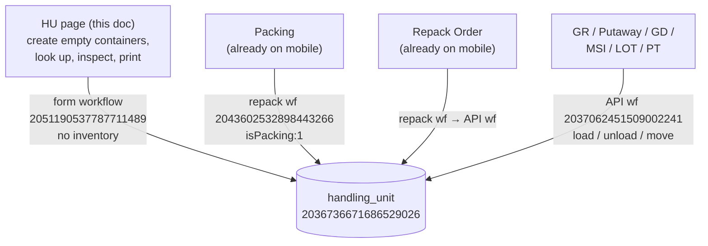
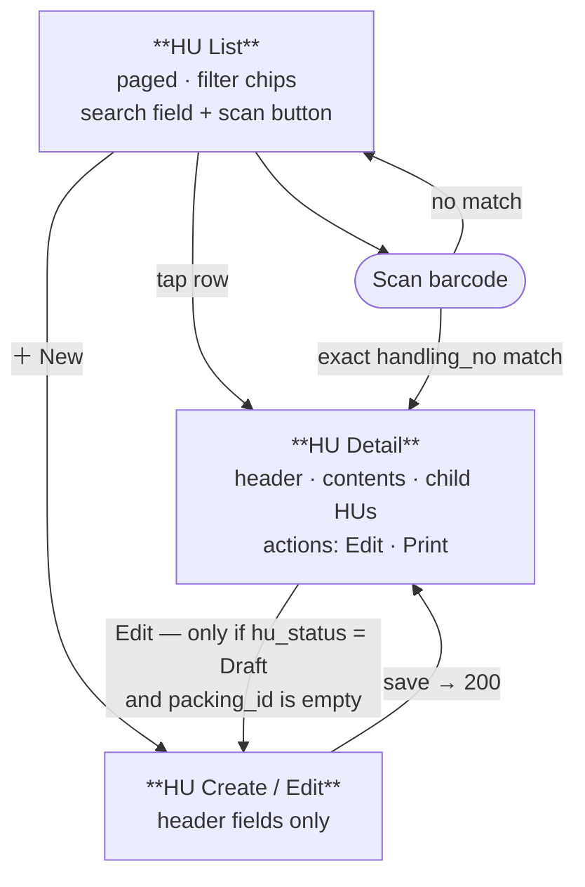
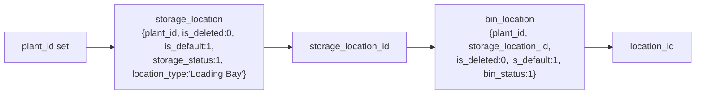

# Handling Unit — Mobile Implementation Guide

> **Audience:** Mobile engineers building a first-class Handling Unit (HU) page natively.
> **Scope:** Four capabilities — **create/edit** HU records (`Draft` / `Created`), **list + search + scan**, **view HU contents**, **print/reprint the HU label**.
> **Assumes:** Familiarity with the HU concepts already covered by the Packing and Repack Order mobile docs. This is net-new: mobile has never had an HU screen, only HU *pickers* embedded inside GR, GD, MSI, LOT, PT, Packing, RO and Picking.
> **Source files covered (all under `Handling Unit/`):** `HUonMounted.js`, `HUonChangePlant.js`, `HUonChangeStorageLocation.js`, `HUonChangeMaterial.js`, `HUsaveAsDraftWorkflow.js`, `HUsaveAsCreatedWorkflow.js`, plus `HUfullJSON.json` (form schema), `HUformWorkflow.json` (the save workflow) and `HUworkflow.json` (the shared HU API workflow). Every `.js` file is reproduced verbatim in [Part 13](#part-13--full-source-appendix).

---

## The load-bearing idea

**The HU page creates and inspects *containers*. It never moves stock.**

`table_hu_items` — the contents of an HU — is a **read-only grid** on this form (`isAdd: false`, `isDelete: false`, every column disabled). Contents arrive from Goods Receiving, Putaway, Packing, Repack Order and Stock Movement, all of which mutate HUs through the shared HU API workflow. On the HU page itself, **Create means "make an empty container"** and **Edit means "fix header fields, while still Draft."**

> **⚠️ Two different workflows write `handling_unit`, and they are not interchangeable.**
>
> | | Form workflow `2051190537787711489` | Shared API workflow `2037062451509002241` |
> |---|---|---|
> | Called by | the HU page (this doc) | GR, Putaway, PRT, Packing, RO, MSI/MSR/LOT/PT/CAT |
> | Touches inventory | **No** | **Yes** — on create it runs `SUBTRACT_INVENTORY` for the packaging material itself (`transaction_type: "HU"`, `isMovingInv: 0`) |
> | Merges `table_hu_items` | No — pass-through | Yes — `load` / `unload` / `move` merge engine |
> | Default `hu_status` | `saveAs` (`Draft` \| `Created`) | `"Created"` |
>
> **Mobile's HU page must call the form workflow.** Calling the API workflow to "create an HU" would silently consume a pallet from stock.

---

## Table of Contents

- [Part 1 — Orientation & Glossary](#part-1--orientation--glossary)
- [Part 2 — Lifecycle & Status State Machine](#part-2--lifecycle--status-state-machine)
- [Part 3 — Data Model](#part-3--data-model)
- [Part 4 — Screen Architecture](#part-4--screen-architecture)
- [Part 5 — List, Search & Scan](#part-5--list-search--scan)
- [Part 6 — HU Detail & Contents](#part-6--hu-detail--contents)
- [Part 7 — Create / Edit](#part-7--create--edit)
- [Part 8 — Print](#part-8--print)
- [Part 9 — What Else Mutates HUs](#part-9--what-else-mutates-hus)
- [Part 10 — Edge Cases & Gotchas](#part-10--edge-cases--gotchas)
- [Part 11 — Validation Messages](#part-11--validation-messages)
- [Part 12 — Porting Checklist](#part-12--porting-checklist)
- [Part 13 — Full Source Appendix](#part-13--full-source-appendix)

---

## Part 1 — Orientation & Glossary

### What a Handling Unit is

A physical container — pallet, carton, tote, cage. One row in the `handling_unit` collection, with a contents array `table_hu_items[]` describing what is inside it. It has:

- an identity — `handling_no` (the barcode a forklift driver scans)
- a **packaging material** — `hu_material_id`, an Item whose `item_properties` is `"Packaging Material"`; this is what the container physically *is*, and it is where `hu_type`, `hu_uom`, `net_weight` and `gross_weight` come from
- a **physical location** — `storage_location_id` (warehouse area) + `location_id` (the bin)
- **aggregates** — `item_count`, `total_quantity`, weights, volume
- optional **nesting** — `parent_hu_id`, a self-FK set by Packing

### Who creates HUs (five producers)

| # | Producer | Route | Resulting `hu_status` |
|---|---|---|---|
| 1 | **The HU page** (this doc) | form workflow `2051190537787711489` | `Draft` or `Created` |
| 2 | **Goods Receiving** save | API workflow, no `process_type` → `load` | `Created` |
| 3 | **Packing** row-Complete | repack workflow `2043602532898443266` with `isPacking: 1` | `Packed`, and stamps `packing_id` |
| 4 | **Repack Order** Completed | repack workflow → API workflow `load` | `Created` |
| 5 | **Misc Receipt / Plant Transfer** Load | API workflow | `Created` |

Putaway does not create HUs — it **relocates** them (`process_type: "move"`).

### Where the HU page sits on mobile



The HU page is the only one of these that is *about* the container rather than about a stock movement. Everything else creates HUs as a side effect of receiving, packing or repacking.

### Glossary

| Term | Meaning |
|---|---|
| **HU** | Handling Unit — one `handling_unit` record |
| **`handling_no`** | The HU's document number / barcode. Unique per organization. |
| **Packaging material** | The Item that the container *is* (`hu_material_id`), filtered `item_properties == "Packaging Material"` |
| **Loading Bay** | The default `storage_location` an HU is created in — `location_type: "Loading Bay"`, `is_default: 1` |
| **Contents** | `table_hu_items[]` — the flat sub-table `handling_unit_atu7sreg_sub` |
| **`balance_id`** | FK to the `item_balance` / `item_batch_balance` row a content line came from; the merge engine keys on it |
| **Empty HU** | `total_quantity == 0`. **Not** `item_count == 0` — see [Part 10 §3](#part-10--edge-cases--gotchas). |

---

## Part 2 — Lifecycle & Status State Machine

### `handling_unit.hu_status`

```
                  ┌─────────┐
    Add ─────────►│  Draft  │──── save as Created ───┐
                  └─────────┘                        │
                       ▲                             ▼
                       │                       ┌───────────┐
              (editable, both buttons)         │  Created  │
                                               └───────────┘
                                                     │
                                       Packing completes the HU
                                                     ▼
                                               ┌──────────┐
                                               │  Packed  │
                                               └──────────┘

                       ┌─────────────┐
                       │  Cancelled  │  ← chip exists, NO writer anywhere in the repo
                       └─────────────┘
```

| Status | Written by |
|---|---|
| `Draft` | HU page, Save as Draft. Also forced by the workflow whenever `pageStatus === "Add"`, before `saveAs` is applied. |
| `Created` | HU page, Save as Created. Also the **default** in the API workflow when no `hu_status` param is supplied — so GR / Misc Receipt / RO-born HUs are `Created`. |
| `Packed` | Packing only. Locked rows via a direct `db.collection("handling_unit").doc(id).update({hu_status: "Packed"})`; generated rows via `target_hu.hu_status: "Packed"` passed to the repack workflow. |
| `Cancelled` | **Nothing.** The desktop form renders a `cancel_status` chip for it, but no code in the repo ever writes it. See [Part 10 §9](#part-10--edge-cases--gotchas). |

There is no transition back out of `Packed`. When Packing unpacks an HU it reverts `packing.table_hu[i].hu_status` and clears `parent_hu_id`, but leaves `handling_unit.hu_status` alone.

### Three status vocabularies — never conflate them

| Field | Values |
|---|---|
| `handling_unit.hu_status` | `Draft` · `Created` · `Packed` · `Cancelled` |
| `packing.table_hu[].hu_status` | `Unpacked` · `Packed` · `Completed` |
| `packing.table_hu_source[].hu_status` | `Pending` · `Unpacked` · `Picked` · `Completed` |

A Packing row reading `Completed` says nothing about the HU record's own status. If you show a status badge on the HU page, it is always the first row of that table.

### Lock matrix — what is editable, by state

Derived from `configureButtons()` and `editDisabledField()` in `HUonMounted.js`.

| Field group | Add | Edit + `Draft` | Edit / View + `Created`·`Packed`·`Cancelled` |
|---|:---:|:---:|:---:|
| `plant_id` | ✏️ (🔒 if user's dept ≠ org) | ✏️ | 🔒 |
| `handling_no` | 🔒 unless Manual Input | 🔒 unless Manual Input | 🔒 |
| `handling_no_type` | ✏️ | 🔒 (`disabled: {{this.isEdit}}`) | 🔒 |
| `hu_material_id` | ✏️ | ✏️ | 🔒 |
| `storage_location_id`, `location_id` | ✏️ (cascade-gated) | ✏️ | 🔒 |
| `hu_type`, `hu_uom`, `hu_quantity`, weights, `item_count`, `total_quantity` | 🔒 (derived) | 🔒 | 🔒 |
| `ref_doc` (attachments) | ✏️ | ✏️ | 🔒 |
| `remark` | ✏️ | ✏️ | 🔒 |
| `table_hu_items` | 🔒 always | 🔒 always | 🔒 always |
| **Buttons** | Save as Draft · Created | Save as Draft · Created | **none** |

> **📌 There is no Complete and no Cancel action on this page.** Once an HU is `Created`, the HU page is a read-only viewer. The only remaining mobile actions are *view contents* and *print*.

---

## Part 3 — Data Model

### Collections

| Purpose | Display name | Table id | Accessed as |
|---|---|---|---|
| HU master | `Handling Unit` | `2036736671686529026` | `db.collection("handling_unit")` |
| HU contents | `Items(Handling Unit)` | `2036977712276639745` | `db.collection("handling_unit_atu7sreg_sub")`, FK `handling_unit_id` |
| Numbering rules | 流水号规则表 | `1994006139209117697` | filter `business_type = "Handling Unit"`, `department_id = <firstLvDeptId>`, `is_default = 1` |
| Item (packaging material) | `Item` | `1901546842240438273` | `{value: id, label: material_code}` |
| UOM | | `1901805375573839874` | `{value: id, label: uom_name}` |
| Storage Location | | `1986694920453566466` | `{value: id, label: storage_location_name}` |
| Bin Location | | `1902282127538507778` | `{value: id, label: bin_location_combine}` |
| Batch | | `1902719754154655746` | `{value: id, label: batch_number}` |
| Customer | | `1902779099617804290` | `{value: id, label: customer_com_name}` |
| Org / plant tree | 组织机构(勿删勿改) | `1789995126399348747` | `{value: id, label: dept_name}` |
| Print templates | `print_template_access` | — | filter `{plant_id in <plant>, doc_type: …}` |

**Unique index on the HU table:** `UNIQUE(handling_no, organization_id)` (index name `"Document Number"`).

### Header fields — every model on the form, in form order

| model | type | label | FK / source | required | default | hidden | disabled |
|---|---|---|---|:---:|---|:---:|---|
| `handling_unit_title` | utext | "Handling Unit" | — | — | static | | — |
| `draft_status` / `created_status` / `packed_status` / `cancel_status` | html | status chips | — | — | HTML | ✔ | — |
| `hu_status` | input | HU Status | — | | `""` | ✔ | ✔ |
| `page_status` | input | Page Status | — | | `""` | ✔ | ✔ · `dataBind: false` (UI-only) |
| `plant_id` | treeselect | Plant | org tree `1789995126399348747` | **✔** | `""` | | conditional (see cascade) |
| `organization_id` | input | Organization | dept id | | `""` | ✔ | ✔ |
| `customer_id` | select **multiple** | Customer Name | Customer `1902779099617804290` | | `[]` | ✔ (shown if non-empty) | ✔ |
| `parent_hu_id` | input | Parent HU ID | self-FK | | `""` | ✔ | ✔ |
| `handling_no` | custom (serial widget) | Handling Unit No | — | server-side | `""`, placeholder `"Auto-generated number"` | | ✔ unless Manual Input |
| `handling_no_type` | select | 规则 (rule) | `1994006139209117697` | | `""` | | `{{this.isEdit}}` |
| `hu_material_id` | custom (lazy picker) | HU Material | Item `1901546842240438273`, `item_properties == "Packaging Material"` | **✔** | `""` | | |
| `hu_type` | input | HU Type | derived from Item | | `""` | | ✔ |
| `hu_quantity` | number (0dp) | HU Quantity | — | | **`1`** | | ✔ |
| `hu_uom` | select | HU UOM | UOM `1901805375573839874` | | `""` | | ✔ |
| `closed_by` | input | Closed By | — | | `{{global:nickname}}` (dynamic) | ✔ | ✔ |
| `storage_location_id` | select | Storage Location | Storage Location `1986694920453566466` | **✔** (client only) | `""` | | until `plant_id` set |
| `location_id` | select | Bin Location | Bin Location `1902282127538507778` | **✔** | `""` | | until `storage_location_id` set |
| `item_count` | number (0dp) | Item Count | — | | `0` | | ✔ |
| `total_quantity` | number (3dp) | Total Item Quantity | — | | `0` | | ✔ |
| `gross_weight` | number (3dp) | Gross Weight | derived from Item | | `0` | | ✔ |
| `net_weight` | number (3dp) | Net Weight | derived from Item | | `0` | | ✔ |
| `net_volume` | number (3dp) | Net Volume | — | | `0` | ✔ | ✔ |
| `ref_doc` | fileupload | Attachment | `limit: 9`, `multiple`, action `/api/blade-resource/oss/endpoint/put-file` | | `[]` | | |
| `packing_id` | input | Packing ID | packing.id | | `""` | ✔ | ✔ |
| `transfer_source_hu_id` | input | Transfer Source HU ID | self-FK | | `""` | ✔ | ✔ |
| `table_hu_items` | table | Items | sub-table (below) | | `[]` | ✔ (shown if rows) | all columns ✔ |
| `remark` | textarea | Remarks | — | | `""` | | **editable** |
| `button_save_as_draft` | button | "Save as Draft" | — | — | — | ✔ (shown by JS) | — |
| `button_created` | button | "Created" | — | — | — | ✔ | permission `hu_save_as_created` |

### Contents sub-table — `table_hu_items`

Grid options: `isAdd: false`, `isDelete: false`, `paging: false`, `rowSelectionType: "None"` — **read-only**.

| column | type | header | FK | hidden | precision |
|---|---|---|---|:---:|---|
| `material_id` | select | Item Code | Item `1901546842240438273` | | — |
| `material_name` | input | Item Name | — | | — |
| `material_desc` | textarea | Item Description | — | | — |
| `location_id` | select | Bin Location | Bin Location `1902282127538507778` | | — |
| `batch_id` | select | Batch | Batch `1902719754154655746` | | — |
| `material_uom` | select | UOM | UOM `1901805375573839874` | | — |
| `quantity` | number | Quantity | — | | **3** |
| `line_status` | input | *(header reads "Balance ID" — mislabeled)* | — | ✔ | — |
| `line_index` | number | Line Index | — | ✔ | 0 (`bigint`) |
| `balance_id` | input | Balance ID | `item_balance` / `item_batch_balance` | ✔ | — |

Two more columns exist in the DB but not on the grid, written only by the API workflow's merge code: **`is_deleted`** (0/1 soft delete per line) and **`id`** (the row id).

### Record shapes

```jsonc
// handling_unit — the 23 columns the form workflow writes
{
  "id": "",
  "hu_status": "Draft",              // = saveAs
  "plant_id": "", "organization_id": "",
  "handling_no": "", "handling_no_type": "",   // rule id, or -9999 = Manual Input
  "hu_material_id": "", "hu_type": "", "hu_quantity": 1, "hu_uom": "",
  "item_count": 0, "total_quantity": 0,        // recomputed server-side by the API workflow
  "storage_location_id": "", "location_id": "",
  "gross_weight": 0, "net_weight": 0, "net_volume": 0,
  "remark": "",
  "ref_doc": [],                     // attachments
  "parent_hu_id": "",                // set by Packing nesting
  "customer_id": [],                 // ARRAY — multi-select
  "packing_id": "",                  // set by Packing
  "closed_by": "",
  "table_hu_items": []
  // NOT written by the form workflow, despite being on the form: transfer_source_hu_id
}
```

```jsonc
// one table_hu_items row / handling_unit_atu7sreg_sub record
{
  "id": "",
  "handling_unit_id": "",            // FK, only on the flat sub-collection
  "material_id": "", "material_name": "", "material_desc": "",
  "location_id": "",                 // bin the content sits in
  "batch_id": "",                    // "" for non-batch items
  "material_uom": "",
  "quantity": 0,                     // 3dp
  "balance_id": "",                  // item_balance / item_batch_balance row
  "line_status": "", "line_index": 0,
  "is_deleted": 0                    // 1 = unloaded to zero; the row is NEVER removed
}
```

### Decimal / precision contract

Neither HU workflow has a `formatNumber` / `toFixed` node, so the form's `precision` values are the **only** rounding contract:

- **3 dp** — `total_quantity`, `gross_weight`, `net_weight`, `net_volume`, `table_hu_items.quantity`
- **0 dp** — `hu_quantity`, `item_count`, `table_hu_items.line_index`

The API workflow declares `hu_quantity` and `total_quantity` as `decimal` and `item_count` as `int` in its request schema.

---

## Part 4 — Screen Architecture

The desktop HU form is a **dialog opened over a platform list page** — `closeDialog()` calls `this.parentGenerateForm.$refs.SuPageDialogRef.hide()` then `.refresh()`. **That parent list page is not in this repo**, so there is no desktop layout to copy for the list. Mobile designs its own.



Three screens, and deliberately no more:

| Screen | Purpose | Reads | Writes |
|---|---|---|---|
| **HU List** | find an HU | `handling_unit` (paged) | — |
| **HU Detail** | inspect a container | `handling_unit` by id + `handling_unit_atu7sreg_sub` by `handling_unit_id` (+ child HUs by `parent_hu_id`) | — |
| **HU Create / Edit** | make an empty container, or fix a Draft's header | numbering rules, Item picker, storage/bin locations | workflow `2051190537787711489` |

> **Mobile callout.** Do not build a contents editor. There is no desktop equivalent, and the only safe way to change what is inside an HU is through GR / Putaway / Packing / Repack / Stock Movement.

---

## Part 5 — List, Search & Scan

### Filter shape

The platform's JS SDK takes either the shorthand `.where({...})` (equality only) or the full `.filter([...])` form. Use `.filter()` — it is the only shape that supports `in` and comparison operators. Pattern copied from `Repack Order/ROopenSelectItemDialog.js`:

```js
db.collection("handling_unit")
  .filter([
    {
      type: "branch",
      operator: "all",                       // a single branch — multiple top-level leaves do NOT AND
      children: [
        { prop: "plant_id",        operator: "equal", value: plantId },
        { prop: "organization_id", operator: "equal", value: organizationId },
        { prop: "is_deleted",      operator: "equal", value: 0 },
        // …filter chips appended here
      ],
    },
  ])
  .get();
```

### Default scope and filter chips

| | |
|---|---|
| **Always applied** | `plant_id`, `organization_id`, `is_deleted: 0` |
| **Chips** | `hu_status` (Draft / Created / Packed) · `storage_location_id` · `location_id` (bin) |
| **Sort** | newest first |

Every chip must be pushed into the `children` array as an extra leaf, **not** applied client-side after the fetch. See the cap warning below for why.

### ⚠️ The 5000-row cap

> **Never fetch `handling_unit` plant-wide and filter in memory.** The platform silently truncates a `.get()` at a **5000-row default cap** — no error, no flag, just missing rows. In a real warehouse the HU table is one of the largest in the system, so a plant-wide fetch will be truncated, and your list will be quietly incomplete.
>
> Every other module works around this by going through the flat sub-collection first (`handling_unit_atu7sreg_sub` filtered by material, then `handling_unit` by `id in candidateHuIds`) — see `ROopenSelectItemDialog.js`, `GDinventoryDialogWorkflow.js`, `PRTinventoryDialog.js`, and the Stock Movement dialogs. **That trick does not help a general-purpose HU list**, which is not scoped by material.

**Consequence for the list screen: it must be server-paged.** See [Open items](#open-items-to-confirm-with-the-platform-team) — no client JS in this repo calls `.limit()`, `.skip()`, `.page()` or `.orderBy()`, so the paged-query surface available to mobile has to be confirmed with the platform team, with a thin HU-search workflow (search-node + `limit` + filter params) as the fallback.

Until paging is confirmed, keep the default result set small by pre-selecting a `storage_location_id` chip.

### Scan

A barcode scan resolves a `handling_no`. It must be an **indexed equality lookup returning at most one record**:

```js
db.collection("handling_unit")
  .filter([
    { type: "branch", operator: "all", children: [
      { prop: "handling_no",     operator: "equal", value: scannedCode },
      { prop: "organization_id", operator: "equal", value: organizationId },
      { prop: "is_deleted",      operator: "equal", value: 0 },
    ]},
  ])
  .get();
```

`UNIQUE(handling_no, organization_id)` guarantees 0 or 1 result — **scope by `organization_id`, not `plant_id`**, or a scan of an HU that has been moved to another plant in the same org will come back empty. On a hit, navigate straight to Detail. On a miss, return to the list with `HU <code> not found.`

> **Never implement scan as a client-side filter over a bulk list fetch.** That is the exact pattern the 5000-row cap breaks, and it fails most often for the oldest HUs — the ones a driver is most likely to be hunting for.

### List row content

`handling_no` · `hu_status` badge · packaging material (`hu_material_id` → `material_code`) · bin (`location_id` → `bin_location_combine`) · `item_count` / `total_quantity`.

Resolve the FK labels with one batched `id in [...]` fetch per collection over the visible page — never one fetch per row.

---

## Part 6 — HU Detail & Contents

### Read the flat sub-collection, not the array column

```js
const [huRes, itemRes] = await Promise.all([
  db.collection("handling_unit")
    .filter([{ type: "branch", operator: "all", children: [
      { prop: "id",         operator: "equal", value: huId },
      { prop: "is_deleted", operator: "equal", value: 0 },
    ]}]).get(),
  db.collection("handling_unit_atu7sreg_sub")
    .filter([{ type: "branch", operator: "all", children: [
      { prop: "handling_unit_id", operator: "equal", value: huId },
      { prop: "is_deleted",       operator: "equal", value: 0 },
    ]}]).get(),
]);
```

Two parallel fetches, no join. This matches how every other module reads HU contents, and the `is_deleted` filter is not optional — unloaded lines persist as `{quantity: 0, is_deleted: 1}` and would otherwise show as phantom zero-qty rows.

> **📌 Belt and braces.** If you instead read `handling_unit.table_hu_items` off the master record, you still must filter `is_deleted !== 1` in memory. The sub-collection query is preferred because the server does that filtering for you and the payload is smaller.

### Deciding whether an HU is empty

Test **`total_quantity`**, not `item_count`.

Goods Delivery completion decrements HU stock with two `atomic-count-node`s that write directly to the tables and **bypass the API workflow entirely** — so they never recompute `item_count` and never soft-delete a line that hits zero. An HU emptied by a GD reads `total_quantity: 0` with `item_count > 0`. (This is exactly the mismatch Repack Order's source picker guards against with `item_count > 0 && total_quantity > 0`.)

### Child HUs

If the HU is a parent, its children are separate records pointing back at it:

```js
db.collection("handling_unit")
  .filter([{ type: "branch", operator: "all", children: [
    { prop: "parent_hu_id", operator: "equal", value: huId },
    { prop: "is_deleted",   operator: "equal", value: 0 },
  ]}]).get();
```

Render them as a separate "Nested HUs" section, each expandable to its own contents. There is **no depth limit and no cycle check anywhere in the system**, so cap your UI recursion (2 levels is plenty in practice) rather than trusting the data.

### Detail actions

| Action | Enabled when |
|---|---|
| **Edit** | `hu_status === "Draft"` **and** `!packing_id` |
| **Print** | see [Part 8](#part-8--print) |

---

## Part 7 — Create / Edit

### The Add-mode defaulting cascade

Replicate exactly — these are three chained lookups, each clearing the next field first.



1. **On mount (Add).** `organization_id = getVarGlobal("deptParentId")`; if that is `"0"`, fall back to `getVarSystem("deptIds").split(",")[0]`. Then set `page_status: "Add"`, show the Draft chip, and run `setPlant`: `currentDept = getVarSystem("deptIds").split(",")[0]`; `plant_id` is **locked** when `currentDept !== organization_id`, and in that case forced to `currentDept`. Then resolve the default storage location, then the default bin.
2. **`plant_id` changes** → clear `storage_location_id`, re-resolve the default storage location. (`HUonChangePlant.js`)
3. **`storage_location_id` changes** → clear `location_id`, re-resolve the default bin. (`HUonChangeStorageLocation.js`)
4. **`hu_material_id` changes** → from the selected Item, set `hu_type = item.hu_type.dict_key || item.item_properties`, `hu_uom = item.based_uom`, `net_weight`, `gross_weight` (0 fallbacks). Clearing the material resets all four. (`HUonChangeMaterial.js`)

> **⚠️ Guard `hu_type.dict_key`.** The desktop code dereferences it without a null check and throws for any packaging Item whose `hu_type` dictionary entry is empty. Use `item.hu_type?.dict_key || item.item_properties`.

> **⚠️ Do not port the `setPlant` return bug.** `setPlant()` returns `currentDept` unconditionally rather than the plant that actually ended up in the form, so the storage-location lookup can run against the wrong plant when the user's department differs from the organization. Resolve the default location from the plant value you actually set.

### Numbering — `handling_no` + `handling_no_type`

The rule dropdown reads collection `1994006139209117697` filtered `business_type == "Handling Unit"` **and** `department_id == {{global:firstLvDeptId}}`, displaying `rule_name`, storing `id`.

On Add, the desktop prepends a synthetic option and preselects:

```js
// value -9999 == Manual Input
const defaultRule = options.find(o => o?.item?.is_default === 1);
handling_no_type = defaultRule ? defaultRule.value : -9999;
```

Behaviour:

| `handling_no_type` | `handling_no` field | What the server does |
|---|---|---|
| a rule id | **disabled**, placeholder `"Auto-generated number"` | workflow substitutes the sentinel `"draft"` (Save as Draft) or `"issued"` (Save as Created); the platform generates the real number |
| `-9999` (Manual Input) | **enabled**, user types it | stored verbatim |

Changing `handling_no_type` clears `handling_no` and re-evaluates the disabled state.

Rule template as configured: `SN` + `YYYYMMDD` (Asia/Shanghai) + a 4-digit day-reset counter starting at 1 — e.g. `SN202608030001`.

> **📌 The literals matter.** `"draft"` and `"issued"` are sentinel tokens the platform's serial-number engine recognises. `"Auto-generated number"` is the sentinel the *API* workflow recognises (used by Packing and RO). Do not localize or reword either set.

### Validation split

**Server-enforced** (via `CHECK_REQUIRED_FIELD` `1988831880511062018`, called by the save workflow) — exactly four fields:

`handling_no` · `location_id` · `hu_material_id` · `plant_id`

All four are reported in **one** combined message, not per field — see [Part 11](#server-side-required-field-failures) for the exact format.

**Client-enforced — mobile must do these itself:**

| Rule | Why |
|---|---|
| `storage_location_id` required | It carries `rules: [{required: true}]` on the form but is **absent from the server's required list** |
| `handling_no` non-blank when `handling_no_type === -9999` | Manual Input skips auto-generation; a blank would reach the unique index as `""` |
| Block Edit when `packing_id` is set | The HU is committed to a Packing document |

### The save call

Both buttons hit the same workflow; only `saveAs` differs.

```js
await this.runWorkflow(
  "2051190537787711489",
  { allData: data, saveAs: "Draft" /* or "Created" */, pageStatus: data.page_status },
  ok => { workflowResult = ok },
  err => { workflowResult = err },
);
```

`pageStatus` is `"Add"` | `"Edit"` | `"View"` and selects the write branch:

| `saveAs` | `pageStatus` | Operation |
|---|---|---|
| `Created` | `Edit` | update `handling_unit` where `id in allData.id` |
| `Created` | ≠ `Edit` | insert |
| `Draft` | `Edit` | update |
| `Draft` | ≠ `Edit` | insert |

All four branches write the same 23 columns listed in [Part 3](#record-shapes). `pageStatus === "Add"` additionally forces `hu_status = "Draft"` inside the workflow *before* `saveAs` is applied as the stored status.

Response handling, verbatim from the desktop wrappers:

```
!result || !result.data                                  → "No response from workflow"
result.data.code === "400" | 400 | success === false     → result.data.msg || result.data.message || "Failed to save Handling Unit"
result.data.code === "200" | 200 | success === true      → result.data.message || result.data.msg || "Handling Unit saved successfully", then close
anything else                                            → "Unknown workflow status"
```

Note the code comparison must accept **both the string `"400"` and the number `400`**.

### `handling_no` collisions

Nothing checks uniqueness before the write — not the form, not the workflow. A duplicate is caught only by the DB index `UNIQUE(handling_no, organization_id)` and surfaces as a **raw database error**, not a friendly message.

Mobile should:

1. Catch the save error and, if it names a duplicate/unique-constraint violation, replace it with `Handling Unit No "<x>" already exists.` (see [Part 11](#part-11--validation-messages)).
2. On Manual Input only, optionally pre-check with the same indexed lookup the scanner uses. This costs one query and turns a raw DB error into inline field validation. Do **not** pre-check for auto-generated numbers — the number does not exist yet at that point.

---

## Part 8 — Print

### What exists today

The only print implementation in the system is `onTableHufunc_print`, a row action on **Packing's** `table_hu`, gated `hidden: {{arguments[0].row.hu_status !== 'Completed'}}`. It looks up a template, then opens a platform-hosted print page:

```js
const resTemplateAccess = await db
  .collection("print_template_access")
  .filter([{ type: "branch", operator: "all", children: [
    { prop: "plant_id", operator: "in",    value: plantId },
    { prop: "doc_type", operator: "equal", value: "packing" },
  ]}]).get();

// 0 templates → "No print template found."
// >1 templates → the desktop silently returns (no picker implemented)
const templateID = resTemplateAccess.data[0].print_template_id;
window.open(
  `/sucode/openpage/${templateID}?ids=${packingIDs}&type=packing_line&sequence=${index + 1}/${huLength}&name=Packing`
);
```

**`ids` is the `packing.table_hu` row id — not the `handling_unit` id.** So this path:

- ✅ works for HUs born in Packing (those with a `packing_id`)
- ❌ cannot print a standalone HU created on the HU page, a GR-born HU, or a Repack-born HU

Mobile can reuse it as-is for packing-born HUs by opening the same URL in an in-app WebView / system browser carrying the session.

### What the HU page needs

The same mechanism, keyed on the HU record:

```js
// doc_type "handling_unit" — DOES NOT EXIST YET
const res = await db.collection("print_template_access")
  .filter([{ type: "branch", operator: "all", children: [
    { prop: "plant_id", operator: "in",    value: plantId },
    { prop: "doc_type", operator: "equal", value: "handling_unit" },
  ]}]).get();

openInWebView(`/sucode/openpage/${res.data[0].print_template_id}?ids=${huId}&name=Handling+Unit`);
```

> **🚧 Platform prerequisite.** A `handling_unit` print template must be created and registered in `print_template_access` before standalone HU label printing works. Until it exists, the Print action on HU Detail should be **enabled only when `packing_id` is set** (using the `packing_line` path above) and hidden otherwise. Do not ship a Print button that fails with "No print template found."

**Two improvements over the desktop while you are here:** handle the `>1 templates` case with a picker instead of returning silently, and surface the `0 templates` case as the existing copy `No print template found.`

---

## Part 9 — What Else Mutates HUs

You are not building this, but you need to know it — it explains why the data looks the way it does.

The shared API workflow `2037062451509002241` is the single mutation point for HU contents. It first tries **Get HU by id**, then **Get HU by `handling_no` + plant + org**; if neither hits it creates, otherwise it merges.

**Merge key:** `` `${material_id}__${balance_id || ""}__${batch_id || ""}` ``

| `process_type` | Behaviour |
|---|---|
| `load` (also the default when no `process_type` is passed) | Match existing by `material_id` + `balance_id`; sum quantities; re-activate soft-deleted lines (`is_deleted: 0`). Otherwise append. |
| `unload` | Validate availability per key (`Cannot unload {qty} of material {m}, only {available} available` / `No matching HU item for key: X`), then subtract across lines in order; any line reaching zero becomes `{quantity: 0, is_deleted: 1}`. |
| `move` | Rewrite `location_id` on every item to the new bin, adopting a refreshed `balance_id` when supplied. Quantities untouched. |
| `transfer` | **Falls through to the `load` branch** — the merge code only special-cases `unload` and `move`. |

After merging it recomputes `item_count` and `total_quantity` from `is_deleted !== 1` lines only, and resolves `parent_hu_id` / `transfer_source_hu_id` / `hu_status` with "use the param if it is non-empty and different, otherwise keep what is there."

Callers:

| Module | `process_type` |
|---|---|
| Goods Receiving (save, prod-version) | *(none → `load`)* |
| Putaway | `move` |
| Purchase Return | `unload` |
| Repack Order / Packing (via repack wf `2043602532898443266`) | `load` and/or `unload` |
| Misc Receipt | *(none → `load`)* · Misc Issue | `unload` |
| Location Transfer | `move` · Category Transfer | `transfer` |
| Plant Transfer | `move` / `load` / `unload` (13 call sites; the only writer of `transfer_source_hu_id`) |

And the one path that does **not** go through it: **Goods Delivery completion**, which uses `atomic-count-node`s straight onto `Handling Unit:Table:2036736671686529026` (`total_quantity = minus(deliver_quantity)`) and `Items(Handling Unit):Table:2036977712276639745` (`quantity = minus(deliver_quantity)`).

---

## Part 10 — Edge Cases & Gotchas

1. **The 5000-row silent truncation.** Any broad `handling_unit` fetch returns at most 5000 rows with no error and no indication. This is the single biggest correctness risk for the list and scan screens. See [Part 5](#the-5000-row-cap).

2. **The two-workflow asymmetry.** The form workflow does not touch inventory; the API workflow **subtracts the packaging material from stock** when it creates an HU (`transaction_type: "HU"`, `isMovingInv: 0`, `inventory_category: "Unrestricted"`). Never "shortcut" a create through the API workflow.

3. **`item_count` can be stale.** GD's atomic decrements bypass the merge engine, so an HU can read `total_quantity: 0` with `item_count > 0`. Test `total_quantity` for emptiness; treat `item_count` as advisory only.

4. **`packing.table_hu` DB columns ≠ the client model.** If you read that sub-table directly you will find `hu_no`, `storage_location`, `target_location` — while the Packing client form uses `handling_no`, `storage_location_id`, `location_id`. The `handling_unit` collection itself has no such drift.

5. **`packing_line` is dead.** `CLAUDE.md` and `PERFORMANCE_OPTIMIZATION.md` both describe it as "the source of truth for HU numbers." No live code queries it — its only occurrence is the `type=packing_line` print-URL parameter, which is a template selector, not a collection. **The source of truth for HU numbers is `handling_unit`.**

6. **HUs with a `packing_id` are committed.** Their quantity lives in reserved, not unrestricted, and Repack's loose-stock calculation excludes them entirely. Block Edit on these regardless of `hu_status`.

7. **Contents are soft-deleted, never removed.** `{quantity: 0, is_deleted: 1}`, and a later load of the same `material_id + balance_id` re-activates the same row. Always filter, and never assume array indices are stable.

8. **HU records are never deleted.** Nothing in the system calls `.remove()` on `handling_unit`. Unpacking leaves an empty shell that deliberately keeps its `handling_unit_id` and `handling_no`. Deletion is soft only, via `is_deleted`.

9. **`Cancelled` has a chip but no writer.** Decide with the product owner whether mobile should be the first thing to write it, or whether the state should be hidden. Do not add a Cancel button on the assumption that the rest of the system understands it — nothing downstream filters on it today.

10. **Desktop defects — do not port.**
    - `hu_quantity.onChange` (`onHuQuantityChange`) is copy-paste residue from Packing: it writes `table_hu.${rowIndex}.hu_status` on a subform that does not exist on this form, with an undefined `rowIndex`.
    - `setPlant()` returns `currentDept` unconditionally (see [Part 7](#the-add-mode-defaulting-cascade)).
    - `hu_type.dict_key` is dereferenced unguarded.
    - The View branch runs a `db.collection("handling_unit").where({id}).get()` whose result is only `console.log`ged — dead debug code.
    - `transfer_source_hu_id` is on the form but is **not** among the 23 columns the form workflow writes; only the API workflow (Plant Transfer) sets it.
    - `onReady_jcm6u99m` injects the Chinese label `手动输入` for option `-9999` while the mounted script injects `Manual Input` for the same option — whichever runs last wins. Pick one string for mobile.
    - Eleven entries in `config.eventScript` are unbound copy-paste residue from Packing / Stock Adjustment / Location Transfer, including one that calls the wrong workflow id (`2013133675374927874`).

11. **`customer_id` is an array.** It is a multi-select (`multiple: true`) and stores `[]`, not `""`. It is hidden unless non-empty, and only the HU page ever writes it.

12. **Timing hacks are not a contract.** The desktop mount logic runs inside `setTimeout(…, 500)` and `setTimeout(…, 200)`, plus a 10×500 ms retry loop waiting for the numbering dropdown to populate. That is Element-UI plumbing — throw it away and load the rule list with a normal awaited fetch before rendering the form.

---

## Part 11 — Validation Messages

Exact copy, for UX parity. Rows marked **new** have no desktop equivalent — the desktop either fails silently or shows a raw error.

### Server-side required-field failures

`CHECK_REQUIRED_FIELD` does **not** emit one message per field. It collects the missing fields' **labels** and returns a single string:

```js
message: 'Validation Error: ' + missingFields.join(', ')
```

which the save workflow returns as the `400` payload and the client shows verbatim. The four labels, exactly as registered by the HU save workflow:

| field | label in the message |
|---|---|
| `handling_no` | `Handling Unit No` |
| `location_id` | `Bin Location` |
| `hu_material_id` | `Handling Unit Material` |
| `plant_id` | `Plant` |

So a save missing the plant and the bin produces exactly: `Validation Error: Plant, Bin Location` — **not** "Plant is required". Display it as-is; do not re-word or split it into per-field inline errors, or mobile and desktop will disagree.

A field counts as missing when it is `undefined` / `null`, a whitespace-only string, a number `<= 0`, an empty array, or an empty object.

### Everything else

| Trigger | Level | Copy |
|---|---|---|
| Save with `storage_location_id` empty (client-only rule) | error | `Storage Location is required` **new** |
| Manual Input selected but `handling_no` blank | error | `Enter a Handling Unit No, or choose a numbering rule.` **new** |
| Duplicate `handling_no` in the org | error | `Handling Unit No "<x>" already exists.` **new** |
| Workflow returned no payload | error | `No response from workflow` |
| Workflow returned 400 | error | `<result.data.msg \|\| result.data.message>`, fallback `Failed to save Handling Unit` |
| Workflow returned 200 | success | `<result.data.message \|\| result.data.msg>`, fallback `Handling Unit saved successfully` |
| Workflow returned an unrecognised code | error | `Unknown workflow status` |
| Any handler throws | error | `<error.message>`, fallback `An error occurred` |
| Scan finds nothing | warning | `HU <code> not found.` **new** |
| Edit tapped on a non-Draft HU | warning | `Only Draft handling units can be edited.` **new** |
| Edit tapped on an HU with `packing_id` | warning | `This handling unit belongs to a packing document and cannot be edited.` **new** |
| Print with no template registered | error | `No print template found.` |
| Print on an HU with no `packing_id`, before the standalone template exists | warning | `Label printing is not available for this handling unit yet.` **new** |

---

## Part 12 — Porting Checklist

### Data model

- [ ] `handling_unit` (`2036736671686529026`) and `handling_unit_atu7sreg_sub` (`2036977712276639745`) modelled with every column from [Part 3](#part-3--data-model)
- [ ] `customer_id` typed as an **array**, not a string
- [ ] `is_deleted` present on both the HU and the item row, and filtered on every read
- [ ] Precision: 3 dp on `total_quantity` / weights / `net_volume` / item `quantity`; 0 dp on `hu_quantity` / `item_count` / `line_index`

### List, search, scan

- [ ] Default scope `{plant_id, organization_id, is_deleted: 0}` via a single `type:"branch"`, `operator:"all"` filter
- [ ] Filter chips pushed into the query, never applied after the fetch
- [ ] **Paging confirmed with the platform team** (or the HU-search workflow fallback built) — no unbounded `.get()` on `handling_unit`
- [ ] Scan is an indexed `handling_no` + `organization_id` equality lookup
- [ ] FK labels resolved with one batched `id in [...]` fetch per collection per page

### Detail

- [ ] Contents read from `handling_unit_atu7sreg_sub` filtered `handling_unit_id` + `is_deleted: 0`
- [ ] "Empty?" decided on `total_quantity`, not `item_count`
- [ ] Child HUs listed via `parent_hu_id`, with UI recursion capped
- [ ] Contents are **read-only** — no add, edit, delete, or quantity entry anywhere

### Create / Edit

- [ ] Plant → default Loading Bay storage location → default bin cascade, each step clearing the next field first
- [ ] `plant_id` locked and forced to `currentDept` when the user's department ≠ the organization
- [ ] Material picker filtered `item_properties == "Packaging Material"`
- [ ] `hu_type` / `hu_uom` / `net_weight` / `gross_weight` derived from the Item, with `hu_type?.dict_key` null-guarded
- [ ] Numbering-rule dropdown from `1994006139209117697`, filtered by `business_type` + `department_id`, with the `-9999` Manual Input option and default preselection
- [ ] `handling_no` enabled **only** for `-9999`; changing the rule clears it
- [ ] Client-side `storage_location_id` required check
- [ ] Save calls `2051190537787711489` with `{allData, saveAs, pageStatus}` and nothing else
- [ ] Response codes compared as **both** string and number
- [ ] Duplicate-`handling_no` DB error translated into the friendly message
- [ ] Buttons shown only for Add or `hu_status === "Draft"`; no Complete, no Cancel

### Print

- [ ] `packing_line` path wired for HUs with a `packing_id`
- [ ] Print hidden (not broken) for HUs without one, until the `handling_unit` template exists
- [ ] `>1 template` handled with a picker; `0 templates` shows `No print template found.`

### Reference checks (do these last)

- [ ] No call to the API workflow `2037062451509002241` anywhere in the HU page
- [ ] No direct `db.collection("handling_unit").doc(id).update(...)` from the HU page — every write goes through the save workflow
- [ ] `hu_status` badges use the `handling_unit` vocabulary, not Packing's
- [ ] Nothing reads `packing_line`
- [ ] None of the desktop defects in [Part 10 §10](#part-10--edge-cases--gotchas) were carried over

---

## Open items to confirm with the platform team

1. **Paged list queries.** No client JS in this repo calls `.limit()`, `.skip()`, `.page()` or `.orderBy()` — the desktop pattern is fetch-everything-and-filter-in-memory, which is precisely what the 5000-row cap punishes. Paging clearly exists server-side: the platform list-page table component is configured with `pagingEnabled: 1`, `pageWay: "Pagination"`, `pageSize: 10` and `page_size_field` / `page_current_field` / `page_total_field` hooks, and workflow search-nodes accept a `limit`. **What is unverified is the paged-query surface available to the mobile SDK.** Fallback if there is none: a thin HU-search workflow wrapping a search-node with `limit` + filter params, returning a page of rows plus a total.
2. **A `handling_unit` print template** must be created and registered in `print_template_access` before standalone HU label printing can ship.
3. **Is mobile allowed to write `hu_status: "Cancelled"`?** The chip exists; no writer does.

---

## Part 13 — Full Source Appendix

Desktop implementation, verbatim. **Reimplement in the mobile framework — do not port.** These are Element-UI / low-code platform scripts; `this.setData`, `this.display`, `this.disabled` and the `setTimeout` scaffolding have no mobile equivalent. What you are copying is the *logic*: the queries, the field derivations, and the save contract.

### `HUonMounted.js`

```javascript
const showStatusHTML = (status) => {
  const statusMap = {
    Draft: "draft_status",
    Created: "created_status",
    Packed: "packed_status",
    Cancelled: "cancel_status",
  };

  if (statusMap[status]) {
    this.display([statusMap[status]]);
  }
};

const CONFIG = {
  fields: {
    buttons: ["button_save_as_draft", "button_created"],
    hide: ["page_status", "hu_status"],
    conditional: ["customer_id", "parent_hu_id", "packing_id", "closed_by"],
  },
  buttonConfig: {
    Draft: ["button_save_as_draft", "button_created"],
  },
};

const configureFields = () => {
  this.hide(CONFIG.fields.hide);
};

const configureButtons = (pageStatus, huStatus) => {
  this.hide(CONFIG.fields.buttons);

  if (pageStatus === "Add" || huStatus === "Draft") {
    this.display(CONFIG.buttonConfig.Draft);
  }
};

const showConditionalFields = (data) => {
  if (data.customer_id && data.customer_id.length > 0)
    this.display(["customer_id"]);
  if (data.closed_by && data.closed_by !== "") this.display(["closed_by"]);
  if (data.table_hu_items && data.table_hu_items.length > 0)
    this.display(["table_hu_items"]);
};

const editDisabledField = () => {
  this.disabled(
    [
      "plant_id",
      "organization_id",
      "customer_id",
      "parent_hu_id",
      "handling_no",
      "handling_no_type",
      "hu_material_id",
      "hu_type",
      "hu_quantity",
      "hu_uom",
      "storage_location_id",
      "location_id",
      "item_count",
      "total_quantity",
      "gross_weight",
      "net_weight",
      "net_volume",
      "ref_doc",
      "remark",
      "packing_id",
      "closed_by",
      "table_hu_items",
      "table_hu_items.material_id",
      "table_hu_items.material_name",
      "table_hu_items.material_desc",
      "table_hu_items.location_id",
      "table_hu_items.batch_id",
      "table_hu_items.material_uom",
      "table_hu_items.quantity",
    ],
    true,
  );
};

const setPlant = (organizationId, pageStatus) => {
  const currentDept = this.getVarSystem("deptIds").split(",")[0];
  const isSameDept = currentDept === organizationId;

  this.disabled("plant_id", !isSameDept);

  if (pageStatus === "Add" && !isSameDept) {
    this.setData({ plant_id: currentDept });
  }
  return currentDept;
};

const setStorageLocation = async (plantID) => {
  try {
    if (plantID) {
      let defaultStorageLocationID = "";

      const resStorageLocation = await db
        .collection("storage_location")
        .where({
          plant_id: plantID,
          is_deleted: 0,
          is_default: 1,
          storage_status: 1,
          location_type: "Loading Bay",
        })
        .get();

      if (resStorageLocation.data && resStorageLocation.data.length > 0) {
        defaultStorageLocationID = resStorageLocation.data[0].id;
        this.setData({
          storage_location_id: defaultStorageLocationID,
        });
      }
    }
  } catch (error) {
    console.error(error);
    this.$message.error(error.message || "An error occurred");
  }
};

setTimeout(async () => {
  try {
    const data = this.getValues();
    let pageStatus = "";

    if (this.isAdd) pageStatus = "Add";
    else if (this.isEdit) pageStatus = "Edit";
    else if (this.isView) pageStatus = "View";
    else throw new Error("Invalid page state");

    let organizationId = this.getVarGlobal("deptParentId");
    if (organizationId === "0") {
      organizationId = this.getVarSystem("deptIds").split(",")[0];
    }

    switch (pageStatus) {
      case "Add":
        this.setData({
          organization_id: organizationId,
          page_status: pageStatus,
        });

        configureFields();
        configureButtons(pageStatus, null);
        this.display(["draft_status"]);

        const plantID = setPlant(organizationId, pageStatus);
        await setStorageLocation(plantID);
        break;

      case "Edit":
        this.setData({ page_status: pageStatus });
        configureFields();
        configureButtons(pageStatus, data.hu_status);
        showStatusHTML(data.hu_status);
        showConditionalFields(data);
        if (data.hu_status !== "Draft") {
          editDisabledField();
        }
        break;

      case "View":
        configureFields();
        configureButtons(pageStatus, data.hu_status);
        showStatusHTML(data.hu_status);
        showConditionalFields(data);
        editDisabledField();

        console.log("huId", data.id);
        const huData = await db
          .collection("handling_unit")
          .where({ id: data.id })
          .get();
        console.log("huData", huData);
        break;
    }
  } catch (error) {
    console.error(error);
    this.$message.error(error.message || "An error occurred");
  }
}, 500);

setTimeout(async () => {
  if (!this.isAdd) return;
  const maxRetries = 10;
  const interval = 500;
  for (let i = 0; i < maxRetries; i++) {
    const op = await this.onDropdownVisible("handling_no_type", true);
    if (op != null) break;
    await new Promise((resolve) => setTimeout(resolve, interval));
  }
  function getDefaultItem(arr) {
    return arr?.find((item) => item?.item?.is_default === 1);
  }
  var params = this.getComponent("handling_no");
  const { options } = params;

  const optionsData = this.getOptionData("handling_no_type") || [];
  const defaultData = getDefaultItem(optionsData);
  if (options?.canManualInput) {
    this.setOptionData("handling_no_type", [
      { label: "Manual Input", value: -9999 },
      ...optionsData,
    ]);
    this.setData({
      handling_no_type: defaultData ? defaultData.value : -9999,
    });
  } else if (defaultData) {
    this.setData({ handling_no_type: defaultData.value });
  }
}, 200);
```

### `HUonChangePlant.js`

```javascript
(async () => {
  try {
    const plantID = arguments[0].value;

    this.setData({
      storage_location_id: "",
    });

    if (!plantID) return;

    const resStorageLocation = await db
      .collection("storage_location")
      .where({
        plant_id: plantID,
        is_deleted: 0,
        is_default: 1,
        storage_status: 1,
        location_type: "Loading Bay",
      })
      .get();

    if (!resStorageLocation.data || resStorageLocation.data.length === 0) {
      return;
    }

    const defaultStorageLocationID = resStorageLocation.data[0].id;
    this.setData({ storage_location_id: defaultStorageLocationID });
  } catch (error) {
    console.error(error);
    this.$message.error(error.message || "An error occurred");
  }
})();
```

### `HUonChangeStorageLocation.js`

```javascript
(async () => {
  try {
    const storageLocationID = arguments[0].value;
    const plantID = this.getValue("plant_id");

    this.setData({ location_id: "" });

    if (!storageLocationID || !plantID) return;

    const resBinLocation = await db
      .collection("bin_location")
      .where({
        plant_id: plantID,
        storage_location_id: storageLocationID,
        is_deleted: 0,
        is_default: 1,
        bin_status: 1,
      })
      .get();

    if (resBinLocation.data && resBinLocation.data.length > 0) {
      this.setData({ location_id: resBinLocation.data[0].id });
    }
  } catch (error) {
    console.error(error);
    this.$message.error(error.message || "An error occurred");
  }
})();
```

### `HUonChangeMaterial.js`

```javascript
(async () => {
  try {
    const value = arguments[0]?.value || "";
    const fieldModel = arguments[0]?.fieldModel || {};
    const { based_uom, hu_type, item_properties, net_weight, gross_weight } =
      fieldModel.item || {};
    if (value && value !== "") {
      await this.setData({
        hu_type: hu_type.dict_key || item_properties,
        hu_uom: based_uom,
        net_weight: net_weight || 0,
        gross_weight: gross_weight || 0,
      });
    } else {
      await this.setData({
        hu_type: "",
        hu_uom: "",
        net_weight: 0,
        gross_weight: 0,
      });
    }
  } catch (error) {
    this.$message.error(error);
    console.log(error);
  }
})();
```

### `HUsaveAsDraftWorkflow.js`

```javascript
const closeDialog = () => {
  if (this.parentGenerateForm) {
    this.parentGenerateForm.$refs.SuPageDialogRef.hide();
    this.parentGenerateForm.refresh();
  }
};

(async () => {
  try {
    this.showLoading("Saving Handling Unit as Draft...");

    const data = this.getValues();
    console.log("data", data);

    let workflowResult;

    await this.runWorkflow(
      "2051190537787711489",
      { allData: data, saveAs: "Draft", pageStatus: data.page_status },
      async (res) => {
        console.log("Handling Unit saved successfully:", res);
        workflowResult = res;
      },
      (err) => {
        console.error("Failed to save Handling Unit:", err);
        this.hideLoading();
        workflowResult = err;
      },
    );

    if (!workflowResult || !workflowResult.data) {
      this.hideLoading();
      this.$message.error("No response from workflow");
      return;
    }

    // Handle workflow errors
    if (
      workflowResult.data.code === "400" ||
      workflowResult.data.code === 400 ||
      workflowResult.data.success === false
    ) {
      this.hideLoading();
      const errorMessage =
        workflowResult.data.msg ||
        workflowResult.data.message ||
        "Failed to save Handling Unit";
      this.$message.error(errorMessage);
      return;
    }

    // Handle success
    if (
      workflowResult.data.code === "200" ||
      workflowResult.data.code === 200 ||
      workflowResult.data.success === true
    ) {
      this.hideLoading();
      const successMessage =
        workflowResult.data.message ||
        workflowResult.data.msg ||
        "Handling Unit saved successfully";
      this.$message.success(successMessage);
      closeDialog();
    } else {
      this.hideLoading();
      this.$message.error("Unknown workflow status");
    }
  } catch (error) {
    this.hideLoading();
    console.error("Error:", error);
    const errorMessage = error.message || "Failed to save Handling Unit";
    this.$message.error(errorMessage);
  }
})();
```

### `HUsaveAsCreatedWorkflow.js`

Byte-for-byte identical to `HUsaveAsDraftWorkflow.js` except two lines:

```javascript
    this.showLoading("Saving Handling Unit as Created...");
// …
      { allData: data, saveAs: "Created", pageStatus: data.page_status },
```

### `onTableHufunc_print` (from `Packing/PackingFullJSON.json`)

Included because it is the only print implementation in the system — see [Part 8](#part-8--print).

```javascript
(async () => {
  const packingLineItem = arguments[0];
  const tableHU = this.getValue("table_hu") || [];
  const huLength = tableHU.length;

  console.log("packingLineItem", packingLineItem);
  const plantId = this.getValue("plant_id");
  let packingIDs;

  packingIDs = packingLineItem.row.id;
  const resTemplateAccess = await db
    .collection("print_template_access")
    .filter([
      {
        type: "branch",
        operator: "all",
        children: [
          {
            prop: "plant_id",
            operator: "in",
            value: plantId,
          },
          {
            prop: "doc_type",
            operator: "equal",
            value: "packing",
          },
        ],
      },
    ])
    .get();

  if (!resTemplateAccess || resTemplateAccess.data.length === 0) {
    this.$message.error("No print template found.");
    return;
  } else if (resTemplateAccess && resTemplateAccess.data.length === 1) {
    const templateID = resTemplateAccess.data[0].print_template_id;

    // Combine the selected packing IDs into a single string and open the print page with the template ID and packing IDs as query parameters
    window.open(
      `/sucode/openpage/${templateID}?ids=${packingIDs}&type=packing_line&sequence=${packingLineItem.index + 1}/${huLength}&name=Packing`,
    );
  } else if (resTemplateAccess && resTemplateAccess.data.length > 1) {
    return;
  }
})();
```
