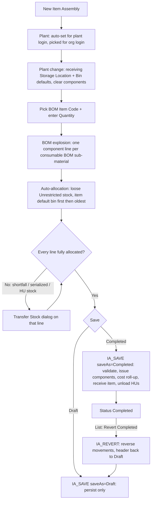

# Item Assembly — Mobile Implementation Guide

> **Audience:** Mobile engineers building the Item Assembly (IA) screen natively.
> **Scope:** Full parity with the desktop form and list page. That covers creating, editing and saving as Draft, completing (inventory moves), reverting a Completed assembly back to Draft, and deleting. BOM maintenance is **out of scope**; this guide covers only the BOM rules that Item Assembly *reads*.
> **Assumes:** You already know the HU concepts from the MSI / GD / RO mobile guides. The component-picking half of this screen is a port of Misc Issue.
> **Source files covered (all under `Item Assembly & BOM/`):**
> - **Client scripts:** `ItemAssemblyOnMounted.js`, `ItemAssemblyOnChangePlant.js`, `ItemAssemblyOnChangeProject.js`, `ItemAssemblyOnChangeItem.js`, `ItemAssemblyOnChangeItemQty.js`, `ItemAssemblyConfirmDialog.js`, `ItemAssemblyOnChangeDialogUOM.js`, `ItemAssemblyOnChangeSelectHU.js`, `ItemAssemblyOnChangeSMQuantity.js`, `ItemAssemblyOnChangeCategory.js`, `ItemAssemblySearchSN.js`, `ItemAssemblyResetSN.js`, `ItemAssemblySaveAsDraft.js`, `ItemAssemblySaveAsCompleted.js`, `ItemAssemblyListDelete.js`, `ItemAssemblyListRevertCompleted.js`.
> - **Scripts embedded only in `ItemAssemblyFullJSON.json`:** the Transfer Stock dialog opener, the numbering-rule `onChange`, and the dialog quantity validator.
> - **Workflows:** `ItemAssemblySaveWorkflow.json` (`IA_SAVE`) and `RevertCompletedIA/IArevertCompletedWorkflow.json` (`IA_REVERT`).
>
> Every client script and every save-workflow code node is reproduced verbatim in [Part 15](#part-15--full-source-appendix).
> **Deployment state (2026-09-14):** both workflows, the form and the list page are enabled on **dev**. Prod is not released.

---

## The load-bearing idea

**An Item Assembly turns components into one finished item.** When it is completed, it consumes the components listed on the item's Bill of Materials and receives the assembled item into stock at their combined cost.

The screen is two existing modules glued together:

| Part of the screen | Behaves like | Direction |
|---|---|---|
| **Header** (assembled item, quantity, storage location, bin, batch) | **one Misc Receipt line** | assembled item goes **IN** |
| **BOM Components table** (`stock_movement`) | **a Misc Issue** — same Transfer Stock dialog, same `temp_qty_data` picks | components go **OUT** |

> **Trust the workflow.** Mobile **never** writes inventory, balances, movements, costing, batches or HU contents. It builds the header plus component lines, including the per-line pick JSON, and calls **one** save workflow (`IA_SAVE` `2098335576774463489`). The server re-validates, moves the stock and computes the cost. Your job is to:
> 1. explode the BOM correctly;
> 2. stage correct picks that add up exactly to what the BOM requires;
> 3. handle the response codes.

---

## Table of Contents

- [Part 1 — Orientation & Glossary](#part-1--orientation--glossary)
- [Part 2 — Lifecycle & Status State Machine](#part-2--lifecycle--status-state-machine)
- [Part 3 — Data Model](#part-3--data-model)
- [Part 4 — Page Initialization](#part-4--page-initialization)
- [Part 5 — Header Field Behaviour](#part-5--header-field-behaviour)
- [Part 6 — BOM Explosion](#part-6--bom-explosion)
- [Part 7 — Auto-Allocation](#part-7--auto-allocation)
- [Part 8 — Transfer Stock Dialog](#part-8--transfer-stock-dialog)
- [Part 9 — Save Workflow Contract IA_SAVE](#part-9--save-workflow-contract-ia_save)
- [Part 10 — Completion Inventory and Costing Mechanics](#part-10--completion-inventory-and-costing-mechanics)
- [Part 11 — Revert Workflow Contract IA_REVERT](#part-11--revert-workflow-contract-ia_revert)
- [Part 12 — List Page, Delete and Bulk Revert](#part-12--list-page-delete-and-bulk-revert)
- [Part 13 — Mobile Cheat Sheet and Porting Checklist](#part-13--mobile-cheat-sheet-and-porting-checklist)
- [Part 14 — Edge Cases, Gotchas and Known Gaps](#part-14--edge-cases-gotchas-and-known-gaps)
- [Part 15 — Full Source Appendix](#part-15--full-source-appendix)

---

## Part 1 — Orientation & Glossary

### End-to-end flow



### Collections

| What | Collection (display name / id) | Physical table |
|---|---|---|
| Header | **Item Assembly** `2098256587713404929` | `sm_item_assembly` |
| Component lines (`stock_movement` subform) | child of header, FK `sm_item_assembly_id` | `sm_item_assembly_tlm8ve69_sub` |
| Dialog loose table (`sm_item_balance.table_item_balance`) | child of header, FK `sm_item_assembly_id` | `sm_item_assembly_mw10kf66_sub` (the save never writes it — see Part 3d) |
| BOM | `bill_of_materials`, sub-materials in `subform_sub_material` | — |
| Stock | `item_balance`, `item_batch_balance`, `item_serial_balance`, `handling_unit` (+ flat `handling_unit_atu7sreg_sub`), `on_reserved_gd` | — |

### Glossary

| Term | Meaning |
|---|---|
| **Assembled item** | Header `item_id`. The finished good produced and received **IN**. |
| **Component line** | One row of `stock_movement`. One BOM sub-material consumed **OUT**. |
| **`requested_qty`** | What the BOM requires for this line at the header quantity. Derived and read-only. See [Part 6](#part-6--bom-explosion). |
| **`total_quantity`** | What has actually been allocated from stock. At Completed it **must equal** `requested_qty` within 0.0005. |
| **Pick** | One allocation, meaning "take `sm_quantity` from this balance row / bin / batch / HU". A line's picks live in `temp_qty_data` as a **JSON string**. |
| **Loose stock** | Stock in a bin that is not inside a handling unit. |
| **HU stock** | Stock inside a handling unit (`handling_unit.table_hu_items`). An HU pick carries `handling_unit_id`. |
| **`temp_hu_data`** | JSON string of the HU dialog rows that were picked. Only used to repopulate the dialog when it is reopened; the server ignores it. |
| **`stock_summary`** | Human-readable text describing the picks. Display only. |
| **`IA` / `IA-R`** | `inventory_movement.transaction_type` for a completion and for its reversal. `trx_no` is the IA number. |
| **`stock_movement_no`** | The IA document number. The `'draft'` / `'issued'` sentinels are replaced by the serial engine on write. |
| **`stock_movement_no_type`** | Numbering rule id. **`-9999` = Manual Input** (the typed number is kept). |
| **`issuing_operation_faci`** | The **Plant**. The name is inherited from Misc Issue. |

---

## Part 2 — Lifecycle & Status State Machine

`item_assembly_status` can hold **Draft, Issued, Completed, Fully Posted**. In practice only two are ever written:

```
            IA_SAVE saveAs=Completed
 (new) ──▶ Draft ─────────────────────────▶ Completed
   │         ▲                                  │
   │         └──── IA_REVERT (list page) ◀──────┘
   └──── IA_SAVE saveAs=Completed (skip Draft entirely; supported)
```

- **Draft** is written by `IA_SAVE` (`saveAs: "Draft"`) and by `IA_REVERT`.
- **Completed** is written by `IA_SAVE` (`saveAs: "Completed"`).
- **Issued** and **Fully Posted** exist in the dictionary, but **nothing writes them**. Posting is a later phase: the desktop **Complete & Post** and **Post** buttons have an **empty `onClick`**. Mobile should **not** show them, but must still *render* those two statuses if they ever appear.
- `posted_status` is set to `"Unposted"` on Completed and cleared to `""` by Revert.

| Status | Doc number | Inventory moved | Header editable | Components editable | Desktop buttons |
|---|---|---|---|---|---|
| (new) | none | no | yes | yes | Draft, Completed, Complete & Post* |
| **Draft** | `'draft'` sentinel → real number from rule (or manual) | no | **yes** | yes | Draft, Completed, Complete & Post* |
| **Completed** | real number (new one issued on completion) | **yes** | no | no | Post* |
| Issued / Fully Posted (legacy) | — | — | no | table still enabled on desktop | Completed, Complete & Post* |

\* Unbound on desktop. Do not port.

### What IA_SAVE does for you, per `saveAs`

| Step | `Draft` | `Completed` |
|---|:---:|:---:|
| Format quantities, stamp line `organization_id` / `issuing_plant` / `line_index` | ✓ | ✓ |
| Required-field check (400) | ✓ | ✓ |
| Assembly validation: qty > 0, lines present, every line allocated, allocated = requested, manual batch present (401) | ✗ | ✓ |
| Idempotency guard: refuse if DB status is Completed / Fully Posted (409). **Edit only** | ✗ | ✓ |
| Pre-flight inventory check of every pick (402) | ✗ | ✓ |
| Resolve / generate batch for the assembled item | ✗ | ✓ |
| Persist header + lines | ✓ | ✓ |
| Issue a **new** document number | only if number empty (Add) | ✓ (always, unless Manual Input) |
| `SUBTRACT_INVENTORY` per pick (`IA` OUT) | ✗ | ✓ |
| Cost roll-up + `ADD_INVENTORY` for the assembled item (`IA` IN) | ✗ | ✓ |
| HU unload for HU picks | ✗ | ✓ |
| `Item.last_transaction_date` | ✗ | ✓ |

> **Mobile callout.** A Draft save does **not** check allocations. Only the required fields are checked. You can let users save a half-allocated draft.

---

## Part 3 — Data Model

### 3a. Header fields

"Req" is the desktop form's required flag. The server's own required list is in [Part 9](#part-9--save-workflow-contract-ia_save).

| Field key | Label | Type | Req | Default / set by | Editable | Data source (value / label / filter) |
|---|---|---|:---:|---|---|---|
| `organization_id` | — | hidden | | mounted (see [Part 4](#part-4--page-initialization)) | — | — |
| `page_status` | — | hidden | | mounted: `Add` / `Edit` / `View` / `Clone` | — | — |
| `item_assembly_status` | — | hidden | | server | — | dictionary parent `1914242988707749889` |
| `posted_status` | — | hidden | | server | — | dictionary parent `1914242988707749889` |
| `issuing_operation_faci` | **Plant** | tree select | ✓ | plant login: its own dept (locked) | org login only | Org dept tree, value `id`, label `dept_name` |
| `stock_movement_no_type` | Numbering rule | select | | default rule (`is_default===1`), else `-9999` | yes on new | `流水号规则表` (`1994006139209117697`): value `id`, label `rule_name`; filter `business_type = "Item Assembly"`, `department_id = {{global:firstLvDeptId}}`, `is_draft = 0`. Prepend `{label:"Manual Input", value:-9999}` when the component allows manual input |
| `stock_movement_no` | **Item Assembly No** | text | (server) | empty; sentinel on save | only when rule = `-9999` | — |
| `item_id` | **BOM Item Code** | select | ✓ | — | yes | **Bill of Materials**: value `parent_material_code.id` (an **Item id**), label `parent_material_code.material_code`; filter org |
| `item_name` | BOM Item Name | text | | from Item `material_name` | no | — |
| `item_desc` | BOM Item Description | textarea | | from Item `material_desc` | yes | — |
| `item_qty` | **Quantity** | number, min 0, 3 dp | ✓ | — | yes | — |
| `item_uom` | UOM | select | | Item `based_uom` | no | `unit_of_measurement` id / `uom_name` |
| `item_assembly_date` | Date | date `YYYY-MM-DD` | | today (`new Date().toISOString().split("T")[0]`) | yes | — |
| `issued_by` | Issued By | text | | `{{global:nickname}}` | no | — |
| `project_id` | Project | select | | — | yes | Project (`2085600321692696577`) id / `project_code` |
| `storage_location_id` | **Storage Location** (receiving) | select | ✓ | item default bin, else plant default ([Part 5](#part-5--header-field-behaviour)) | once item chosen | `storage_location`: `plant_id = plant`, `storage_status = 1` |
| `location_id` | **Bin Location** (receiving) | select | ✓ | item default bin, else plant default ([Part 5](#part-5--header-field-behaviour)) | once storage location chosen | `bin_location` id / `bin_location_combine`: `plant_id`, `storage_location_id`, `bin_status = 1` |
| `batch_no` | Batch No | text | | — | **hidden on desktop** — see [Part 14](#part-14--edge-cases-gotchas-and-known-gaps) | — |
| `manufacturing_date` | Manufacturing Date | date | | — | hidden on desktop | — |
| `expired_date` | Expired Date | date | | — | hidden on desktop | — |
| `remarks`, `remarks_2`, `remarks_3` | Remarks 1–3 | textarea | | — | yes | — |
| `reference_documents` | Reference Documents | file upload (max 9) | | — | yes | `/api/blade-resource/oss/endpoint/put-file` |

### 3b. Component line — `stock_movement[]`

The table is **locked to the BOM**: `isAdd: false`, `isDelete: false`, and `item_selection` is disabled. Rows only come from the BOM explosion. To change the rows, change `item_id` or `item_qty`.

| Column | Label | Shown | Editable | Meaning |
|---|---|:---:|:---:|---|
| `item_selection` | Item Code | ✓ | ✗ | Component Item id (`bom_material_code`) |
| `item_name` | Item Name | ✓ | ✗ | `sub_material_name` \|\| Item `material_name` |
| `item_desc` | Item Description | ✓ | ✗ | `sub_material_desc` \|\| Item `material_desc` |
| `transfer_stock` | Transfer Stock | ✓ | link | "Select Stock": opens the dialog ([Part 8](#part-8--transfer-stock-dialog)) |
| `requested_qty` | Requested Quantity | hidden on desktop | ✗ | BOM requirement. **Mobile should show it** next to `total_quantity` |
| `total_quantity` | Total quantity | ✓ | ✗ | Allocated sum of picks |
| `quantity_uom` | Quantity UOM | ✓ | ✗ | `sub_material_qty_uom` \|\| Item `based_uom` |
| `stock_summary` | Stock Summary | ✓ | ✗ | Pick description text |
| `item_remark`, `item_remark_2`, `item_remark_3` | Remark 1–3 | ✓ | ✓ | seeded from `sub_material_remark` |
| `project_id` | Project | ✓ | ✓ | seeded from header |
| `temp_qty_data` | — | hidden | — | **JSON string**, array of picks (3c). **This is what the server consumes.** |
| `temp_hu_data` | — | hidden | — | JSON string of picked HU rows (3d) |
| `uom_options` | — | hidden | — | JSON string of UOM records for this line |
| `balance_id` | — | hidden | — | always `""` |
| `organization_id`, `issuing_plant`, `line_index` | — | hidden | — | overwritten by the server |

### 3c. Pick shape — each element of `temp_qty_data`

**Written by auto-allocation** (loose only):

```jsonc
{
  "material_id": "<component item id>",
  "location_id": "<bin id>",
  "storage_location_id": "<id>|null",
  "batch_id": "<batch id>|null",
  "balance_id": "<item_balance / item_batch_balance id>",
  "sm_quantity": 4,                 // in the LINE's quantity_uom, 3 dp
  "category": "Unrestricted",
  "plant_id": "<plant>",
  "organization_id": "<org>",
  "is_deleted": 0,
  "expired_date": null,
  "manufacturing_date": null,
  "unrestricted_qty": 10,           // informational snapshot
  "balance_quantity": 10            // informational snapshot
}
```

**Written by the Transfer Stock dialog:**
- **Loose rows:** the whole balance row (all balance columns, `balance_id`, `serial_number` when serialized, `remarks`, …). `dialog_manufacturing_date` and `dialog_expired_date` are renamed to `manufacturing_date` and `expired_date`. Rows with `sm_quantity` 0 are dropped.
- **HU rows:** the same keys as the auto-allocation shape, plus **`handling_unit_id`**. `category` is always `"Unrestricted"`.

**The server reads only these keys:**
- `sm_quantity` (picks ≤ 0 are ignored)
- `location_id`, `batch_id`, `category` (default `Unrestricted`)
- `manufacturing_date`, `expired_date`
- `handling_unit_id`
- for HU picks, also `storage_location_id`, `material_id`, `balance_id`

Everything else is carried along for the dialog. **`serial_number` is not read by the save** (see Part 14).

### 3d. Dialog working object — `sm_item_balance` (not persisted)

| Key | Meaning |
|---|---|
| `material_id` | component **material_code** (display) |
| `material_name` | display |
| `material_uom` | UOM the dialog is currently shown in (options = Item alt UOMs) |
| `current_table_uom` | UOM the loose table quantities are currently expressed in |
| `row_index` | which `stock_movement` row the dialog is editing |
| `table_item_balance[]` | loose balance rows (Part 8) |
| `table_hu[]` | HU header + item rows (Part 8) |
| `table_item_balance_raw` | JSON copy for serial search |
| `search_serial_number` | serial search text |

> **Strip it before saving.** The desktop does `const { sm_item_balance, ...data } = this.getValues()`. Never send `sm_item_balance` to `IA_SAVE`.

**`table_hu[]` row shape.** Rows come in pairs of a header row followed by its item rows:

```jsonc
// header row
{ "row_type": "header", "handling_unit_id": "<hu id>", "handling_no": "HU-0001",
  "material_id": "", "material_name": "", "storage_location_id": "...", "location_id": "...",
  "batch_id": null, "item_quantity": 12, "sm_quantity": 0, "remark": "", "balance_id": "" }
// item row
{ "row_type": "item", "handling_unit_id": "<hu id>", "handling_no": "",
  "material_id": "<item id>", "material_name": "...", "storage_location_id": "...",
  "location_id": "<bin>", "batch_id": null, "item_quantity": 12, "item_quantity_base": 12,
  "sm_quantity": 5, "remark": "", "balance_id": "<hu line balance id>",
  "expired_date": null, "manufacturing_date": null, "create_time": "..." }
```

`temp_hu_data` = the **item** rows with `sm_quantity > 0`, as a JSON string.

---

## Part 4 — Page Initialization

Source: `ItemAssemblyOnMounted.js`.

### Organization id

```js
let organizationId = this.getVarGlobal("deptParentId");
if (organizationId === "0") organizationId = this.getVarSystem("deptIds").split(",")[0];
```

### Plant — `setPlant`

Let `currentDept = deptIds.split(",")[0]`.

| Login | `currentDept === organizationId`? | New record (Add/Clone) behaviour |
|---|---|---|
| **Plant-level** | no | Plant = `currentDept`, **locked**. Run the plant-change logic (Part 5) so the storage location and bin defaults fill. Components table enabled. |
| **Org-level** | yes | Plant is editable and empty. **Components table disabled until a plant is chosen.** |

On Edit and View the plant is locked by the status rules below.

### Numbering rule default (Add / Clone)

1. Load the rule options. Filter: `business_type = "Item Assembly"`, `department_id = firstLvDeptId`, `is_draft = 0`.
2. If manual input is allowed (`canManualInput: true` on the IA number component, which it is), prepend `{ label: "Manual Input", value: -9999 }`.
3. Select the rule whose `is_default === 1`, otherwise `-9999`.
4. **On rule change:** clear `stock_movement_no`. The number field is editable **only** when the rule is `-9999`.

### Status → UI matrix

| Mode | Status badge | Header | Components table | Buttons |
|---|---|---|---|---|
| **Add / Clone** | Draft | editable (set `organization_id`, `issued_by = nickname`, `item_assembly_date = today`) | per `setPlant` | **Save as Draft**, **Complete** |
| **Edit, Draft** | Draft | **editable** | editable | Save as Draft, Complete |
| **Edit, Completed** | Completed | locked | **locked** | none (Post is unbound) |
| **Edit, other** (Issued / Fully Posted) | that status | locked | desktop leaves it enabled — **lock it on mobile** | none useful (a save returns 409 for Fully Posted) |
| **View** | status | locked | locked | none |

Fields locked when status ≠ Draft (`EDIT_DISABLED_FIELDS`):

```
issuing_operation_faci, stock_movement_no, stock_movement_no_type, item_id, item_name,
item_desc, item_qty, item_uom, issued_by, project_id, batch_no, manufacturing_date,
expired_date, storage_location_id, location_id, item_assembly_date, reference_documents,
remarks, remarks_2, remarks_3
```

Status badge colours on desktop: Draft = grey, Issued = teal, Completed = green, Fully Posted = green.

---

## Part 5 — Header Field Behaviour

### Receiving location chain

`storage_location_id` and `location_id` are where the **assembled item** is received. They resolve in this order, and are **re-resolved on both plant change and item change**:

1. **The assembled item's own default bin for this plant.** `item.table_default_bin` (subform; columns `plant_id`, `bin_location`, `storage_location`), first row where `plant_id` matches **and** `bin_location` is non-blank. A row with a blank bin counts as unconfigured and falls through — never stamp a blank bin.
   - `location_id` = `bin_location`; `storage_location_id` = `storage_location` **or the plant default storage location** if that column is blank (not the bin's own parent).
2. **Plant default.** `storage_location` where `{ plant_id, is_deleted: 0, is_default: 1, storage_status: 1, location_type: "Common" }`, first row; then `bin_location` where `{ plant_id, storage_location_id, is_deleted: 0, is_default: 1, bin_status: 1 }`, first row.
3. **Neither configured:** both `""`.

> **Always overwrite both fields, including with the empty pair.** If you only stamp when the item has a default bin, switching to an item **without** one silently leaves the previous item's bin on the header and the assembly is received into the wrong place.

Query cost: when the item's bin wins, the `bin_location` lookup is skipped. On item change the whole chain runs inside the same parallel batch as the BOM fetch, so it adds no latency.

### Plant change (`ItemAssemblyOnChangePlant.js`)

1. **Clear** `storage_location_id`, `location_id` **and all component lines** (`stock_movement: []`).
2. No plant: disable the components table and stop.
3. Run the **receiving location chain** above. If an assembled item is already selected, its `table_default_bin` is read (one extra query, issued in parallel with the storage-location lookup) and wins over the plant default.

> Clearing the lines means the user must re-pick the BOM item after changing the plant. On mobile, confirm before changing the plant when lines exist. The desktop does not ask.

### BOM Item Code change

Triggers the BOM explosion ([Part 6](#part-6--bom-explosion)) and re-runs the **receiving location chain** for the newly chosen item. The chain is stamped **before** the explosion's early returns (no active BOM / no consumable sub-materials / BOM base quantity 0), so an aborted explosion still leaves a correct receiving bin. If the value is cleared, clear `item_name`, `item_desc`, `item_uom` and `stock_movement`.

### Quantity change (`ItemAssemblyOnChangeItemQty.js`)

If `item_id` is set, re-run the **whole** explosion plus auto-allocation. **Every line's picks are rebuilt from scratch**, so manual Transfer Stock picks are discarded.

### Project change (`ItemAssemblyOnChangeProject.js`)

- Header project cleared: **do nothing**. Never wipe the line projects.
- Otherwise, lines with a blank `project_id` always take the header project.
- If some lines hold a **different** project, ask the user:
  - **Overwrite**: apply the header project to every line.
  - **Keep**: fill only the blank lines.

---

## Part 6 — BOM Explosion

Source: `ItemAssemblyOnChangeItem.js`. The whole explosion plus allocation costs a **fixed** number of queries, however many sub-materials the BOM has. Keep that budget on mobile: every lookup is one batched `in` query.

### Step 1 — assembled item

Set `item_name = material_name`, `item_desc = material_desc` and `item_uom = based_uom` from the Item, using fields `material_name,material_desc,based_uom`.

### Step 2 — pick the BOM

```js
db.collection("bill_of_materials").where({
  parent_material_code: <item_id>, organization_id, is_deleted: 0, is_active: 1
})
```

| Result | Behaviour |
|---|---|
| 0 BOMs | clear lines; warning **"No active Bill of Materials found for this item. Create a BOM before assembling it."** |
| ≥ 1 | sort: **`parent_mat_is_default === 1` first**, then the highest numeric `V<n>` in `parent_mat_bom_version`. Use the first. |
| > 1 and chosen BOM is not default | info **"Using BOM {version}; {n} BOMs exist for this item and none is marked default."** |

### Step 3 — consumable sub-materials

Take `bom.subform_sub_material` rows where `bom_material_code` is set **and `consume_type !== "REF"`**. REF lines are reference-only and are never consumed.

- None left: clear lines; warning **"BOM {version} has no consumable sub materials."**
- `parent_mat_base_quantity <= 0`: clear lines; error **"BOM {version} has a base quantity of 0 and cannot be scaled."**

### Step 4 — component items and UOMs (2 batched fetches)

- **Items:** `item` where `id in componentIds`, fields `material_name,material_desc,based_uom,serial_number_management,item_batch_management,table_uom_conversion`.
- **UOMs:** `unit_of_measurement` where `id in` (every `sub_material_qty_uom` + each item's `based_uom` + every `table_uom_conversion[].alt_uom_id`).

### Step 5 — the requested quantity formula

```js
requested_qty = round3( (item_qty / parent_mat_base_quantity)
                        × sub_material_qty
                        × (1 + sub_material_wastage / 100) )

if (item.serial_number_management === 1) requested_qty = Math.ceil(requested_qty)
```

**Example:** the BOM base quantity is 2, a sub-material quantity is 3 with 10% wastage, and `item_qty` is 5. Then `(5/2) × 3 × 1.10 = 8.25`. A serialized component would round up to `9`.

### Step 6 — build the lines

```js
{
  item_selection: sub.bom_material_code,
  item_name: sub.sub_material_name || item.material_name || "",
  item_desc: sub.sub_material_desc || item.material_desc || "",
  requested_qty,
  total_quantity: 0,
  quantity_uom: sub.sub_material_qty_uom || item.based_uom || "",
  uom_options: JSON.stringify(rowUoms),   // de-duplicated [sub uom, base uom, ...alt uoms]
  item_remark: sub.sub_material_remark || "",
  project_id: header.project_id || "",
  organization_id, issuing_plant: plantId, line_index: index + 1,
  balance_id: "", temp_qty_data: "", temp_hu_data: "", stock_summary: ""
}
```

If no plant is selected yet, show the warning **"Select a Plant to auto-allocate stock for these components."** and stop. Otherwise go straight to [Part 7](#part-7--auto-allocation).

---

## Part 7 — Auto-Allocation

Runs after every explosion. It is a convenience: it may leave lines short, and the user finishes those in the dialog.

### What it covers and what it does not

| Covered | Not covered (user must use Transfer Stock) |
|---|---|
| Loose stock, category **Unrestricted** | **Serialized** components (skipped entirely) |
| Batch and non-batch items | Stock inside **handling units** (never auto-picked) |
| Several lines of the same material (no double-claim) | Reserved / QI / Blocked categories |

### Fetch plan (parallel)

| # | Collection | Filter |
|---|---|---|
| 1 | `item_balance` (non-batch components) | `material_id in`, `plant_id`, `organization_id`, `is_deleted 0` |
| 2 | `item_batch_balance` (batch components) | same |
| 3 | `handling_unit_atu7sreg_sub` | `material_id in`, `is_deleted 0` → collect `handling_unit_id` |
| 4 | `on_reserved_gd` | `material_id in`, `plant_id`, `organization_id`, `is_deleted 0` |
| 5 | `handling_unit` (after 3) | `id in`, `is_deleted 0` |
| 6–7 | `bin_location` (`bin_location_combine`), `batch` (`batch_number`) | `id in`, for display |

### Availability rule — the double-count trap

`item_balance.unrestricted_qty` **already includes** stock sitting inside HUs. It is **already net** of loose Allocated GD reservations, because those move to `reserved_qty` when saved. So:

```
huReserved[huId|batchId]  = Σ on_reserved_gd.open_qty   where status === "Allocated" && open_qty > 0 && handling_unit_id set
huHeld[material|bin|batch] = Σ max(0, hu_item.quantity − huReserved[hu.id|hu_item.batch_id])   (hu items not deleted; bin = item.location_id || hu.location_id)
available(balance row)     = max(0, unrestricted_qty − huHeld[material|location_id|batch_id||"no_batch"])
```

Do **not** subtract loose reservations again.

### Allocation order

1. Sort each material's candidate balance rows: **that component's own default bin for this plant first** (same `table_default_bin` rule as [Part 5](#part-5--header-field-behaviour), keyed on the component, not the assembled item), then `create_time` ascending (oldest first) — including within the default bin. `table_default_bin` rides along on the component `item` projection, so this costs no extra query.
2. For each line, in line order, take `min(available, remaining)` from candidates. **Deduct from the candidate in place** so a later line of the same material cannot claim the same stock.
3. Write `total_quantity = Σ picks` (3 dp) and `temp_qty_data = JSON.stringify(picks)` (`""` if none).
4. Build `stock_summary`, using the exact format below so a manual re-pick reads the same:

```
Total: 8.25 PCS

DETAILS:
1. WH-A-01: 5 PCS (UNR)
[BATCH-001]
2. WH-A-02: 3.25 PCS (UNR)
```

5. If any line is short, show the warning **"Not enough loose stock for: {name} ({remaining}), …. Open Transfer Stock on those lines to pick from handling units."**

---

## Part 8 — Transfer Stock Dialog

Opened from a line's **Select Stock** link. Here the user picks loose and/or HU stock by hand. The desktop dialog is titled "Confirm Inventory". It has two tabs, **Handling Unit** and **Inventory** (loose). A tab with no rows is hidden; if both have rows, open on Inventory.

> **Mobile callout.** The desktop drives the tabs with DOM `querySelector` / `.click()`. Throw that away and use a native segmented control.

### 8a. Opening — what to load

Source: the inline opener `onClick_select_stock` in the appendix.

1. **Item:** `Item` where `id = item_selection`.
2. **Pick the balance collection:**
   - `serial_number_management === 1` → `item_serial_balance`
   - else `item_batch_management === 1` → `item_batch_balance`
   - else → `item_balance`
3. **Parallel fetches:**
   - UOMs for the item's `table_uom_conversion[].alt_uom_id`. These are the dialog UOM options; default = line `quantity_uom`.
   - `on_reserved_gd` where `{ plant_id, organization_id, material_id, is_deleted: 0 }`.
   - HUs: `handling_unit_atu7sreg_sub` `{ material_id, is_deleted: 0 }` → ids → `handling_unit` where `id in`, `plant_id`, `organization_id`, `is_deleted 0`.
   - Balances: `<balance collection>` where `{ material_id, plant_id }`.
4. **Reservations:** keep `status === "Allocated" && open_qty > 0`. For HU-bound ones, build `huReserved[huId|batchId]` in **base UOM**, converting `open_qty` from `item_uom` via `table_uom_conversion`.

### 8b. Loose table rows (`table_item_balance`)

1. Rename each balance row's `id` to **`balance_id`**. Default `category` = `"Unrestricted"`. For batch items, copy `expired_date` / `manufacturing_date` into `dialog_expired_date` / `dialog_manufacturing_date`.
2. **Non-serialized only:** subtract HU-held quantity, net of HU reservations, from `unrestricted_qty` **and** `balance_quantity`. The key is `location_id` or `location_id-batch_id`.
3. **Re-hydrate a previous pick:** merge the line's existing `temp_qty_data`, ignoring entries with `handling_unit_id`. The merge key is:
   - serialized: `location-serial` (+ `-batch` if batch-managed)
   - batch: `location-batch`
   - otherwise: `location_id || balance_id`

   A match keeps the fresh DB quantities but restores `sm_quantity`, `category` and `remarks`. Temp rows with no DB match are appended.
4. Drop rows with no quantity in any bucket (serialized rows also need a non-blank `serial_number`). Then **keep only rows with `unrestricted_qty > 0` or `block_qty > 0`**.
5. **Columns shown:**
   - batch items: Batch Number, Manufacturing Date, Expired Date
   - serialized items: Serial Number, plus the serial search box
   - always: Location, Unrestricted, Balance Quantity, **Inventory Category**, **Quantity** (`sm_quantity`)
6. **Category options:** dictionary parent `1915303560812322818`, restricted to **`Unrestricted` only**.

### 8c. HU table rows (`table_hu`) — ALLOW_SPLIT

For every HU that contains this material:
- Keep only `table_hu_items` of this material that are not deleted. Other materials in the same HU are hidden, not blocking.
- Per item: `baseQty = max(0, quantity − huReserved[hu.id|batch_id])`, then convert to the line UOM (`baseQty / alt.base_qty`, rounded to 3 dp).
- **Subtract what other lines already picked from this HU.** Use the other lines of the *same material*: parse their `temp_hu_data` item rows with `sm_quantity > 0`, keyed `hu|material|batch`.
- Skip item rows whose quantity ends ≤ 0. Drop HUs left with no item rows.
- Header row `item_quantity` = sum of its item rows.
- **Re-hydrate:** restore `sm_quantity` from this line's `temp_hu_data` (key `hu|material|batch`).
- The header row's `sm_quantity` is not editable. The desktop `hu_select` "select whole HU" switch is **hidden** for IA, so each HU item quantity is entered one at a time.

### 8d. Per-row quantity validator (loose `sm_quantity`)

1. Choose the bucket by `category`: Unrestricted → `unrestricted_qty`, Reserved → `reserved_qty`, Quality Inspection → `qualityinsp_qty`, Blocked → `block_qty`. Anything else fails with **"Invalid category type"**.
2. Add the quantity already confirmed on **other** lines' `temp_qty_data` with the same `material_id`, `balance_id`, `location_id` and category.
3. Fail with **"Quantity in {category} is not enough."** when `bucket < value + confirmedElsewhere`.

### 8e. Changing the dialog UOM (`ItemAssemblyOnChangeDialogUOM.js`)

Converts the loose table's `block_qty, reserved_qty, unrestricted_qty, qualityinsp_qty, intransit_qty, balance_quantity, sm_quantity` from `current_table_uom` to the new UOM via the base UOM, rounded to 3 dp. It then records `current_table_uom`.

> ⚠️ **Do not copy the desktop inconsistency.** The UOM change converts only the **loose** table, but Confirm converts **both** loose and HU rows from the dialog UOM back to the line UOM. If the dialog UOM differs from the line UOM, desktop HU quantities get converted once too often. On mobile, keep HU quantities in the line UOM, or convert both tables consistently.

### 8f. Serial search (serialized items)

- **Search:** `table_item_balance = raw.filter(r => r.serial_number.includes(text))`.
- **Reset:** restore the raw copy.
- Edits to `sm_quantity` / `category` on a filtered row are written back to the raw copy by `serial_number`, so they survive a reset. On mobile a single state array with a filter view does this for free.

### 8g. Confirm — the rules you must replicate (`ItemAssemblyConfirmDialog.js`)

Run in this order and stop at the first failure. **The dialog stays open with the entered quantities intact.**

1. If dialog UOM ≠ line UOM, convert loose and HU quantities to the line UOM.
2. **HU rows:** for item rows with `sm_quantity > 0`, fail when `sm_quantity > item_quantity`: **"HU {handling_no}: sm quantity ({x}) exceeds available ({y})."**
3. **Loose rows:** for rows with `sm_quantity > 0`, check the category bucket (as in 8d, but also accepting `In Transit` → `intransit_qty`). Messages: **"Quantity in {category} is not enough."** / **"Invalid category type"**.
4. **Exact-match gate.** Let `totalCombined = Σ loose sm_quantity + Σ HU sm_quantity`. If `requested_qty > 0` and `|round3(totalCombined − requested_qty)| > 0.0005`, fail with:
   **"Allocated {total} {uom} but {requested} {uom} is required (over|short by {diff}). Adjust the quantities before confirming."**
   Lines with `requested_qty` 0 are not gated.
5. **Duplicate serials** across all lines, keyed `serial|location|batch`. Fail with **"Duplicate serial numbers detected in the same location/batch combination: …"**.
6. **Write the line:**
   - `total_quantity = totalCombined`
   - `temp_qty_data = JSON.stringify([...loose rows with sm_quantity > 0 (dialog_* dates renamed), ...HU picks in balance shape])`
   - `temp_hu_data = JSON.stringify(HU item rows with sm_quantity > 0)`
   - `stock_summary`: format below
7. Close.

**HU pick in balance shape:**

```js
{ material_id, location_id, storage_location_id: s || null, batch_id: b || null,
  balance_id: hu.balance_id || "", sm_quantity, category: "Unrestricted",
  handling_unit_id, plant_id: header.issuing_operation_faci,
  organization_id: header.organization_id, is_deleted: 0,
  expired_date: e || null, manufacturing_date: m || null }
```

**`stock_summary` formats:**
- Loose only: `Total: X UOM\n\nDETAILS:\n1. <bin>: q UOM (UNR)\n[batch]`. Serialized rows add `\nSerial: …`, and remarks add `\nRemarks: …`.
- HU only: `Total: X UOM\n\nHANDLING UNIT:\n1. <handling_no>: q UOM\n   [Batch: …]`.
- Both: `Total: X UOM\n\nLOOSE STOCK:\n…\n\nHANDLING UNIT:\n…`.
- Category abbreviations: Blocked `BLK`, Reserved `RES`, Unrestricted `UNR`, Quality Inspection `QIP`, In Transit `INT`.

---

## Part 9 — Save Workflow Contract IA_SAVE

| | |
|---|---|
| Workflow | **`IA_SAVE`** — id **`2098335576774463489`** (79 nodes) |
| Request | `{ allData, saveAs, pageStatus }` |
| Response | `{ code: string, message: string, id: string }`, read from `workflowResult.data` |

- **`saveAs`:** exactly `"Draft"` or `"Completed"`. Every branch tests `saveAs !== "Draft"`, and the value is written straight into `item_assembly_status`, so do not send anything else.
- **`pageStatus`:** `"Add"` for a new document, `"Edit"` for an existing one. Only `"Edit"` (update vs insert, plus the 409 guard) and `"Add"` (treat stored status as Draft) are tested. See the Clone gotcha in Part 14.
- **`code` is a string.** Every return uses HTTP 200, so branch on `data.code`, never on HTTP status.

### Desktop wrapper (both buttons)

```js
await this.validate();                               // form required fields
const { sm_item_balance, ...data } = this.getValues();
runWorkflow("2098335576774463489", { allData: data, saveAs: "Draft" | "Completed", pageStatus: data.page_status })
// success iff !data.code || String(data.code) === "200"; else show data.message || data.msg
// success toast: "Item Assembly saved as draft" / "Item Assembly completed"
```

### Request payload

```jsonc
{
  "saveAs": "Completed",
  "pageStatus": "Add",
  "allData": {
    "id": "<required when pageStatus = Edit>",
    "organization_id": "<org>",
    "issuing_operation_faci": "<plant id>",
    "stock_movement_no": "",                 // "" for auto numbering; typed value for Manual Input
    "stock_movement_no_type": 1234567890,    // NUMBER. Manual Input must be the number -9999, not "-9999"
    "item_assembly_status": "Draft",         // the status you loaded (drives stored-status logic)
    "item_id": "<assembled item id>",
    "item_name": "...", "item_desc": "...",
    "item_qty": 5,
    "item_uom": "<uom id>",
    "item_assembly_date": "2026-09-14",
    "issued_by": "nickname",
    "project_id": "",
    "batch_no": "",                          // required for batch item with Manual Input batch numbering
    "manufacturing_date": null, "expired_date": null,
    "storage_location_id": "<id>",
    "location_id": "<receiving bin id>",
    "remarks": "", "remarks_2": "", "remarks_3": "",
    "reference_documents": [],
    "stock_movement": [
      {
        "item_selection": "<component id>",
        "item_name": "...", "item_desc": "...",
        "requested_qty": 8.25,
        "total_quantity": 8.25,
        "quantity_uom": "<uom id>",
        "uom_options": "[...]",
        "stock_summary": "Total: ...",
        "item_remark": "", "item_remark_2": "", "item_remark_3": "",
        "project_id": "",
        "balance_id": "",
        "temp_qty_data": "[{\"material_id\":\"...\",\"location_id\":\"...\",\"sm_quantity\":8.25,\"category\":\"Unrestricted\", ...}]",
        "temp_hu_data": "[]"
      }
    ]
  }
}
```

> **Mobile callout.** Send quantities as numbers. The server turns `item_qty`, `requested_qty` and `total_quantity` into 3-dp **strings** itself.

### Server flow (node order)

1. **`code_fillback`**
   - Formats the quantities and stamps line `organization_id`, `issuing_plant` and `line_index` (1-based).
   - Computes `storedStatus = pageStatus === 'Add' ? 'Draft' : (allData.item_assembly_status || 'Draft')`, then sets `item_assembly_status = saveAs`.
   - **Numbering** applies only when `stock_movement_no_type !== -9999`:
     - Draft: the `'draft'` sentinel **only if the number is empty**.
     - Completed: the `'issued'` sentinel if the number is empty **or `storedStatus !== 'Completed'`**. Completing a Draft therefore **always issues a new number**, even if the Draft already had one.
   - Completed also sets `posted_status = 'Unposted'`.
2. **Required fields** (`CHECK_REQUIRED_FIELD`) → **400**:
   - `stock_movement_no` (Item Assembly No), `issuing_operation_faci` (Plant), `item_id` (Item Code), `item_qty` (Quantity), `storage_location_id` (Storage Location), `location_id` (Bin Location)
   - `stock_movement` (BOM Components) with `item_selection` on each line
3. *(Completed only)* **Validate Assembly** → **401**. See the message table below.
4. *(Completed + Edit only)* **Idempotency guard** → **409**. It re-reads the stored record from the DB and refuses when it is `Completed` or `Fully Posted`.
5. *(Completed only)* **Pre-flight inventory check** → **402**. `GLOBAL_INVENTORY_VALIDATION` runs for every pick with `sm_quantity > 0`. Params: `material_id`, `quantity`, `plant_id`, `organization_id`, `location_id`, `batch_id`, `orderUomId` (line UOM), `category`.
6. *(Completed only)* **Batch for the assembled item** (Part 10) → 400 on generation failure.
7. **Persist:**
   - Completed: `update_ia` then re-read (Edit), or `add_ia` (Add). `batch_no` = the server-resolved batch.
   - Draft: `update_draft` (Edit), which **does not touch the number columns**, or `add_draft`.
8. *(Completed only)* **Issue leg, component OUT movements** → 400 on failure.
9. *(Completed only)* **Cost roll-up + receipt leg**, assembled item IN → 400 on failure.
10. *(Completed only)* **HU unload** for HU picks. The result is **not** checked.
11. *(Completed only)* `Item.last_transaction_date = now` for the assembled item and all components.
12. **Return 200** with `id`.

### Response codes

| `code` | When | `message` | Stock moved? | Mobile action |
|---|---|---|---|---|
| `"200"` | success | `Item Assembly saved.` | Completed: yes | close, refresh; `id` = document id |
| `"400"` | required field missing | from `CHECK_REQUIRED_FIELD` | no | show message |
| `"400"` | batch generation failed | `Could not generate a batch number. Check the Batch Number Configuration for this item.` | no (but see below) | show message |
| `"400"` | `SUBTRACT_INVENTORY` / `ADD_INVENTORY` failed | engine `errorMessage` | **possibly partial** | show message; **reload the record** — see Part 14 |
| `"401"` | assembly invalid | see table below | no | show message |
| `"402"` | pre-flight shortfall | from `GLOBAL_INVENTORY_VALIDATION` | no | show message; send the user back to Transfer Stock |
| `"409"` | record already Completed / Fully Posted in DB | `This Item Assembly is already {status} and cannot be saved again.` | no | show message; reload as read-only |

**401 messages** (first failure wins):

| Rule | Message |
|---|---|
| stored status is Completed | `This Item Assembly is already Completed and cannot be saved again.` |
| `item_qty` ≤ 0 | `Quantity must be greater than zero.` |
| no lines | `No BOM components to consume. Choose an item that has an active Bill of Materials.` |
| a line has no pick with `sm_quantity > 0` | `Line {n} ({name}): no stock has been allocated.` |
| `|total_quantity − requested_qty| > 0.0005` | `Line {n} ({name}): allocated {a} but {r} is required.` |
| assembled item is batch-managed, `batch_number_genaration === 'Manual Input'`, and `batch_no` empty or `'-'` | `This item is batch managed with manual numbering, so a Batch No is required.` |

> **Mobile callout.** Mirror the 401 rules on the client before calling, so the user sees problems early. The server remains the authority.

---

## Part 10 — Completion Inventory and Costing Mechanics

You don't call any of this yourself. It is here so you understand what the server does with your picks.

### Batch for the assembled item

| Assembled Item | Result |
|---|---|
| `item_batch_management !== 1` | no batch (`batch_number: ""`) |
| batch, `batch_number_genaration === "According To System Settings"` | `GENERATE_BATCH` with `item_id`, `document_date = item_assembly_date`, `manufacturing_date`, `expired_date`. An empty result gives 400. |
| batch, any other setting (Manual Input) | `batch_no` from the payload |

The resolved number is written to the header `batch_no` **before** stock moves.

### Issue leg — one `SUBTRACT_INVENTORY` (`2012096660219564034`) per pick

| Param | Value |
|---|---|
| `plant_id`, `organization_id` | header |
| `material_id` | line `item_selection` |
| `quantity` | pick `sm_quantity` |
| `material_uom` | line `quantity_uom` |
| `transaction_type` | **`"IA"`** |
| `trx_no` | the **persisted real** document number (re-read after the write, never the `'issued'` sentinel) |
| `inventory_category` | pick `category` \|\| `"Unrestricted"` |
| `location_id`, `batch_id`, `manufacturing_date`, `expired_date`, `handling_unit_id` | from pick, **`null` when absent (never `""`)** |
| `doc_date` | `item_assembly_date` |
| `itemData` | component Item row |

### Cost roll-up

The server reads back the movements it just wrote: `inventory_movement` where `trx_no = <number>` and `movement = "OUT"`.

```
unit_price(assembled) = round4( Σ OUT.total_price / item_qty  +  Item.assembly_cost )
```

So the finished good carries the **actual** FIFO / weighted-average value of the consumed components, plus the per-unit `assembly_cost` from the assembled Item master.

### Receipt leg — one `ADD_INVENTORY` (`2012005532688723970`)

- `material_id = item_id`, `quantity = item_qty`, `material_uom = item_uom`
- `transaction_type "IA"`, `trx_no`
- `inventory_category "Unrestricted"`
- `location_id` = header bin, `batch_number` (string), `unit_price` (above)
- `doc_date`, `manufacturing_date`, `expired_date`
- `remark` / `remark2` / `remark3` = header remarks
- `itemData`, `isMovingInv "0"`

### HU unload — `HANDLING_UNIT` (`2037062451509002241`), `process_type: "unload"`

HU picks are grouped by `handling_unit_id`:

```js
{ handling_unit_id, plant_id, organization_id, location_id, storage_location_id,
  table_hu_items: [{ material_id, location_id, batch_id, material_uom: line.quantity_uom,
                     quantity: sm_quantity, balance_id }] }
```

---

## Part 11 — Revert Workflow Contract IA_REVERT

| | |
|---|---|
| Workflow | **`IA_REVERT`** — id **`2099319746652852225`** |
| Request | `{ ia_id, ia_no, organization_id }` (strings). **One document per call.** |
| Response | `{ code, message, conflicts }` |
| Entry point on desktop | List page toolbar **Revert Completed** (multi-select), one call per selected row |

- **`ia_no` must be the stored `stock_movement_no`.** The workflow finds movements and batches by the number you send and does not cross-check it.
- **`organization_id` must come from the record.** On desktop the list grid needed a hidden `organization_id` column, because selected rows carry only grid columns. Without it the call fails with 400.
- **Parameter guard:** `ia_id` must be digits; `ia_no` and `organization_id` must match `/^[A-Za-z0-9\/\-_. ]{1,64}$/`.

### What it does

1. **Refusals** (400, nothing written):
   - `ia_id, ia_no and organization_id are required.`
   - `Item Assembly record not found for this organization.`
   - `This Item Assembly has been posted to accounting and cannot be reverted.` (status `Fully Posted`, or `posted_status === "Posted"`)
   - `Only Completed Item Assembly can be reverted (this one is {status|blank}).`
2. **Reads the ledger, not the document lines:** `inventory_movement` where `trx_no = ia_no` and `transaction_type IN ('IA','IA-R')`. Rows are paired by item | batch | bin | category | HU. Each `IA-R` row cancels the `IA` row it undid, so only still-unpaired rows are reversed.
3. **Conflict check** (409, **nothing written**). It blocks only when *this assembly's own output* has been used, or the data has drifted. `conflicts` is an array of `{ type, id, message }`:

| `type` | Meaning |
|---|---|
| `fifo_layer_consumed` / `fifo_layer_missing` | the assembled item's own FIFO layer was drawn down / not found |
| `wa_qty_short` / `wa_row_missing` / `wa_backsolve_negative` | weighted-average row short, missing, or the back-solve would go negative |
| `balance_short` / `balance_missing` | not enough of the assembled item left at the receiving bin / batch |
| `hu_missing` / `hu_status` / `hu_nested` / `hu_moved` / `hu_line_missing` | an HU that components came from can no longer take stock back (must be `Created`, not nested, not moved) |
| `item_missing` / `stock_control_changed` / `costing_method_changed` / `uom_conversion_changed` / `costing_inconsistent` | item master drift |
| `partial_row_state` | an earlier revert stopped inside a single movement |
| `fetch_truncated` | a lookup hit its limit; cannot verify |

   A sale of the same item from **older** stock does **not** block.
4. **Executes** line by line:
   - The assembled item: `SUBTRACT_INVENTORY` `IA-R` at the receipt price. Its FIFO layer is soft-deleted, or its WA batch row deleted, or the WA pool back-solved.
   - Each component: `ADD_INVENTORY` `IA-R` at the price it left at, with `batch_number "-"` so no batch is minted. HU picks are loaded back with `HANDLING_UNIT` `process_type "load"`.
   - Batch rows that completion minted for this number are soft-deleted.
   - Header: `item_assembly_status = "Draft"`, `posted_status = ""`. **The number is kept.** Completing again issues a **new** number.

### Response codes

| `code` | Message | Mobile action |
|---|---|---|
| `"200"` | `Item Assembly reverted to Draft successfully.` | success |
| `"400"` | refusal text above | show message |
| `"409"` | `Revert blocked: the assembled item has been used or its stock has moved on.` | show `message` + each `conflicts[].message`. Nothing changed. |
| `"500"` | `Revert stopped part way through: {label} - {detail}. Earlier lines have already been reversed. Do not edit or complete this Item Assembly; run Revert again to finish it.` (or the HU variant) | **prominent alert**. Tell the user to run Revert again; a rerun is safe and finishes only what is left. |

> ⚠️ `conflicts` is a real array only on 409. On 200 / 400 / 500 it is the literal **string `"[]"`**. Parse defensively: `Array.isArray(c) ? c : safeJsonParse(c) ?? []`.

A Completed assembly with **no** live movements (its save failed before the issue leg) reverts header-only.

---

## Part 12 — List Page, Delete and Bulk Revert

### Grid

- **Collection:** Item Assembly.
- **Scope filter:** `organization_id = {{global:deptParentId}}` **or** `{{system:deptIds}}`.
- **Paging:** 10 per page, multi-select.

| Column | Field |
|---|---|
| Item Assembly No | `stock_movement_no` |
| Status | `item_assembly_status` (pill) |
| Item Code | `item_id.material_code` |
| Item Name | `item_name` |
| Quantity | `item_qty` |
| Date | `item_assembly_date` (`YYYY-MM-DD`) |
| Issued By | `issued_by` |
| Posted Status | `posted_status` |
| *(hidden)* | `organization_id` — required by Revert |

- **Filters:** Item Assembly No, Item Code, Item Name (loose match), Status (multi-select).
- **Row actions and permission codes:** View `ia_view`, Edit `ia_edit`, Delete `ia_delete`. **Add New** currently has **no** permission code on the page. `ia_add` is not registered yet.

### Delete (`ItemAssemblyListDelete.js`) — client-side soft delete

1. Refuse when status is `Completed` or `Fully Posted`: **"Item Assembly {no} is {status} and cannot be deleted."** (Revert it first.)
2. Confirm: **"Delete Item Assembly {no}? This cannot be undone."**
3. `sm_item_assembly.doc(id).update({ is_deleted: 1 })`.
4. **Soft-delete both child tables too**, or the rows are orphaned: `sm_item_assembly_tlm8ve69_sub` and `sm_item_assembly_mw10kf66_sub`, where `{ sm_item_assembly_id: id, is_deleted: 0 }` → `is_deleted: 1`.
5. Success: **"Item Assembly {no} deleted."**

### Bulk Revert Completed (`ItemAssemblyListRevertCompleted.js`)

1. No selection: **"Please select at least one record."**
2. Split the selection: `item_assembly_status === "Completed"` is eligible. Anything else is skipped with **"Only Completed Item Assembly can be reverted (this one is {status})."**
3. None eligible: show the skipped list and stop.
4. Confirm: **"You've selected {n} Item Assembly to revert to Draft. This will take the assembled item back out of stock and return its components. Completing it again will issue a new number."** Also list the numbers and the skipped ones.
5. Call `IA_REVERT` **sequentially**, one row at a time, and collect results (Part 11 codes).
6. If any result is a 500 partial, show a separate blocking alert **"Revert did not finish"**.
7. Summary: **"{ok} reverted, {n} failed: …"** or **"All {n} Item Assembly reverted to Draft successfully"**. Refresh.

> Escape `stock_movement_no` before putting it in rich text. It is free text under Manual Input numbering.

---

## Part 13 — Mobile Cheat Sheet and Porting Checklist

**Init**
- [ ] Resolve `organization_id` (`deptParentId`, else first `deptIds`).
- [ ] Plant login: lock plant and apply plant defaults. Org login: plant empty, components disabled until chosen.
- [ ] Numbering rule: default rule, else Manual Input `-9999`. The number is editable only for `-9999`; clear it on rule change.
- [ ] Defaults: `issued_by = nickname`, `item_assembly_date = today`.
- [ ] Status matrix (Part 4): only Draft is editable. Hide Post / Complete & Post.

**Header**
- [ ] Plant change clears storage location, bin and **all lines**, then re-runs the receiving location chain (assembled item's `table_default_bin` for the plant, else the `Common` plant default).
- [ ] Item or quantity change re-runs explosion + auto-allocation (manual picks are discarded — warn the user) and re-stamps the receiving bin — **always overwritten**, so a previous item's bin cannot stick.
- [ ] Project cascade with Overwrite / Keep; clearing the header never wipes lines.

**BOM explosion**
- [ ] Active BOMs for the item in the org. Default first, else highest `V<n>`.
- [ ] Exclude `consume_type === "REF"`. Guard base quantity 0.
- [ ] `requested_qty = round3(item_qty / base × qty × (1 + wastage/100))`, `ceil` if serialized.
- [ ] Lines are not user-addable or deletable.

**Allocation**
- [ ] Auto: loose Unrestricted only, **component's own default bin first** then oldest `create_time`, HU-held minus HU reservations deducted, in-place deduction across lines, serialized skipped.
- [ ] Dialog: balance collection by serial / batch / loose; loose + HU (ALLOW_SPLIT); deduct other lines' HU picks; re-hydrate from `temp_qty_data` / `temp_hu_data`.
- [ ] Confirm gate: **loose + HU total == `requested_qty` (±0.0005)**, bucket checks, HU ≤ available, no duplicate serials.
- [ ] Write `total_quantity`, `temp_qty_data` (JSON string), `temp_hu_data` (JSON string), `stock_summary`.

**Save**
- [ ] Strip `sm_item_balance`. Send `{ allData, saveAs: "Draft" | "Completed", pageStatus: "Add" | "Edit" }`.
- [ ] `stock_movement_no_type` as a **number**; `-9999` for manual.
- [ ] Pre-validate the 401 rules on the client.
- [ ] **Disable the Save buttons while the call is in flight** (Add has no server-side double-submit guard).
- [ ] After the first successful Add, switch to Edit with the returned `id`.
- [ ] Handle 200 / 400 / 401 / 402 / 409 (Part 9). On a 400 from the Completed path, reload the record.

**List**
- [ ] Delete only non-Completed / non-Fully-Posted; soft-delete header + both child tables.
- [ ] Revert: Completed only; `{ ia_id, ia_no: stock_movement_no, organization_id }` from the record; sequential calls; 409 shows conflicts; 500 prompts a rerun.

---

## Part 14 — Edge Cases, Gotchas and Known Gaps

Each item below was checked against the source on 2026-09-14.

### Server behaviour you must design around

1. **No rollback on Completed.** Components are deducted one pick at a time *after* the header is already saved as Completed. If `SUBTRACT_INVENTORY` fails midway (400), earlier picks stay deducted. If `ADD_INVENTORY` fails, every component is consumed but the assembled item is not received. The pre-flight check (402) makes this unlikely, not impossible. After any 400 on Completed, **reload the document** rather than letting the user retry blindly. A retry on Edit gets 409, because the DB status is already Completed.
2. **Add has no idempotency guard.** The 409 guard runs only for `pageStatus: "Edit"`. A double-tap on Add creates **two** documents and moves stock twice. Debounce, and switch to Edit once you have an `id`.
3. **Completing a Draft always issues a new number** (unless Manual Input). Don't show the Draft's number as final.
4. **Clone.** Desktop Clone does not reset `item_assembly_status`, `stock_movement_no` or the line picks in `onMounted`, and it sends `pageStatus: "Clone"`. `storedStatus` is then taken from the copied status, so completing a clone of a Completed record returns 401 **"already Completed"**. If mobile offers Clone, reset `item_assembly_status = "Draft"`, `stock_movement_no = ""`, strip `id`, re-run explosion + allocation, and send `pageStatus: "Add"`.
5. **Serialized components.** The dialog lets users pick serial numbers, but `IA_SAVE` **never passes `serial_number`** to `SUBTRACT_INVENTORY`, and auto-allocation skips serialized items. Serial-level deduction is not guaranteed. Treat serialized components as unverified until tested on dev.
6. **HU unload result is unchecked.** If the unload silently fails, the HU still shows the stock. A later Revert then loads it back on top, over-filling the HU.
7. **Pass `null`, never `""`, for nullable pick fields** (`batch_id`, `location_id`, dates, `handling_unit_id`). The server already normalises this. If you ever build picks for another workflow, keep the rule: `SUBTRACT_INVENTORY` throws on `""`.

### Desktop gaps — decide deliberately, don't copy blindly

8. **`batch_no` is hidden on desktop**, yet the server requires it for a batch-managed assembled item with Manual Input batch numbering (401). `manufacturing_date` / `expired_date` are also hidden but feed batch generation and the receipt. Recommendation: show `batch_no` when the assembled item has `item_batch_management === 1 && batch_number_genaration === "Manual Input"`, and show both dates for any batch-managed assembled item.
9. **`requested_qty` is hidden on desktop.** Show it on mobile; it is what the user must match.
10. **UOM conversion inconsistency** in the dialog (Part 8e). Don't port it.
11. **BOM Item Code picker lists BOM rows**, not items. An item with several BOM versions appears several times, and inactive BOMs are listed too (explosion then warns). Consider de-duplicating by `parent_material_code` and filtering `is_active = 1`.
12. **Project datasource filter** compares `organization_id_1` against a form field that doesn't exist. Filter projects by the real `organization_id` on mobile.
13. **List Status filter** offers `Draft`, `Created`, `Completed`. `Created` is not an IA status, and `Issued` / `Fully Posted` are missing. The status pill set has no `Fully Posted` style either. Use the real set: Draft, Issued, Completed, Fully Posted.
14. **List Edit button** has a hidden expression `posted_status.dict_key == 'Pending Post'`. `posted_status` is a plain string, so it never hides. Use the status matrix (Part 4) instead.
15. **Legacy statuses.** On desktop an `Issued` / `Fully Posted` record opened in Edit still shows the Completed button with the components table enabled. Lock it on mobile.
16. **Plant change wipes lines without asking** (Part 5). Add a confirm on mobile.

### Revert limitations

17. Components come back as a **new** FIFO layer at their average cost, not into the original layers. The value is exact; the layer order is not.
18. If `ADD_INVENTORY` succeeds but the HU load then fails, a rerun treats that row as done and does **not** retry the load.
19. `Item.last_transaction_date` is not restored.
20. A receipt at unit cost 0 reverses correctly, but the `IA-R` audit movement is stamped with the FIFO / WA price (`SUBTRACT` treats 0 as absent).

---

## Part 15 — Full Source Appendix

Verbatim copies. The repo files are the source of truth; if anything here disagrees with them, the files win.

### 15a. Page init and header

#### `ItemAssemblyOnMounted.js`

Page init — status matrix, setPlant, numbering-rule default.

```js
const showStatusHTML = (status) => {
  const statusMap = {
    Draft: "draft_status",
    Issued: "issued_status",
    Completed: "completed_status",
    "Fully Posted": "fullyposted_status",
  };
  if (statusMap[status]) {
    this.display([statusMap[status]]);
  }
};

const EDIT_DISABLED_FIELDS = [
  "issuing_operation_faci",
  "stock_movement_no",
  "stock_movement_no_type",
  "item_id",
  "item_name",
  "item_desc",
  "item_qty",
  "item_uom",
  "issued_by",
  "project_id",
  "batch_no",
  "manufacturing_date",
  "expired_date",
  "storage_location_id",
  "location_id",
  "item_assembly_date",
  "reference_documents",
  "net_weight",
  "gross_weight",
  "remarks",
  "remarks_2",
  "remarks_3",
];

// Mirrors MSI: a plant-level login can only issue from its own plant, so the
// field is fixed to it and locked; an org-level login picks one.
const setPlant = (organizationId, pageStatus) => {
  const currentDept = this.getVarSystem("deptIds").split(",")[0];
  const isSameDept = currentDept === organizationId;
  const isNew = pageStatus === "Add" || pageStatus === "Clone";

  this.disabled(["issuing_operation_faci"], !isSameDept);

  if (isNew && !isSameDept) {
    this.setData({ issuing_operation_faci: currentDept });
    this.disabled(["stock_movement"], false);
    // Reuse the plant handler so the storage location and bin defaults are
    // resolved in exactly one place.
    this.triggerEvent("onChange_Plant", { value: currentDept });
  } else if (isNew && isSameDept) {
    this.disabled(["stock_movement"], true);
  }

  return currentDept;
};

(async () => {
  try {
    let pageStatus = "";

    if (this.isAdd) pageStatus = "Add";
    else if (this.isEdit) pageStatus = "Edit";
    else if (this.isView) pageStatus = "View";
    else if (this.isCopy) pageStatus = "Clone";
    else throw new Error("Invalid page state");

    let organizationId = this.getVarGlobal("deptParentId");
    if (organizationId === "0") {
      organizationId = this.getVarSystem("deptIds").split(",")[0];
    }

    this.setData({ page_status: pageStatus });
    const status = this.getValue("item_assembly_status");

    switch (pageStatus) {
      case "Add":
      case "Clone":
        this.setData({
          organization_id: organizationId,
          issued_by: this.getVarGlobal("nickname"),
          item_assembly_date: new Date().toISOString().split("T")[0],
        });
        this.display([
          "draft_status",
          "button_draft",
          "button_completed",
          "comp_post_button",
        ]);

        setPlant(organizationId, pageStatus);
        break;

      case "Edit":
        showStatusHTML(status);

        // A draft is still being written, so the header stays editable; every
        // later status locks it. Same rule as Handling Unit and Misc Issue.
        if (status !== "Draft") {
          this.disabled(EDIT_DISABLED_FIELDS, true);
        }

        if (status === "Completed") {
          this.display(["button_post"]);
          this.disabled(["stock_movement"], true);
        } else if (status === "Draft") {
          this.display([
            "button_draft",
            "button_completed",
            "comp_post_button",
          ]);
        } else {
          this.display(["button_completed", "comp_post_button"]);
        }
        break;

      case "View":
        showStatusHTML(status);
        this.disabled(EDIT_DISABLED_FIELDS.concat(["stock_movement"]), true);
        break;
    }
  } catch (error) {
    console.error(error);
    this.$message.error(error.message || "An error occurred");
  }
})();

setTimeout(async () => {
  if (!this.isAdd && !this.isCopy) return;

  const maxRetries = 10;
  const interval = 500;
  for (let i = 0; i < maxRetries; i++) {
    const op = await this.onDropdownVisible("stock_movement_no_type", true);
    if (op != null) break;
    await new Promise((resolve) => setTimeout(resolve, interval));
  }

  function getDefaultItem(arr) {
    return arr?.find((item) => item?.item?.is_default === 1);
  }

  const params = this.getComponent("stock_movement_no");
  const { options } = params;
  const optionsData = this.getOptionData("stock_movement_no_type") || [];
  const defaultData = getDefaultItem(optionsData);

  if (options?.canManualInput) {
    if (!optionsData.some((option) => option.value === -9999)) {
      this.setOptionData("stock_movement_no_type", [
        { label: "Manual Input", value: -9999 },
        ...optionsData,
      ]);
    }
    this.setData({
      stock_movement_no_type: defaultData ? defaultData.value : -9999,
    });
  } else if (defaultData) {
    this.setData({ stock_movement_no_type: defaultData.value });
  }
}, 200);
```

#### `ItemAssemblyOnChangePlant.js`

Plant change — default storage location / bin, clear lines.

```js
// Item master default bin for this plant. A row without a bin is treated as
// unconfigured so we never stamp a blank bin over the plant default.
const getItemDefaultBin = (tableDefaultBin, plantId) => {
  if (!plantId || !Array.isArray(tableDefaultBin)) return null;

  const matchingBin = tableDefaultBin.find(
    (bin) => bin.plant_id === plantId && bin.bin_location
  );

  if (!matchingBin) return null;

  return {
    binLocation: matchingBin.bin_location,
    storageLocation: matchingBin.storage_location || null,
  };
};

(async () => {
  try {
    const plantID = arguments[0].value;

    this.setData({
      storage_location_id: "",
      location_id: "",
      stock_movement: [],
    });

    if (!plantID) {
      // No plant means no stock to allocate against.
      this.disabled(["stock_movement"], true);
      return;
    }

    this.disabled(["stock_movement"], false);

    const assembledItemID = this.getValue("item_id");

    const [resStorageLocation, resItem] = await Promise.all([
      db
        .collection("storage_location")
        .where({
          plant_id: plantID,
          is_deleted: 0,
          is_default: 1,
          storage_status: 1,
          location_type: "Common",
        })
        .get(),
      assembledItemID
        ? db
            .collection("item")
            .field("table_default_bin")
            .where({ id: assembledItemID })
            .get()
            .catch(() => ({ data: [] }))
        : Promise.resolve({ data: [] }),
    ]);

    const defaultStorageLocationID = resStorageLocation.data?.[0]?.id;

    // The assembled item's own default bin for this plant wins over the plant default.
    const itemDefaultBin = getItemDefaultBin(
      resItem.data?.[0]?.table_default_bin,
      plantID
    );

    if (itemDefaultBin) {
      this.setData({
        storage_location_id:
          itemDefaultBin.storageLocation || defaultStorageLocationID || "",
        location_id: itemDefaultBin.binLocation,
      });
      return;
    }

    if (!defaultStorageLocationID) return;

    this.setData({ storage_location_id: defaultStorageLocationID });

    const resBinLocation = await db
      .collection("bin_location")
      .where({
        plant_id: plantID,
        storage_location_id: defaultStorageLocationID,
        is_deleted: 0,
        is_default: 1,
        bin_status: 1,
      })
      .get();

    if (resBinLocation.data?.[0]?.id) {
      this.setData({ location_id: resBinLocation.data[0].id });
    }
  } catch (error) {
    console.error("Error loading plant defaults:", error);
    this.$message.error(error.message || "Failed to load the plant defaults");
  }
})();
```

#### `ItemAssemblyOnChangeProject.js`

Project cascade.

```js
// Push the header Project down onto the BOM component lines, following the same
// rules as Sales Order (SOonChangeProject.js).
//
// A blank line always takes the header's project. A line carrying a DIFFERENT
// project is left alone unless the user asks to overwrite it — a component is
// allowed to sit on a project of its own, independently of the header.
//
// Bound to the header Project's onChange only. Unlike Sales Order there is no
// onRowAdd to wire: the components table is locked to the BOM, so rows only
// arrive via the explosion, which seeds project_id itself.

(async () => {
  const isBlank = (value) =>
    value === null || value === undefined || value === "";

  const projectId = this.getValue("project_id");

  // Clearing the header must not wipe projects already entered on the lines.
  if (isBlank(projectId)) return;

  const rows = this.getValue("stock_movement") || [];
  if (rows.length === 0) return;

  // One setData for the whole cascade rather than one write per row.
  const applyTo = async (indexes) => {
    if (indexes.length === 0) return;

    const updates = {};

    for (const index of indexes) {
      updates[`stock_movement.${index}.project_id`] = projectId;
    }

    await this.setData(updates);
  };

  const blanks = [];
  const conflicts = [];

  rows.forEach((row, index) => {
    if (isBlank(row.project_id)) {
      blanks.push(index);
    } else if (String(row.project_id) !== String(projectId)) {
      conflicts.push(index);
    }
  });

  if (conflicts.length === 0) {
    await applyTo(blanks);
    return;
  }

  await this.$confirm(
    `${conflicts.length} component line(s) already have a different project. Please choose one: <br><br>
        <strong>Overwrite:</strong> Apply the header project to every line.<br>
        <strong>Keep:</strong> Only fill the lines that have no project yet.`,
    "Project Change Detected",
    {
      confirmButtonText: "Overwrite",
      cancelButtonText: "Keep",
      dangerouslyUseHTMLString: true,
      type: "info",
    }
  )
    .then(() => applyTo([...blanks, ...conflicts]))
    .catch(() => applyTo(blanks));
})();
```

#### `ItemAssemblyOnChangeItemQty.js`

Quantity change — re-run explosion.

```js
// Component quantities are derived from item_qty, so a change has to re-scale
// them. Re-running the explosion keeps one copy of the formula.
const itemId = this.getValue("item_id");
if (itemId) {
  this.triggerEvent("onChange_assembledItem", { value: itemId });
}
```

#### `ItemAssemblyOnChangeItem.js`

BOM explosion + auto-allocation.

```js
// Explodes the assembled item's BOM into the BOM Components table, then
// auto-allocates loose stock against each component line.
//
// Fetch budget is fixed regardless of how many sub-materials the BOM has:
// every lookup is batched across the whole component set.

const getOrganizationId = () => {
  let organizationId = this.getVarGlobal("deptParentId");
  if (organizationId === "0") {
    organizationId = this.getVarSystem("deptIds").split(",")[0];
  }
  return organizationId;
};

const clearComponents = () => {
  this.setData({
    item_name: "",
    item_desc: "",
    item_uom: "",
    stock_movement: [],
  });
};

const fetchByIds = (collection, ids, fields) => {
  let query = db.collection(collection);
  if (fields) query = query.field(fields);
  return query
    .filter([
      {
        type: "branch",
        operator: "all",
        children: [
          { prop: "id", operator: "in", value: ids },
          { prop: "is_deleted", operator: "equal", value: 0 },
        ],
      },
    ])
    .get()
    .catch((error) => {
      console.error(`Error fetching ${collection}:`, error);
      return { data: [] };
    });
};

// Item master default bin for this plant. A row without a bin is treated as
// unconfigured so we never stamp a blank bin over the plant default.
const getItemDefaultBin = (tableDefaultBin, plantId) => {
  if (!plantId || !Array.isArray(tableDefaultBin)) return null;

  const matchingBin = tableDefaultBin.find(
    (bin) => bin.plant_id === plantId && bin.bin_location
  );

  if (!matchingBin) return null;

  return {
    binLocation: matchingBin.bin_location,
    storageLocation: matchingBin.storage_location || null,
  };
};

// Plant-level fallback, mirroring onChange_Plant.
const fetchPlantDefaults = async (plantId) => {
  const empty = { storageLocation: null, binLocation: null };
  if (!plantId) return empty;

  const storageRes = await db
    .collection("storage_location")
    .where({
      plant_id: plantId,
      is_deleted: 0,
      is_default: 1,
      storage_status: 1,
      location_type: "Common",
    })
    .get()
    .catch(() => ({ data: [] }));

  const storageLocation = storageRes.data?.[0]?.id;
  if (!storageLocation) return empty;

  const binRes = await db
    .collection("bin_location")
    .where({
      plant_id: plantId,
      storage_location_id: storageLocation,
      is_deleted: 0,
      is_default: 1,
      bin_status: 1,
    })
    .get()
    .catch(() => ({ data: [] }));

  return { storageLocation, binLocation: binRes.data?.[0]?.id || null };
};

const fetchBalances = (collection, materialIds, plantId, organizationId) =>
  db
    .collection(collection)
    .filter([
      {
        type: "branch",
        operator: "all",
        children: [
          { prop: "material_id", operator: "in", value: materialIds },
          { prop: "plant_id", operator: "equal", value: plantId },
          { prop: "organization_id", operator: "equal", value: organizationId },
          { prop: "is_deleted", operator: "equal", value: 0 },
        ],
      },
    ])
    .get()
    .catch((error) => {
      console.error(`Error fetching ${collection}:`, error);
      return { data: [] };
    });

// Loose availability, mirroring the rules the Transfer Stock dialog applies:
// item_balance.unrestricted_qty is already net of Allocated loose reservations
// (they bucket-shift to reserved_qty on save), so only HU-held stock has to be
// deducted here to isolate what is genuinely loose.
const autoAllocate = async (rows, itemMap, uomMap, plantId, organizationId) => {
  const allocatable = rows.filter(
    (row) => itemMap.get(row.item_selection)?.serial_number_management !== 1
  );
  if (allocatable.length === 0) return;

  const batchIds = [];
  const looseIds = [];
  allocatable.forEach((row) => {
    const item = itemMap.get(row.item_selection);
    (item?.item_batch_management === 1 ? batchIds : looseIds).push(
      row.item_selection
    );
  });
  const allIds = allocatable.map((row) => row.item_selection);

  const [looseRes, batchRes, huSubRes, reservationRes] = await Promise.all([
    looseIds.length
      ? fetchBalances("item_balance", looseIds, plantId, organizationId)
      : Promise.resolve({ data: [] }),
    batchIds.length
      ? fetchBalances("item_batch_balance", batchIds, plantId, organizationId)
      : Promise.resolve({ data: [] }),
    db
      .collection("handling_unit_atu7sreg_sub")
      .filter([
        {
          type: "branch",
          operator: "all",
          children: [
            { prop: "material_id", operator: "in", value: allIds },
            { prop: "is_deleted", operator: "equal", value: 0 },
          ],
        },
      ])
      .get()
      .catch(() => ({ data: [] })),
    db
      .collection("on_reserved_gd")
      .filter([
        {
          type: "branch",
          operator: "all",
          children: [
            { prop: "material_id", operator: "in", value: allIds },
            { prop: "plant_id", operator: "equal", value: plantId },
            { prop: "organization_id", operator: "equal", value: organizationId },
            { prop: "is_deleted", operator: "equal", value: 0 },
          ],
        },
      ])
      .get()
      .catch(() => ({ data: [] })),
  ]);

  const huIds = [
    ...new Set(
      (huSubRes.data || []).map((sub) => sub.handling_unit_id).filter(Boolean)
    ),
  ];
  const huRes = huIds.length
    ? await fetchByIds("handling_unit", huIds)
    : { data: [] };

  // An Allocated reservation against an HU is logically Reserved, so that
  // portion never sat in unrestricted_qty and must not be deducted twice.
  const huReservedMap = new Map();
  (reservationRes.data || [])
    .filter(
      (r) => parseFloat(r.open_qty || 0) > 0 && r.status === "Allocated"
    )
    .forEach((r) => {
      if (!r.handling_unit_id) return;
      const key = `${r.handling_unit_id}|${r.batch_id || ""}`;
      huReservedMap.set(
        key,
        (huReservedMap.get(key) || 0) + parseFloat(r.open_qty || 0)
      );
    });

  const huQtyMap = new Map();
  (huRes.data || []).forEach((hu) => {
    (hu.table_hu_items || [])
      .filter((huItem) => huItem.is_deleted !== 1)
      .forEach((huItem) => {
        const locationId = huItem.location_id || hu.location_id;
        const reservedKey = `${hu.id}|${huItem.batch_id || ""}`;
        const qty = Math.max(
          0,
          (parseFloat(huItem.quantity) || 0) -
            (huReservedMap.get(reservedKey) || 0)
        );
        if (qty <= 0) return;
        const key = `${huItem.material_id}|${locationId}|${
          huItem.batch_id || "no_batch"
        }`;
        huQtyMap.set(key, (huQtyMap.get(key) || 0) + qty);
      });
  });

  const balancesByMaterial = new Map();
  [...(looseRes.data || []), ...(batchRes.data || [])].forEach((balance) => {
    const key = `${balance.material_id}|${balance.location_id}|${
      balance.batch_id || "no_batch"
    }`;
    const available = Math.max(
      0,
      (parseFloat(balance.unrestricted_qty) || 0) - (huQtyMap.get(key) || 0)
    );
    if (available <= 0) return;
    const list = balancesByMaterial.get(String(balance.material_id)) || [];
    list.push({ balance, available });
    balancesByMaterial.set(String(balance.material_id), list);
  });

  // The component's own default bin for this plant leads; the rest stay oldest first.
  const preferredBinByMaterial = new Map();
  allocatable.forEach((row) => {
    const defaultBin = getItemDefaultBin(
      itemMap.get(row.item_selection)?.table_default_bin,
      plantId
    );
    if (defaultBin?.binLocation) {
      preferredBinByMaterial.set(
        String(row.item_selection),
        defaultBin.binLocation
      );
    }
  });

  balancesByMaterial.forEach((list, materialId) => {
    const preferredBin = preferredBinByMaterial.get(materialId);
    list.sort((a, b) => {
      const byBin =
        (b.balance.location_id === preferredBin ? 1 : 0) -
        (a.balance.location_id === preferredBin ? 1 : 0);
      return byBin !== 0
        ? byBin
        : String(a.balance.create_time || "").localeCompare(
            String(b.balance.create_time || "")
          );
    });
  });

  const updates = {};
  const shortfalls = [];
  const picksByRow = new Map();

  rows.forEach((row, rowIndex) => {
    const item = itemMap.get(row.item_selection);
    if (!item || item.serial_number_management === 1) return;

    let remaining = parseFloat(row.requested_qty) || 0;
    if (remaining <= 0) return;

    const picks = [];
    const candidates = balancesByMaterial.get(String(row.item_selection)) || [];

    for (const candidate of candidates) {
      if (remaining <= 0) break;
      if (candidate.available <= 0) continue;

      const take = Math.min(candidate.available, remaining);
      // Deduct in place so a second line for the same material cannot claim
      // stock this line just took.
      candidate.available -= take;
      remaining = parseFloat((remaining - take));

      const balance = candidate.balance;
      picks.push({
        material_id: balance.material_id,
        location_id: balance.location_id,
        storage_location_id: balance.storage_location_id || null,
        batch_id: balance.batch_id || null,
        balance_id: balance.id,
        sm_quantity: parseFloat(take),
        category: "Unrestricted",
        plant_id: plantId,
        organization_id: organizationId,
        is_deleted: 0,
        expired_date: balance.expired_date || null,
        manufacturing_date: balance.manufacturing_date || null,
        unrestricted_qty: parseFloat(balance.unrestricted_qty) || 0,
        balance_quantity: parseFloat(balance.balance_quantity) || 0,
      });
    }

    const allocated = picks.reduce((sum, pick) => sum + pick.sm_quantity, 0);
    const total = parseFloat(allocated);

    updates[`stock_movement.${rowIndex}.total_quantity`] = total;
    updates[`stock_movement.${rowIndex}.temp_qty_data`] = picks.length
      ? JSON.stringify(picks)
      : "";
    picksByRow.set(rowIndex, { picks, total, row });

    if (remaining > 0) {
      shortfalls.push(`${row.item_name || row.item_selection} (${remaining})`);
    }
  });

  // stock_summary is read by a human, so bin / batch / UOM are resolved to names
  // here rather than left as ids. Both lookups are batched across every line.
  const allPicks = [...picksByRow.values()].flatMap((entry) => entry.picks);
  const pickBinIds = [
    ...new Set(allPicks.map((pick) => pick.location_id).filter(Boolean)),
  ];
  const pickBatchIds = [
    ...new Set(allPicks.map((pick) => pick.batch_id).filter(Boolean)),
  ];

  const [binRes, batchNameRes] = await Promise.all([
    pickBinIds.length
      ? fetchByIds("bin_location", pickBinIds, "bin_location_combine")
      : Promise.resolve({ data: [] }),
    pickBatchIds.length
      ? fetchByIds("batch", pickBatchIds, "batch_number")
      : Promise.resolve({ data: [] }),
  ]);

  const binMap = new Map(
    (binRes.data || []).map((bin) => [bin.id, bin.bin_location_combine])
  );
  const batchMap = new Map(
    (batchNameRes.data || []).map((batch) => [batch.id, batch.batch_number])
  );

  picksByRow.forEach(({ picks, total, row }, rowIndex) => {
    if (picks.length === 0) {
      updates[`stock_movement.${rowIndex}.stock_summary`] = "";
      return;
    }

    const uomName = uomMap.get(row.quantity_uom)?.uom_name || "";

    // Same shape onConfirm_Stock writes, so a manual re-pick reads identically.
    const details = picks
      .map((pick, i) => {
        const binName = binMap.get(pick.location_id) || pick.location_id;
        let line = `${i + 1}. ${binName}: ${pick.sm_quantity} ${uomName} (UNR)`;
        if (pick.batch_id) {
          line += `\n[${batchMap.get(pick.batch_id) || pick.batch_id}]`;
        }
        return line;
      })
      .join("\n");

    updates[
      `stock_movement.${rowIndex}.stock_summary`
    ] = `Total: ${total} ${uomName}\n\nDETAILS:\n${details}`;
  });

  await this.setData(updates);

  if (shortfalls.length > 0) {
    this.$message.warning(
      `Not enough loose stock for: ${shortfalls.join(
        ", "
      )}. Open Transfer Stock on those lines to pick from handling units.`
    );
  }
};

(async () => {
  try {
    const { value, fieldModel } = arguments[0];

    if (!value) {
      clearComponents();
      return;
    }

    const organizationId = getOrganizationId();
    const allData = this.getValues();
    const plantId = allData.issuing_operation_faci;

    // triggerEvent (the item_qty re-scale path) supplies no fieldModel.
    let parentItem = fieldModel?.item;
    if (!parentItem) {
      const parentRes = await fetchByIds(
        "item",
        [value],
        "material_name,material_desc,based_uom"
      );
      parentItem = (parentRes.data || [])[0];
    }

    this.setData({
      item_name: parentItem?.material_name || "",
      item_desc: parentItem?.material_desc || "",
      item_uom: parentItem?.based_uom || "",
    });

    const [bomRes, parentBinRes, plantDefaults] = await Promise.all([
      db
        .collection("bill_of_materials")
        .where({
          parent_material_code: value,
          organization_id: organizationId,
          is_deleted: 0,
          is_active: 1,
        })
        .get(),
      fetchByIds("item", [value], "table_default_bin"),
      fetchPlantDefaults(plantId),
    ]);

    // Always overwritten, so a previous item's default bin cannot stick.
    const parentDefaultBin = getItemDefaultBin(
      (parentBinRes.data || [])[0]?.table_default_bin,
      plantId
    );
    this.setData({
      storage_location_id:
        parentDefaultBin?.storageLocation ||
        plantDefaults.storageLocation ||
        "",
      location_id:
        parentDefaultBin?.binLocation || plantDefaults.binLocation || "",
    });

    const boms = bomRes.data || [];
    if (boms.length === 0) {
      this.setData({ stock_movement: [] });
      this.$message.warning(
        "No active Bill of Materials found for this item. Create a BOM before assembling it."
      );
      return;
    }

    // Default version wins; otherwise the highest V-number.
    const versionOf = (bom) => {
      const match = /^V(\d+)$/.exec(
        String(bom.parent_mat_bom_version || "").trim()
      );
      return match ? parseInt(match[1], 10) : 0;
    };
    boms.sort((a, b) => {
      const byDefault =
        (b.parent_mat_is_default === 1 ? 1 : 0) -
        (a.parent_mat_is_default === 1 ? 1 : 0);
      return byDefault !== 0 ? byDefault : versionOf(b) - versionOf(a);
    });
    const bom = boms[0];

    if (boms.length > 1 && bom.parent_mat_is_default !== 1) {
      this.$message.info(
        `Using BOM ${bom.parent_mat_bom_version}; ${boms.length} BOMs exist for this item and none is marked default.`
      );
    }

    // REF lines are reference-only and are never consumed.
    const subMaterials = (bom.subform_sub_material || []).filter(
      (sub) => sub.bom_material_code && sub.consume_type !== "REF"
    );

    if (subMaterials.length === 0) {
      this.setData({ stock_movement: [] });
      this.$message.warning(
        `BOM ${bom.parent_mat_bom_version} has no consumable sub materials.`
      );
      return;
    }

    const componentIds = [
      ...new Set(subMaterials.map((sub) => sub.bom_material_code)),
    ];

    const itemsRes = await fetchByIds(
      "item",
      componentIds,
      "material_name,material_desc,based_uom,serial_number_management,item_batch_management,table_uom_conversion,table_default_bin"
    );
    const itemMap = new Map(
      (itemsRes.data || []).map((item) => [item.id, item])
    );

    const uomIds = [
      ...new Set(
        subMaterials
          .flatMap((sub) => {
            const item = itemMap.get(sub.bom_material_code);
            return [
              sub.sub_material_qty_uom,
              item?.based_uom,
              ...(item?.table_uom_conversion || []).map(
                (conv) => conv.alt_uom_id
              ),
            ];
          })
          .filter(Boolean)
      ),
    ];
    const uomRes = uomIds.length
      ? await fetchByIds("unit_of_measurement", uomIds)
      : { data: [] };
    const uomMap = new Map((uomRes.data || []).map((uom) => [uom.id, uom]));

    const itemQty = parseFloat(allData.item_qty) || 0;
    const bomBaseQty = parseFloat(bom.parent_mat_base_quantity) || 0;

    if (bomBaseQty <= 0) {
      this.setData({ stock_movement: [] });
      this.$message.error(
        `BOM ${bom.parent_mat_bom_version} has a base quantity of 0 and cannot be scaled.`
      );
      return;
    }

    const rows = subMaterials.map((sub, index) => {
      const item = itemMap.get(sub.bom_material_code);
      const wastage = parseFloat(sub.sub_material_wastage) || 0;
      let requestedQty = parseFloat(
        (
          (itemQty / bomBaseQty) *
          (parseFloat(sub.sub_material_qty) || 0) *
          (1 + wastage / 100)
        )
      );
      // A serialized component cannot be issued in fractions.
      if (item?.serial_number_management === 1) {
        requestedQty = Math.ceil(requestedQty);
      }

      const rowUoms = [
        sub.sub_material_qty_uom,
        item?.based_uom,
        ...(item?.table_uom_conversion || []).map((conv) => conv.alt_uom_id),
      ]
        .filter(Boolean)
        .filter((id, i, arr) => arr.indexOf(id) === i)
        .map((id) => uomMap.get(id))
        .filter(Boolean);

      return {
        item_selection: sub.bom_material_code,
        item_name: sub.sub_material_name || item?.material_name || "",
        item_desc: sub.sub_material_desc || item?.material_desc || "",
        requested_qty: requestedQty,
        total_quantity: 0,
        quantity_uom: sub.sub_material_qty_uom || item?.based_uom || "",
        uom_options: JSON.stringify(rowUoms),
        item_remark: sub.sub_material_remark || "",
        // Seeded here because the locked table has no onRowAdd for
        // onChange_project to hook, unlike the Sales Order line table.
        project_id: allData.project_id || "",
        organization_id: organizationId,
        issuing_plant: plantId,
        line_index: index + 1,
        balance_id: "",
        temp_qty_data: "",
        temp_hu_data: "",
        stock_summary: "",
      };
    });

    await this.setData({ stock_movement: rows });

    rows.forEach((row, rowIndex) => {
      let options = [];
      try {
        options = JSON.parse(row.uom_options);
      } catch (e) {}
      this.setOptionData(
        [`stock_movement.${rowIndex}.quantity_uom`],
        options
      );
    });

    if (!plantId) {
      this.$message.warning(
        "Select a Plant to auto-allocate stock for these components."
      );
      return;
    }

    await autoAllocate(rows, itemMap, uomMap, plantId, organizationId);
  } catch (error) {
    console.error("Error exploding the BOM:", error);
    this.$message.error(error.message || "Failed to load the Bill of Materials");
  }
})();
```

### 15b. Transfer Stock dialog

#### `ItemAssemblyConfirmDialog.js`

Dialog Confirm — gates and write-back.

```js
(async () => {
  console.log("test");
  const allData = this.getValues();
  console.log("allData", allData);
  const temporaryData = allData.sm_item_balance.table_item_balance;
  const huData = allData.sm_item_balance.table_hu || [];
  const rowIndex = allData.sm_item_balance.row_index;
  const quantityUOM = allData.stock_movement[rowIndex].quantity_uom;
  const selectedUOM = allData.sm_item_balance.material_uom;

  let isValid = true;

  // const allValid = temporaryData.every((item, idx) => {
  //   console.log('window.validationState', window.validationState)
  //   const valid =
  //     window.validationState && window.validationState[idx] !== false;
  //   return valid;
  // });

  // if (!allValid) {
  //   console.log('allValid', allValid)
  //   return;
  // }

  const gdUOM = await db
    .collection("unit_of_measurement")
    .where({ id: quantityUOM })
    .get()
    .then((res) => res.data[0]?.uom_name || "");

  const materialId = allData.stock_movement[rowIndex].item_selection;
  let itemData = null;
  try {
    const itemResponse = await db
      .collection("Item")
      .field(
        "material_name,material_desc,based_uom,serial_number_management,item_batch_management,table_uom_conversion",
      )
      .where({ id: materialId })
      .get();
    itemData = itemResponse.data[0];
  } catch (error) {
    console.error("Error fetching item data:", error);
  }

  let processedTemporaryData = temporaryData;
  let processedHuData = huData;

  if (selectedUOM !== quantityUOM && itemData) {
    const tableUOMConversion = itemData.table_uom_conversion;
    const baseUOM = itemData.based_uom;

    const convertQuantityFromTo = (
      value,
      table_uom_conversion,
      fromUOM,
      toUOM,
      baseUOM,
    ) => {
      if (!value || fromUOM === toUOM) return value;

      let baseQty = value;
      if (fromUOM !== baseUOM) {
        const fromConversion = table_uom_conversion.find(
          (conv) => conv.alt_uom_id === fromUOM,
        );
        if (fromConversion && fromConversion.base_qty) {
          baseQty = value * fromConversion.base_qty;
        }
      }

      if (toUOM !== baseUOM) {
        const toConversion = table_uom_conversion.find(
          (conv) => conv.alt_uom_id === toUOM,
        );
        if (toConversion && toConversion.base_qty) {
          return Math.round((baseQty / toConversion.base_qty) * 1000) / 1000;
        }
      }

      return baseQty;
    };

    const balanceFields = [
      "block_qty",
      "reserved_qty",
      "unrestricted_qty",
      "qualityinsp_qty",
      "intransit_qty",
      "balance_quantity",
      "sm_quantity",
    ];

    processedTemporaryData = temporaryData.map((record) => {
      const convertedRecord = { ...record };
      balanceFields.forEach((field) => {
        if (convertedRecord[field]) {
          convertedRecord[field] = convertQuantityFromTo(
            convertedRecord[field],
            tableUOMConversion,
            selectedUOM,
            quantityUOM,
            baseUOM,
          );
        }
      });
      return convertedRecord;
    });

    processedHuData = huData.map((record) => {
      if (record.row_type !== "item") return { ...record };
      const convertedRecord = { ...record };
      ["item_quantity", "sm_quantity"].forEach((field) => {
        if (convertedRecord[field]) {
          convertedRecord[field] = convertQuantityFromTo(
            convertedRecord[field],
            tableUOMConversion,
            selectedUOM,
            quantityUOM,
            baseUOM,
          );
        }
      });
      return convertedRecord;
    });
  }

  // HU items the user actually wants to sm
  const filteredHuData = processedHuData.filter(
    (item) => item.row_type === "item" && parseFloat(item.sm_quantity || 0) > 0,
  );

  // Validate HU rows: sm_quantity must not exceed available item_quantity.
  // HU items are always treated as Unrestricted, so no category check applies.
  for (const huItem of filteredHuData) {
    const smQty = parseFloat(huItem.sm_quantity || 0);
    const availableQty = parseFloat(huItem.item_quantity || 0);
    if (smQty > availableQty) {
      const huHeader = huData.find(
        (row) =>
          row.row_type === "header" &&
          row.handling_unit_id === huItem.handling_unit_id,
      );
      const huName = huHeader?.handling_no || huItem.handling_unit_id;
      this.$message.error(
        `HU ${huName}: sm quantity (${smQty}) exceeds available (${availableQty}).`,
      );
      isValid = false;
      break;
    }
  }
  if (!isValid) return;

  const totalSmQuantity = processedTemporaryData
    .filter((item) => (item.sm_quantity || 0) > 0)
    .reduce((sum, item) => {
      const category_type = item.category ?? item.category_from;
      const quantity = item.sm_quantity || 0;

      if (quantity > 0) {
        let selectedField;

        switch (category_type) {
          case "Unrestricted":
            selectedField = item.unrestricted_qty;
            break;
          case "Reserved":
            selectedField = item.reserved_qty;
            break;
          case "Quality Inspection":
            selectedField = item.qualityinsp_qty;
            break;
          case "Blocked":
            selectedField = item.block_qty;
            break;
          case "In Transit":
            selectedField = item.intransit_qty;
            break;
          default:
            this.$message.error("Invalid category type");
            isValid = false;
            return sum;
        }

        if (selectedField < quantity) {
          this.$message.error(
            `Quantity in ${category_type} is not enough.`,
          );
          isValid = false;
          return sum;
        }
      }

      return sum + quantity;
    }, 0);

  if (!isValid) return;

  const totalHuQuantity = filteredHuData.reduce(
    (sum, item) => sum + parseFloat(item.sm_quantity || 0),
    0,
  );
  const totalCombined = totalSmQuantity + totalHuQuantity;

  // An assembly consumes exactly what the BOM calls for, so the allocation has
  // to match requested_qty. Returning here leaves the dialog open with the
  // entered quantities intact so they can be adjusted rather than re-entered.
  const requestedQty =
    parseFloat(allData.stock_movement[rowIndex]?.requested_qty) || 0;

  if (requestedQty > 0) {
    // Quantities are 3dp; the epsilon only absorbs float noise.
    const difference = parseFloat((totalCombined - requestedQty).toFixed(3));
    if (Math.abs(difference) > 0.0005) {
      this.$message.error(
        `Allocated ${totalCombined} ${gdUOM} but ${requestedQty} ${gdUOM} is required ` +
          `(${difference > 0 ? "over" : "short"} by ${Math.abs(difference)}). ` +
          `Adjust the quantities before confirming.`
      );
      return;
    }
  }

  this.setData({
    [`stock_movement.${rowIndex}.total_quantity`]: totalCombined,
  });

  const rowsToUpdate = processedTemporaryData.filter(
    (item) => (item.sm_quantity || 0) > 0,
  );

  // HU items in balance-shape; category always "Unrestricted" for HU items.
  const huAsBalanceRowsBase = filteredHuData.map((huItem) => ({
    material_id: huItem.material_id,
    location_id: huItem.location_id,
    storage_location_id: huItem.storage_location_id || null,
    batch_id: huItem.batch_id || null,
    balance_id: huItem.balance_id || "",
    sm_quantity: parseFloat(huItem.sm_quantity) || 0,
    category: "Unrestricted",
    handling_unit_id: huItem.handling_unit_id,
    plant_id: allData.issuing_operation_faci,
    organization_id: allData.organization_id,
    is_deleted: 0,
    expired_date: huItem.expired_date || null,
    manufacturing_date: huItem.manufacturing_date || null,
  }));

  // Cross-line serial dup check: scan other rows' persisted temp_qty_data,
  // plus this row's new loose + HU entries.
  const otherRowEntries = [];
  (allData.stock_movement || []).forEach((line, idx) => {
    if (String(idx) === String(rowIndex)) return;
    if (!line.temp_qty_data) return;
    try {
      const parsed = JSON.parse(line.temp_qty_data);
      if (Array.isArray(parsed)) otherRowEntries.push(...parsed);
    } catch (e) {}
  });

  const serialLocationBatchMap = new Map();

  [...otherRowEntries, ...rowsToUpdate, ...huAsBalanceRowsBase].forEach((entry) => {
    if (entry.serial_number && entry.serial_number.trim() !== "") {
      const serialNumber = entry.serial_number.trim();
      const locationId = entry.location_id || "no-location";
      const batchId = entry.batch_id || "no-batch";

      const combinationKey = `${serialNumber}|${locationId}|${batchId}`;

      if (!serialLocationBatchMap.has(combinationKey)) {
        serialLocationBatchMap.set(combinationKey, []);
      }

      serialLocationBatchMap.get(combinationKey).push({
        serialNumber: serialNumber,
        locationId: locationId,
        batchId: batchId,
      });
    }
  });

  const duplicates = [];
  for (const [combinationKey, entries] of serialLocationBatchMap.entries()) {
    if (entries.length > 1) {
      duplicates.push({
        combinationKey: combinationKey,
        serialNumber: entries[0].serialNumber,
      });
    }
  }

  if (duplicates.length > 0) {
    const duplicateMessages = duplicates
      .map((dup) => `• Serial Number "${dup.serialNumber}".`)
      .join("\n");

    this.$message.error(
      `Duplicate serial numbers detected in the same location/batch combination:\n\n${duplicateMessages}\n\nThe same serial number cannot be allocated multiple times to the same location and batch. Please remove the duplicates and try again.`,
    );
    return;
  }

  const formatLooseDetails = async (filteredData) => {
    const locationIds = [
      ...new Set(filteredData.map((item) => item.location_id)),
    ];

    const batchIds = [
      ...new Set(
        filteredData
          .map((item) => item.batch_id)
          .filter((batchId) => batchId != null && batchId !== ""),
      ),
    ];

    const locationPromises = locationIds.map(async (locationId) => {
      try {
        const resBinLocation = await db
          .collection("bin_location")
          .where({ id: locationId })
          .get();
        return {
          id: locationId,
          name:
            resBinLocation.data?.[0]?.bin_location_combine ||
            `Location ID: ${locationId}`,
        };
      } catch (error) {
        console.error(`Error fetching location ${locationId}:`, error);
        return { id: locationId, name: `${locationId} (Error)` };
      }
    });

    const batchPromises = batchIds.map(async (batchId) => {
      try {
        const resBatch = await db
          .collection("batch")
          .where({ id: batchId })
          .get();
        return {
          id: batchId,
          name: resBatch.data?.[0]?.batch_number || `Batch ID: ${batchId}`,
        };
      } catch (error) {
        console.error(`Error fetching batch ${batchId}:`, error);
        return { id: batchId, name: `${batchId} (Error)` };
      }
    });

    const [locations, batches] = await Promise.all([
      Promise.all(locationPromises),
      Promise.all(batchPromises),
    ]);

    const categoryMap = {
      Blocked: "BLK",
      Reserved: "RES",
      Unrestricted: "UNR",
      "Quality Inspection": "QIP",
      "In Transit": "INT",
    };

    const locationMap = locations.reduce((map, loc) => {
      map[loc.id] = loc.name;
      return map;
    }, {});

    const batchMap = batches.reduce((map, batch) => {
      map[batch.id] = batch.name;
      return map;
    }, {});

    return filteredData
      .map((item, index) => {
        const locationName = locationMap[item.location_id] || item.location_id;
        const qty = item.sm_quantity || 0;
        const category = item.category;
        const categoryAbbr = categoryMap[category] || category || "UNR";

        let itemDetail = `${
          index + 1
        }. ${locationName}: ${qty} ${gdUOM} (${categoryAbbr})`;

        if (itemData?.serial_number_management === 1 && item.serial_number) {
          itemDetail += `\nSerial: ${item.serial_number}`;
        }

        if (item.batch_id) {
          const batchName = batchMap[item.batch_id] || item.batch_id;
          itemDetail += `\n${
            itemData?.serial_number_management === 1 ? "Batch: " : "["
          }${batchName}${itemData?.serial_number_management === 1 ? "" : "]"}`;
        }

        if (item.remarks && item.remarks.trim() !== "") {
          itemDetail += `\nRemarks: ${item.remarks}`;
        }

        return itemDetail;
      })
      .join("\n");
  };

  const formatHuDetails = async (filteredHuList) => {
    const batchIds = [
      ...new Set(
        filteredHuList
          .map((item) => item.batch_id)
          .filter((batchId) => batchId != null && batchId !== ""),
      ),
    ];

    const batchPromises = batchIds.map(async (batchId) => {
      try {
        const resBatch = await db
          .collection("batch")
          .where({ id: batchId })
          .get();
        return {
          id: batchId,
          name: resBatch.data?.[0]?.batch_number || `Batch ID: ${batchId}`,
        };
      } catch (error) {
        console.error(`Error fetching batch ${batchId}:`, error);
        return { id: batchId, name: `${batchId} (Error)` };
      }
    });

    const batches = await Promise.all(batchPromises);
    const batchMap = batches.reduce((map, batch) => {
      map[batch.id] = batch.name;
      return map;
    }, {});

    return filteredHuList
      .map((item, index) => {
        const huHeader = huData.find(
          (row) =>
            row.row_type === "header" &&
            row.handling_unit_id === item.handling_unit_id,
        );
        const huName = huHeader?.handling_no || item.handling_unit_id;
        let detail = `${index + 1}. ${huName}: ${item.sm_quantity} ${gdUOM}`;
        if (item.batch_id) {
          const batchName = batchMap[item.batch_id] || item.batch_id;
          detail += `\n   [Batch: ${batchName}]`;
        }
        return detail;
      })
      .join("\n");
  };

  const filteredLoose = processedTemporaryData.filter(
    (item) => (item.sm_quantity || 0) > 0,
  );
  const looseDetails = await formatLooseDetails(filteredLoose);
  const hasHu = filteredHuData.length > 0;
  const hasLoose = filteredLoose.length > 0;

  let formattedString;
  if (hasHu && hasLoose) {
    formattedString = `Total: ${totalCombined} ${gdUOM}\n\nLOOSE STOCK:\n${looseDetails}\n\nHANDLING UNIT:\n${await formatHuDetails(
      filteredHuData,
    )}`;
  } else if (hasHu) {
    formattedString = `Total: ${totalHuQuantity} ${gdUOM}\n\nHANDLING UNIT:\n${await formatHuDetails(
      filteredHuData,
    )}`;
  } else {
    formattedString = `Total: ${totalSmQuantity} ${gdUOM}\n\nDETAILS:\n${looseDetails}`;
  }

  // temp_qty_data carries loose + HU rows in balance shape; HU rows are
  // distinguishable via handling_unit_id. temp_hu_data carries the raw HU table
  // rows so the dialog can re-hydrate sm_quantity on next open.
  const cleanedLooseTempData = processedTemporaryData
    .filter((tempData) => tempData.sm_quantity > 0)
    .map((item) => {
      const cleaned = { ...item };
      if (cleaned.dialog_manufacturing_date !== undefined) {
        cleaned.manufacturing_date = cleaned.dialog_manufacturing_date;
        delete cleaned.dialog_manufacturing_date;
      }
      if (cleaned.dialog_expired_date !== undefined) {
        cleaned.expired_date = cleaned.dialog_expired_date;
        delete cleaned.dialog_expired_date;
      }
      return cleaned;
    });

  const combinedTempQty = [...cleanedLooseTempData, ...huAsBalanceRowsBase];

  this.setData({
    [`stock_movement.${rowIndex}.temp_qty_data`]:
      JSON.stringify(combinedTempQty),
    [`stock_movement.${rowIndex}.temp_hu_data`]: JSON.stringify(filteredHuData),
    [`stock_movement.${rowIndex}.stock_summary`]: formattedString,
  });

  this.models["previous_material_uom"] = undefined;
  this.closeDialog("sm_item_balance");
})();
```

#### `ItemAssemblyOnChangeDialogUOM.js`

Dialog UOM change.

```js
(async () => {
  const fetchItemData = async (itemId) => {
    const itemData = await db.collection("Item").where({ id: itemId }).get();
    return itemData.data[0];
  };

  const allData = this.getValues();

  const selectedUOM = arguments[0].value;
  const rowIndex = allData.sm_item_balance.row_index;

  console.log("DEBUG - UOM Change:");
  console.log("selectedUOM:", selectedUOM);

  const quantityUOM = allData.stock_movement[rowIndex].quantity_uom;
  const itemId = allData.stock_movement[rowIndex].item_selection;
  const itemData = await fetchItemData(itemId);
  const tableUOMConversion = itemData.table_uom_conversion;
  const tableItemBalance = allData.sm_item_balance.table_item_balance;

  // Use stored current_table_uom if set, otherwise fall back to quantityUOM
  // This tracks the actual current UOM state of the table data
  const currentTableUOM =
    allData.sm_item_balance.current_table_uom || quantityUOM;

  console.log("quantityUOM:", quantityUOM);
  console.log("currentTableUOM:", currentTableUOM);
  console.log("itemData.based_uom:", itemData.based_uom);
  console.log("tableItemBalance length:", tableItemBalance?.length);
  console.log("tableUOMConversion:", tableUOMConversion);

  const convertBaseToAlt = (baseQty, table_uom_conversion, uom) => {
    if (
      !Array.isArray(table_uom_conversion) ||
      table_uom_conversion.length === 0 ||
      !uom
    ) {
      return baseQty;
    }

    const uomConversion = table_uom_conversion.find(
      (conv) => conv.alt_uom_id === uom,
    );

    if (!uomConversion || !uomConversion.base_qty) {
      return baseQty;
    }

    return Math.round((baseQty / uomConversion.base_qty) * 1000) / 1000;
  };

  const convertQuantityFromTo = (
    value,
    table_uom_conversion,
    fromUOM,
    toUOM,
    baseUOM,
  ) => {
    if (!value || fromUOM === toUOM) return value;

    // First convert from current UOM back to base UOM
    let baseQty = value;
    if (fromUOM !== baseUOM) {
      const fromConversion = table_uom_conversion.find(
        (conv) => conv.alt_uom_id === fromUOM,
      );
      if (fromConversion && fromConversion.base_qty) {
        baseQty = value * fromConversion.base_qty;
      }
    }

    // Then convert from base UOM to target UOM
    return convertBaseToAlt(baseQty, table_uom_conversion, toUOM);
  };

  // Only convert if the selected UOM is different from the current table UOM
  if (currentTableUOM !== selectedUOM) {
    console.log(
      `UOMs are different, converting from ${currentTableUOM} to ${selectedUOM}`,
    );

    const quantityFields = [
      "block_qty",
      "reserved_qty",
      "unrestricted_qty",
      "qualityinsp_qty",
      "intransit_qty",
      "balance_quantity",
      "sm_quantity",
    ];

    const updatedTableItemBalance = tableItemBalance.map((record, index) => {
      const updatedRecord = { ...record };

      console.log(`Processing record ${index}:`, record);

      quantityFields.forEach((field) => {
        if (updatedRecord[field]) {
          const originalValue = updatedRecord[field];
          updatedRecord[field] = convertQuantityFromTo(
            updatedRecord[field],
            tableUOMConversion,
            currentTableUOM,
            selectedUOM,
            itemData.based_uom,
          );
          console.log(`${field}: ${originalValue} -> ${updatedRecord[field]}`);
        }
      });

      return updatedRecord;
    });

    console.log("Final updatedTableItemBalance:", updatedTableItemBalance);

    await this.setData({
      [`sm_item_balance.table_item_balance`]: updatedTableItemBalance,
      [`sm_item_balance.current_table_uom`]: selectedUOM,
    });

    console.log(
      `Updated table_item_balance quantities from ${currentTableUOM} to ${selectedUOM}`,
    );
  } else {
    console.log("Table is already in selected UOM, no conversion needed");
  }
})();
```

#### `ItemAssemblyOnChangeSelectHU.js`

HU select switch (hidden for IA).

```js
// onChange handler for hu_select checkbox on HU header rows in the LOT inventory dialog.
// When checked (1): sets sm_quantity = item_quantity for all item rows in this HU.
// When unchecked (0): sets sm_quantity = 0 for all item rows in this HU.
// LOT enforces NO_SPLIT (whole-HU pick), so this is always active.

(async () => {
  const data = this.getValues();
  const { rowIndex, value } = arguments[0];

  const huTableData = data.sm_item_balance?.table_hu || [];
  const currentRow = huTableData[rowIndex];

  // Only header rows have hu_select
  if (!currentRow || currentRow.row_type !== "header") return;

  // Don't allow selection of disabled HUs (defensive — LOT skips reserved HUs at load)
  if (currentRow.hu_disabled) {
    this.setData({
      [`sm_item_balance.table_hu.${rowIndex}.hu_select`]: 0,
    });
    return;
  }

  const isSelected = value === 1 || value === true;
  const handlingUnitId = currentRow.handling_unit_id;

  // Find all item rows belonging to this HU
  const updates = {};
  huTableData.forEach((row, idx) => {
    if (row.row_type === "item" && row.handling_unit_id === handlingUnitId) {
      if (isSelected) {
        // Checked: set sm_quantity to full item_quantity
        updates[`sm_item_balance.table_hu.${idx}.sm_quantity`] =
          parseFloat(row.item_quantity) || 0;
      } else {
        // Unchecked: reset sm_quantity to 0
        updates[`sm_item_balance.table_hu.${idx}.sm_quantity`] = 0;
      }
    }
  });

  if (Object.keys(updates).length > 0) {
    this.setData(updates);
  }
})();
```

#### `ItemAssemblyOnChangeSMQuantity.js`

Loose sm_quantity change — sync raw copy.

```js
(async () => {
  try {
    const rowIndex = arguments[0].rowIndex;
    const sm_quantity = arguments[0].value;

    const serialNumber = await this.getValue(
      `sm_item_balance.table_item_balance.${rowIndex}.serial_number`
    );

    if (!serialNumber || serialNumber === "") {
      return;
    }

    let tableItemBalanceRaw = JSON.parse(
      await this.getValue("sm_item_balance.table_item_balance_raw")
    );

    tableItemBalanceRaw.forEach((item) => {
      if (item.serial_number === serialNumber) {
        item.sm_quantity = sm_quantity;
      }
    });

    await this.setData({
      "sm_item_balance.table_item_balance_raw":
        JSON.stringify(tableItemBalanceRaw),
    });

        console.log("Table Raw Updated")
  } catch (error) {
    console.error("Unexpected error in on change SN qty handler:", error);
  }
})();
```

#### `ItemAssemblyOnChangeCategory.js`

Loose category change — sync raw copy.

```js
(async () => {
  try {
    const rowIndex = arguments[0].rowIndex;
    const category = arguments[0].value;

    const serialNumber = await this.getValue(
      `sm_item_balance.table_item_balance.${rowIndex}.serial_number`
    );

    if (!serialNumber || serialNumber === "") {
      return;
    }

    let tableItemBalanceRaw = JSON.parse(
      await this.getValue("sm_item_balance.table_item_balance_raw")
    );

    tableItemBalanceRaw.forEach((item) => {
      if (item.serial_number === serialNumber) {
        item.category = category;
      }
    });

    await this.setData({
      "sm_item_balance.table_item_balance_raw":
        JSON.stringify(tableItemBalanceRaw),
    });

    console.log("Table Raw Updated")
  } catch (error) {
    console.error("Unexpected error in on change SN qty handler:", error);
  }
})();
```

#### `ItemAssemblySearchSN.js`

Serial search.

```js
(async () => {
  try {
    const value = this.getValue("sm_item_balance.search_serial_number");

    const tableItemBalanceRaw = JSON.parse(
      this.getValue("sm_item_balance.table_item_balance_raw")
    );

    const filteredSerialNumber = tableItemBalanceRaw.filter((item) =>
      item.serial_number.includes(value)
    );

    await this.setData({
      "sm_item_balance.table_item_balance": filteredSerialNumber,
    });
  } catch (error) {
    console.error("Unexpected error in search serial number handler:", error);
  }
})();
```

#### `ItemAssemblyResetSN.js`

Serial search reset.

```js
(async () => {
  try {
    const tableItemBalanceRaw = JSON.parse(
      this.getValue("sm_item_balance.table_item_balance_raw")
    );

    await this.setData({
      "sm_item_balance.table_item_balance": tableItemBalanceRaw,
    });
    await this.setData({
      "sm_item_balance.search_serial_number": "",
    });
  } catch (error) {
    console.error("Unexpected error in search serial number handler:", error);
  }
})();
```

#### Inline: `onClick_select_stock` (dialog opener)

Embedded in `ItemAssemblyFullJSON.json` → `config.eventScript` key `evhzkk8e`, rule action `js` (preceded by an `openDialog` rule for `sm_item_balance`). No `.js` file exists.

```js
(async () => {
  this.showLoading("Loading inventory data...");
  try {
    const allData = this.getValues();
    const lineItemData = arguments[0]?.row;
    const rowIndex = arguments[0]?.rowIndex;
    const plant_id = allData.issuing_operation_faci;
    const materialId = lineItemData.item_selection;
    const tempQtyData = lineItemData.temp_qty_data;
    const tempHuData = lineItemData.temp_hu_data;
    const quantityUOM = lineItemData.quantity_uom;
    const organizationId = allData.organization_id;

    if (!materialId) return;

    // ============= HELPERS =============

    // Single `in` query instead of N parallel queries — much cheaper at scale.
    const fetchUomData = async (uomIds) => {
      if (!uomIds || uomIds.length === 0) return [];
      try {
        const resUOM = await db
          .collection("unit_of_measurement")
          .filter([
            {
              type: "branch",
              operator: "all",
              children: [
                {
                  prop: "id",
                  operator: "in",
                  value: uomIds,
                },
              ],
            },
          ])
          .get();
        return resUOM.data || [];
      } catch (error) {
        console.error("Error fetching UOM data:", error);
        return [];
      }
    };

    const convertBaseToAlt = (baseQty, itemData, altUOM) => {
      if (
        !baseQty ||
        !Array.isArray(itemData.table_uom_conversion) ||
        itemData.table_uom_conversion.length === 0 ||
        !altUOM
      ) {
        return baseQty || 0;
      }
      const uomConversion = itemData.table_uom_conversion.find(
        (c) => c.alt_uom_id === altUOM,
      );
      if (!uomConversion || !uomConversion.base_qty) return baseQty;
      return Math.round((baseQty / uomConversion.base_qty) * 1000) / 1000;
    };

    const parseJSON = (str) => {
      if (
        !str ||
        str === "[]" ||
        (typeof str === "string" && str.trim() === "")
      )
        return [];
      try {
        const parsed = JSON.parse(str);
        return Array.isArray(parsed) ? parsed : [];
      } catch {
        return [];
      }
    };

    const filterZeroQuantityRecords = (data, itemData) => {
      return data.filter((record) => {
        if (itemData.serial_number_management === 1) {
          const hasValidSerial =
            record.serial_number && record.serial_number.trim() !== "";
          if (!hasValidSerial) return false;
          return (
            (record.block_qty && record.block_qty > 0) ||
            (record.reserved_qty && record.reserved_qty > 0) ||
            (record.unrestricted_qty && record.unrestricted_qty > 0) ||
            (record.qualityinsp_qty && record.qualityinsp_qty > 0) ||
            (record.intransit_qty && record.intransit_qty > 0) ||
            (record.balance_quantity && record.balance_quantity > 0)
          );
        }
        return (
          (record.block_qty && record.block_qty > 0) ||
          (record.reserved_qty && record.reserved_qty > 0) ||
          (record.unrestricted_qty && record.unrestricted_qty > 0) ||
          (record.qualityinsp_qty && record.qualityinsp_qty > 0) ||
          (record.intransit_qty && record.intransit_qty > 0) ||
          (record.balance_quantity && record.balance_quantity > 0)
        );
      });
    };

    const generateKey = (item, itemData) => {
      if (itemData.serial_number_management === 1) {
        if (itemData.item_batch_management === 1) {
          return `${item.location_id || "no_location"}-${
            item.serial_number || "no_serial"
          }-${item.batch_id || "no_batch"}`;
        }
        return `${item.location_id || "no_location"}-${
          item.serial_number || "no_serial"
        }`;
      }
      if (itemData.item_batch_management === 1) {
        return `${item.location_id || "no_location"}-${
          item.batch_id || "no_batch"
        }`;
      }
      return `${item.location_id || item.balance_id || "no_key"}`;
    };

    const mergeWithTempData = (freshDbData, tempDataArray, itemData) => {
      if (!tempDataArray || tempDataArray.length === 0) {
        return freshDbData;
      }

      const tempDataMap = new Map(
        tempDataArray.map((tempItem) => [
          generateKey(tempItem, itemData),
          tempItem,
        ]),
      );

      // Pre-compute fresh keys once — avoids re-running generateKey N×T times below.
      const freshKeys = freshDbData.map((d) => generateKey(d, itemData));
      const freshKeySet = new Set(freshKeys);

      const mergedData = freshDbData.map((dbItem, i) => {
        const tempItem = tempDataMap.get(freshKeys[i]);

        if (tempItem) {
          return {
            ...dbItem,
            ...tempItem,
            id: dbItem.id,
            balance_id: dbItem.id,
            fm_key: tempItem.fm_key,
            category: tempItem.category,
            sm_quantity: tempItem.sm_quantity,
            remarks: tempItem.remarks || dbItem.remarks,
          };
        }

        return {
          ...dbItem,
          balance_id: dbItem.id,
        };
      });

      tempDataArray.forEach((tempItem) => {
        const key = generateKey(tempItem, itemData);
        if (!freshKeySet.has(key)) {
          mergedData.push({
            ...tempItem,
            balance_id: tempItem.balance_id || tempItem.id,
          });
        }
      });

      return mergedData;
    };

    const mapBalanceData = (itemBalanceData) => {
      return Array.isArray(itemBalanceData)
        ? itemBalanceData.map((item) => {
            const { id, ...itemWithoutId } = item;
            return {
              ...itemWithoutId,
              balance_id: id,
              category: item.category || "Unrestricted",
            };
          })
        : (() => {
            const { id, ...itemWithoutId } = itemBalanceData;
            return {
              ...itemWithoutId,
              balance_id: id,
              category: itemBalanceData.category || "Unrestricted",
            };
          })();
    };

    // Sum HU-bound qty by location/batch for current material — used to subtract
    // from loose item_balance display so the same physical stock isn't pickable both ways
    const buildHuQtyMap = (allHUs, matId, isBatchManaged, huReservedMap) => {
      const huQtyMap = new Map();
      for (const hu of allHUs) {
        const items = (hu.table_hu_items || []).filter(
          (item) => item.is_deleted !== 1 && item.material_id === matId,
        );
        for (const item of items) {
          const locationId = item.location_id || hu.location_id;
          const key = isBatchManaged
            ? `${locationId}-${item.batch_id || "no_batch"}`
            : `${locationId}`;
          // Subtract reserved portion of this HU item: the reserved qty is
          // logically Reserved (via on_reserved_gd overlay), not Unrestricted,
          // so only the unreserved portion sits in item_balance.unrestricted_qty
          // and should be deducted from the loose display.
          const reservedKey = `${hu.id}|${item.batch_id || ""}`;
          const reservedQty =
            (huReservedMap && huReservedMap.get(reservedKey)) || 0;
          const qty = Math.max(
            0,
            (parseFloat(item.quantity) || 0) - reservedQty,
          );
          if (qty <= 0) continue;
          huQtyMap.set(key, (huQtyMap.get(key) || 0) + qty);
        }
      }
      return huQtyMap;
    };

    // Build HU table from pre-fetched HU data. ALLOW_SPLIT: include HUs that contain
    // the current material; filter table_hu_items down to only the matching items
    // (foreign items in the same HU are hidden, not blocking).
    const buildHandlingUnits = (
      allHUs,
      matId,
      tempHuStr,
      itemData,
      altUOM,
      otherLinesHuAllocations,
      huReservedMap,
    ) => {
      // Map for O(1) other-line allocation lookup (preserves first-match behavior of .find())
      const huAllocMap = new Map();
      for (const a of otherLinesHuAllocations) {
        const k = `${a.handling_unit_id}|${a.material_id}|${a.batch_id || ""}`;
        if (!huAllocMap.has(k)) huAllocMap.set(k, a);
      }

      const huTableData = [];

      for (const hu of allHUs) {
        // ALLOW_SPLIT: keep only items matching the current material; skip the
        // HU entirely if it has none.
        const allActiveItems = (hu.table_hu_items || []).filter(
          (item) => item.is_deleted !== 1 && item.material_id === matId,
        );
        if (allActiveItems.length === 0) continue;

        // Header row placeholder — item_quantity updated after items are added
        const headerRow = {
          row_type: "header",
          handling_unit_id: hu.id,
          handling_no: hu.handling_no,
          material_id: "",
          material_name: "",
          storage_location_id: hu.storage_location_id,
          location_id: hu.location_id,
          batch_id: null,
          item_quantity: 0,
          sm_quantity: 0,
          remark: hu.remark || "",
          balance_id: "",
        };
        huTableData.push(headerRow);

        let headerItemTotal = 0;
        for (const huItem of allActiveItems) {
          const rawBaseQty = parseFloat(huItem.quantity) || 0;
          // Partial GD-reservation deduction in base units, matched on HU + batch
          const reservedKey = `${hu.id}|${huItem.batch_id || ""}`;
          const reservedBase = huReservedMap?.get(reservedKey) || 0;
          const baseQty = Math.max(0, rawBaseQty - reservedBase);
          let displayQty = convertBaseToAlt(baseQty, itemData, altUOM);

          const k = `${hu.id}|${huItem.material_id}|${huItem.batch_id || ""}`;
          const otherLineAlloc = huAllocMap.get(k);
          if (otherLineAlloc) {
            displayQty = Math.max(
              0,
              displayQty - (otherLineAlloc.sm_quantity || 0),
            );
          }

          if (displayQty <= 0) continue;

          headerItemTotal += displayQty;
          huTableData.push({
            row_type: "item",
            handling_unit_id: hu.id,
            handling_no: "",
            material_id: huItem.material_id,
            material_name: huItem.material_name,
            storage_location_id: hu.storage_location_id,
            location_id: huItem.location_id || hu.location_id,
            batch_id: huItem.batch_id || null,
            item_quantity: displayQty,
            item_quantity_base: baseQty,
            sm_quantity: 0,
            remark: "",
            balance_id: huItem.balance_id || "",
            expired_date: huItem.expired_date || null,
            manufacturing_date: huItem.manufacturing_date || null,
            create_time: huItem.create_time || hu.create_time,
          });
        }

        headerRow.item_quantity = Math.round(headerItemTotal * 1000) / 1000;
      }

      // Drop header rows whose items were all fully allocated by other lines
      const huIdsWithItems = new Set(
        huTableData
          .filter((r) => r.row_type === "item")
          .map((r) => r.handling_unit_id),
      );
      const filtered = huTableData.filter(
        (r) => r.row_type === "item" || huIdsWithItems.has(r.handling_unit_id),
      );

      // Restore sm_quantity from existing temp_hu_data on re-open. Map lookup
      // replaces O(T*N) linear scan.
      const parsedTempHu = parseJSON(tempHuStr);
      if (parsedTempHu.length > 0) {
        const filteredItemMap = new Map();
        for (const row of filtered) {
          if (row.row_type !== "item") continue;
          const k = `${row.handling_unit_id}|${row.material_id}|${
            row.batch_id || ""
          }`;
          if (!filteredItemMap.has(k)) filteredItemMap.set(k, row);
        }
        for (const tempItem of parsedTempHu) {
          if (tempItem.row_type !== "item") continue;
          const k = `${tempItem.handling_unit_id}|${tempItem.material_id}|${
            tempItem.batch_id || ""
          }`;
          const match = filteredItemMap.get(k);
          if (match) match.sm_quantity = tempItem.sm_quantity || 0;
        }
      }

      return filtered;
    };

    // Drawer-scoped selectors so we don't collide with same-id tabs on the parent page
    const TAB_SCOPE = `.el-drawer[role="dialog"] .el-tabs__item`;

    const hideTab = (tabName) => {
      const tab = document.querySelector(`${TAB_SCOPE}#tab-${tabName}`);
      if (tab) tab.style.display = "none";
    };

    const showTab = (tabName) => {
      const tab = document.querySelector(`${TAB_SCOPE}#tab-${tabName}`);
      if (tab) {
        tab.style.display = "flex";
        tab.setAttribute("aria-disabled", "false");
        tab.classList.remove("is-disabled");
      }
    };

    const activateTab = (tabName) => {
      const tab = document.querySelector(`${TAB_SCOPE}#tab-${tabName}`);
      if (tab) tab.click();
    };

    // ============= MAIN =============

    // Hide category-from/to + serial column. MSI uses ALLOW_SPLIT — user picks
    // per-item sm_quantity manually; hu_select column is hidden.
    this.hide([
      "sm_item_balance.table_item_balance.category_from",
      "sm_item_balance.table_item_balance.category_to",
      "sm_item_balance.table_item_balance.serial_number",
      "sm_item_balance.table_hu.hu_select",
    ]);

    // Reset tables and clear category default
    this.setData({
      "sm_item_balance.table_item_balance": [],
      "sm_item_balance.table_hu": [],
      "sm_item_balance.table_item_balance.category": undefined,
    });

    let itemData;
    try {
      const itemResponse = await db
        .collection("Item")
        .where({ id: materialId })
        .get();
      itemData = itemResponse.data?.[0];
    } catch (error) {
      console.error("Error fetching item data:", error);
      return;
    }
    if (!itemData) return;

    const isBatchManaged = itemData.item_batch_management === 1;
    const isSerial = itemData.serial_number_management === 1;
    const altUoms =
      itemData.table_uom_conversion?.map((data) => data.alt_uom_id) || [];

    const balanceCollection = isSerial
      ? "item_serial_balance"
      : isBatchManaged
        ? "item_batch_balance"
        : "item_balance";

    // Parallelize independent fetches: UOM, GD reservations, all HUs, balance
    // Active GD reservations for this material. Used to:
    //   (a) Subtract HU-bound reservations from the matching HU+batch row in the
    //       handling_unit display (partial deduction, not full exclusion).
    //   (b) Subtract loose-stock reservations (no handling_unit_id) from the
    //       item_balance display so MSI doesn't pick stock already committed to GD.
    const [uomOptions, reservationRes, huRes, balanceRes] = await Promise.all([
      fetchUomData(altUoms),
      db
        .collection("on_reserved_gd")
        .where({
          plant_id: plant_id,
          organization_id: organizationId,
          material_id: materialId,
          is_deleted: 0,
        })
        .get()
        .catch((error) => {
          console.error("Error fetching on_reserved_gd:", error);
          return { data: [] };
        }),
      (async () => {
        // Find HU IDs containing this material via the flat sub-collection.
        // Avoids the 5000-row default cap on `handling_unit` when many HUs exist.
        try {
          const subRes = await db
            .collection("handling_unit_atu7sreg_sub")
            .where({ material_id: materialId, is_deleted: 0 })
            .get();
          const candidateHuIds = [
            ...new Set(
              (subRes.data || [])
                .map((r) => r.handling_unit_id)
                .filter(Boolean),
            ),
          ];
          if (candidateHuIds.length === 0) return { data: [] };
          return await db
            .collection("handling_unit")
            .filter([
              {
                type: "branch",
                operator: "all",
                children: [
                  { prop: "id", operator: "in", value: candidateHuIds },
                  { prop: "plant_id", operator: "equal", value: plant_id },
                  {
                    prop: "organization_id",
                    operator: "equal",
                    value: organizationId,
                  },
                  { prop: "is_deleted", operator: "equal", value: 0 },
                ],
              },
            ])
            .get();
        } catch (error) {
          console.error("Error fetching handling units:", error);
          return { data: [] };
        }
      })(),
      db
        .collection(balanceCollection)
        .where({ material_id: materialId, plant_id: plant_id })
        .get()
        .catch((error) => {
          console.error(`Error fetching ${balanceCollection} data:`, error);
          return { data: [] };
        }),
    ]);

    this.setOptionData([`sm_item_balance.material_uom`], uomOptions);
    this.setData({
      sm_item_balance: {
        material_id: itemData.material_code,
        material_name: itemData.material_name,
        row_index: rowIndex,
        material_uom: quantityUOM,
      },
    });

    // Only Allocated overlays deduct from unrestricted display. Pending records
    // already moved their qty from unrestricted to reserved bucket on
    // item_balance (at SO save), so subtracting them again would double-deduct.
    // Delivered records are excluded implicitly via the open_qty > 0 guard.
    const activeReservations = (reservationRes.data || []).filter(
      (r) => parseFloat(r.open_qty || 0) > 0 && r.status === "Allocated",
    );

    const convertReservedToBase = (qty, item_uom) => {
      if (!item_uom || item_uom === itemData.based_uom) return qty;
      const conv = itemData.table_uom_conversion?.find(
        (c) => c.alt_uom_id === item_uom,
      );
      if (conv && conv.base_qty) return qty * conv.base_qty;
      return qty;
    };

    // huReservedMap key: `${huId}|${batchId}` -> reserved base qty.
    // Allocated reservations bucket-shift unrestricted_qty → reserved_qty on
    // item_balance at write time, so item_balance.unrestricted_qty is already
    // net of loose Allocated reservations — no looseReservedMap needed.
    // huReservedMap is still built for HU partial-reservation deduction in
    // buildHuQtyMap (ALLOW_SPLIT: subtract reserved portion per HU item).
    const huReservedMap = new Map();
    for (const r of activeReservations) {
      if (!r.handling_unit_id) continue;
      const qtyBase = convertReservedToBase(
        parseFloat(r.open_qty || 0),
        r.item_uom,
      );
      const key = `${r.handling_unit_id}|${r.batch_id || ""}`;
      huReservedMap.set(key, (huReservedMap.get(key) || 0) + qtyBase);
    }

    const allHUs = huRes.data || [];

    let looseRowCount = 0;

    // Filter out HU-bound records from temp_qty_data — those belong to table_hu.
    // Final filter drops rows with no issuable stock: only rows with
    // unrestricted_qty > 0 OR block_qty > 0 are kept (Reserved / QI / InTransit
    // categories aren't issuable via MSI).
    const processBalanceData = (itemBalanceData, itemDataLocal) => {
      const mappedData = mapBalanceData(itemBalanceData);
      let finalData = mappedData;

      if (tempQtyData) {
        try {
          const tempArr = JSON.parse(tempQtyData).filter(
            (it) => !it.handling_unit_id,
          );
          finalData = mergeWithTempData(mappedData, tempArr, itemDataLocal);
        } catch (error) {
          console.error("Error parsing temp_qty_data:", error);
        }
      }

      return filterZeroQuantityRecords(finalData, itemDataLocal).filter(
        (r) =>
          (parseFloat(r.unrestricted_qty) || 0) > 0 ||
          (parseFloat(r.block_qty) || 0) > 0,
      );
    };

    // item_balance.unrestricted_qty is already net of all Allocated loose
    // reservations (bucket-shifted to reserved_qty on save), so only the
    // unreserved HU portion needs deducting here to isolate truly-loose stock.
    // Skip serialized items: HU items don't carry serial_number.
    const applyLooseDeduction = (freshDbData) => {
      if (isSerial) return freshDbData;
      const huQtyMap = buildHuQtyMap(
        allHUs,
        materialId,
        isBatchManaged,
        huReservedMap,
      );
      for (const row of freshDbData) {
        const key = isBatchManaged
          ? `${row.location_id}-${row.batch_id || "no_batch"}`
          : `${row.location_id}`;
        const huQty = huQtyMap.get(key) || 0;
        const totalDeduct = huQty;
        if (totalDeduct > 0) {
          row.unrestricted_qty = Math.max(
            0,
            (row.unrestricted_qty || 0) - totalDeduct,
          );
          row.balance_quantity = Math.max(
            0,
            (row.balance_quantity || 0) - totalDeduct,
          );
        }
      }
      return freshDbData;
    };

    if (isSerial) {
      this.display([
        "sm_item_balance.table_item_balance.serial_number",
        "sm_item_balance.search_serial_number",
        "sm_item_balance.confirm_search",
        "sm_item_balance.reset_search",
      ]);

      if (isBatchManaged) {
        this.display([
          "sm_item_balance.table_item_balance.batch_id",
          "sm_item_balance.table_item_balance.dialog_expired_date",
          "sm_item_balance.table_item_balance.dialog_manufacturing_date",
        ]);
      } else {
        this.hide([
          "sm_item_balance.table_item_balance.batch_id",
          "sm_item_balance.table_item_balance.dialog_expired_date",
          "sm_item_balance.table_item_balance.dialog_manufacturing_date",
        ]);
      }

      const filteredData = processBalanceData(balanceRes.data || [], itemData);
      looseRowCount = filteredData.length;

      this.setData({
        [`sm_item_balance.table_item_balance`]: filteredData,
        [`sm_item_balance.table_item_balance_raw`]:
          JSON.stringify(filteredData),
      });
    } else if (isBatchManaged) {
      this.display([
        "sm_item_balance.table_item_balance.batch_id",
        "sm_item_balance.table_item_balance.dialog_expired_date",
        "sm_item_balance.table_item_balance.dialog_manufacturing_date",
      ]);
      this.hide("sm_item_balance.table_item_balance.serial_number");

      const itemBalanceData = balanceRes.data || [];
      const mappedData = Array.isArray(itemBalanceData)
        ? itemBalanceData.map((item) => {
            const { id, ...itemWithoutId } = item;
            return {
              ...itemWithoutId,
              balance_id: id,
              dialog_expired_date: item.expired_date,
              dialog_manufacturing_date: item.manufacturing_date,
            };
          })
        : (() => {
            const { id, ...itemWithoutId } = itemBalanceData;
            return {
              ...itemWithoutId,
              balance_id: id,
              dialog_expired_date: itemBalanceData.expired_date,
              dialog_manufacturing_date: itemBalanceData.manufacturing_date,
            };
          })();

      const deducted = applyLooseDeduction(mappedData);
      const filteredData = processBalanceData(deducted, itemData);
      looseRowCount = filteredData.length;

      this.setData({
        [`sm_item_balance.table_item_balance`]: filteredData,
      });
    } else {
      this.hide([
        "sm_item_balance.table_item_balance.batch_id",
        "sm_item_balance.table_item_balance.dialog_expired_date",
        "sm_item_balance.table_item_balance.dialog_manufacturing_date",
        "sm_item_balance.table_item_balance.serial_number",
      ]);

      const dbData = balanceRes.data || [];
      const deducted = applyLooseDeduction(dbData);
      const filteredData = processBalanceData(deducted, itemData);
      looseRowCount = filteredData.length;

      this.setData({
        [`sm_item_balance.table_item_balance`]: filteredData,
        [`sm_item_balance.table_item_balance.unit_price`]:
          itemData.purchase_unit_price,
      });
    }

    // ============= HU TABLE =============

    // Other stock_movement lines' HU allocations for same material — to deduct
    const otherLinesHuAllocations = [];
    if (Array.isArray(allData.stock_movement)) {
      allData.stock_movement.forEach((line, idx) => {
        if (idx === rowIndex) return;
        if (line.item_selection !== materialId) return;
        const huStr = line.temp_hu_data;
        if (!huStr || huStr === "[]") return;
        try {
          const parsed = JSON.parse(huStr);
          if (Array.isArray(parsed)) {
            parsed.forEach((alloc) => {
              if (
                alloc.row_type === "item" &&
                parseFloat(alloc.sm_quantity) > 0
              ) {
                otherLinesHuAllocations.push(alloc);
              }
            });
          }
        } catch (e) {
          console.warn(
            `Failed to parse temp_hu_data for stock_movement row ${idx}`,
          );
        }
      });
    }

    const huTableData = buildHandlingUnits(
      allHUs,
      materialId,
      tempHuData,
      itemData,
      quantityUOM,
      otherLinesHuAllocations,
      huReservedMap,
    );

    // Reset both tabs to visible — clears any stale hide from a previous open
    showTab("handling_unit");
    showTab("loose");

    const hasHu = huTableData.length > 0;
    const hasLoose = looseRowCount > 0;

    if (hasHu) {
      await this.setData({ "sm_item_balance.table_hu": huTableData });

      // Batch all header-row disables into a single call — per-row calls froze
      // the UI at scale (~10K rows = 10K sync UI mutations on main thread).
      const disabledPaths = [];
      for (let idx = 0; idx < huTableData.length; idx++) {
        if (huTableData[idx].row_type === "header") {
          disabledPaths.push(`sm_item_balance.table_hu.${idx}.sm_quantity`);
        }
      }
      if (disabledPaths.length > 0) {
        this.disabled(disabledPaths, true);
      }
    }

    if (!hasHu) hideTab("handling_unit");
    if (!hasLoose) hideTab("loose");

    if (hasHu && hasLoose) {
      activateTab("loose");
    } else if (hasHu) {
      activateTab("handling_unit");
    } else if (hasLoose) {
      activateTab("loose");
    }
  } catch (error) {
    console.error("Error in MSI inventory dialog:", error);
  } finally {
    this.hideLoading();
  }
})();
```

#### Inline: loose `sm_quantity` validator

Embedded in `ItemAssemblyFullJSON.json` on `sm_item_balance.table_item_balance.sm_quantity` → `options.validator`.

```js
const data = this.getValues();
const stockMovement = data.stock_movement;
const rowIndex = data.sm_item_balance.row_index;
const fieldParts = rule.field.split(".");
const index = fieldParts[2];
const row = data.sm_item_balance.table_item_balance[index];
const materialId = row.material_id;
const balanceId = row.balance_id;
const locationId = row.location_id;
const category = row.category;

const category_type = row.category ?? row.category_from;

const unrestricted_field = row.unrestricted_qty;
const reserved_field = row.reserved_qty;
const quality_field = row.qualityinsp_qty;
const blocked_field = row.block_qty;

let selectedField;

switch (category_type) {
  case "Unrestricted":
    selectedField = unrestricted_field;
    break;
  case "Reserved":
    selectedField = reserved_field;
    break;
  case "Quality Inspection":
    selectedField = quality_field;
    break;
  case "Blocked":
    selectedField = blocked_field;
    break;
  default:
    callback("Invalid category type");
    return;
}

// Sum already-confirmed allocations from OTHER stock_movement lines hitting the
// same balance/location/category, so cross-line over-allocation is caught.
let confirmedQuantity = 0;

for (let i = 0; i < stockMovement.length; i++) {
  if (i === rowIndex) continue;
  const item = stockMovement[i];
  if (
    item.item_selection !== materialId ||
    !item.total_quantity ||
    !item.temp_qty_data
  ) continue;

  let tempDataParsed;
  try {
    tempDataParsed = JSON.parse(item.temp_qty_data);
  } catch (e) {
    continue;
  }
  if (!Array.isArray(tempDataParsed)) continue;

  for (const tempItem of tempDataParsed) {
    if (
      tempItem.material_id === materialId &&
      tempItem.balance_id === balanceId &&
      tempItem.location_id === locationId &&
      tempItem.category === category &&
      tempItem.sm_quantity > 0
    ) {
      confirmedQuantity += tempItem.sm_quantity;
    }
  }
}

if (selectedField < value + confirmedQuantity) {
  callback(`Quantity in ${category_type} is not enough.`);
} else {
  callback();
}
```

### 15c. Numbering rule change

#### Inline: `onChange_26v09azx`

Embedded in `ItemAssemblyFullJSON.json` → `config.eventScript` key `26v09azx`, bound to `stock_movement_no_type`.

```js
const { value } = arguments[0];
this.setData({
  stock_movement_no: ''
});
if(value === -9999) {
   this.disabled('stock_movement_no', false)
} else {
   this.disabled('stock_movement_no', true)
}
```

### 15d. Save buttons

#### `ItemAssemblySaveAsDraft.js`

Save as Draft.

```js
// ITEM_ASSEMBLY_SAVE — the server-side save; see ItemAssemblySaveWorkflow.json.
const IA_SAVE_WORKFLOW_ID = "2098335576774463489";

const closeDialog = () => {
  if (this.parentGenerateForm) {
    this.parentGenerateForm.$refs.SuPageDialogRef.hide();
    this.parentGenerateForm.refresh();
    this.hideLoading();
  }
};

const findFieldMessage = (obj) => {
  if (obj && typeof obj === "object") {
    if (obj.field && obj.message) {
      return obj.message;
    }

    if (Array.isArray(obj)) {
      for (const item of obj) {
        const found = findFieldMessage(item);
        if (found) return found;
      }
    }

    for (const key in obj) {
      if (Object.prototype.hasOwnProperty.call(obj, key)) {
        const found = findFieldMessage(obj[key]);
        if (found) return found;
      }
    }

    return obj.toString();
  }
  return null;
};

(async () => {
  try {
    await this.validate();

    this.showLoading("Saving Item Assembly as draft...");

    const rawData = this.getValues();
    // sm_item_balance is the stock dialog's model, not a column on the table.
    const { sm_item_balance, ...data } = rawData;
    const pageStatus = data.page_status;

    let workflowResult;

    await this.runWorkflow(
      IA_SAVE_WORKFLOW_ID,
      { allData: data, saveAs: "Draft", pageStatus },
      (res) => {
        workflowResult = res;
      },
      (err) => {
        workflowResult = err;
      },
    );

    if (!workflowResult || !workflowResult.data) {
      this.hideLoading();
      this.$message.error("No response from workflow");
      return;
    }

    const code = workflowResult.data.code;
    if (code && String(code) !== "200") {
      this.hideLoading();
      this.$message.error(
        workflowResult.data.message ||
          workflowResult.data.msg ||
          "Failed to save the Item Assembly",
      );
      return;
    }

    this.$message.success("Item Assembly saved as draft");
    this.hideLoading();
    closeDialog();
  } catch (error) {
    this.hideLoading();
    console.error(error);

    let errorMessage = "";
    if (error && typeof error === "object") {
      errorMessage = findFieldMessage(error) || "An error occurred";
    } else {
      errorMessage = error;
    }

    this.$message.error(errorMessage);
  }
})();
```

#### `ItemAssemblySaveAsCompleted.js`

Complete.

```js
// ITEM_ASSEMBLY_SAVE — the server-side save; see ItemAssemblySaveWorkflow.json.
const IA_SAVE_WORKFLOW_ID = "2098335576774463489";

const closeDialog = () => {
  if (this.parentGenerateForm) {
    this.parentGenerateForm.$refs.SuPageDialogRef.hide();
    this.parentGenerateForm.refresh();
    this.hideLoading();
  }
};

const findFieldMessage = (obj) => {
  if (obj && typeof obj === "object") {
    if (obj.field && obj.message) {
      return obj.message;
    }

    if (Array.isArray(obj)) {
      for (const item of obj) {
        const found = findFieldMessage(item);
        if (found) return found;
      }
    }

    for (const key in obj) {
      if (Object.prototype.hasOwnProperty.call(obj, key)) {
        const found = findFieldMessage(obj[key]);
        if (found) return found;
      }
    }

    return obj.toString();
  }
  return null;
};

(async () => {
  try {
    await this.validate();

    this.showLoading("Completing Item Assembly...");

    const rawData = this.getValues();
    // sm_item_balance is the stock dialog's model, not a column on the table.
    const { sm_item_balance, ...data } = rawData;
    const pageStatus = data.page_status;

    let workflowResult;

    await this.runWorkflow(
      IA_SAVE_WORKFLOW_ID,
      { allData: data, saveAs: "Completed", pageStatus },
      (res) => {
        workflowResult = res;
      },
      (err) => {
        workflowResult = err;
      },
    );

    if (!workflowResult || !workflowResult.data) {
      this.hideLoading();
      this.$message.error("No response from workflow");
      return;
    }

    const code = workflowResult.data.code;
    if (code && String(code) !== "200") {
      this.hideLoading();
      this.$message.error(
        workflowResult.data.message ||
          workflowResult.data.msg ||
          "Failed to save the Item Assembly",
      );
      return;
    }

    this.$message.success("Item Assembly completed");
    this.hideLoading();
    closeDialog();
  } catch (error) {
    this.hideLoading();
    console.error(error);

    let errorMessage = "";
    if (error && typeof error === "object") {
      errorMessage = findFieldMessage(error) || "An error occurred";
    } else {
      errorMessage = error;
    }

    this.$message.error(errorMessage);
  }
})();
```

### 15e. List page

#### `ItemAssemblyListDelete.js`

Row Delete.

```js
(async () => {
  try {
    const row = arguments[0]?.row;
    if (!row || !row.id) {
      this.$message.error("No Item Assembly selected.");
      return;
    }

    const label = row.stock_movement_no || row.id;
    const status = row.item_assembly_status;

    // Once an assembly is completed the components have left stock and the
    // assembled item has been received; deleting the document would strand both.
    if (status === "Completed" || status === "Fully Posted") {
      this.$message.error(
        `Item Assembly ${label} is ${status} and cannot be deleted.`
      );
      return;
    }

    // stock_movement_no is free text under the Manual Input serial rule, so it
    // cannot go into an HTML confirm unescaped.
    const escapeHtml = (value) =>
      String(value)
        .replace(/&/g, "&amp;")
        .replace(/</g, "&lt;")
        .replace(/>/g, "&gt;")
        .replace(/"/g, "&quot;")
        .replace(/'/g, "&#39;");

    await this.$confirm(
      `Delete Item Assembly <strong>${escapeHtml(
        label
      )}</strong>?<br>This cannot be undone.`,
      "Item Assembly Deletion",
      {
        confirmButtonText: "Delete",
        cancelButtonText: "Cancel",
        type: "warning",
        dangerouslyUseHTMLString: true,
      }
    ).catch(() => {
      throw new Error("cancelled");
    });

    await db
      .collection("sm_item_assembly")
      .doc(row.id)
      .update({ is_deleted: 1 });

    // Both subforms are real child tables; leaving them behind orphans them.
    const CHILD_TABLES = [
      "sm_item_assembly_tlm8ve69_sub",
      "sm_item_assembly_mw10kf66_sub",
    ];

    await Promise.all(
      CHILD_TABLES.map(async (table) => {
        const children = await db
          .collection(table)
          .where({ sm_item_assembly_id: row.id, is_deleted: 0 })
          .get()
          .catch(() => ({ data: [] }));

        await Promise.all(
          (children.data || []).map((child) =>
            db
              .collection(table)
              .doc(child.id)
              .update({ is_deleted: 1 })
              .catch((error) =>
                console.error(`Error deleting ${table} row:`, error)
              )
          )
        );
      })
    );

    this.refresh();
    this.$message.success(`Item Assembly ${label} deleted.`);
  } catch (error) {
    if (error?.message === "cancelled") return;
    console.error(error);
    this.$message.error(error?.message || "Failed to delete the Item Assembly");
  }
})();
```

#### `ItemAssemblyListRevertCompleted.js`

Bulk Revert Completed.

```js
// Bulk Revert Completed Item Assembly back to Draft.
//
// Everything is decided server-side: the workflow re-reads the record, so this
// only filters out rows the list already shows as ineligible.
const IA_REVERT_WORKFLOW_ID = "2099319746652852225";

const runRevertWorkflow = async (ia) => {
  return new Promise((resolve, reject) => {
    this.runWorkflow(
      IA_REVERT_WORKFLOW_ID,
      {
        ia_id: ia.id,
        ia_no: ia.stock_movement_no,
        organization_id: ia.organization_id,
      },
      (res) => resolve(res),
      (err) => reject(err),
    );
  });
};

const esc = (s) =>
  String(s === null || s === undefined ? "" : s)
    .replace(/&/g, "&amp;")
    .replace(/</g, "&lt;")
    .replace(/>/g, "&gt;")
    .replace(/"/g, "&quot;")
    .replace(/'/g, "&#39;");

const handleWorkflowResult = (workflowResult, ia) => {
  const label = ia.stock_movement_no || ia.id;
  const fail = (error) => ({ label, success: false, error });

  if (!workflowResult || !workflowResult.data) {
    return fail("No response from revert workflow");
  }

  const data = workflowResult.data;
  const resultCode = String(data.code);
  const message = data.msg || data.message;

  // 409 - the assembled item has been used. Nothing was written.
  if (resultCode === "409") {
    const detail = Array.isArray(data.conflicts)
      ? data.conflicts
          .map((c) => c && c.message)
          .filter((m) => m)
          .join(" ")
      : "";
    return fail(
      [message || "The assembled item has already been used.", detail]
        .filter((m) => m)
        .join(" "),
    );
  }

  // 500 - the reversal stopped part way through and has to be run again.
  if (resultCode === "500") {
    return {
      label,
      success: false,
      partial: true,
      error: message || "Revert stopped part way through.",
    };
  }

  if (resultCode === "200") {
    return { label, success: true };
  }

  return fail(message || "Failed to revert Item Assembly");
};

(async () => {
  try {
    this.showLoading();

    const selectedRecords =
      this.getComponent("custom_7rq6zmn4")?.$refs.crud.tableSelect;

    if (!selectedRecords || selectedRecords.length === 0) {
      this.hideLoading();
      this.$message.error("Please select at least one record.");
      return;
    }

    const revertable = [];
    const skipped = [];
    for (const item of selectedRecords) {
      if (item.item_assembly_status === "Completed") {
        revertable.push(item);
      } else {
        skipped.push({
          label: item.stock_movement_no || item.id,
          success: false,
          error: `Only Completed Item Assembly can be reverted (this one is ${
            item.item_assembly_status || "blank"
          }).`,
        });
      }
    }

    const describe = (rows) =>
      rows.map((r) => `${esc(r.label)}: ${esc(r.error)}`).join("<br>");

    if (revertable.length === 0) {
      this.hideLoading();
      this.$message({
        type: "error",
        message: `None of the selected Item Assembly can be reverted.<br>${describe(
          skipped,
        )}`,
        dangerouslyUseHTMLString: true,
      });
      return;
    }

    const skippedNote =
      skipped.length > 0
        ? `<br><br><strong>${skipped.length} will be skipped:</strong><br>${describe(
            skipped,
          )}`
        : "";

    this.hideLoading();
    await this.$confirm(
      `You've selected ${
        revertable.length
      } Item Assembly to revert to Draft. This will take the assembled item back out of stock and return its components. Completing it again will issue a new number.<br><strong>Item Assembly Numbers:</strong><br>${revertable
        .map((item) => esc(item.stock_movement_no))
        .join(", ")}${skippedNote}<br><br>Do you want to proceed?`,
      "Revert Item Assembly to Draft",
      {
        confirmButtonText: "Revert",
        cancelButtonText: "Cancel",
        type: "warning",
        dangerouslyUseHTMLString: true,
      },
    ).catch(() => {
      throw new Error("cancelled");
    });

    this.showLoading("Reverting Item Assembly...");
    const results = skipped.slice();

    for (const ia of revertable) {
      try {
        results.push(handleWorkflowResult(await runRevertWorkflow(ia), ia));
      } catch (error) {
        results.push({
          label: ia.stock_movement_no || ia.id,
          success: false,
          error: (error && error.message) || "Failed to revert",
        });
      }
    }

    this.hideLoading();

    // A half-finished reversal needs the user to act, so it gets its own alert.
    const partial = results.filter((r) => r.partial);
    if (partial.length > 0) {
      await this.$alert(describe(partial), "Revert did not finish", {
        type: "error",
        dangerouslyUseHTMLString: true,
      }).catch(() => {});
    }

    const successCount = results.filter((r) => r.success).length;
    const failed = results.filter((r) => !r.success);

    if (failed.length > 0) {
      this.$message({
        type: "error",
        message: `${successCount} reverted, ${failed.length} failed:<br>${describe(
          failed,
        )}`,
        dangerouslyUseHTMLString: true,
      });
    } else {
      this.$message.success(
        `All ${successCount} Item Assembly reverted to Draft successfully`,
      );
    }

    this.refresh();
  } catch (error) {
    this.hideLoading();
    if (error && error.message === "cancelled") return;
    console.error(error);
    this.$message.error((error && error.message) || "Failed to revert");
  }
})();
```

### 15f. IA_SAVE code nodes

Every `code-node` of `ItemAssemblySaveWorkflow.json`, in node order. `{{workflowparams:...}}` / `{{node:...}}` are platform placeholders substituted before execution. The revert workflow (`RevertCompletedIA/IArevertCompletedWorkflow.json`) is not reproduced — mobile only calls it; see Part 11.

#### `code_fillback` — fillbackHeaderFields

```js
let allData = {{workflowparams:allData}};
const saveAs = {{workflowparams:saveAs}};
const pageStatus = {{workflowparams:pageStatus}};

// Every decimal column is coerced to a fixed-scale STRING: a raw float is
// serialized at full precision and the DB's BigDecimal multipleOf check then
// rejects the whole save. This list is an ALLOW-LIST -- a decimal column missing
// from it will crash a save.
const formatNumber = (value) => {
  if (value === null || value === undefined || value === '') return 0;
  return parseFloat(value).toFixed(3);
};

const lines = [];
for (const [index, line] of (allData.stock_movement || []).entries()) {
  line.requested_qty = formatNumber(line.requested_qty);
  line.total_quantity = formatNumber(line.total_quantity);
  line.organization_id = allData.organization_id;
  line.issuing_plant = allData.issuing_operation_faci || null;
  line.line_index = index + 1;
  lines.push(line);
}
allData.stock_movement = lines;

// item_qty is decimal(65,3) on the header -- MSI/MSR only format lines because
// their header carries no quantity; this one does.
allData.item_qty = formatNumber(allData.item_qty);

const storedStatus = pageStatus === 'Add' ? 'Draft' : (allData.item_assembly_status || 'Draft');
allData.item_assembly_status = saveAs;

// The platform replaces these sentinels with a real number on insert. -9999 is
// Manual Input, where the user's typed number stands.
if (saveAs === 'Draft') {
  if (allData.stock_movement_no_type !== -9999 &&
      (!allData.stock_movement_no || allData.stock_movement_no === '')) {
    allData.stock_movement_no = 'draft';
  }
} else {
  if (allData.stock_movement_no_type !== -9999 &&
      (!allData.stock_movement_no || allData.stock_movement_no === '' ||
       storedStatus !== 'Completed')) {
    allData.stock_movement_no = 'issued';
  }
  // There is no acc_integration_type column on this table; posting is a later phase.
  allData.posted_status = 'Unposted';
}

return { allData: allData, storedStatus: storedStatus };
```

#### `code_required` — Required Fields

```js
const entry = {{node:code_fillback.data.allData}};

const requiredFields = [
  { name: 'stock_movement_no', label: 'Item Assembly No' },
  { name: 'issuing_operation_faci', label: 'Plant' },
  { name: 'item_id', label: 'Item Code' },
  { name: 'item_qty', label: 'Quantity' },
  { name: 'storage_location_id', label: 'Storage Location' },
  { name: 'location_id', label: 'Bin Location' },
  { name: 'stock_movement', label: 'BOM Components', isArray: true, arrayType: 'object',
    arrayFields: [{ name: 'item_selection', label: 'Item Code' }] }
];

return {
  required_fields: JSON.stringify(requiredFields),
  data: JSON.stringify({
    stock_movement_no: entry.stock_movement_no,
    issuing_operation_faci: entry.issuing_operation_faci,
    item_id: entry.item_id,
    item_qty: entry.item_qty,
    storage_location_id: entry.storage_location_id,
    location_id: entry.location_id,
    stock_movement: entry.stock_movement
  })
};
```

#### `code_item_ids` — Collect Item IDs

```js
const entry = {{node:code_fillback.data.allData}};

// The assembled item plus every component, in one fetch.
const ids = [];
if (entry.item_id) ids.push(String(entry.item_id));
(entry.stock_movement || []).forEach(function (line) {
  if (line.item_selection) ids.push(String(line.item_selection));
});

return { itemIds: ids.filter(function (v, i, a) { return a.indexOf(v) === i; }) };
```

#### `code_validate` — Validate Assembly

```js
const entry = {{node:code_fillback.data.allData}};
const storedStatus = {{node:code_fillback.data.storedStatus}};
const items = {{node:search_items.data.data}} || [];

const itemMap = {};
items.forEach(function (it) { itemMap[String(it.id)] = it; });

const round3 = function (v) { return Math.round((parseFloat(v) || 0) * 1000) / 1000; };

let message = '';

// Re-completing an assembly would move stock a second time.
if (storedStatus === 'Completed') {
  message = 'This Item Assembly is already Completed and cannot be saved again.';
}

const itemQty = round3(entry.item_qty);
if (!message && itemQty <= 0) {
  message = 'Quantity must be greater than zero.';
}

const lines = entry.stock_movement || [];
if (!message && lines.length === 0) {
  message = 'No BOM components to consume. Choose an item that has an active Bill of Materials.';
}

for (let i = 0; i < lines.length && !message; i++) {
  const line = lines[i];
  const label = line.item_name || line.item_selection;
  const requested = round3(line.requested_qty);
  const allocated = round3(line.total_quantity);

  let picks = [];
  try {
    picks = line.temp_qty_data ? JSON.parse(line.temp_qty_data) : [];
  } catch (e) {
    picks = [];
  }
  picks = picks.filter(function (p) { return round3(p.sm_quantity) > 0; });

  if (picks.length === 0) {
    message = 'Line ' + (i + 1) + ' (' + label + '): no stock has been allocated.';
  } else if (Math.abs(allocated - requested) > 0.0005) {
    message = 'Line ' + (i + 1) + ' (' + label + '): allocated ' + allocated +
      ' but ' + requested + ' is required.';
  }
}

// A manually-numbered batch item needs its batch before stock can be received.
if (!message) {
  const assembled = itemMap[String(entry.item_id)];
  if (assembled && assembled.item_batch_management === 1 &&
      assembled.batch_number_genaration === 'Manual Input' &&
      (!entry.batch_no || String(entry.batch_no).trim() === '' || entry.batch_no === '-')) {
    message = 'This item is batch managed with manual numbering, so a Batch No is required.';
  }
}

return { status: message ? 'Failed' : 'Passed', message: message };
```

#### `code_idem_guard` — Idempotency Guard

```js
const raw = {{node:get_persisted_ia.data.data}};

// Read the stored status from the DB, never from allData: a stale tab or a
// double-click posts the pre-completion status and would move stock twice.
const rec = Array.isArray(raw) ? raw[0] : raw;
const status = rec ? rec.item_assembly_status : '';
const blocked = status === 'Completed' || status === 'Fully Posted' ? 1 : 0;

return {
  blocked: blocked,
  blockedMessage: blocked === 1
    ? 'This Item Assembly is already ' + status + ' and cannot be saved again.'
    : ''
};
```

#### `code_precheck_line` — Pre-check Line Prep

```js
const line = {{node:loop_precheck_lines}};
const entry = {{node:code_fillback.data.allData}};

let picks = [];
try {
  picks = line.temp_qty_data ? JSON.parse(line.temp_qty_data) : [];
} catch (e) {
  picks = [];
}

return {
  plant_id: entry.issuing_operation_faci,
  organization_id: entry.organization_id,
  material_id: line.item_selection,
  material_uom: line.quantity_uom,
  item_name: line.item_name || line.item_selection,
  balancesToProcess: picks.filter(function (p) {
    return (parseFloat(p.sm_quantity) || 0) > 0;
  })
};
```

#### `code_precheck_pick` — Pre-check Pick Prep

```js
const pick = {{node:loop_precheck_picks}};

return {
  location_id: pick.location_id || null,
  batch_id: pick.batch_id || null,
  quantity: parseFloat(pick.sm_quantity) || 0,
  inventory_category: pick.category || 'Unrestricted'
};
```

#### `code_batch_decide` — Batch Decision

```js
const entry = {{node:code_fillback.data.allData}};
const items = {{node:search_items.data.data}} || [];

const assembled = items.find(function (it) {
  return String(it.id) === String(entry.item_id);
}) || {};

const isBatch = assembled.item_batch_management === 1;
const auto = assembled.batch_number_genaration === 'According To System Settings';

return {
  needsGen: isBatch && auto ? 1 : 0,
  manualBatch: isBatch && !auto ? String(entry.batch_no || '') : '',
  isBatch: isBatch ? 'Y' : 'N',
  item_id: String(entry.item_id || ''),
  document_date: entry.item_assembly_date || null,
  manufacturing_date: entry.manufacturing_date || null,
  expired_date: entry.expired_date || null
};
```

#### `code_normalize_batch` — Normalize Batch Result

```js
const raw = {{node:wf_generate_batch.data}};
const batchNumber = raw && raw.batch_number ? String(raw.batch_number) : '';

return {
  batchNumber: batchNumber,
  isError: batchNumber === '' ? 1 : 0,
  message: batchNumber === ''
    ? 'Could not generate a batch number. Check the Batch Number Configuration for this item.'
    : ''
};
```

#### `code_batch_number` — Resolve Batch Number

```js
const needsGen = {{node:code_batch_decide.data.needsGen}};
// Lives inside if_needs_batch_gen, so it is null whenever generation was skipped.
const generated = {{node:code_normalize_batch.data.batchNumber}};
const manual = {{node:code_batch_decide.data.manualBatch}};

return { batchNumber: needsGen === 1 ? String(generated || '') : String(manual || '') };
```

#### `code_persisted` — Resolve Persisted Document

```js
const pageStatus = {{workflowparams:pageStatus}};
const updated = {{node:get_ia.data.data}};
const added = {{node:add_ia.data}};

// One of these two ran; the other resolves null. Guarded on pageStatus.
let rec = pageStatus === 'Edit' ? updated : added;
if (Array.isArray(rec)) rec = rec[0];
rec = rec || {};

// The serial engine replaced the 'issued' sentinel during the write, so this is
// the first point the REAL document number exists. Everything downstream stamps
// trx_no from here -- stamping it from the fillback copy would write the literal
// string 'issued' onto every inventory movement.
return {
  docId: rec.id ? String(rec.id) : '',
  stock_movement_no: rec.stock_movement_no || '',
  stock_movement: rec.stock_movement || []
};
```

#### `code_issue_line` — Issue Line Prep

```js
const line = {{node:loop_issue_lines}};
const entry = {{node:code_fillback.data.allData}};
const persisted = {{node:code_persisted.data}};
const items = {{node:search_items.data.data}} || [];

let picks = [];
try {
  picks = line.temp_qty_data ? JSON.parse(line.temp_qty_data) : [];
} catch (e) {
  picks = [];
}

const itemData = items.find(function (it) {
  return String(it.id) === String(line.item_selection);
}) || null;

return {
  plant_id: entry.issuing_operation_faci,
  organization_id: entry.organization_id,
  stock_movement_no: persisted.stock_movement_no,
  doc_date: entry.item_assembly_date,
  material_id: line.item_selection,
  material_uom: line.quantity_uom,
  remark: line.item_remark || '',
  remark2: line.item_remark_2 || '',
  remark3: line.item_remark_3 || '',
  itemData: itemData,
  balancesToProcess: picks.filter(function (p) {
    return (parseFloat(p.sm_quantity) || 0) > 0;
  })
};
```

#### `code_issue_pick` — Issue Pick Prep

```js
const pick = {{node:loop_issue_picks}};

// Every nullable param is null, never '': SUBTRACT_INVENTORY's own Batch ID node
// does `const batchId = ...; if (batchId === "") batchId = null`, which throws
// TypeError: Assignment to constant. MSI passes null for the same reason.
return {
  location_id: pick.location_id || null,
  batch_id: pick.batch_id || null,
  quantity: parseFloat(pick.sm_quantity) || 0,
  inventory_category: pick.category || 'Unrestricted',
  manufacturing_date: pick.manufacturing_date || null,
  expired_date: pick.expired_date || null,
  handling_unit_id: pick.handling_unit_id || null
};
```

#### `code_receipt_prep` — Receipt Prep

```js
const entry = {{node:code_fillback.data.allData}};
const items = {{node:search_items.data.data}} || [];
const movements = {{node:search_movements.data.data}} || [];
const persisted = {{node:code_persisted.data}};
const batchNumber = {{node:code_batch_number.data.batchNumber}};

const assembled = items.find(function (it) {
  return String(it.id) === String(entry.item_id);
}) || {};

// Read the cost back off the movements the issue leg just wrote. SUBTRACT has a
// success path that returns only `code` and no unit_price, so its response can
// never be relied on; the movement rows always carry the real figure, and FIFO
// splitting one pick across layers is summed correctly here for free.
const consumedValue = movements.reduce(function (sum, m) {
  return sum + (parseFloat(m.total_price) || 0);
}, 0);

const itemQty = parseFloat(entry.item_qty) || 0;
const materialUnitCost = itemQty > 0 ? consumedValue / itemQty : 0;
const assemblyCost = parseFloat(assembled.assembly_cost) || 0;

return {
  plant_id: entry.issuing_operation_faci,
  organization_id: entry.organization_id,
  material_id: entry.item_id,
  material_uom: entry.item_uom,
  quantity: parseFloat(itemQty.toFixed(3)),
  unit_price: parseFloat((materialUnitCost + assemblyCost).toFixed(4)),
  location_id: entry.location_id,
  batch_number: batchNumber,
  trx_no: persisted.stock_movement_no,
  doc_date: entry.item_assembly_date || null,
  manufacturing_date: entry.manufacturing_date || null,
  expired_date: entry.expired_date || null,
  remark: entry.remarks || '',
  remark2: entry.remarks_2 || '',
  remark3: entry.remarks_3 || '',
  itemData: assembled
};
```

#### `code_hu_unloads` — Aggregate HU Unloads

```js
const entry = {{node:code_fillback.data.allData}};

// Components picked out of a handling unit have to be unloaded from it.
const byHu = {};
(entry.stock_movement || []).forEach(function (line) {
  let picks = [];
  try {
    picks = line.temp_qty_data ? JSON.parse(line.temp_qty_data) : [];
  } catch (e) {
    picks = [];
  }
  picks.forEach(function (p) {
    if (!p.handling_unit_id) return;
    if ((parseFloat(p.sm_quantity) || 0) <= 0) return;
    const key = String(p.handling_unit_id);
    if (!byHu[key]) {
      byHu[key] = {
        handling_unit_id: key,
        plant_id: entry.issuing_operation_faci,
        organization_id: entry.organization_id,
        location_id: p.location_id || null,
        storage_location_id: p.storage_location_id || null,
        table_hu_items: []
      };
    }
    byHu[key].table_hu_items.push({
      material_id: p.material_id || line.item_selection,
      location_id: p.location_id || null,
      batch_id: p.batch_id || null,
      material_uom: line.quantity_uom,
      quantity: parseFloat(p.sm_quantity) || 0,
      balance_id: p.balance_id || null
    });
  });
});

const huUpdates = Object.keys(byHu).map(function (k) { return byHu[k]; });

return { huUpdates: huUpdates, huUpdatesLength: huUpdates.length };
```

#### `code_hu_pick` — Pick HU Unload

```js
const hu = {{node:loop_hu}};

return {
  handling_unit_id: hu.handling_unit_id,
  plant_id: hu.plant_id,
  organization_id: hu.organization_id,
  location_id: hu.location_id,
  storage_location_id: hu.storage_location_id,
  table_hu_items: hu.table_hu_items
};
```

#### `code_item_txn` — updateItemTransactionDate

```js
const entry = {{node:code_fillback.data.allData}};

const ids = [];
if (entry.item_id) ids.push(String(entry.item_id));
(entry.stock_movement || []).forEach(function (line) {
  if (line.item_selection) ids.push(String(line.item_selection));
});

const stamp = new Date().toISOString();

const updates = [];
ids.filter(function (v, i, a) { return a.indexOf(v) === i; }).forEach(function (id) {
  updates.push({ id: id, last_transaction_date: stamp });
});

return { updates: updates };
```

#### `code_doc_id` — Resolve Document ID

```js
const entry = {{node:code_fillback.data.allData}};
const persisted = {{node:code_persisted.data.docId}};
// Each add-node lives in a mutually exclusive branch, so at most one of these
// resolves; the others come back null.
const addedDraft = {{node:add_draft.data}};

const firstId = function (raw) {
  if (!raw) return '';
  const row = raw.length > 0 ? raw[0] : raw;
  return row && row.id ? String(row.id) : '';
};

return { id: String(persisted || '') || firstId(addedDraft) || String(entry.id || '') };
```

