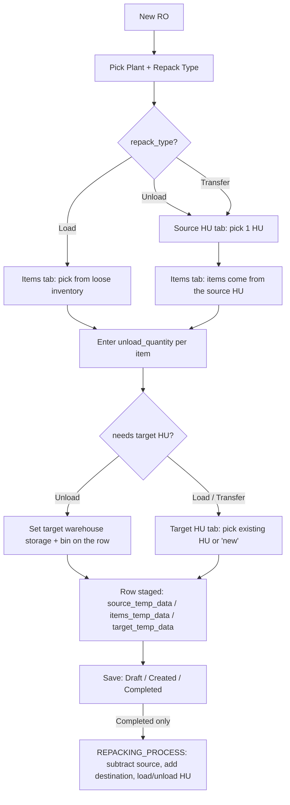

# Repack Order — Mobile Implementation Guide

> **Audience:** Mobile engineers re-implementing the Repack Order (RO) module natively.
> **Scope:** Full parity with the desktop low-code form — create, edit, and the whole `Draft → Created → Completed` lifecycle, across all three repack types (**Load**, **Unload**, **Transfer**).
> **Assumes:** Familiarity with the Handling-Unit (HU) concepts from the GD / PT / MSI mobile guides. RO is the most HU-heavy module in the system — it has *both* a source-HU picker and a target-HU picker in one flow.
> **Source files covered (all under `Repack Order/`):** `ROonMounted.js`, `ROonChangePlant.js`, `ROonChangeRepackType.js`, `ROopenSourceHUDialog.js`, `ROconfirmSourceHU.js`, `ROgotoItemsTab.js`, `ROopenSelectItemDialog.js`, `ROconfirmItems.js`, `ROonChangeUnloadQty.js`, `ROgotoTargetHUTab.js`, `ROopenTargetHUDialog.js`, `ROconfirmTargetHU.js`, `ROonChangeSelectSourceHU.js`, `ROonChangeSelectTargetHU.js`, `ROonChangeTargetStorageLocation.js`, `ROonChangeTargetHUStorageLocation.js`, `ROcancelSourceDialog.js`, `ROcancelTargetDialog.js`, `ROsaveAsDraft.js`, `ROsaveAsCreated.js`, `ROsaveAsCompleted.js`, plus workflows `ROheadWorkflow.json` and `ROrepackingProcessWorkflow.json`. Every `.js` file is reproduced verbatim in [Part 13](#part-13--full-source-appendix).

---

## The load-bearing idea

**A Repack Order moves stock between handling units and/or loose inventory. Nothing touches inventory until the order is Completed.** The whole form is just a way to *stage* a plan — three JSON snapshot blobs per line describing "take these items, out of here, into there." `Draft` persists the plan. `Created` persists the plan and burns a real document number. Only `Completed` runs the inventory engine that actually subtracts and adds balances and loads/unloads HUs.

> **Trust the workflow.** The mobile app **never** writes an inventory balance, stock-movement record, or HU content row directly. It writes the RO header + lines and calls **one** workflow (`2043621631586209793`). The server does all the stock math. Your job is to stage correct data and replicate the client-side validation.

---

## Table of Contents

- [Part 1 — Orientation & Glossary](#part-1--orientation--glossary)
- [Part 2 — Lifecycle & Status State Machine](#part-2--lifecycle--status-state-machine)
- [Part 3 — Repack Types & Field-Visibility Matrix](#part-3--repack-types--field-visibility-matrix)
- [Part 4 — Core Data Model](#part-4--core-data-model)
- [Part 5 — Source HU Side (Unpack)](#part-5--source-hu-side-unpack)
- [Part 6 — Items Selection](#part-6--items-selection)
- [Part 7 — Target HU Side (Repack)](#part-7--target-hu-side-repack)
- [Part 8 — Page Initialization (`ROonMounted`)](#part-8--page-initialization-roonmounted)
- [Part 9 — Save Workflows & Contracts](#part-9--save-workflows--contracts)
- [Part 10 — Completion Inventory Mechanics](#part-10--completion-inventory-mechanics)
- [Part 11 — Mobile Cheat Sheet / Porting Checklist](#part-11--mobile-cheat-sheet--porting-checklist)
- [Part 12 — Edge Cases & Gotchas](#part-12--edge-cases--gotchas)
- [Part 13 — Full Source Appendix](#part-13--full-source-appendix)

---

## Part 1 — Orientation & Glossary

### What a Repack Order is for

Warehouses repack physical stock: dissolve a pallet into a bin, build a new pallet from loose cartons, or shift cartons from one pallet to another. RO models exactly these three operations through the `repack_type` field:

- **Load** — pick **loose inventory** (unrestricted stock sitting in a bin, not in any HU) and pack it **into a target HU**. There is no source HU.
- **Unload** — take items **out of a source HU** and drop them into a plain **warehouse bin** (loose). The HU is emptied (dissolved); there is no target HU.
- **Transfer** — move items **out of a source HU into a different target HU** (HU-to-HU). Both HUs are involved.

### The form shape

A header + one line table, `table_repack`. **Each row of `table_repack` is one repack operation.** The user builds a row's contents inside a **drawer dialog** (`dialog_repack`) that has **three tabs**, visited in order depending on the repack type:

```
tab_source_hu  →  tab_items  →  tab_target_hu
```

| Repack type | tab_source_hu | tab_items | tab_target_hu |
|---|:---:|:---:|:---:|
| **Load** | — | ✓ | ✓ |
| **Unload** | ✓ | ✓ | — |
| **Transfer** | ✓ | ✓ | ✓ |

> **Mobile callout.** The desktop dialog drives its tabs with raw DOM manipulation (`document.querySelector('.el-drawer ... .el-tabs__item#tab-...')`, `.click()`, `is-active`/`is-disabled` classes). That is Element-UI plumbing — throw it away and use a native **stepper / segmented flow**. The *sequence* and *conditional skipping* above is what matters, not the DOM code.

### End-to-end flow



### Glossary

| Term | Meaning |
|---|---|
| **Handling Unit (HU)** | A physical container (pallet / carton / tote). One row in the `handling_unit` collection, with a `table_hu_items[]` array of what's inside. Has a `handling_no`, an HU material (`hu_material_id`), a type (`hu_type`), aggregates (`item_count`, `total_quantity`, weights, volume) and a physical location (`storage_location_id` + `location_id` bin). |
| **Source HU** | The HU being emptied (Unload / Transfer). Its `table_hu_items` become the item list. |
| **Target HU** | The HU being filled (Load / Transfer). May be an existing HU or a brand-new one (see the `"Auto-generated number"` sentinel). |
| **Loose inventory** | Stock in `item_balance` / `item_batch_balance` with `unrestricted_qty > 0`, not inside any HU. The item source for **Load**. |
| **Staging blobs** | Three JSON-string columns per line: `source_temp_data`, `target_temp_data` (HU snapshots) and `items_temp_data` (item snapshots). RO's equivalent of `temp_qty_data`. Frozen at selection time so the operation is reproducible at completion. |
| **`balance_id`** | The id of the specific `item_balance` / `item_batch_balance` row an item was drawn from. Carried on every item snapshot; needed by the inventory move. |
| **`repack_no`** | The document number. Placeholder `"draft"` for drafts, magic `"issued"` triggers real numbering. |
| **`repack_no_type`** | The numbering-rule (prefix) selector. `-9999` = manual number, skip the rule. **Distinct from `repack_type`.** |

---

## Part 2 — Lifecycle & Status State Machine

`repack_status` holds the state: **Draft → Created → Completed**. Every transition calls the same head workflow `2043621631586209793`; the `saveAs` parameter (`"Draft"` / `"Created"` / `"Completed"`) drives the server behavior.

| Status | Doc number | Inventory moved? | Reserved? | Editable? | Buttons shown |
|---|---|---|---|---|---|
| **Draft** | placeholder `"draft"` (none consumed) | No | No | Yes | Draft, Created, Completed |
| **Created** | real number issued (`"issued"`) | **No** | **No** | Yes | Created, Completed |
| **Completed** | real number (kept) | **Yes** — full subtract/add + HU load/unload | n/a | **No (terminal)** | none |

> **There is no reservation.** Unlike GD/PP, "Created" holds **nothing** in stock. It is simply a numbered, persisted plan. Between Created and Completed, the source stock can be consumed by anything else — the snapshot may go stale (see [Part 12](#part-12--edge-cases--gotchas)). Only Completed commits.

### What the workflow does for you, per `saveAs`

| `saveAs` | Client validation first? | Server writes header/lines | Issues number | Runs REPACKING_PROCESS (stock) |
|---|:---:|:---:|:---:|:---:|
| `"Draft"` | No | ✓ (`repack_status="Draft"`) | No (`repack_no="draft"`) | No |
| `"Created"` | No | ✓ (`repack_status="Created"`) | ✓ (`repack_no="issued"`) | No |
| `"Completed"` | **Yes** (`validateCompletion`) | ✓ (`repack_status="Completed"`) | ✓ | **Yes** |

> **Mobile callout.** Draft and Created are **not** validated client-side beyond the server's required-field check. Only Completed runs the full `validateCompletion` (Part 9). Replicate it exactly, because the head workflow does **not** re-run those business rules.

> **The only guard against editing a Completed order is that the buttons are hidden.** On mobile, enforce read-only mode when `repack_status === "Completed"` yourself — do not rely on hiding a button.

---

## Part 3 — Repack Types & Field-Visibility Matrix

`applyRepackTypeVisibility(repackType)` (in `ROonMounted.js`, duplicated in `ROonChangeRepackType.js`) toggles three column groups on each `table_repack` row:

```js
const sourceHuCols = [
  "table_repack.button_source_hu",
  "table_repack.handling_unit_id",
  "table_repack.total_hu_item_quantity",
  "table_repack.hu_storage_location",
  "table_repack.hu_location",
];
const targetWarehouseCols = [
  "table_repack.target_storage_location",
  "table_repack.target_location",
];
const targetHuCols = [
  "table_repack.button_target_hu",
  "table_repack.target_hu_no",
  "table_repack.target_hu_location",
];
```

| Repack type | Source-HU cols | Target-warehouse cols | Target-HU cols |
|---|:---:|:---:|:---:|
| **Load** | hidden | hidden | **shown** |
| **Unload** | **shown** | **shown** | hidden |
| **Transfer** | **shown** | hidden | **shown** |

On mobile this is your per-type screen layout: which fields a row exposes. Map "hidden/shown" to whether that section of the row editor exists for the chosen type.

### Type guards enforced by the dialog openers

- `ROopenSourceHUDialog`: rejects if `repack_type === "Load"` → *"Source Handling Unit is not applicable for Load type"*.
- `ROopenTargetHUDialog`: rejects if `repack_type === "Unload"` → *"Target Handling Unit is not applicable for Unload type"*.
- `ROopenSelectItemDialog`: Unload/Transfer require `source_temp_data` first → *"Please select a source handling unit first"*.

### Changing repack type OR plant wipes all lines

Both `ROonChangeRepackType.js` and `ROonChangePlant.js` check whether any row already has data:

```js
const hasData = existingRepack.some(
  (row) => row && (row.handling_unit_id || row.target_hu_id || row.target_hu_no ||
    row.source_temp_data || row.target_temp_data || row.items_temp_data || row.item_details),
);
```

If so they warn ("all repack lines were reset") and `setData({ table_repack: [] })`. Plant change additionally resets `repack_type`, `user_assignees`, `work_group_assignees`, and re-enables `repack_type`. **Replicate this reset on mobile** — a half-migrated line under a new type is a corruption source.

---

## Part 4 — Core Data Model

### 4a. Header — collection **Repack Order** (`2042442614396764161`)

| Field | Type | Notes |
|---|---|---|
| `id` | string | Header PK (present on Edit). |
| `repack_status` | string | `"Draft"` / `"Created"` / `"Completed"`. Server sets it from `saveAs`. |
| `repack_type` | string | `"Load"` / `"Unload"` / `"Transfer"`. |
| `repack_no` | string | Document number. Magic `"draft"` / `"issued"` sentinels (Part 9). |
| `repack_no_type` | number | Numbering-rule selector. `-9999` = manual. Label in JSON is `"规则"` (rule). |
| `plant_id` | string | May be forced + disabled from the user's department (Part 8). |
| `organization_id` | string | Multi-tenant scope. |
| `assignees`, `user_assignees`, `work_group_assignees` | — | Assignment fields. |
| `remark`, `remark2`, `remark3` | string | Free-text remarks. |
| `table_repack` | array | The line rows → child sub-table `2043570073905401858`. |
| `page_status` | string | **Client-only** helper (`"Add"`/`"Edit"`/`"View"`). Passed to the workflow but **not a stored column** — strip it from what you persist; the workflow reads it from the params. |

### 4b. Line — sub-table **Repack Details** (`2043570073905401858`, FK `repack_order_id`)

The workflow's `fillbackHeaderFields` node injects `organization_id`, `plant_id`, and `line_index = index + 1` into every row before saving.

| Field | Written by | Meaning |
|---|---|---|
| `repack_order_id` | platform FK | Back-reference to header. |
| `organization_id`, `plant_id`, `line_index` | fillback node | 1-based line number. |
| `source_temp_data` | source confirm | JSON string — source HU snapshot (§4d). Source-side types only. |
| `handling_unit_id` | source confirm | = source HU id. |
| `total_hu_item_quantity` | source confirm | source HU `total_quantity`. |
| `hu_storage_location` | source confirm | source HU `storage_location_id`. |
| `hu_location` | source confirm | source HU `location_id` (bin). |
| `items_temp_data` | items confirm | JSON string — array of item snapshots (§4e). |
| `item_details` | items confirm | Human-readable multi-line summary string. |
| `target_temp_data` | target confirm | JSON string — target HU snapshot. Empty for new/auto HU. |
| `target_hu_id` | target confirm | = target HU id. Empty for a new HU. |
| `target_hu_no` | target confirm | target HU `handling_no`, or literal `"Auto-generated number"` for a new HU. |
| `target_hu_location` | target confirm | target HU `location_id`. |
| `target_storage_location` | Unload only | destination warehouse storage location. |
| `target_location` | Unload only | destination warehouse bin. |
| `remarks` | line remark | per-line remark. |

### 4c. Dialog working object — `dialog_repack` (not persisted)

| Field | Meaning |
|---|---|
| `row_index` | Which `table_repack` row is being edited. |
| `table_source_hu` | Candidate source HUs (array). |
| `table_items` | Editable item rows with `unload_quantity`. |
| `table_target_hu` | Candidate target HUs (array). |
| `button_target_hu` | The "go to target HU" button — hidden for Unload. |

> **Strip `dialog_repack` before saving.** All three save wrappers do `const { dialog_repack, ...data } = this.getValues()`. Never send it to the workflow.

### 4d. HU snapshot shape (`source_temp_data` / `target_temp_data`)

```jsonc
{
  "id": "...", "handling_no": "...", "hu_material_id": "...", "hu_type": "...",
  "hu_quantity": 1, "hu_uom": "...", "item_count": 3, "total_quantity": 120,
  "gross_weight": 0, "net_weight": 0, "net_volume": 0,
  "storage_location_id": "...", "location_id": "...",   // bin
  "hu_status": "...", "parent_hu_id": "...", "packing_id": "...",
  "table_hu_items": [ /* only rows with is_deleted !== 1 */ ]
}
```

### 4e. Item snapshot shape (each element of `items_temp_data`)

```jsonc
{
  "material_id": "...", "material_name": "...", "material_desc": "...",
  "location_id": "...",             // source bin the qty is drawn from
  "batch_id": "..." | null,         // null for non-batch items
  "material_uom": "...",            // base UOM id
  "item_quantity": 120,             // available balance (display / clamp ceiling)
  "unload_quantity": 40,            // the amount actually repacked (user input)
  "balance_id": "...",              // item_balance / item_batch_balance row id
  "line_status": "Open"
}
```

> On completion, `unload_quantity` is renamed to `quantity` in the workflow payload. `item_quantity` is only the available ceiling — do not send it as the move amount.

### 4f. Collections the client reads (for pickers/display)

`handling_unit` (source/target pickers), `item_balance` + `item_batch_balance` (loose stock for Load, and `balance_id` resolution), `item` (`material_name`/`material_desc`/`based_uom`/`item_batch_management`), `batch` (`batch_number` for display), `unit_of_measurement` (`uom_name` for display), `bin_location` (default-bin resolution).

---

## Part 5 — Source HU Side (Unpack)

*Applies to Unload and Transfer. For Load there is no source HU — skip to [Part 6](#part-6--items-selection).*

### Loading candidate source HUs (`ROopenSourceHUDialog.js`)

```js
const responseHU = await db.collection("handling_unit")
  .where({ plant_id: plantId, organization_id: organizationId, is_deleted: 0 })
  .get();

const availableHUs = allHUs.filter(
  (hu) => (parseFloat(hu.item_count) || 0) > 0 && (parseFloat(hu.total_quantity) || 0) > 0,
);
```

- **Non-empty filter:** only HUs with `item_count > 0` **and** `total_quantity > 0` are pickable as a source. (Target HUs are *not* filtered this way — you can target an empty HU.)
- Each candidate gets `handling_unit_id = hu.id`, a `line_index`, and `select_hu` (pre-checked if it matches the previously saved `source_temp_data.id`).
- **Single-select:** `ROonChangeSelectSourceHU.js` — when one row's `select_hu` becomes `1`, all others are reset to `0`. On mobile, use a radio/single-select list.

> **Mobile callout (HU scale).** Like GD/MSI/PT, the `handling_unit` collection can be large. If your platform caps `.get()` results, apply the same pattern the other guides use: pre-query the flat HU sub-collection by `material_id` to collect HU ids, then fetch only those. The desktop code fetches all and filters in memory — fine on desktop, risky at scale.

### Confirming the source HU (`ROconfirmSourceHU.js` / `ROgotoItemsTab.js`)

Validation on confirm:
- A HU must be selected → *"Please select a handling unit"*.
- It must have `hu_material_id` → *"...missing handling unit material"*.
- It must have `location_id` → *"...missing location"*.

On success it freezes the snapshot (§4d, keeping only `is_deleted !== 1` items) into `source_temp_data` and writes the four source display fields (`handling_unit_id`, `total_hu_item_quantity`, `hu_storage_location`, `hu_location`).

> **Cascade reset on HU change (the silent corrupter).** If the newly chosen source HU id differs from the previously saved one (`huChanged`), the row's `items_temp_data`, `item_details`, `target_temp_data`, `target_hu_id`, `target_hu_no`, `target_hu_location` are **all cleared**. Skipping this leaves a target/items selection that belongs to a different HU. Replicate exactly.

`ROgotoItemsTab.js` does the same snapshot write **and** builds the items list from the HU in one step (it's the "confirm source and advance to items" path), also resolving each item's `balance_id` (see Part 6).

---

## Part 6 — Items Selection

### Where the items come from (`ROopenSelectItemDialog.js`)

| Repack type | Item source | Function |
|---|---|---|
| **Load** | loose inventory | `fetchInventoryItems(plantId, organizationId)` |
| **Unload / Transfer** | the chosen source HU's `table_hu_items` | `buildItemsFromHU(source_temp_data, ...)` |

**Load — `fetchInventoryItems`:** reads `item_balance` (non-batch, kept only where the item's `item_batch_management !== 1`) and `item_batch_balance` (batch), both filtered to `unrestricted_qty > 0` and `is_deleted: 0`. `balance_id` = the balance row's id. Material master (`item`) is fetched once for names/desc/`based_uom`.

**Unload / Transfer — `buildItemsFromHU`:** parses `source_temp_data.table_hu_items`, keeps `is_deleted !== 1 && quantity > 0`, and re-resolves each item's `balance_id` via `fetchBalanceId` (queries `item_batch_balance` when `batch_id` is present, else `item_balance`, matching material + plant + org + location).

Each produced item row: `material_id`, `material_name`, `material_desc`, `location_id`, `batch_id` (or null), `material_uom`, `item_quantity` (available), `unload_quantity` (starts `0`), `line_status: "Open"`, `balance_id`, `line_index`.

> **Re-open preserves prior quantities.** When re-opening a row that already has `items_temp_data`, the code re-matches by `(material_id, batch_id, location_id)` and restores the saved `unload_quantity`. Do the same so editing a staged line doesn't lose the user's numbers.

### Quantity entry (`ROonChangeUnloadQty.js`)

`unload_quantity` is clamped against the row's available `item_quantity`:

- `NaN` → `0`.
- `< 0` → `0`, warn *"Quantity cannot be negative"*.
- `> item_quantity` → clamp to `item_quantity`, warn *"Quantity cannot exceed available {n}"*.

> **No UOM conversion anywhere.** Quantities are in the item's base UOM only. `material_uom` and `unit_of_measurement.uom_name` are used **only** for display text. Do not build a UOM funnel here (unlike Picking).

### Confirming items (`ROconfirmItems.js` for Unload, `ROgotoTargetHUTab.js` for Load/Transfer)

- Requires at least one item with `unload_quantity > 0` → *"Please enter quantity for at least one item"*.
- Writes `items_temp_data` (only the items with qty > 0) and a derived `item_details` text summary, then **clears any previously chosen target** (`target_temp_data`, `target_hu_id`, `target_hu_no`, `target_hu_location`) — changing items invalidates the target selection.
- **Unload** stops here (`ROconfirmItems` closes the dialog — no target HU). **Load/Transfer** advance to the target-HU tab (`ROgotoTargetHUTab` also pre-builds the target-HU candidate list).

### `item_details` text (for display parity)

`buildItemDetails` produces:

```
Source: HU {handling_no}          // or "Source: Inventory" for Load
Total: {qty} {uom}, ...           // per-UOM totals

DETAILS:
1. {material_name} — {qty} {uom}
   Batch: {batch_number}          // only if batched
2. ...
```

You don't have to reproduce the exact string, but the desktop stores it in `item_details` for the row display; keep a human-readable summary if you want list parity.

---

## Part 7 — Target HU Side (Repack)

*Applies to Load and Transfer. For Unload there is no target HU — set the destination warehouse fields instead (below).*

### Loading candidate target HUs (`ROopenTargetHUDialog.js` / `ROgotoTargetHUTab.js`)

```js
const availableTargetHUs = allHUs.filter((hu) => hu.id !== sourceHuId);
```

- All plant/org HUs **except the source HU** (self-exclusion). **Not** filtered by `item_count`/`total_quantity` — an empty HU is a valid target.
- `select_hu` pre-checked from `target_temp_data.id`; single-select via `ROonChangeSelectTargetHU.js`.

### Confirming the target HU (`ROconfirmTargetHU.js`)

Requires a selected target HU with `hu_material_id` and `location_id`. Writes `target_temp_data` (snapshot, §4d), `target_hu_id`, `target_hu_no = handling_no`, `target_hu_location = location_id`.

### New target HU — the `"Auto-generated number"` sentinel

If the user wants a brand-new HU, the row carries `target_hu_no === "Auto-generated number"` with an empty `target_hu_id`. On completion the workflow synthesizes a new HU (`hu_quantity: 1`) and the HANDLING_UNIT `load` step creates it. `validateCompletion` accepts a target that is *either* an existing HU (`target_hu_id || target_temp_data`) *or* this sentinel.

> **Mobile callout.** Expose a "Create new handling unit" option in the target picker. When chosen, set `target_hu_no = "Auto-generated number"` and leave `target_hu_id` / `target_temp_data` empty. That literal string is the contract — don't localize or reword it.

### Destination warehouse (Unload only)

Instead of a target HU, Unload sets `target_storage_location` + `target_location` (bin) on the row. `ROonChangeTargetStorageLocation.js`: on storage-location change, clears `target_location`, then looks up the **default bin** for that storage location and auto-fills it:

```js
const resBin = await db.collection("bin_location")
  .where({ plant_id: plantId, storage_location_id: value, is_default: 1, is_deleted: 0 })
  .get();
// if found: target_location = resBin.data[0].id
```

`ROonChangeTargetHUStorageLocation.js` is the same default-bin resolution but for a **target HU** row's `location_id` (used when a target HU's storage location is edited in the dialog).

---

## Part 8 — Page Initialization (`ROonMounted`)

### `pageStatus`

`this.isAdd` → `"Add"`, `this.isEdit` → `"Edit"`, `this.isView` → `"View"`; stored in `page_status`.

| pageStatus | On mount |
|---|---|
| **Add** | Set plant (below) + `showStatusHTML("Draft")`; async auto-select the default `repack_no_type`. |
| **Edit** | `display(["table_repack"])`, `applyRepackTypeVisibility(repack_type)`, `showStatusHTML(repack_status)`. |
| **View** | Same as Edit (read-only). |

### Plant defaulting (`setPlant`)

```js
const deptId = (await this.getVarSystem("deptIds")).split(",")[0];
if (deptId === organizationId) { plantId = ""; }         // org-level user: choose plant
else { plantId = deptId; this.disabled("plant_id", true); } // plant-scoped user: locked
```

On Add, `organization_id = getVarGlobal("deptParentId")`, or the first `deptIds` entry if that is `"0"`. **Mirror this:** a plant-scoped user gets `plant_id` forced and locked; an org-level user picks it.

### Default numbering rule

On Add, once the `repack_no_type` dropdown has options, the entry with `is_default === 1` is auto-selected. Replicate: default the numbering rule to the org's default prefix rule.

### Status → buttons (`showStatusHTML`)

- **Draft** → show Draft + Created + Completed actions.
- **Created** → show Created + Completed (no Draft).
- **Completed** → show none (locked / read-only).

---

## Part 9 — Save Workflows & Contracts

### One workflow, three wrappers

`ROsaveAsDraft.js`, `ROsaveAsCreated.js`, `ROsaveAsCompleted.js` are identical except for `saveAs`:

```js
const { dialog_repack, ...data } = this.getValues();
await this.runWorkflow(
  "2043621631586209793",                         // ROheadWorkflow
  { allData: data, saveAs: "Draft"|"Created"|"Completed", pageStatus: data.page_status },
  onSuccess, onError,
);
// error if workflowResult?.data?.code && workflowResult.data.code !== 200
```

**Request:** `{ allData, saveAs, pageStatus }` where `allData` = full form values minus `dialog_repack`.
**Response:** `{ data: { code, message, ... } }` — treat any `code !== 200` as failure and surface `message`.

### Magic `repack_no` (numbering)

Set inside the workflow's `fillbackHeaderFields` node:

```js
if (saveAs === "Draft") {
  if (repack_no_type !== -9999 && !repack_no)  allData.repack_no = "draft";
} else { // Created / Completed
  if (repack_no_type !== -9999 && (!repack_no || repack_status !== "In Progress"))
       allData.repack_no = "issued";
}
```

- `"draft"` → placeholder, no sequential number consumed.
- `"issued"` → platform generates the real number from the `repack_no_type` prefix rule.
- `repack_no_type === -9999` → keep the user-typed `repack_no` verbatim (manual).

### Server-side required-field check (all three actions)

The workflow calls **CHECK_REQUIRED_FIELD** (`1988831880511062018`) before any DB write. Required: `repack_no`, `repack_type`, `plant_id`, and `table_repack` (must be a non-empty array of objects). On failure the workflow returns `{ code: "400", message }` and aborts.

### Client-side `validateCompletion` — Completed only, **you must replicate it**

The head workflow does **not** re-run these business rules, so the mobile client is the only thing enforcing them on completion. From `ROsaveAsCompleted.js`:

- `repack_type` required (fatal).
- **Per row:**
  - `items_temp_data` parses to a non-empty array → else *"Row N: no items selected"*.
  - at least one item `unload_quantity > 0` → else *"Row N: no item has a quantity"*.
  - **Unload / Transfer** (`needsSource`): `source_temp_data` required → *"Row N: source handling unit not selected"*; and the source HU id must be **unique across rows** → *"Row N: source handling unit already used in another row"*.
  - **Load / Transfer** (`needsTarget`): an existing target (`target_hu_id || target_temp_data`) **or** a new one (`target_hu_no === "Auto-generated number"`) → else *"Row N: target handling unit not selected"*.
  - **Unload** (`needsWarehouseLocation`): both `target_location` and `target_storage_location` set → else *"Row N: target warehouse location not set"*.
  - **Transfer:** source HU id ≠ target HU id → else *"Row N: source and target handling unit cannot be the same"*.

Block completion if any error; show `"Cannot complete: " + errors.join("; ")`.

---

## Part 10 — Completion Inventory Mechanics

*This is what the server does when `saveAs === "Completed"`. You do not implement it — but understanding it prevents you from double-booking stock.*

### Head → per-line payload (`code_node_P66DGqo9`)

For each `table_repack` row, the head workflow parses the three blobs and builds a **REPACKING_PROCESS** (`2043602532898443266`) call:

```
{ plant_id, organization_id,
  process_type,          // = repack_type: "Load" | "Unload" | "Transfer"
  trx_no,                // = repack_no
  items,                 // item snapshots with unload_quantity RENAMED to quantity
  source_hu, target_hu,
  target_storage_location_id, target_location_id,
  remark, transaction_type: "RO" }
```

New target HU (empty `target_hu_id` + `target_hu_no === "Auto-generated number"`) becomes a synthesized `target_hu` with `handling_no: "Auto-generated number"`, `hu_quantity: 1`.

### REPACKING_PROCESS: two steps

**Step 1 — HU load/unload** (`HANDLING_UNIT` `2037062451509002241`, parallel branch):
- Load / Transfer → `process_type: "load"` (lowercase) building/filling the target HU with the items pinned to the **target HU bin**.
- Unload / Transfer → `process_type: "unload"` (lowercase) emptying the source HU (items keep their **source bin**).
- Neither applicable → `400 "Invalid process_type"`.

> Note the case: REPACKING_PROCESS receives capitalized `"Load"/"Unload"/"Transfer"`; the HANDLING_UNIT sub-call receives lowercase `"load"/"unload"`.

**Step 2 — per-item balance move** (loop, only when `isPacking === 0`). `ItemMovement` computes the subtract and add endpoints, then always **SUBTRACT first, then ADD**:

| `process_type` | SUBTRACT from | ADD to |
|---|---|---|
| **Load** | `item.location_id` (loose, no HU) | target HU bin + target HU id |
| **Unload** | source HU (`sourceHu.id` @ item bin) | destination warehouse bin (no HU) |
| **Transfer** | source HU @ item bin | target HU bin + target HU id |

- **SUBTRACT_INVENTORY** (`2012096660219564034`): `material_id, quantity, material_uom, inventory_category: "Unrestricted", location_id, batch_id, handling_unit_id, isMovingInv: 1, transaction_type: "RO", trx_no, parent_trx_no`.
- **ADD_INVENTORY** (`2012005532688723970`): same, plus `unit_price`, `manufacturing_date`, `expired_date` **carried from the subtract result**, at the destination `location_id` / `handling_unit_id`.

So each item is subtracted from the source (bin and/or source HU) and added to the destination (target HU or warehouse bin), preserving batch, unit price, and mfg/expiry across the move. **Category is always `Unrestricted`.** Any `400` from a sub-workflow aborts the whole completion.

### Not supported

- **Serial numbers** — no serialized-item handling anywhere in RO. Batch is fully supported (`batch_id`).
- **Reservations** — none; stock only changes at Completed.
- **UOM conversion** — base UOM only.

---

## Part 11 — Mobile Cheat Sheet / Porting Checklist

- [ ] Header write → collection `2042442614396764161`; lines → nested `table_repack` (child `2043570073905401858`, FK `repack_order_id`).
- [ ] Save = call workflow `2043621631586209793` with `{ allData, saveAs, pageStatus }`; strip `dialog_repack` from `allData`.
- [ ] Three save actions: `Draft` (no number, no stock), `Created` (number, no stock, no reservation), `Completed` (number + stock).
- [ ] Stage each line as three JSON strings: `source_temp_data`, `target_temp_data`, `items_temp_data` (+ `item_details`, `handling_unit_id`, `target_hu_id`, `target_hu_no`, location fields).
- [ ] Item snapshot must carry `balance_id`, `location_id`, `batch_id`, `material_uom`, `item_quantity`, and `unload_quantity`.
- [ ] Per-type flow: Load = Items→TargetHU; Unload = SourceHU→Items→(warehouse bin); Transfer = SourceHU→Items→TargetHU.
- [ ] Source HU picker: filter to `item_count > 0 && total_quantity > 0`, single-select, non-deleted, plant+org scoped.
- [ ] Target HU picker: all plant/org HUs **except** the source HU; allow empty HUs; offer "new HU" → `target_hu_no = "Auto-generated number"`.
- [ ] Clamp `unload_quantity` to `[0, item_quantity]`.
- [ ] On source-HU change, wipe items + target on that row. On repack-type/plant change, wipe **all** lines.
- [ ] Storage-location change → auto-fill default bin from `bin_location` (`is_default: 1`).
- [ ] Plant defaulting from `deptIds` / `deptParentId`; lock plant for plant-scoped users; default `repack_no_type` to the `is_default` rule.
- [ ] Replicate `validateCompletion` in full (Part 9) before allowing Completed.
- [ ] Treat `repack_status === "Completed"` as hard read-only.
- [ ] Handle response `code !== 200` as failure; show `message`.
- [ ] Do **not** write inventory/HU rows yourself — the workflow does it.

---

## Part 12 — Edge Cases & Gotchas

- **Build rows explicitly — no reactive-reference sharing.** When building candidate/item rows, assign fields explicitly rather than reusing the same object reference across rows (the desktop spreads `...hu` into a fresh object per row). Sharing a reference lets one row's edit corrupt siblings — a recurring HU-guide trap.
- **Empty-HU culling for sources.** A source HU with `item_count` or `total_quantity` at 0 is filtered out. If a user emptied an HU in a prior (uncommitted) line, it can still appear as a source until Completed actually moves stock — because Created reserves nothing.
- **Stale snapshots.** `source_temp_data` freezes the HU at selection time. Between Created and Completed, another document can consume that stock. The snapshot won't reflect it; the completion move (SUBTRACT_INVENTORY) is what surfaces a shortfall. Don't treat a staged snapshot as a hold.
- **Source-HU uniqueness across rows.** A given source HU can be used in only one row of the order (`validateCompletion` blocks reuse). Enforce it while building rows, not just at save.
- **Transfer self-target.** Source and target HU must differ; the target picker already excludes the source, and `validateCompletion` double-checks.
- **`"Auto-generated number"` is a contract string.** Don't localize or reword it — the workflow branches on that exact value to synthesize a new HU.
- **`repack_no_type` vs `repack_type`.** Easy to confuse: `repack_no_type` is the numbering-rule selector (`-9999` = manual); `repack_type` is Load/Unload/Transfer.
- **Read-only is button-hidden only.** Completed orders are protected purely by hidden buttons on desktop. Enforce read-only in your own state machine.
- **DOM tab code is throwaway.** The `hideTab`/`selectTab` helpers manipulate Element-UI DOM. Replace with a native stepper; keep only the sequence + conditional-skip logic.
- **`page_status` is not a column.** Pass it as a workflow param; don't persist it on the header.

---

## Part 13 — Full Source Appendix

Every RO client `.js` file, reproduced verbatim from the shipped desktop source. Workflow definitions (`ROheadWorkflow.json`, `ROrepackingProcessWorkflow.json`) live in the same directory and are described contract-first in Parts 9–10; they are not reproduced here because they are large low-code node graphs, not hand-written code.

### Page init & type/plant changes

#### `ROonMounted.js`

```javascript
const applyRepackTypeVisibility = async (repackType) => {
  const sourceHuCols = [
    "table_repack.button_source_hu",
    "table_repack.handling_unit_id",
    "table_repack.total_hu_item_quantity",
    "table_repack.hu_storage_location",
    "table_repack.hu_location",
  ];
  const targetWarehouseCols = [
    "table_repack.target_storage_location",
    "table_repack.target_location",
  ];
  const targetHuCols = [
    "table_repack.button_target_hu",
    "table_repack.target_hu_no",
    "table_repack.target_hu_location",
  ];

  switch (repackType) {
    case "Load":
      await this.hide([...sourceHuCols, ...targetWarehouseCols]);
      await this.display(targetHuCols);
      break;
    case "Unload":
      await this.display([...sourceHuCols, ...targetWarehouseCols]);
      await this.hide(targetHuCols);
      break;
    case "Transfer":
      await this.hide(targetWarehouseCols);
      await this.display([...sourceHuCols, ...targetHuCols]);
      break;
    default:
      break;
  }
};

const showStatusHTML = (status) => {
  switch (status) {
    case "Draft":
      this.display([
        "draft_status",
        "button_draft",
        "button_created",
        "button_completed",
      ]);
      break;
    case "Created":
      this.display(["created_status", "button_created", "button_completed"]);
      break;
    case "Completed":
      this.display(["completed_status"]);
      break;
    default:
      break;
  }
};

const setPlant = async (organizationId) => {
  try {
    const deptId = await this.getVarSystem("deptIds").split(",")[0];
    let plantId = "";

    if (deptId === organizationId) {
      plantId = "";
    } else {
      plantId = deptId;
      await this.disabled("plant_id", true);
    }

    await this.setData({
      organization_id: organizationId,
      plant_id: plantId,
    });
  } catch (error) {
    console.error("Error setting plant:", error);
  }
};

(async () => {
  let pageStatus = "";

  if (this.isAdd) pageStatus = "Add";
  else if (this.isEdit) pageStatus = "Edit";
  else if (this.isView) pageStatus = "View";
  else throw new Error("Invalid page state");

  this.setData({ page_status: pageStatus });

  console.log("pageStatus", pageStatus);

  const roStatus = (await this.getValue("repack_status")) || "Draft";
  const roType = await this.getValue("repack_type");

  switch (pageStatus) {
    case "Add":
      let organizationId = this.getVarGlobal("deptParentId");
      if (organizationId === "0") {
        organizationId = this.getVarSystem("deptIds").split(",")[0];
      }
      setPlant(organizationId);
      showStatusHTML(roStatus);
      break;
    case "Edit":
      await this.display(["table_repack"]);
      await applyRepackTypeVisibility(roType);
      showStatusHTML(roStatus);
      break;
    case "View":
      await this.display(["table_repack"]);
      await applyRepackTypeVisibility(roType);
      showStatusHTML(roStatus);
      break;
  }
})();

setTimeout(async () => {
  if (!this.isAdd) return;
  const maxRetries = 10;
  const interval = 500;
  for (let i = 0; i < maxRetries; i++) {
    const op = await this.onDropdownVisible("repack_no_type", true);
    if (op != null) break;
    await new Promise((resolve) => setTimeout(resolve, interval));
  }
  function getDefaultItem(arr) {
    return arr?.find((item) => item?.item?.is_default === 1);
  }

  const optionsData = this.getOptionData("repack_no_type") || [];
  const data = getDefaultItem(optionsData);
  if (data) {
    this.setData({ repack_no_type: data.value });
  }
}, 500);
```

#### `ROonChangePlant.js`

```javascript
(async () => {
  const plantId = this.getValue("plant_id");

  if (!plantId) return;

  this.disabled(["repack_type"], false);

  if (!arguments[0].fieldModel) return;

  const existingRepack = this.getValue("table_repack") || [];
  const hasData = existingRepack.some(
    (row) =>
      row &&
      (row.handling_unit_id ||
        row.target_hu_id ||
        row.target_hu_no ||
        row.source_temp_data ||
        row.target_temp_data ||
        row.items_temp_data ||
        row.item_details),
  );

  if (hasData) {
    this.$alert(
      "Changing the plant has <strong>reset all repack lines</strong>.",
      "Plant Changed",
      {
        confirmButtonText: "OK",
        type: "warning",
        dangerouslyUseHTMLString: true,
      },
    );
  }

  this.setData({
    repack_type: "",
    table_repack: [],
    user_assignees: [],
    work_group_assignees: "",
  });
})();
```

#### `ROonChangeRepackType.js`

```javascript
(async () => {
  const repackType = arguments[0]?.value ?? (await this.getValue("repack_type"));

  const existingRepack = this.getValue("table_repack") || [];
  const hasData = existingRepack.some(
    (row) =>
      row &&
      (row.handling_unit_id ||
        row.target_hu_id ||
        row.target_hu_no ||
        row.source_temp_data ||
        row.target_temp_data ||
        row.items_temp_data ||
        row.item_details),
  );

  if (hasData) {
    this.$alert(
      "Changing the repack type has <strong>reset all repack lines</strong>.",
      "Repack Type Changed",
      {
        confirmButtonText: "OK",
        type: "warning",
        dangerouslyUseHTMLString: true,
      },
    );
  }

  await this.setData({ table_repack: [] });

  const sourceHuCols = [
    "table_repack.button_source_hu",
    "table_repack.handling_unit_id",
    "table_repack.total_hu_item_quantity",
    "table_repack.hu_storage_location",
    "table_repack.hu_location",
  ];

  const targetWarehouseCols = [
    "table_repack.target_storage_location",
    "table_repack.target_location",
  ];

  const targetHuCols = [
    "table_repack.button_target_hu",
    "table_repack.target_hu_no",
    "table_repack.target_hu_location",
  ];

  switch (repackType) {
    case "Load":
      await this.hide([...sourceHuCols, ...targetWarehouseCols]);
      await this.display(targetHuCols);
      break;
    case "Unload":
      await this.display([...sourceHuCols, ...targetWarehouseCols]);
      await this.hide(targetHuCols);
      break;
    case "Transfer":
      await this.hide(targetWarehouseCols);
      await this.display([...sourceHuCols, ...targetHuCols]);
      break;
    default:
      break;
  }
})();
```

### Source HU side

#### `ROopenSourceHUDialog.js`

```javascript
const hideTab = (tabName) => {
  setTimeout(() => {
    const tabSelector = `.el-drawer[role="dialog"] .el-tabs__item.is-top#tab-${tabName}[tabindex="-1"][aria-selected="false"]`;
    const tab = document.querySelector(tabSelector);

    if (tab) {
      tab.style.display = "none";
    } else {
      const fallbackTab = document.querySelector(
        `.el-drawer[role="dialog"] .el-tabs__item#tab-${tabName}`,
      );
      if (fallbackTab) {
        fallbackTab.style.display = "none";
      } else {
        console.log("Completion tab not found");
      }
    }

    const inactiveTabSelector = `.el-drawer[role="dialog"] .el-tabs__item.is-top[tabindex="-1"]:not(#tab-${tabName})`;
    const inactiveTab = document.querySelector(inactiveTabSelector);
    if (inactiveTab) {
      inactiveTab.setAttribute("aria-disabled", "true");
      inactiveTab.classList.add("is-disabled");
    }
  }, 10);
};

const selectTab = (tabName) => {
  setTimeout(() => {
    const tabSelector = `.el-drawer[role="dialog"] .el-tabs__item.is-top#tab-${tabName}`;
    const tab = document.querySelector(tabSelector);

    if (tab) {
      tab.style.display = "flex";
      tab.setAttribute("aria-selected", "true");
      tab.setAttribute("tabindex", "0");
      tab.classList.remove("is-disabled");
      tab.classList.add("is-active");
      tab.click();
    } else {
      console.log(`Tab ${tabName} not found`);
    }
  }, 100);
};

(async () => {
  try {
    this.showLoading("Loading handling units...");

    const rowIndex = arguments[0].rowIndex;
    const plantId = this.getValue("plant_id");
    const organizationId = this.getValue("organization_id");
    const repackType = this.getValue("repack_type");

    if (repackType === "Load") {
      this.hideLoading();
      this.$message.error("Source Handling Unit is not applicable for Load type");
      return;
    }

    if (!plantId || !organizationId) {
      this.hideLoading();
      this.$message.error("Please set plant and organization first");
      return;
    }

    const tableRepack = this.getValue("table_repack") || [];
    const currentRow = tableRepack[rowIndex] || {};

    const responseHU = await db
      .collection("handling_unit")
      .where({
        plant_id: plantId,
        organization_id: organizationId,
        is_deleted: 0,
      })
      .get();

    const allHUs = (responseHU && responseHU.data) || [];

    const availableHUs = allHUs.filter(
      (hu) =>
        (parseFloat(hu.item_count) || 0) > 0 &&
        (parseFloat(hu.total_quantity) || 0) > 0,
    );

    let previouslySelectedId = null;
    if (currentRow.source_temp_data) {
      try {
        const parsed = JSON.parse(currentRow.source_temp_data);
        previouslySelectedId = parsed?.id || null;
      } catch (e) {
        console.error("Error parsing source_temp_data:", e);
      }
    }

    const tableSourceHU = availableHUs.map((hu, index) => ({
      ...hu,
      handling_unit_id: hu.id,
      line_index: index,
      select_hu: previouslySelectedId && hu.id === previouslySelectedId ? 1 : 0,
    }));

    selectTab("tab_source_hu");
    hideTab("tab_items");
    hideTab("tab_target_hu");

    await this.openDialog("dialog_repack");

    await this.setData({
      dialog_repack: {
        row_index: rowIndex,
        table_source_hu: tableSourceHU,
        table_items: [],
        table_target_hu: [],
      },
    });

    this.hideLoading();
  } catch (error) {
    this.hideLoading();
    this.$message.error("Error in ROopenSourceHUDialog: " + error.message);
    console.error("Error in ROopenSourceHUDialog:", error);
  }
})();
```

#### `ROconfirmSourceHU.js`

```javascript
(async () => {
  try {
    const dialogData = this.getValue("dialog_repack");
    if (!dialogData) {
      throw new Error("Dialog data not available");
    }

    const rowIndex = dialogData.row_index;
    if (typeof rowIndex !== "number") {
      throw new Error("Row index missing on dialog");
    }

    const tableSourceHU = dialogData.table_source_hu || [];
    const selected = tableSourceHU.find((r) => r.select_hu === 1);

    if (!selected) {
      this.$message.error("Please select a handling unit");
      return;
    }

    if (!selected.hu_material_id) {
      this.$message.error("Selected handling unit is missing handling unit material");
      return;
    }

    if (!selected.location_id) {
      this.$message.error("Selected handling unit is missing location");
      return;
    }

    const activeHuItems = (selected.table_hu_items || []).filter(
      (it) => it.is_deleted !== 1,
    );

    const snapshot = {
      id: selected.id,
      handling_no: selected.handling_no,
      hu_material_id: selected.hu_material_id,
      hu_type: selected.hu_type,
      hu_quantity: selected.hu_quantity,
      hu_uom: selected.hu_uom,
      item_count: selected.item_count,
      total_quantity: selected.total_quantity,
      gross_weight: selected.gross_weight,
      net_weight: selected.net_weight,
      net_volume: selected.net_volume,
      storage_location_id: selected.storage_location_id,
      location_id: selected.location_id,
      hu_status: selected.hu_status,
      parent_hu_id: selected.parent_hu_id,
      packing_id: selected.packing_id,
      table_hu_items: activeHuItems,
    };

    const tableRepack = this.getValue("table_repack") || [];
    const currentRow = tableRepack[rowIndex] || {};
    let oldSourceId = null;
    if (currentRow.source_temp_data) {
      try {
        const parsed = JSON.parse(currentRow.source_temp_data);
        oldSourceId = parsed?.id || null;
      } catch (e) {
        console.error("Error parsing source_temp_data:", e);
      }
    }
    const huChanged = oldSourceId && oldSourceId !== selected.id;

    const updates = {
      [`table_repack.${rowIndex}.source_temp_data`]: JSON.stringify(snapshot),
      [`table_repack.${rowIndex}.handling_unit_id`]: snapshot.id,
      [`table_repack.${rowIndex}.total_hu_item_quantity`]: snapshot.total_quantity,
      [`table_repack.${rowIndex}.hu_storage_location`]: snapshot.storage_location_id,
      [`table_repack.${rowIndex}.hu_location`]: snapshot.location_id,
    };

    if (huChanged) {
      updates[`table_repack.${rowIndex}.items_temp_data`] = "";
      updates[`table_repack.${rowIndex}.item_details`] = "";
      updates[`table_repack.${rowIndex}.target_temp_data`] = "";
      updates[`table_repack.${rowIndex}.target_hu_id`] = "";
      updates[`table_repack.${rowIndex}.target_hu_no`] = "";
      updates[`table_repack.${rowIndex}.target_hu_location`] = "";
    }

    await this.setData(updates);

    await this.closeDialog("dialog_repack");
  } catch (error) {
    this.$message.error("Error in ROconfirmSourceHU: " + error.message);
    console.error("Error in ROconfirmSourceHU:", error);
  }
})();
```

#### `ROonChangeSelectSourceHU.js`

```javascript
(async () => {
  try {
    const value = arguments[0].value;
    const rowIndex = arguments[0].rowIndex;

    if (value !== 1) return;

    const tableSourceHU =
      this.getValue("dialog_repack.table_source_hu") || [];

    const updates = {};
    for (let i = 0; i < tableSourceHU.length; i++) {
      if (i === rowIndex) continue;
      if (tableSourceHU[i].select_hu === 1) {
        updates[`dialog_repack.table_source_hu.${i}.select_hu`] = 0;
      }
    }

    if (Object.keys(updates).length > 0) {
      await this.setData(updates);
    }
  } catch (error) {
    this.$message.error("Error in ROonChangeSelectSourceHU: " + error.message);
    console.error("Error in ROonChangeSelectSourceHU:", error);
  }
})();
```

### Items selection & quantity

#### `ROopenSelectItemDialog.js`

```javascript
const hideTab = (tabName) => {
  setTimeout(() => {
    const tabSelector = `.el-drawer[role="dialog"] .el-tabs__item.is-top#tab-${tabName}[tabindex="-1"][aria-selected="false"]`;
    const tab = document.querySelector(tabSelector);

    if (tab) {
      tab.style.display = "none";
    } else {
      const fallbackTab = document.querySelector(
        `.el-drawer[role="dialog"] .el-tabs__item#tab-${tabName}`,
      );
      if (fallbackTab) {
        fallbackTab.style.display = "none";
      } else {
        console.log(`Tab ${tabName} not found`);
      }
    }

    const inactiveTabSelector = `.el-drawer[role="dialog"] .el-tabs__item.is-top[tabindex="-1"]:not(#tab-${tabName})`;
    const inactiveTab = document.querySelector(inactiveTabSelector);
    if (inactiveTab) {
      inactiveTab.setAttribute("aria-disabled", "true");
      inactiveTab.classList.add("is-disabled");
    }
  }, 10);
};

const selectTab = (tabName) => {
  setTimeout(() => {
    const tabSelector = `.el-drawer[role="dialog"] .el-tabs__item.is-top#tab-${tabName}`;
    const tab = document.querySelector(tabSelector);

    if (tab) {
      tab.style.display = "flex";
      tab.setAttribute("aria-selected", "true");
      tab.setAttribute("aria-disabled", "false");
      tab.setAttribute("tabindex", "0");
      tab.classList.remove("is-disabled");
      tab.classList.add("is-active");
      tab.click();
    } else {
      console.log(`Tab ${tabName} not found`);
    }
  }, 100);
};

const fetchInventoryItems = async (plantId, organizationId) => {
  const [itemBalanceRes, itemBatchBalanceRes] = await Promise.all([
    db
      .collection("item_balance")
      .where({
        plant_id: plantId,
        organization_id: organizationId,
        is_deleted: 0,
      })
      .get(),
    db
      .collection("item_batch_balance")
      .where({
        plant_id: plantId,
        organization_id: organizationId,
        is_deleted: 0,
      })
      .get(),
  ]);

  const itemBalanceRows = (itemBalanceRes.data || []).filter(
    (r) => (parseFloat(r.unrestricted_qty) || 0) > 0,
  );
  const batchBalanceRows = (itemBatchBalanceRes.data || []).filter(
    (r) => (parseFloat(r.unrestricted_qty) || 0) > 0,
  );

  const materialIds = [
    ...new Set([
      ...itemBalanceRows.map((r) => r.material_id),
      ...batchBalanceRows.map((r) => r.material_id),
    ]),
  ].filter(Boolean);

  let itemMap = new Map();
  if (materialIds.length > 0) {
    const itemRes = await db
      .collection("item")
      .filter([
        {
          type: "branch",
          operator: "all",
          children: [
            { prop: "id", operator: "in", value: materialIds },
            { prop: "is_deleted", operator: "equal", value: 0 },
          ],
        },
      ])
      .get();
    (itemRes.data || []).forEach((it) => itemMap.set(it.id, it));
  }

  const nonBatchBalances = itemBalanceRows.filter((r) => {
    const item = itemMap.get(r.material_id);
    return item && item.item_batch_management !== 1;
  });

  const combined = [];

  nonBatchBalances.forEach((r) => {
    const item = itemMap.get(r.material_id);
    combined.push({
      material_id: r.material_id,
      material_name: item?.material_name || "",
      material_desc: item?.material_desc || "",
      location_id: r.location_id,
      batch_id: null,
      material_uom: item?.based_uom || "",
      item_quantity: parseFloat(r.unrestricted_qty) || 0,
      unload_quantity: 0,
      line_status: "Open",
      balance_id: r.id,
    });
  });

  batchBalanceRows.forEach((r) => {
    const item = itemMap.get(r.material_id);
    combined.push({
      material_id: r.material_id,
      material_name: item?.material_name || "",
      material_desc: item?.material_desc || "",
      location_id: r.location_id,
      batch_id: r.batch_id || null,
      material_uom: item?.based_uom || "",
      item_quantity: parseFloat(r.unrestricted_qty) || 0,
      unload_quantity: 0,
      line_status: "Open",
      balance_id: r.id,
    });
  });

  return combined.map((it, index) => ({ ...it, line_index: index }));
};

const fetchBalanceId = async (item, plantId, organizationId) => {
  try {
    const where = {
      material_id: item.material_id,
      plant_id: plantId,
      organization_id: organizationId,
      location_id: item.location_id,
      is_deleted: 0,
    };
    let result;
    if (item.batch_id) {
      where.batch_id = item.batch_id;
      result = await db.collection("item_batch_balance").where(where).get();
    } else {
      result = await db.collection("item_balance").where(where).get();
    }
    if (result?.data?.length > 0) {
      return result.data[0].id;
    }
    console.warn(
      `No balance_id found for material ${item.material_id} at location ${item.location_id}`,
    );
    return "";
  } catch (e) {
    console.error("Error fetching balance_id:", e);
    return "";
  }
};

const buildItemsFromHU = async (sourceTempDataStr, plantId, organizationId) => {
  let parsed;
  try {
    parsed = JSON.parse(sourceTempDataStr);
  } catch (e) {
    return [];
  }
  const huItems = (parsed?.table_hu_items || []).filter(
    (it) => it.is_deleted !== 1 && (parseFloat(it.quantity) || 0) > 0,
  );

  const enriched = huItems.map((it, index) => ({
    material_id: it.material_id,
    material_name: it.material_name,
    material_desc: it.material_desc,
    location_id: it.location_id || parsed.location_id,
    batch_id: it.batch_id || null,
    material_uom: it.material_uom,
    item_quantity: parseFloat(it.quantity) || 0,
    unload_quantity: 0,
    line_status: "Open",
    line_index: index,
    balance_id: it.balance_id || "",
  }));

  const balanceIds = await Promise.all(
    enriched.map((it) =>
      it.balance_id ? it.balance_id : fetchBalanceId(it, plantId, organizationId),
    ),
  );
  enriched.forEach((it, i) => {
    it.balance_id = balanceIds[i];
  });

  return enriched;
};

(async () => {
  try {
    this.showLoading("Loading items...");

    const rowIndex = arguments[0].rowIndex;
    const plantId = this.getValue("plant_id");
    const organizationId = this.getValue("organization_id");
    const repackType = this.getValue("repack_type");

    if (!plantId || !organizationId) {
      this.hideLoading();
      this.$message.error("Please set plant and organization first");
      return;
    }

    const tableRepack = this.getValue("table_repack") || [];
    const currentRow = tableRepack[rowIndex] || {};

    let tableItems = [];

    if (repackType === "Load") {
      tableItems = await fetchInventoryItems(plantId, organizationId);
    } else if (repackType === "Unload" || repackType === "Transfer") {
      if (!currentRow.source_temp_data) {
        this.hideLoading();
        this.$message.error("Please select a source handling unit first");
        return;
      }
      tableItems = await buildItemsFromHU(
        currentRow.source_temp_data,
        plantId,
        organizationId,
      );
    } else {
      this.hideLoading();
      this.$message.error("Please select a repack type first");
      return;
    }

    if (currentRow.items_temp_data) {
      try {
        const previousItems = JSON.parse(currentRow.items_temp_data);
        if (Array.isArray(previousItems)) {
          tableItems.forEach((it) => {
            const match = previousItems.find(
              (p) =>
                p.material_id === it.material_id &&
                (p.batch_id || null) === (it.batch_id || null) &&
                (p.location_id || "") === (it.location_id || ""),
            );
            if (match) {
              it.unload_quantity = parseFloat(match.unload_quantity) || 0;
            }
          });
        }
      } catch (e) {
        console.error("Error parsing items_temp_data:", e);
      }
    }

    selectTab("tab_items");
    hideTab("tab_source_hu");
    hideTab("tab_target_hu");

    if (repackType === "Unload") {
      this.hide("dialog_repack.button_target_hu");
    } else {
      this.display("dialog_repack.button_target_hu");
    }

    await this.openDialog("dialog_repack");

    await this.setData({
      dialog_repack: {
        row_index: rowIndex,
        table_source_hu: [],
        table_items: tableItems,
        table_target_hu: [],
      },
    });

    this.hideLoading();
  } catch (error) {
    this.hideLoading();
    this.$message.error("Error in ROopenSelectItemDialog: " + error.message);
    console.error("Error in ROopenSelectItemDialog:", error);
  }
})();
```

#### `ROgotoItemsTab.js`

```javascript
const fetchBalanceId = async (item, plantId, organizationId) => {
  try {
    const where = {
      material_id: item.material_id,
      plant_id: plantId,
      organization_id: organizationId,
      location_id: item.location_id,
      is_deleted: 0,
    };
    let result;
    if (item.batch_id) {
      where.batch_id = item.batch_id;
      result = await db.collection("item_batch_balance").where(where).get();
    } else {
      result = await db.collection("item_balance").where(where).get();
    }
    if (result?.data?.length > 0) {
      return result.data[0].id;
    }
    console.warn(
      `No balance_id found for material ${item.material_id} at location ${item.location_id}`,
    );
    return "";
  } catch (e) {
    console.error("Error fetching balance_id:", e);
    return "";
  }
};

const selectTab = (tabName) => {
  setTimeout(() => {
    const tabSelector = `.el-drawer[role="dialog"] .el-tabs__item.is-top#tab-${tabName}`;
    const tab = document.querySelector(tabSelector);
    if (tab) {
      tab.style.display = "flex";
      tab.setAttribute("aria-selected", "true");
      tab.setAttribute("aria-disabled", "false");
      tab.setAttribute("tabindex", "0");
      tab.classList.remove("is-disabled");
      tab.classList.add("is-active");
      tab.click();
    } else {
      console.log(`Tab ${tabName} not found`);
    }
  }, 100);
};

(async () => {
  try {
    this.showLoading("Loading items...");

    const dialogData = this.getValue("dialog_repack");
    if (!dialogData) {
      throw new Error("Dialog data not available");
    }

    const rowIndex = dialogData.row_index;
    if (typeof rowIndex !== "number") {
      throw new Error("Row index missing on dialog");
    }

    const tableSourceHU = dialogData.table_source_hu || [];
    const selected = tableSourceHU.find((r) => r.select_hu === 1);

    if (!selected) {
      this.hideLoading();
      this.$message.error("Please select a handling unit");
      return;
    }

    if (!selected.hu_material_id) {
      this.hideLoading();
      this.$message.error("Selected handling unit is missing handling unit material");
      return;
    }

    if (!selected.location_id) {
      this.hideLoading();
      this.$message.error("Selected handling unit is missing location");
      return;
    }

    const plantId = this.getValue("plant_id");
    const organizationId = this.getValue("organization_id");
    const tableRepack = this.getValue("table_repack") || [];
    const currentRow = tableRepack[rowIndex] || {};

    let oldSourceId = null;
    if (currentRow.source_temp_data) {
      try {
        const parsed = JSON.parse(currentRow.source_temp_data);
        oldSourceId = parsed?.id || null;
      } catch (e) {
        console.error("Error parsing source_temp_data:", e);
      }
    }
    const huChanged = oldSourceId && oldSourceId !== selected.id;

    const activeHuItems = (selected.table_hu_items || []).filter(
      (it) => it.is_deleted !== 1 && (parseFloat(it.quantity) || 0) > 0,
    );

    const snapshot = {
      id: selected.id,
      handling_no: selected.handling_no,
      hu_material_id: selected.hu_material_id,
      hu_type: selected.hu_type,
      hu_quantity: selected.hu_quantity,
      hu_uom: selected.hu_uom,
      item_count: selected.item_count,
      total_quantity: selected.total_quantity,
      gross_weight: selected.gross_weight,
      net_weight: selected.net_weight,
      net_volume: selected.net_volume,
      storage_location_id: selected.storage_location_id,
      location_id: selected.location_id,
      hu_status: selected.hu_status,
      parent_hu_id: selected.parent_hu_id,
      packing_id: selected.packing_id,
      table_hu_items: activeHuItems,
    };

    const tableItems = activeHuItems.map((it, index) => ({
      material_id: it.material_id,
      material_name: it.material_name,
      material_desc: it.material_desc,
      location_id: it.location_id || selected.location_id,
      batch_id: it.batch_id || null,
      material_uom: it.material_uom,
      item_quantity: parseFloat(it.quantity) || 0,
      unload_quantity: 0,
      line_status: "Open",
      line_index: index,
      balance_id: it.balance_id || "",
    }));

    const balanceIds = await Promise.all(
      tableItems.map((it) =>
        it.balance_id ? it.balance_id : fetchBalanceId(it, plantId, organizationId),
      ),
    );
    tableItems.forEach((it, i) => {
      it.balance_id = balanceIds[i];
    });

    const updates = {
      [`table_repack.${rowIndex}.source_temp_data`]: JSON.stringify(snapshot),
      [`table_repack.${rowIndex}.handling_unit_id`]: snapshot.id,
      [`table_repack.${rowIndex}.total_hu_item_quantity`]: snapshot.total_quantity,
      [`table_repack.${rowIndex}.hu_storage_location`]: snapshot.storage_location_id,
      [`table_repack.${rowIndex}.hu_location`]: snapshot.location_id,
      "dialog_repack.table_items": tableItems,
    };

    if (huChanged) {
      updates[`table_repack.${rowIndex}.items_temp_data`] = "";
      updates[`table_repack.${rowIndex}.item_details`] = "";
      updates[`table_repack.${rowIndex}.target_temp_data`] = "";
      updates[`table_repack.${rowIndex}.target_hu_id`] = "";
      updates[`table_repack.${rowIndex}.target_hu_no`] = "";
      updates[`table_repack.${rowIndex}.target_hu_location`] = "";
    }

    await this.setData(updates);

    selectTab("tab_items");

    const repackType = this.getValue("repack_type");
    if (repackType === "Unload") {
      this.hide("dialog_repack.button_target_hu");
    } else {
      this.display("dialog_repack.button_target_hu");
    }

    this.hideLoading();
  } catch (error) {
    this.hideLoading();
    this.$message.error("Error in ROgotoItemsTab: " + error.message);
    console.error("Error in ROgotoItemsTab:", error);
  }
})();
```

#### `ROconfirmItems.js`

```javascript
const buildItemDetails = async (selectedItems, handlingNo) => {
  const batchIds = [
    ...new Set(selectedItems.map((it) => it.batch_id).filter(Boolean)),
  ];
  const uomIds = [
    ...new Set(selectedItems.map((it) => it.material_uom).filter(Boolean)),
  ];

  const [batchRes, uomRes] = await Promise.all([
    batchIds.length > 0
      ? db
          .collection("batch")
          .filter([
            {
              type: "branch",
              operator: "all",
              children: [{ prop: "id", operator: "in", value: batchIds }],
            },
          ])
          .get()
      : Promise.resolve({ data: [] }),
    uomIds.length > 0
      ? db
          .collection("unit_of_measurement")
          .filter([
            {
              type: "branch",
              operator: "all",
              children: [{ prop: "id", operator: "in", value: uomIds }],
            },
          ])
          .get()
      : Promise.resolve({ data: [] }),
  ]);

  const batchMap = new Map();
  (batchRes.data || []).forEach((b) => batchMap.set(b.id, b.batch_number));
  const uomMap = new Map();
  (uomRes.data || []).forEach((u) => uomMap.set(u.id, u.uom_name));

  const sourceLabel = handlingNo ? `HU ${handlingNo}` : "Inventory";

  const lines = selectedItems.map((it, index) => {
    const name = it.material_name || it.material_id;
    const batchName = it.batch_id ? batchMap.get(it.batch_id) || "" : "";
    const uomName = it.material_uom ? uomMap.get(it.material_uom) || "" : "";
    const qty = parseFloat(it.unload_quantity) || 0;
    let line = `${index + 1}. ${name} — ${qty} ${uomName}`.trimEnd();
    if (batchName) line += `\n   Batch: ${batchName}`;
    return line;
  });

  // Total per UOM (in case of mixed UOMs, show each)
  const totalsByUom = selectedItems.reduce((acc, it) => {
    const uomName = it.material_uom ? uomMap.get(it.material_uom) || "" : "";
    acc[uomName] = (acc[uomName] || 0) + (parseFloat(it.unload_quantity) || 0);
    return acc;
  }, {});
  const totalLine = Object.entries(totalsByUom)
    .map(([uom, qty]) => `${qty} ${uom}`.trim())
    .join(", ");

  return [
    `Source: ${sourceLabel}`,
    `Total: ${totalLine}`,
    "",
    "DETAILS:",
    ...lines,
  ].join("\n");
};

(async () => {
  try {
    const dialogData = this.getValue("dialog_repack");
    if (!dialogData) {
      throw new Error("Dialog data not available");
    }

    const rowIndex = dialogData.row_index;
    if (typeof rowIndex !== "number") {
      throw new Error("Row index missing on dialog");
    }

    const tableItems = dialogData.table_items || [];
    const selectedItems = tableItems.filter(
      (it) => (parseFloat(it.unload_quantity) || 0) > 0,
    );

    if (selectedItems.length === 0) {
      this.$message.error("Please enter quantity for at least one item");
      return;
    }

    const itemsSnapshot = selectedItems.map((it) => ({
      material_id: it.material_id,
      material_name: it.material_name,
      material_desc: it.material_desc,
      location_id: it.location_id,
      batch_id: it.batch_id || null,
      material_uom: it.material_uom,
      item_quantity: parseFloat(it.item_quantity) || 0,
      unload_quantity: parseFloat(it.unload_quantity) || 0,
      balance_id: it.balance_id || "",
      line_status: it.line_status || "Open",
    }));

    const tableRepack = this.getValue("table_repack") || [];
    const currentRow = tableRepack[rowIndex] || {};
    let handlingNo = "";
    if (currentRow.source_temp_data) {
      try {
        const parsed = JSON.parse(currentRow.source_temp_data);
        handlingNo = parsed?.handling_no || "";
      } catch (e) {
        console.error("Error parsing source_temp_data:", e);
      }
    }

    const itemDetails = await buildItemDetails(itemsSnapshot, handlingNo);

    await this.setData({
      [`table_repack.${rowIndex}.items_temp_data`]: JSON.stringify(itemsSnapshot),
      [`table_repack.${rowIndex}.item_details`]: itemDetails,
      [`table_repack.${rowIndex}.target_temp_data`]: "",
      [`table_repack.${rowIndex}.target_hu_id`]: "",
      [`table_repack.${rowIndex}.target_hu_no`]: "",
      [`table_repack.${rowIndex}.target_hu_location`]: "",
    });

    await this.closeDialog("dialog_repack");
  } catch (error) {
    this.$message.error("Error in ROconfirmItems: " + error.message);
    console.error("Error in ROconfirmItems:", error);
  }
})();
```

#### `ROonChangeUnloadQty.js`

```javascript
(async () => {
  try {
    const rawValue = arguments[0].value;
    const rowIndex = arguments[0].rowIndex;

    const tableItems = this.getValue("dialog_repack.table_items") || [];
    const row = tableItems[rowIndex];
    if (!row) return;

    const itemQuantity = parseFloat(row.item_quantity) || 0;
    const value = parseFloat(rawValue);

    if (Number.isNaN(value)) {
      await this.setData({
        [`dialog_repack.table_items.${rowIndex}.unload_quantity`]: 0,
      });
      return;
    }

    if (value < 0) {
      await this.setData({
        [`dialog_repack.table_items.${rowIndex}.unload_quantity`]: 0,
      });
      this.$message.warning("Quantity cannot be negative");
      return;
    }

    if (value > itemQuantity) {
      await this.setData({
        [`dialog_repack.table_items.${rowIndex}.unload_quantity`]: itemQuantity,
      });
      this.$message.warning(
        `Quantity cannot exceed available ${itemQuantity}`,
      );
    }
  } catch (error) {
    this.$message.error("Error in ROonChangeUnloadQty: " + error.message);
    console.error("Error in ROonChangeUnloadQty:", error);
  }
})();
```

### Target HU side

#### `ROgotoTargetHUTab.js`

```javascript
const buildItemDetails = async (selectedItems, handlingNo) => {
  const batchIds = [
    ...new Set(selectedItems.map((it) => it.batch_id).filter(Boolean)),
  ];
  const uomIds = [
    ...new Set(selectedItems.map((it) => it.material_uom).filter(Boolean)),
  ];

  const [batchRes, uomRes] = await Promise.all([
    batchIds.length > 0
      ? db
          .collection("batch")
          .filter([
            {
              type: "branch",
              operator: "all",
              children: [{ prop: "id", operator: "in", value: batchIds }],
            },
          ])
          .get()
      : Promise.resolve({ data: [] }),
    uomIds.length > 0
      ? db
          .collection("unit_of_measurement")
          .filter([
            {
              type: "branch",
              operator: "all",
              children: [{ prop: "id", operator: "in", value: uomIds }],
            },
          ])
          .get()
      : Promise.resolve({ data: [] }),
  ]);

  const batchMap = new Map();
  (batchRes.data || []).forEach((b) => batchMap.set(b.id, b.batch_number));
  const uomMap = new Map();
  (uomRes.data || []).forEach((u) => uomMap.set(u.id, u.uom_name));

  const sourceLabel = handlingNo ? `HU ${handlingNo}` : "Inventory";

  const lines = selectedItems.map((it, index) => {
    const name = it.material_name || it.material_id;
    const batchName = it.batch_id ? batchMap.get(it.batch_id) || "" : "";
    const uomName = it.material_uom ? uomMap.get(it.material_uom) || "" : "";
    const qty = parseFloat(it.unload_quantity) || 0;
    let line = `${index + 1}. ${name} — ${qty} ${uomName}`.trimEnd();
    if (batchName) line += `\n   Batch: ${batchName}`;
    return line;
  });

  const totalsByUom = selectedItems.reduce((acc, it) => {
    const uomName = it.material_uom ? uomMap.get(it.material_uom) || "" : "";
    acc[uomName] = (acc[uomName] || 0) + (parseFloat(it.unload_quantity) || 0);
    return acc;
  }, {});
  const totalLine = Object.entries(totalsByUom)
    .map(([uom, qty]) => `${qty} ${uom}`.trim())
    .join(", ");

  return [
    `Source: ${sourceLabel}`,
    `Total: ${totalLine}`,
    "",
    "DETAILS:",
    ...lines,
  ].join("\n");
};

const selectTab = (tabName) => {
  setTimeout(() => {
    const tabSelector = `.el-drawer[role="dialog"] .el-tabs__item.is-top#tab-${tabName}`;
    const tab = document.querySelector(tabSelector);

    if (tab) {
      tab.style.display = "flex";
      tab.setAttribute("aria-selected", "true");
      tab.setAttribute("aria-disabled", "false");
      tab.setAttribute("tabindex", "0");
      tab.classList.remove("is-disabled");
      tab.classList.add("is-active");
      tab.click();
    } else {
      console.log(`Tab ${tabName} not found`);
    }
  }, 100);
};

(async () => {
  try {
    this.showLoading("Loading target handling units...");

    const dialogData = this.getValue("dialog_repack");
    if (!dialogData) {
      throw new Error("Dialog data not available");
    }

    const rowIndex = dialogData.row_index;
    if (typeof rowIndex !== "number") {
      throw new Error("Row index missing on dialog");
    }

    const tableItems = dialogData.table_items || [];
    const selectedItems = tableItems.filter(
      (it) => (parseFloat(it.unload_quantity) || 0) > 0,
    );

    if (selectedItems.length === 0) {
      this.hideLoading();
      this.$message.error("Please enter quantity for at least one item");
      return;
    }

    const itemsSnapshot = selectedItems.map((it) => ({
      material_id: it.material_id,
      material_name: it.material_name,
      material_desc: it.material_desc,
      location_id: it.location_id,
      batch_id: it.batch_id || null,
      material_uom: it.material_uom,
      item_quantity: parseFloat(it.item_quantity) || 0,
      unload_quantity: parseFloat(it.unload_quantity) || 0,
      balance_id: it.balance_id || "",
      line_status: it.line_status || "Open",
    }));

    const plantId = this.getValue("plant_id");
    const organizationId = this.getValue("organization_id");
    const tableRepack = this.getValue("table_repack") || [];
    const currentRow = tableRepack[rowIndex] || {};

    let sourceHuId = null;
    let handlingNo = "";
    if (currentRow.source_temp_data) {
      try {
        const parsed = JSON.parse(currentRow.source_temp_data);
        sourceHuId = parsed?.id || null;
        handlingNo = parsed?.handling_no || "";
      } catch (e) {
        console.error("Error parsing source_temp_data:", e);
      }
    }

    const itemDetails = await buildItemDetails(itemsSnapshot, handlingNo);

    const responseHU = await db
      .collection("handling_unit")
      .where({
        plant_id: plantId,
        organization_id: organizationId,
        is_deleted: 0,
      })
      .get();

    const allHUs = (responseHU && responseHU.data) || [];
    const availableTargetHUs = allHUs.filter((hu) => hu.id !== sourceHuId);

    let previouslySelectedId = null;
    if (currentRow.target_temp_data) {
      try {
        const parsed = JSON.parse(currentRow.target_temp_data);
        previouslySelectedId = parsed?.id || null;
      } catch (e) {
        console.error("Error parsing target_temp_data:", e);
      }
    }

    const tableTargetHU = availableTargetHUs.map((hu, index) => ({
      ...hu,
      handling_unit_id: hu.id,
      line_index: index,
      select_hu: previouslySelectedId && hu.id === previouslySelectedId ? 1 : 0,
    }));

    await this.setData({
      [`table_repack.${rowIndex}.items_temp_data`]: JSON.stringify(itemsSnapshot),
      [`table_repack.${rowIndex}.item_details`]: itemDetails,
      [`table_repack.${rowIndex}.target_temp_data`]: "",
      [`table_repack.${rowIndex}.target_hu_id`]: "",
      [`table_repack.${rowIndex}.target_hu_no`]: "",
      [`table_repack.${rowIndex}.target_hu_location`]: "",
      "dialog_repack.table_target_hu": tableTargetHU,
    });

    selectTab("tab_target_hu");

    this.hideLoading();
  } catch (error) {
    this.hideLoading();
    this.$message.error("Error in ROgotoTargetHUTab: " + error.message);
    console.error("Error in ROgotoTargetHUTab:", error);
  }
})();
```

#### `ROopenTargetHUDialog.js`

```javascript
const hideTab = (tabName) => {
  setTimeout(() => {
    const tabSelector = `.el-drawer[role="dialog"] .el-tabs__item.is-top#tab-${tabName}[tabindex="-1"][aria-selected="false"]`;
    const tab = document.querySelector(tabSelector);

    if (tab) {
      tab.style.display = "none";
    } else {
      const fallbackTab = document.querySelector(
        `.el-drawer[role="dialog"] .el-tabs__item#tab-${tabName}`,
      );
      if (fallbackTab) {
        fallbackTab.style.display = "none";
      } else {
        console.log(`Tab ${tabName} not found`);
      }
    }

    const inactiveTabSelector = `.el-drawer[role="dialog"] .el-tabs__item.is-top[tabindex="-1"]:not(#tab-${tabName})`;
    const inactiveTab = document.querySelector(inactiveTabSelector);
    if (inactiveTab) {
      inactiveTab.setAttribute("aria-disabled", "true");
      inactiveTab.classList.add("is-disabled");
    }
  }, 10);
};

const selectTab = (tabName) => {
  setTimeout(() => {
    const tabSelector = `.el-drawer[role="dialog"] .el-tabs__item.is-top#tab-${tabName}`;
    const tab = document.querySelector(tabSelector);

    if (tab) {
      tab.style.display = "flex";
      tab.setAttribute("aria-selected", "true");
      tab.setAttribute("aria-disabled", "false");
      tab.setAttribute("tabindex", "0");
      tab.classList.remove("is-disabled");
      tab.classList.add("is-active");
      tab.click();
    } else {
      console.log(`Tab ${tabName} not found`);
    }
  }, 100);
};

(async () => {
  try {
    this.showLoading("Loading target handling units...");

    const rowIndex = arguments[0].rowIndex;
    const plantId = this.getValue("plant_id");
    const organizationId = this.getValue("organization_id");
    const repackType = this.getValue("repack_type");

    if (repackType === "Unload") {
      this.hideLoading();
      this.$message.error("Target Handling Unit is not applicable for Unload type");
      return;
    }

    if (!plantId || !organizationId) {
      this.hideLoading();
      this.$message.error("Please set plant and organization first");
      return;
    }

    const tableRepack = this.getValue("table_repack") || [];
    const currentRow = tableRepack[rowIndex] || {};

    let sourceHuId = null;
    if (currentRow.source_temp_data) {
      try {
        const parsed = JSON.parse(currentRow.source_temp_data);
        sourceHuId = parsed?.id || null;
      } catch (e) {
        console.error("Error parsing source_temp_data:", e);
      }
    }

    const responseHU = await db
      .collection("handling_unit")
      .where({
        plant_id: plantId,
        organization_id: organizationId,
        is_deleted: 0,
      })
      .get();

    const allHUs = (responseHU && responseHU.data) || [];
    const availableTargetHUs = allHUs.filter((hu) => hu.id !== sourceHuId);

    let previouslySelectedId = null;
    if (currentRow.target_temp_data) {
      try {
        const parsed = JSON.parse(currentRow.target_temp_data);
        previouslySelectedId = parsed?.id || null;
      } catch (e) {
        console.error("Error parsing target_temp_data:", e);
      }
    }

    const tableTargetHU = availableTargetHUs.map((hu, index) => ({
      ...hu,
      handling_unit_id: hu.id,
      line_index: index,
      select_hu: previouslySelectedId && hu.id === previouslySelectedId ? 1 : 0,
    }));

    selectTab("tab_target_hu");
    hideTab("tab_items");
    hideTab("tab_source_hu");

    await this.openDialog("dialog_repack");

    await this.setData({
      dialog_repack: {
        row_index: rowIndex,
        table_source_hu: [],
        table_items: [],
        table_target_hu: tableTargetHU,
      },
    });

    this.hideLoading();
  } catch (error) {
    this.hideLoading();
    this.$message.error("Error in ROopenTargetHUDialog: " + error.message);
    console.error("Error in ROopenTargetHUDialog:", error);
  }
})();
```

#### `ROconfirmTargetHU.js`

```javascript
(async () => {
  try {
    const dialogData = this.getValue("dialog_repack");
    if (!dialogData) {
      throw new Error("Dialog data not available");
    }

    const rowIndex = dialogData.row_index;
    if (typeof rowIndex !== "number") {
      throw new Error("Row index missing on dialog");
    }

    const tableTargetHU = dialogData.table_target_hu || [];
    const selected = tableTargetHU.find((r) => r.select_hu === 1);

    if (!selected) {
      this.$message.error("Please select a target handling unit");
      return;
    }

    if (!selected.hu_material_id) {
      this.$message.error("Selected handling unit is missing handling unit material");
      return;
    }

    if (!selected.location_id) {
      this.$message.error("Selected handling unit is missing location");
      return;
    }

    const activeHuItems = (selected.table_hu_items || []).filter(
      (it) => it.is_deleted !== 1,
    );

    const snapshot = {
      id: selected.id,
      handling_no: selected.handling_no,
      hu_material_id: selected.hu_material_id,
      hu_type: selected.hu_type,
      hu_quantity: selected.hu_quantity,
      hu_uom: selected.hu_uom,
      item_count: selected.item_count,
      total_quantity: selected.total_quantity,
      gross_weight: selected.gross_weight,
      net_weight: selected.net_weight,
      net_volume: selected.net_volume,
      storage_location_id: selected.storage_location_id,
      location_id: selected.location_id,
      hu_status: selected.hu_status,
      parent_hu_id: selected.parent_hu_id,
      packing_id: selected.packing_id,
      table_hu_items: activeHuItems,
    };

    await this.setData({
      [`table_repack.${rowIndex}.target_temp_data`]: JSON.stringify(snapshot),
      [`table_repack.${rowIndex}.target_hu_id`]: snapshot.id,
      [`table_repack.${rowIndex}.target_hu_no`]: snapshot.handling_no,
      [`table_repack.${rowIndex}.target_hu_location`]: snapshot.location_id,
    });

    await this.closeDialog("dialog_repack");
  } catch (error) {
    this.$message.error("Error in ROconfirmTargetHU: " + error.message);
    console.error("Error in ROconfirmTargetHU:", error);
  }
})();
```

#### `ROonChangeSelectTargetHU.js`

```javascript
(async () => {
  try {
    const value = arguments[0].value;
    const rowIndex = arguments[0].rowIndex;

    if (value !== 1) return;

    const tableTargetHU =
      this.getValue("dialog_repack.table_target_hu") || [];

    const updates = {};
    for (let i = 0; i < tableTargetHU.length; i++) {
      if (i === rowIndex) continue;
      if (tableTargetHU[i].select_hu === 1) {
        updates[`dialog_repack.table_target_hu.${i}.select_hu`] = 0;
      }
    }

    if (Object.keys(updates).length > 0) {
      await this.setData(updates);
    }
  } catch (error) {
    this.$message.error("Error in ROonChangeSelectTargetHU: " + error.message);
    console.error("Error in ROonChangeSelectTargetHU:", error);
  }
})();
```

### Location default-bin resolution

#### `ROonChangeTargetStorageLocation.js`

```javascript
(async () => {
  try {
    const value = arguments[0]?.value || "";
    const rowIndex = arguments[0].rowIndex;
    const plantId = this.getValue("plant_id");

    await this.setData({
      [`table_repack.${rowIndex}.target_location`]: "",
    });

    if (!value || !plantId) return;

    const resBin = await db
      .collection("bin_location")
      .where({
        plant_id: plantId,
        storage_location_id: value,
        is_default: 1,
        is_deleted: 0,
      })
      .get();

    const defaultBin = resBin?.data?.[0];
    if (defaultBin?.id) {
      await this.setData({
        [`table_repack.${rowIndex}.target_location`]: defaultBin.id,
      });
    }
  } catch (error) {
    this.$message.error("Error in ROonChangeTargetStorageLocation: " + error.message);
    console.error("Error in ROonChangeTargetStorageLocation:", error);
  }
})();
```

#### `ROonChangeTargetHUStorageLocation.js`

```javascript
(async () => {
  try {
    const value = arguments[0]?.value || "";
    const rowIndex = arguments[0].rowIndex;
    const plantId = this.getValue("plant_id");

    await this.setData({
      [`dialog_repack.table_target_hu.${rowIndex}.location_id`]: "",
    });

    if (!value || !plantId) return;

    const resBin = await db
      .collection("bin_location")
      .where({
        plant_id: plantId,
        storage_location_id: value,
        is_default: 1,
        is_deleted: 0,
      })
      .get();

    const defaultBin = resBin?.data?.[0];
    if (defaultBin?.id) {
      await this.setData({
        [`dialog_repack.table_target_hu.${rowIndex}.location_id`]: defaultBin.id,
      });
    }
  } catch (error) {
    this.$message.error("Error in ROonChangeTargetHUStorageLocation: " + error.message);
    console.error("Error in ROonChangeTargetHUStorageLocation:", error);
  }
})();
```

### Cancel

#### `ROcancelSourceDialog.js`

```javascript
(async () => {
  try {
    await this.closeDialog("dialog_repack");
  } catch (error) {
    this.$message.error("Error in ROcancelSourceDialog: " + error.message);
    console.error("Error in ROcancelSourceDialog:", error);
  }
})();
```

#### `ROcancelTargetDialog.js`

```javascript
(async () => {
  try {
    await this.closeDialog("dialog_repack");
  } catch (error) {
    this.$message.error("Error in ROcancelTargetDialog: " + error.message);
    console.error("Error in ROcancelTargetDialog:", error);
  }
})();
```

### Save wrappers

#### `ROsaveAsDraft.js`

```javascript
const closeDialog = () => {
  if (this.parentGenerateForm) {
    this.parentGenerateForm.$refs.SuPageDialogRef.hide();
    this.parentGenerateForm.refresh();
    this.hideLoading();
  }
};

(async () => {
  try {
    this.showLoading("Saving Repack Order as draft...");

    const rawData = this.getValues();
    const { dialog_repack, ...data } = rawData;
    const pageStatus = data.page_status;

    let workflowResult;

    await this.runWorkflow(
      "2043621631586209793",
      { allData: data, saveAs: "Draft", pageStatus },
      (res) => {
        console.log("Repack Order draft saved:", res);
        workflowResult = res;
      },
      (err) => {
        console.error("Failed to save Repack Order draft:", err);
        workflowResult = err;
      },
    );

    if (workflowResult?.data?.code && workflowResult.data.code !== 200) {
      this.hideLoading();
      this.$message.error(
        workflowResult.data.message || "Failed to save Repack Order draft",
      );
      return;
    }

    this.$message.success("Repack Order saved as draft");
    this.hideLoading();
    closeDialog();
  } catch (error) {
    console.error("Error in ROsaveAsDraft:", error);
    this.hideLoading();
    this.$message.error(error.message || "Failed to save Repack Order draft");
    closeDialog();
  }
})();
```

#### `ROsaveAsCreated.js`

```javascript
const closeDialog = () => {
  if (this.parentGenerateForm) {
    this.parentGenerateForm.$refs.SuPageDialogRef.hide();
    this.parentGenerateForm.refresh();
    this.hideLoading();
  }
};

(async () => {
  try {
    this.showLoading("Creating Repack Order...");

    const rawData = this.getValues();
    const { dialog_repack, ...data } = rawData;
    const pageStatus = data.page_status;

    let workflowResult;

    await this.runWorkflow(
      "2043621631586209793",
      { allData: data, saveAs: "Created", pageStatus },
      (res) => {
        console.log("Repack Order created:", res);
        workflowResult = res;
      },
      (err) => {
        console.error("Failed to create Repack Order:", err);
        workflowResult = err;
      },
    );

    if (workflowResult?.data?.code && workflowResult.data.code !== 200) {
      this.hideLoading();
      this.$message.error(
        workflowResult.data.message || "Failed to create Repack Order",
      );
      return;
    }

    this.$message.success("Repack Order created");
    this.hideLoading();
    closeDialog();
  } catch (error) {
    console.error("Error in ROsaveAsCreated:", error);
    this.hideLoading();
    this.$message.error(error.message || "Failed to create Repack Order");
    closeDialog();
  }
})();
```

#### `ROsaveAsCompleted.js`

```javascript
const closeDialog = () => {
  if (this.parentGenerateForm) {
    this.parentGenerateForm.$refs.SuPageDialogRef.hide();
    this.parentGenerateForm.refresh();
    this.hideLoading();
  }
};

const validateCompletion = (data) => {
  const errors = [];
  const repackType = data.repack_type;
  const rows = data.table_repack || [];

  if (!repackType) {
    errors.push("Repack Type is required");
    return errors;
  }

  const seenSourceHuIds = new Set();

  rows.forEach((row, idx) => {
    const rowNo = idx + 1;
    const needsSource = repackType === "Unload" || repackType === "Transfer";
    const needsTarget = repackType === "Load" || repackType === "Transfer";
    const needsWarehouseLocation = repackType === "Unload";

    let parsedItems = [];
    try {
      parsedItems = row.items_temp_data ? JSON.parse(row.items_temp_data) : [];
    } catch (e) {
      parsedItems = [];
    }

    if (!Array.isArray(parsedItems) || parsedItems.length === 0) {
      errors.push(`Row ${rowNo}: no items selected`);
    } else if (
      !parsedItems.some((it) => (parseFloat(it.unload_quantity) || 0) > 0)
    ) {
      errors.push(`Row ${rowNo}: no item has a quantity`);
    }

    if (needsSource) {
      if (!row.source_temp_data) {
        errors.push(`Row ${rowNo}: source handling unit not selected`);
      } else {
        try {
          const parsed = JSON.parse(row.source_temp_data);
          const sourceId = parsed?.id || "";
          if (sourceId) {
            if (seenSourceHuIds.has(sourceId)) {
              errors.push(
                `Row ${rowNo}: source handling unit already used in another row`,
              );
            } else {
              seenSourceHuIds.add(sourceId);
            }
          }
        } catch (e) {
          errors.push(`Row ${rowNo}: source handling unit data is invalid`);
        }
      }
    }

    if (needsTarget) {
      const hasExistingTarget = row.target_hu_id || row.target_temp_data;
      const hasNewTarget = row.target_hu_no === "Auto-generated number";
      if (!hasExistingTarget && !hasNewTarget) {
        errors.push(`Row ${rowNo}: target handling unit not selected`);
      }
    }

    if (needsWarehouseLocation) {
      if (!row.target_location || !row.target_storage_location) {
        errors.push(
          `Row ${rowNo}: target warehouse location not set`,
        );
      }
    }

    if (repackType === "Transfer" && row.source_temp_data && row.target_temp_data) {
      try {
        const src = JSON.parse(row.source_temp_data);
        const tgt = JSON.parse(row.target_temp_data);
        if (src?.id && tgt?.id && src.id === tgt.id) {
          errors.push(
            `Row ${rowNo}: source and target handling unit cannot be the same`,
          );
        }
      } catch (e) {
        // already reported above
      }
    }
  });

  return errors;
};

(async () => {
  try {
    this.showLoading("Completing Repack Order...");

    const rawData = this.getValues();
    const { dialog_repack, ...data } = rawData;
    const pageStatus = data.page_status;

    const validationErrors = validateCompletion(data);
    if (validationErrors.length > 0) {
      this.hideLoading();
      this.$message.error(
        `Cannot complete: ${validationErrors.join("; ")}`,
      );
      return;
    }

    let workflowResult;

    await this.runWorkflow(
      "2043621631586209793",
      { allData: data, saveAs: "Completed", pageStatus },
      (res) => {
        console.log("Repack Order completed:", res);
        workflowResult = res;
      },
      (err) => {
        console.error("Failed to complete Repack Order:", err);
        workflowResult = err;
      },
    );

    if (workflowResult?.data?.code && workflowResult.data.code !== 200) {
      this.hideLoading();
      this.$message.error(
        workflowResult.data.message || "Failed to complete Repack Order",
      );
      return;
    }

    this.$message.success("Repack Order completed");
    this.hideLoading();
    closeDialog();
  } catch (error) {
    console.error("Error in ROsaveAsCompleted:", error);
    this.hideLoading();
    this.$message.error(error.message || "Failed to complete Repack Order");
    closeDialog();
  }
})();
```

