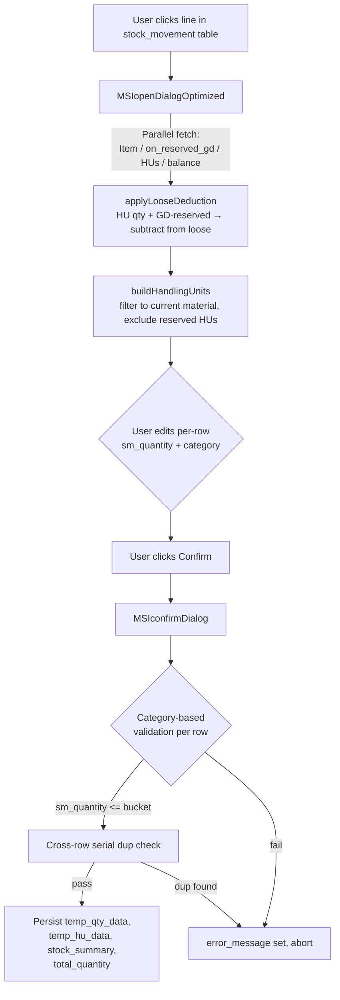

# Misc Issue — HU Integration Guide

> **Audience:** mobile engineers who have already implemented the Goods Delivery flow from `Goods Delivery/GD_HU_AND_AUTO_ALLOCATION_GUIDE.md`. This guide is a **delta** — what stays the same, what changes, and what's MSI-only.
>
> **Source files covered (full code in Part 8):**
> 1. `MSIopenDialogOptimized.js`
> 2. `MSIconfirmDialog.js`

---

## Table of Contents

1. [Orientation](#part-1--orientation)
2. [What's the Same as GD](#part-2--whats-the-same-as-gd)
3. [What's Different from GD](#part-3--whats-different-from-gd)
4. [MSIopenDialogOptimized Walkthrough](#part-4--msiopendialogoptimized-walkthrough)
5. [MSIconfirmDialog Walkthrough](#part-5--msiconfirmdialog-walkthrough)
6. [Mobile Cheat Sheet](#part-6--mobile-cheat-sheet)
7. [Edge Cases](#part-7--edge-cases)
8. [Full Source Code](#part-8--full-source-code)

---

## Part 1 — Orientation

**Misc Issue (MSI)** is a stock-out operation that consumes inventory directly without a Sales Order. There is no auto-allocation workflow, no split policy choices, no cross-line distribution. The user picks quantities manually for every row.

The MSI dialog must treat existing GD reservations as a **hard exclusion** — MSI must never consume stock that GD has already reserved (Pending or Allocated). This is the inverse of GD's relationship with its own reservations.

For the HU primitives — header vs item rows, loose-vs-HU deduplication, `temp_qty_data` / `temp_hu_data` shapes, UOM dual-universe, tab visibility logic — **see the GD guide**. This doc only covers what differs.

### The two files

| File | Role |
|---|---|
| [MSIopenDialogOptimized.js](MSIopenDialogOptimized.js) | Opens the inventory dialog. Parallel-fetches Item / GD-reservations / HUs (via `handling_unit_atu7sreg_sub` to bypass 5000-row cap) / balance. Sync builders fill the loose and HU tabs. **No** auto-allocation workflow call. |
| [MSIconfirmDialog.js](MSIconfirmDialog.js) | On Confirm: UOM normalise, validate HU rows, validate loose rows against their `category` bucket, cross-row serial dup check, persist `temp_qty_data` + `temp_hu_data` + `stock_summary`. |

### End-to-end flow



---

## Part 2 — What's the Same as GD

| Concept | Pointer |
|---|---|
| HU header/item row shape (`row_type`, `handling_unit_id`, `item_quantity`, `item_quantity_base`, etc.) | GD guide Part 2 (`gd_item_balance.table_hu`). |
| `handling_unit_atu7sreg_sub` sub-collection lookup pattern (5000-row cap bypass) | GD guide Part 4 + this codebase's recently-applied fix in `MSIopenDialogOptimized.js`. |
| HU-qty deduction from loose balance via `buildHuQtyMap` | GD guide Part 4, Step 9. |
| UOM dual-universe: `convertBaseToAlt` for HU item display; back-conversion in Confirm if user switched dialog UOM mid-edit | GD guide Part 6. |
| `is_deleted !== 1` filter on `table_hu_items` | GD guide Part 4, Step 5. |
| Loose-tab and HU-tab visibility (hide empty tabs, auto-activate the populated one) | GD guide Part 4, Step 11. |
| `temp_qty_data` carries both loose AND HU entries; HU entries identified by `handling_unit_id` | GD guide Part 7, Step 12. |
| `temp_hu_data` carries raw HU table rows for re-render on reopen | GD guide Part 7, Step 15. |

If anything above is unclear, read the matching GD section first — the mechanics are identical.

---

## Part 3 — What's Different from GD

### Δ1 — No Sales Order, no auto-allocation

| GD | MSI |
|---|---|
| `picking_setup` drives mode / strategy / split policy | Not read. |
| `runWorkflow("2032298961937842178", ...)` for Auto mode | Not called. |
| `on_reserved_gd` Pending = stock reserved *for this SO* → treated as **available** to this delivery | `on_reserved_gd` Pending OR Allocated → reserved by some GD → treated as **unavailable** to MSI. |
| HU with cross-GD Allocated row → deduct per-item from display | Any HU with ANY active reservation → **entire HU excluded** (`reservedHuIds` set). |
| Loose `reserved_qty` rewritten to SO-line-specific reserved | Loose reserved qty **subtracted** from `unrestricted_qty` and `balance_quantity` (vanishes from MSI's view). |
| `gd_status` (Draft vs Created) changes which reservations are visible | No status logic. |

> **MSI's rule:** if it's been reserved by GD in any way, MSI doesn't touch it. Period.

### Δ2 — Categories (the MSI-only dimension)

Every loose balance row carries five quantity buckets. MSI exposes a `category` dropdown per row so the user picks WHICH bucket to issue from. Confirm validates `sm_quantity <= bucket-for-chosen-category`.

| `category` value | Validated against | Notes |
|---|---|---|
| `Unrestricted` | `unrestricted_qty` | Default / normal case. |
| `Reserved` | `reserved_qty` | See edge-case note in Part 7. |
| `Quality Inspection` | `qualityinsp_qty` | See edge-case note in Part 7. |
| `Blocked` | `block_qty` | |
| `In Transit` | `intransit_qty` | See edge-case note in Part 7. |

HU items are hardcoded to `category: "Unrestricted"` in [MSIconfirmDialog.js line 218](MSIconfirmDialog.js#L218). HUs only hold unrestricted stock.

**`category_from` / `category_to` columns are hidden** in MSI — those belong to LOT / PT transfer dialogs which move stock between two category buckets. MSI just consumes from one bucket.

**Issuability filter:** the loose tab also filters rows down to those with `unrestricted_qty > 0 OR block_qty > 0` ([MSIopenDialogOptimized.js line 502-506](MSIopenDialogOptimized.js#L502-L506)). Rows where only Reserved / QI / In Transit have stock will be hidden even though the category dropdown technically allows them. Mobile should mirror this — see Part 7 for the inconsistency note.

### Δ3 — Split policy is hardcoded to ALLOW_SPLIT

There is no `split_policy` form key in MSI. All ALLOW_SPLIT behaviours are inlined:

- `hu_select` column hidden at the top of MAIN ([MSIopenDialogOptimized.js line 357-362](MSIopenDialogOptimized.js#L357-L362)).
- Foreign items inside an HU are filtered out — `buildHandlingUnits` only keeps items where `item.material_id === matId` ([MSIopenDialogOptimized.js line 234-237](MSIopenDialogOptimized.js#L234-L237)).
- Per-item `sm_quantity` is editable; header rows disabled (header is summary-only) — `disabledPaths` only contains header rows.
- No `temp_excess_data` is built or persisted.
- No cross-line quantity distribution happens at Confirm.

### Δ4 — Cross-row safety: serial duplicate detection (instead of qty distribution)

GD distributes whole-HU picks across multiple lines on Confirm. MSI doesn't — the user enters `sm_quantity` per row already. The MSI form-level safety check is **serial number uniqueness across rows**.

[MSIconfirmDialog.js line 229-280](MSIconfirmDialog.js#L229-L280):
1. Build `otherRowEntries` = flatten every other `stock_movement` row's persisted `temp_qty_data`.
2. Build a Map keyed by `serial_number|location_id|batch_id`, populated from `otherRowEntries` + current row's about-to-be-saved loose entries + HU entries.
3. Any key with more than one entry → `duplicates`.
4. If `duplicates.length > 0` → `$message.error` listing the duplicated serials, abort.

This catches: user picks Serial X in row 1, then opens row 2 and tries to pick the same Serial X. Confirm of row 2 will refuse.

### Δ5 — Field naming

Cheat-sheet for mental translation between GD and MSI:

| GD | MSI |
|---|---|
| `table_gd` (form key for the line table) | `stock_movement` |
| `gd_qty` (line-level rolled-up qty) | `total_quantity` (sum of all `sm_quantity` from loose + HU) |
| `gd_quantity` (per loose balance row, user's pick) | `sm_quantity` |
| `deliver_quantity` (per HU item row, user's pick) | `sm_quantity` (same name on HU rows too) |
| `gd_item_balance.table_item_balance` | `sm_item_balance.table_item_balance` |
| `gd_item_balance.table_hu` | `sm_item_balance.table_hu` |
| `view_stock` (summary display string) | `stock_summary` |
| `material_id` (on a line) | `item_selection` (on a line) |
| `gd_order_uom_id` / `good_delivery_uom_id` (line UOM) | `quantity_uom` |
| Plant: `plant_id` | Plant: `issuing_operation_faci` |
| `error_message` (form-level) | Same key name, same mechanism. |

### Δ6 — No inline `gd_qty` handler

GD has `GDgdQty.js` — a field-change handler that auto-allocates from a single balance row when the user types into `gd_qty` directly. **MSI has no equivalent.** The dialog is the only way to set `sm_quantity`. Mobile should not implement an inline-edit shortcut here.

---

## Part 4 — MSIopenDialogOptimized Walkthrough

In execution order. Only annotations specific to MSI; for shared mechanics see the GD guide.

1. **Hide MSI-irrelevant columns** ([line 357-362](MSIopenDialogOptimized.js#L357-L362)) — `category_from`, `category_to`, `serial_number` (default hidden, re-shown later for serialized items), `table_hu.hu_select`.

2. **Reset tables + clear default `category`** ([line 365-369](MSIopenDialogOptimized.js#L365-L369)).

3. **Fetch Item** ([line 371-381](MSIopenDialogOptimized.js#L371-L381)) → determines `isSerial`, `isBatchManaged`, `balanceCollection`.

4. **Parallel fetch via `Promise.all`** ([line 400-435](MSIopenDialogOptimized.js#L400-L435)):
   - **UOM**: single `in`-filter query for all alt UOMs (not N parallel queries).
   - **`on_reserved_gd`** scoped to `plant_id + organization_id + material_id`.
   - **HUs**: sub-collection-first IIFE — query `handling_unit_atu7sreg_sub` by `material_id`, collect `handling_unit_id` set, fetch only those HUs from `handling_unit`. Bypasses the 5000-row default cap.
   - **Balance collection** chosen by item flavor.

5. **Build `reservedHuIds` + `looseReservedMap`** ([line 447-477](MSIopenDialogOptimized.js#L447-L477)). Reservations with non-null `handling_unit_id` go into the HU exclusion set; loose reservations (no HU) are summed by location/batch key in base UOM.

6. **`applyLooseDeduction`** (sync, [line 513-535](MSIopenDialogOptimized.js#L513-L535)) — for each loose balance row, subtract `huQty + reservedQty` for its key from `unrestricted_qty` AND `balance_quantity`. Skipped for serialized items (HU items don't carry serial_number).

7. **`processBalanceData`** ([line 487-507](MSIopenDialogOptimized.js#L487-L507)):
   - Merges with `temp_qty_data` (HU entries filtered out — those re-hydrate via `temp_hu_data`).
   - Then `filterZeroQuantityRecords` (any non-zero bucket keeps the row).
   - Then **further** filtered to `unrestricted_qty > 0 OR block_qty > 0` — see Part 7 for the inconsistency this creates.

8. **`buildHandlingUnits`** (sync, [line 210-329](MSIopenDialogOptimized.js#L210-L329)) — pre-fetched `allHUs` consumed here:
   - Skip HUs in `reservedHuIdSet`.
   - Keep only items matching `materialId` (ALLOW_SPLIT); skip HU entirely if no matching items.
   - For each kept item, deduct `otherLinesHuAllocations.sm_quantity` for same `(handling_unit_id, material_id, batch_id)`.
   - Drop headers whose items all vanished.
   - Restore `sm_quantity` from `temp_hu_data` via Map lookup ([line 308-326](MSIopenDialogOptimized.js#L308-L326)).

9. **Set HU table data + batched disable** ([line 670-684](MSIopenDialogOptimized.js#L670-L684)):
   - Build list of all header-row `sm_quantity` paths.
   - Single `this.disabled([all paths], true)` call (per-row disables froze UI at ~10K rows).

10. **Tab visibility** — `showTab` both → hide whichever is empty → activate populated one.

---

## Part 5 — MSIconfirmDialog Walkthrough

1. **Read state** ([line 3-9](MSIconfirmDialog.js#L3-L9)) — `temporaryData` (loose), `huData` (HU table), `rowIndex`, `quantityUOM` (the line's UOM from `stock_movement[rowIndex].quantity_uom`) vs `selectedUOM` (the dialog's currently-displayed UOM).

2. **UOM normalisation** ([line 46-123](MSIconfirmDialog.js#L46-L123)) — if user switched UOM mid-edit, run `convertQuantityFromTo` (via base UOM) on all balance qty fields in `temporaryData` and on `item_quantity` + `sm_quantity` for every HU item row.

3. **HU row validation** ([line 132-148](MSIconfirmDialog.js#L132-L148)) — for each HU item with `sm_quantity > 0`, check `sm_quantity <= item_quantity`. If exceeded, write `error_message` on the form (using the HU's `handling_no`), set `isValid = false`, break.

4. **Loose row validation + total accumulation** ([line 151-194](MSIconfirmDialog.js#L151-L194)) — single reducer over `processedTemporaryData`:
   - Skip rows with `sm_quantity <= 0`.
   - Read `category` (fallback to `category_from`).
   - Map to bucket: Unrestricted→`unrestricted_qty`, Reserved→`reserved_qty`, Quality Inspection→`qualityinsp_qty`, Blocked→`block_qty`, In Transit→`intransit_qty`.
   - If `selectedField < quantity` → set `error_message`, abort.
   - Else add to `totalSmQuantity`.

5. **Compute `totalCombined`** ([line 196-204](MSIconfirmDialog.js#L196-L204)) — `totalSmQuantity + totalHuQuantity`, write to `stock_movement.${rowIndex}.total_quantity`.

6. **Cross-row serial dup check** ([line 229-280](MSIconfirmDialog.js#L229-L280)) — see Δ4. Builds Map of `serial_number|location_id|batch_id` from other rows' `temp_qty_data` + current row's loose + HU rows. Aborts with `$message.error` if any duplicates.

7. **Build `stock_summary`** ([line 282-418](MSIconfirmDialog.js#L282-L418)). Three layouts:
   - **Both**: `Total: X UOM\n\nLOOSE STOCK:\n...\n\nHANDLING UNIT:\n...`
   - **HU only**: `Total: X UOM\n\nHANDLING UNIT:\n...`
   - **Loose only**: `Total: X UOM\n\nDETAILS:\n...`
   - Loose details show location name + qty + category abbreviation (BLK/RES/UNR/QIP/INT) + optional serial + optional batch + optional remarks.

8. **Build `combinedTempQty`** ([line 423-438](MSIconfirmDialog.js#L423-L438)):
   - Clean loose entries: `dialog_manufacturing_date` → `manufacturing_date`, `dialog_expired_date` → `expired_date`.
   - HU entries in balance shape with `category: "Unrestricted"` hardcoded.
   - Concatenate.

9. **Persist** ([line 440-449](MSIconfirmDialog.js#L440-L449)):
   - `temp_qty_data` = JSON of `combinedTempQty`.
   - `temp_hu_data` = JSON of `filteredHuData` (raw HU rows for re-hydration on reopen).
   - `stock_summary` = the display string.
   - Clear `error_message`, close dialog.

---

## Part 6 — Mobile Cheat Sheet

- [ ] Skip everything related to `picking_setup`, `picking_mode`, `runWorkflow`, `split_policy` — none apply to MSI.
- [ ] Treat `on_reserved_gd` rows (Pending OR Allocated, `open_qty > 0`, `status !== "Cancelled"`) as exclusions: any HU appearing in one → drop whole HU; loose reservations → subtract from `unrestricted_qty` + `balance_quantity`.
- [ ] Each loose row carries a `category` dropdown; validate `sm_quantity` against the bucket matching that category.
- [ ] HU items are always `category: "Unrestricted"` when persisted to `temp_qty_data`.
- [ ] Serial duplicate check is form-wide — scan other rows' `temp_qty_data` AND the current row's pending entries.
- [ ] `total_quantity` on the line = sum of all `sm_quantity` (loose + HU) after UOM normalisation.
- [ ] Persist HU entries both inside `temp_qty_data` (carrying `handling_unit_id`) AND `temp_hu_data` (raw rows for re-render on reopen).
- [ ] On reopen, restore `sm_quantity` from `temp_hu_data` for HU rows, and from `temp_qty_data` (HU entries filtered out via `!handling_unit_id`) for loose rows.
- [ ] Plant id source: `stock_movement.issuing_operation_faci` (NOT `plant_id`).
- [ ] Line-level material id: `stock_movement[i].item_selection` (NOT `material_id`).

---

## Part 7 — Edge Cases

- **Category dropdown vs issuability filter mismatch.** The dialog filters loose rows to `unrestricted_qty > 0 OR block_qty > 0` ([MSIopenDialogOptimized.js line 502-506](MSIopenDialogOptimized.js#L502-L506)), but the category dropdown still lists Reserved / Quality Inspection / In Transit. A row with only `reserved_qty` is hidden from the dialog even though picking Reserved would otherwise be valid. **Recommendation:** mobile should mirror the filter as-is to match desktop. Flag to product if the filter should be relaxed.

- **Cross-row serial dup check uses persisted `temp_qty_data` only.** If two dialogs are open simultaneously (row 1 and row 2 both being edited), each pending dialog's about-to-save entries are invisible to the other. This is unlikely in practice (the desktop binding closes the dialog on row click) but document it.

- **`error_message` is a form-level field**, not a toast/alert. Confirm writes to it and aborts. Mobile should render it inline at the dialog level — match the UX or replace with whatever inline-error mechanism is natural on the platform.

- **`stock_summary` is display-only** — never parsed back. Mobile can render in any format that fits the device. Just keep it readable.

- **HU header `item_quantity` is the sum AFTER deductions** (other-line allocations + cross-GD reservations), not the raw DB value.

- **Confirm uses `$message.error` for serial duplicates** with multi-line content (`\n` newlines). Adapt to whatever your platform's toast/error component supports.

- **HU items don't carry serial_number** — applyLooseDeduction skips serialized items because the HU-vs-loose double-count problem doesn't exist for them. If you change this assumption, the deduction logic needs updating.

- **The two date fields swap names on persist.** Inside the dialog, expired/manufacturing dates live on `dialog_expired_date` / `dialog_manufacturing_date` (the column field-names). On Confirm they're renamed back to `expired_date` / `manufacturing_date` before persisting to `temp_qty_data`. Mobile should mirror this rename to keep `temp_qty_data` shape stable across modules.

---

## Part 8 — Full Source Code

### File 1 — `Stock Movement/Misc Issue/MSIopenDialogOptimized.js`

```js
(async () => {
  this.showLoading("Loading inventory data...");
  try {
    const allData = this.getValues();
    const lineItemData = arguments[0]?.row;
    const rowIndex = arguments[0]?.rowIndex;
    const plant_id = allData.issuing_operation_faci;
    const materialId = lineItemData.item_selection;
    const tempQtyData = lineItemData.temp_qty_data;
    const tempHuData = lineItemData.temp_hu_data;
    const quantityUOM = lineItemData.quantity_uom;
    const organizationId = allData.organization_id;

    if (!materialId) return;

    // ============= HELPERS =============

    // Single `in` query instead of N parallel queries — much cheaper at scale.
    const fetchUomData = async (uomIds) => {
      if (!uomIds || uomIds.length === 0) return [];
      try {
        const resUOM = await db
          .collection("unit_of_measurement")
          .filter([
            {
              type: "branch",
              operator: "all",
              children: [
                {
                  prop: "id",
                  operator: "in",
                  value: uomIds,
                },
              ],
            },
          ])
          .get();
        return resUOM.data || [];
      } catch (error) {
        console.error("Error fetching UOM data:", error);
        return [];
      }
    };

    const convertBaseToAlt = (baseQty, itemData, altUOM) => {
      if (
        !baseQty ||
        !Array.isArray(itemData.table_uom_conversion) ||
        itemData.table_uom_conversion.length === 0 ||
        !altUOM
      ) {
        return baseQty || 0;
      }
      const uomConversion = itemData.table_uom_conversion.find(
        (c) => c.alt_uom_id === altUOM,
      );
      if (!uomConversion || !uomConversion.base_qty) return baseQty;
      return Math.round((baseQty / uomConversion.base_qty) * 1000) / 1000;
    };

    const parseJSON = (str) => {
      if (
        !str ||
        str === "[]" ||
        (typeof str === "string" && str.trim() === "")
      )
        return [];
      try {
        const parsed = JSON.parse(str);
        return Array.isArray(parsed) ? parsed : [];
      } catch {
        return [];
      }
    };

    const filterZeroQuantityRecords = (data, itemData) => {
      return data.filter((record) => {
        if (itemData.serial_number_management === 1) {
          const hasValidSerial =
            record.serial_number && record.serial_number.trim() !== "";
          if (!hasValidSerial) return false;
          return (
            (record.block_qty && record.block_qty > 0) ||
            (record.reserved_qty && record.reserved_qty > 0) ||
            (record.unrestricted_qty && record.unrestricted_qty > 0) ||
            (record.qualityinsp_qty && record.qualityinsp_qty > 0) ||
            (record.intransit_qty && record.intransit_qty > 0) ||
            (record.balance_quantity && record.balance_quantity > 0)
          );
        }
        return (
          (record.block_qty && record.block_qty > 0) ||
          (record.reserved_qty && record.reserved_qty > 0) ||
          (record.unrestricted_qty && record.unrestricted_qty > 0) ||
          (record.qualityinsp_qty && record.qualityinsp_qty > 0) ||
          (record.intransit_qty && record.intransit_qty > 0) ||
          (record.balance_quantity && record.balance_quantity > 0)
        );
      });
    };

    const generateKey = (item, itemData) => {
      if (itemData.serial_number_management === 1) {
        if (itemData.item_batch_management === 1) {
          return `${item.location_id || "no_location"}-${
            item.serial_number || "no_serial"
          }-${item.batch_id || "no_batch"}`;
        }
        return `${item.location_id || "no_location"}-${
          item.serial_number || "no_serial"
        }`;
      }
      if (itemData.item_batch_management === 1) {
        return `${item.location_id || "no_location"}-${
          item.batch_id || "no_batch"
        }`;
      }
      return `${item.location_id || item.balance_id || "no_key"}`;
    };

    const mergeWithTempData = (freshDbData, tempDataArray, itemData) => {
      if (!tempDataArray || tempDataArray.length === 0) {
        return freshDbData;
      }

      const tempDataMap = new Map(
        tempDataArray.map((tempItem) => [
          generateKey(tempItem, itemData),
          tempItem,
        ]),
      );

      // Pre-compute fresh keys once — avoids re-running generateKey N×T times below.
      const freshKeys = freshDbData.map((d) => generateKey(d, itemData));
      const freshKeySet = new Set(freshKeys);

      const mergedData = freshDbData.map((dbItem, i) => {
        const tempItem = tempDataMap.get(freshKeys[i]);

        if (tempItem) {
          return {
            ...dbItem,
            ...tempItem,
            id: dbItem.id,
            balance_id: dbItem.id,
            fm_key: tempItem.fm_key,
            category: tempItem.category,
            sm_quantity: tempItem.sm_quantity,
            remarks: tempItem.remarks || dbItem.remarks,
          };
        }

        return {
          ...dbItem,
          balance_id: dbItem.id,
        };
      });

      tempDataArray.forEach((tempItem) => {
        const key = generateKey(tempItem, itemData);
        if (!freshKeySet.has(key)) {
          mergedData.push({
            ...tempItem,
            balance_id: tempItem.balance_id || tempItem.id,
          });
        }
      });

      return mergedData;
    };

    const mapBalanceData = (itemBalanceData) => {
      return Array.isArray(itemBalanceData)
        ? itemBalanceData.map((item) => {
            const { id, ...itemWithoutId } = item;
            return {
              ...itemWithoutId,
              balance_id: id,
            };
          })
        : (() => {
            const { id, ...itemWithoutId } = itemBalanceData;
            return { ...itemWithoutId, balance_id: id };
          })();
    };

    // Sum HU-bound qty by location/batch for current material — used to subtract
    // from loose item_balance display so the same physical stock isn't pickable both ways
    const buildHuQtyMap = (allHUs, matId, isBatchManaged) => {
      const huQtyMap = new Map();
      for (const hu of allHUs) {
        const items = (hu.table_hu_items || []).filter(
          (item) => item.is_deleted !== 1 && item.material_id === matId,
        );
        for (const item of items) {
          const locationId = item.location_id || hu.location_id;
          const key = isBatchManaged
            ? `${locationId}-${item.batch_id || "no_batch"}`
            : `${locationId}`;
          const qty = parseFloat(item.quantity) || 0;
          huQtyMap.set(key, (huQtyMap.get(key) || 0) + qty);
        }
      }
      return huQtyMap;
    };

    // Build HU table from pre-fetched HU data. ALLOW_SPLIT: include HUs that contain
    // the current material; filter table_hu_items down to only the matching items
    // (foreign items in the same HU are hidden, not blocking).
    const buildHandlingUnits = (
      allHUs,
      matId,
      tempHuStr,
      itemData,
      altUOM,
      otherLinesHuAllocations,
      reservedHuIdSet,
    ) => {
      // Map for O(1) other-line allocation lookup (preserves first-match behavior of .find())
      const huAllocMap = new Map();
      for (const a of otherLinesHuAllocations) {
        const k = `${a.handling_unit_id}|${a.material_id}|${a.batch_id || ""}`;
        if (!huAllocMap.has(k)) huAllocMap.set(k, a);
      }

      const huTableData = [];

      for (const hu of allHUs) {
        // Full HU exclusion: skip any HU with an active reservation in on_reserved_gd
        if (reservedHuIdSet && reservedHuIdSet.has(hu.id)) continue;

        // ALLOW_SPLIT: keep only items matching the current material; skip the
        // HU entirely if it has none.
        const allActiveItems = (hu.table_hu_items || []).filter(
          (item) => item.is_deleted !== 1 && item.material_id === matId,
        );
        if (allActiveItems.length === 0) continue;

        // Header row placeholder — item_quantity updated after items are added
        const headerRow = {
          row_type: "header",
          handling_unit_id: hu.id,
          handling_no: hu.handling_no,
          material_id: "",
          material_name: "",
          storage_location_id: hu.storage_location_id,
          location_id: hu.location_id,
          batch_id: null,
          item_quantity: 0,
          sm_quantity: 0,
          remark: hu.remark || "",
          balance_id: "",
        };
        huTableData.push(headerRow);

        let headerItemTotal = 0;
        for (const huItem of allActiveItems) {
          const baseQty = parseFloat(huItem.quantity) || 0;
          let displayQty = convertBaseToAlt(baseQty, itemData, altUOM);

          const k = `${hu.id}|${huItem.material_id}|${huItem.batch_id || ""}`;
          const otherLineAlloc = huAllocMap.get(k);
          if (otherLineAlloc) {
            displayQty = Math.max(
              0,
              displayQty - (otherLineAlloc.sm_quantity || 0),
            );
          }

          if (displayQty <= 0) continue;

          headerItemTotal += displayQty;
          huTableData.push({
            row_type: "item",
            handling_unit_id: hu.id,
            handling_no: "",
            material_id: huItem.material_id,
            material_name: huItem.material_name,
            storage_location_id: hu.storage_location_id,
            location_id: huItem.location_id || hu.location_id,
            batch_id: huItem.batch_id || null,
            item_quantity: displayQty,
            item_quantity_base: baseQty,
            sm_quantity: 0,
            remark: "",
            balance_id: huItem.balance_id || "",
            expired_date: huItem.expired_date || null,
            manufacturing_date: huItem.manufacturing_date || null,
            create_time: huItem.create_time || hu.create_time,
          });
        }

        headerRow.item_quantity = Math.round(headerItemTotal * 1000) / 1000;
      }

      // Drop header rows whose items were all fully allocated by other lines
      const huIdsWithItems = new Set(
        huTableData
          .filter((r) => r.row_type === "item")
          .map((r) => r.handling_unit_id),
      );
      const filtered = huTableData.filter(
        (r) => r.row_type === "item" || huIdsWithItems.has(r.handling_unit_id),
      );

      // Restore sm_quantity from existing temp_hu_data on re-open. Map lookup
      // replaces O(T*N) linear scan.
      const parsedTempHu = parseJSON(tempHuStr);
      if (parsedTempHu.length > 0) {
        const filteredItemMap = new Map();
        for (const row of filtered) {
          if (row.row_type !== "item") continue;
          const k = `${row.handling_unit_id}|${row.material_id}|${
            row.batch_id || ""
          }`;
          if (!filteredItemMap.has(k)) filteredItemMap.set(k, row);
        }
        for (const tempItem of parsedTempHu) {
          if (tempItem.row_type !== "item") continue;
          const k = `${tempItem.handling_unit_id}|${tempItem.material_id}|${
            tempItem.batch_id || ""
          }`;
          const match = filteredItemMap.get(k);
          if (match) match.sm_quantity = tempItem.sm_quantity || 0;
        }
      }

      return filtered;
    };

    // Drawer-scoped selectors so we don't collide with same-id tabs on the parent page
    const TAB_SCOPE = `.el-drawer[role="dialog"] .el-tabs__item`;

    const hideTab = (tabName) => {
      const tab = document.querySelector(`${TAB_SCOPE}#tab-${tabName}`);
      if (tab) tab.style.display = "none";
    };

    const showTab = (tabName) => {
      const tab = document.querySelector(`${TAB_SCOPE}#tab-${tabName}`);
      if (tab) {
        tab.style.display = "flex";
        tab.setAttribute("aria-disabled", "false");
        tab.classList.remove("is-disabled");
      }
    };

    const activateTab = (tabName) => {
      const tab = document.querySelector(`${TAB_SCOPE}#tab-${tabName}`);
      if (tab) tab.click();
    };

    // ============= MAIN =============

    // Hide category-from/to + serial column. MSI uses ALLOW_SPLIT — user picks
    // per-item sm_quantity manually; hu_select column is hidden.
    this.hide([
      "sm_item_balance.table_item_balance.category_from",
      "sm_item_balance.table_item_balance.category_to",
      "sm_item_balance.table_item_balance.serial_number",
      "sm_item_balance.table_hu.hu_select",
    ]);

    // Reset tables and clear category default
    this.setData({
      "sm_item_balance.table_item_balance": [],
      "sm_item_balance.table_hu": [],
      "sm_item_balance.table_item_balance.category": undefined,
    });

    let itemData;
    try {
      const itemResponse = await db
        .collection("Item")
        .where({ id: materialId })
        .get();
      itemData = itemResponse.data?.[0];
    } catch (error) {
      console.error("Error fetching item data:", error);
      return;
    }
    if (!itemData) return;

    const isBatchManaged = itemData.item_batch_management === 1;
    const isSerial = itemData.serial_number_management === 1;
    const altUoms =
      itemData.table_uom_conversion?.map((data) => data.alt_uom_id) || [];

    const balanceCollection = isSerial
      ? "item_serial_balance"
      : isBatchManaged
        ? "item_batch_balance"
        : "item_balance";

    // Parallelize independent fetches: UOM, GD reservations, all HUs, balance
    // Active GD reservations for this material. Used to:
    //   (a) Hide whole HUs that have any item reserved (full HU exclusion).
    //   (b) Subtract loose-stock reservations (no handling_unit_id) from the
    //       item_balance display so MSI doesn't pick stock already committed to GD.
    const [uomOptions, reservationRes, huRes, balanceRes] = await Promise.all([
      fetchUomData(altUoms),
      db
        .collection("on_reserved_gd")
        .where({
          plant_id: plant_id,
          organization_id: organizationId,
          material_id: materialId,
          is_deleted: 0,
        })
        .get()
        .catch((error) => {
          console.error("Error fetching on_reserved_gd:", error);
          return { data: [] };
        }),
      (async () => {
        // Find HU IDs containing this material via the flat sub-collection.
        // Avoids the 5000-row default cap on `handling_unit` when many HUs exist.
        try {
          const subRes = await db
            .collection("handling_unit_atu7sreg_sub")
            .where({ material_id: materialId, is_deleted: 0 })
            .get();
          const candidateHuIds = [
            ...new Set(
              (subRes.data || [])
                .map((r) => r.handling_unit_id)
                .filter(Boolean),
            ),
          ];
          if (candidateHuIds.length === 0) return { data: [] };
          return await db
            .collection("handling_unit")
            .filter([
              {
                type: "branch",
                operator: "all",
                children: [
                  { prop: "id", operator: "in", value: candidateHuIds },
                  { prop: "plant_id", operator: "equal", value: plant_id },
                  {
                    prop: "organization_id",
                    operator: "equal",
                    value: organizationId,
                  },
                  { prop: "is_deleted", operator: "equal", value: 0 },
                ],
              },
            ])
            .get();
        } catch (error) {
          console.error("Error fetching handling units:", error);
          return { data: [] };
        }
      })(),
      db
        .collection(balanceCollection)
        .where({ material_id: materialId, plant_id: plant_id })
        .get()
        .catch((error) => {
          console.error(`Error fetching ${balanceCollection} data:`, error);
          return { data: [] };
        }),
    ]);

    this.setOptionData([`sm_item_balance.material_uom`], uomOptions);
    this.setData({
      sm_item_balance: {
        material_id: itemData.material_code,
        material_name: itemData.material_name,
        row_index: rowIndex,
        material_uom: quantityUOM,
      },
    });

    const activeReservations = (reservationRes.data || []).filter(
      (r) => parseFloat(r.open_qty || 0) > 0 && r.status !== "Cancelled",
    );

    const convertReservedToBase = (qty, item_uom) => {
      if (!item_uom || item_uom === itemData.based_uom) return qty;
      const conv = itemData.table_uom_conversion?.find(
        (c) => c.alt_uom_id === item_uom,
      );
      if (conv && conv.base_qty) return qty * conv.base_qty;
      return qty;
    };

    const reservedHuIds = new Set();
    const looseReservedMap = new Map();
    for (const r of activeReservations) {
      if (r.handling_unit_id) {
        reservedHuIds.add(r.handling_unit_id);
      } else {
        const locId = r.bin_location;
        if (!locId) continue;
        const key = isBatchManaged
          ? `${locId}-${r.batch_id || "no_batch"}`
          : `${locId}`;
        const qtyBase = convertReservedToBase(
          parseFloat(r.open_qty || 0),
          r.item_uom,
        );
        looseReservedMap.set(key, (looseReservedMap.get(key) || 0) + qtyBase);
      }
    }

    const allHUs = huRes.data || [];

    let looseRowCount = 0;

    // Filter out HU-bound records from temp_qty_data — those belong to table_hu.
    // Final filter drops rows with no issuable stock: only rows with
    // unrestricted_qty > 0 OR block_qty > 0 are kept (Reserved / QI / InTransit
    // categories aren't issuable via MSI).
    const processBalanceData = (itemBalanceData, itemDataLocal) => {
      const mappedData = mapBalanceData(itemBalanceData);
      let finalData = mappedData;

      if (tempQtyData) {
        try {
          const tempArr = JSON.parse(tempQtyData).filter(
            (it) => !it.handling_unit_id,
          );
          finalData = mergeWithTempData(mappedData, tempArr, itemDataLocal);
        } catch (error) {
          console.error("Error parsing temp_qty_data:", error);
        }
      }

      return filterZeroQuantityRecords(finalData, itemDataLocal).filter(
        (r) =>
          (parseFloat(r.unrestricted_qty) || 0) > 0 ||
          (parseFloat(r.block_qty) || 0) > 0,
      );
    };

    // item_balance includes stock physically inside HUs and stock reserved by other
    // GDs — deduct both so loose display reflects what's actually available to MSI.
    // Skip serialized items: HU items don't carry serial_number.
    // Now sync — uses already-fetched HU data instead of re-querying.
    const applyLooseDeduction = (freshDbData) => {
      if (isSerial) return freshDbData;
      const huQtyMap = buildHuQtyMap(allHUs, materialId, isBatchManaged);
      for (const row of freshDbData) {
        const key = isBatchManaged
          ? `${row.location_id}-${row.batch_id || "no_batch"}`
          : `${row.location_id}`;
        const huQty = huQtyMap.get(key) || 0;
        const reservedQty = looseReservedMap.get(key) || 0;
        const totalDeduct = huQty + reservedQty;
        if (totalDeduct > 0) {
          row.unrestricted_qty = Math.max(
            0,
            (row.unrestricted_qty || 0) - totalDeduct,
          );
          row.balance_quantity = Math.max(
            0,
            (row.balance_quantity || 0) - totalDeduct,
          );
        }
      }
      return freshDbData;
    };

    if (isSerial) {
      this.display([
        "sm_item_balance.table_item_balance.serial_number",
        "sm_item_balance.search_serial_number",
        "sm_item_balance.confirm_search",
        "sm_item_balance.reset_search",
      ]);

      if (isBatchManaged) {
        this.display([
          "sm_item_balance.table_item_balance.batch_id",
          "sm_item_balance.table_item_balance.dialog_expired_date",
          "sm_item_balance.table_item_balance.dialog_manufacturing_date",
        ]);
      } else {
        this.hide([
          "sm_item_balance.table_item_balance.batch_id",
          "sm_item_balance.table_item_balance.dialog_expired_date",
          "sm_item_balance.table_item_balance.dialog_manufacturing_date",
        ]);
      }

      const filteredData = processBalanceData(balanceRes.data || [], itemData);
      looseRowCount = filteredData.length;

      this.setData({
        [`sm_item_balance.table_item_balance`]: filteredData,
        [`sm_item_balance.table_item_balance_raw`]:
          JSON.stringify(filteredData),
      });
    } else if (isBatchManaged) {
      this.display([
        "sm_item_balance.table_item_balance.batch_id",
        "sm_item_balance.table_item_balance.dialog_expired_date",
        "sm_item_balance.table_item_balance.dialog_manufacturing_date",
      ]);
      this.hide("sm_item_balance.table_item_balance.serial_number");

      const itemBalanceData = balanceRes.data || [];
      const mappedData = Array.isArray(itemBalanceData)
        ? itemBalanceData.map((item) => {
            const { id, ...itemWithoutId } = item;
            return {
              ...itemWithoutId,
              balance_id: id,
              dialog_expired_date: item.expired_date,
              dialog_manufacturing_date: item.manufacturing_date,
            };
          })
        : (() => {
            const { id, ...itemWithoutId } = itemBalanceData;
            return {
              ...itemWithoutId,
              balance_id: id,
              dialog_expired_date: itemBalanceData.expired_date,
              dialog_manufacturing_date: itemBalanceData.manufacturing_date,
            };
          })();

      const deducted = applyLooseDeduction(mappedData);
      const filteredData = processBalanceData(deducted, itemData);
      looseRowCount = filteredData.length;

      this.setData({
        [`sm_item_balance.table_item_balance`]: filteredData,
      });
    } else {
      this.hide([
        "sm_item_balance.table_item_balance.batch_id",
        "sm_item_balance.table_item_balance.dialog_expired_date",
        "sm_item_balance.table_item_balance.dialog_manufacturing_date",
        "sm_item_balance.table_item_balance.serial_number",
      ]);

      const dbData = balanceRes.data || [];
      const deducted = applyLooseDeduction(dbData);
      const filteredData = processBalanceData(deducted, itemData);
      looseRowCount = filteredData.length;

      this.setData({
        [`sm_item_balance.table_item_balance`]: filteredData,
        [`sm_item_balance.table_item_balance.unit_price`]:
          itemData.purchase_unit_price,
      });
    }

    // ============= HU TABLE =============

    // Other stock_movement lines' HU allocations for same material — to deduct
    const otherLinesHuAllocations = [];
    if (Array.isArray(allData.stock_movement)) {
      allData.stock_movement.forEach((line, idx) => {
        if (idx === rowIndex) return;
        if (line.item_selection !== materialId) return;
        const huStr = line.temp_hu_data;
        if (!huStr || huStr === "[]") return;
        try {
          const parsed = JSON.parse(huStr);
          if (Array.isArray(parsed)) {
            parsed.forEach((alloc) => {
              if (
                alloc.row_type === "item" &&
                parseFloat(alloc.sm_quantity) > 0
              ) {
                otherLinesHuAllocations.push(alloc);
              }
            });
          }
        } catch (e) {
          console.warn(
            `Failed to parse temp_hu_data for stock_movement row ${idx}`,
          );
        }
      });
    }

    const huTableData = buildHandlingUnits(
      allHUs,
      materialId,
      tempHuData,
      itemData,
      quantityUOM,
      otherLinesHuAllocations,
      reservedHuIds,
    );

    // Reset both tabs to visible — clears any stale hide from a previous open
    showTab("handling_unit");
    showTab("loose");

    const hasHu = huTableData.length > 0;
    const hasLoose = looseRowCount > 0;

    if (hasHu) {
      await this.setData({ "sm_item_balance.table_hu": huTableData });

      // Batch all header-row disables into a single call — per-row calls froze
      // the UI at scale (~10K rows = 10K sync UI mutations on main thread).
      const disabledPaths = [];
      for (let idx = 0; idx < huTableData.length; idx++) {
        if (huTableData[idx].row_type === "header") {
          disabledPaths.push(`sm_item_balance.table_hu.${idx}.sm_quantity`);
        }
      }
      if (disabledPaths.length > 0) {
        this.disabled(disabledPaths, true);
      }
    }

    if (!hasHu) hideTab("handling_unit");
    if (!hasLoose) hideTab("loose");

    if (hasHu && hasLoose) {
      activateTab("loose");
    } else if (hasHu) {
      activateTab("handling_unit");
    } else if (hasLoose) {
      activateTab("loose");
    }
  } catch (error) {
    console.error("Error in MSI inventory dialog:", error);
  } finally {
    this.hideLoading();
  }
})();
```

### File 2 — `Stock Movement/Misc Issue/MSIconfirmDialog.js`

```js
(async () => {
  console.log("test");
  const allData = this.getValues();
  console.log("allData", allData);
  const temporaryData = allData.sm_item_balance.table_item_balance;
  const huData = allData.sm_item_balance.table_hu || [];
  const rowIndex = allData.sm_item_balance.row_index;
  const quantityUOM = allData.stock_movement[rowIndex].quantity_uom;
  const selectedUOM = allData.sm_item_balance.material_uom;

  let isValid = true;

  // const allValid = temporaryData.every((item, idx) => {
  //   console.log('window.validationState', window.validationState)
  //   const valid =
  //     window.validationState && window.validationState[idx] !== false;
  //   return valid;
  // });

  // if (!allValid) {
  //   console.log('allValid', allValid)
  //   return;
  // }

  const gdUOM = await db
    .collection("unit_of_measurement")
    .where({ id: quantityUOM })
    .get()
    .then((res) => res.data[0]?.uom_name || "");

  const materialId = allData.stock_movement[rowIndex].item_selection;
  let itemData = null;
  try {
    const itemResponse = await db
      .collection("Item")
      .where({ id: materialId })
      .get();
    itemData = itemResponse.data[0];
  } catch (error) {
    console.error("Error fetching item data:", error);
  }

  let processedTemporaryData = temporaryData;
  let processedHuData = huData;

  if (selectedUOM !== quantityUOM && itemData) {
    const tableUOMConversion = itemData.table_uom_conversion;
    const baseUOM = itemData.based_uom;

    const convertQuantityFromTo = (
      value,
      table_uom_conversion,
      fromUOM,
      toUOM,
      baseUOM,
    ) => {
      if (!value || fromUOM === toUOM) return value;

      let baseQty = value;
      if (fromUOM !== baseUOM) {
        const fromConversion = table_uom_conversion.find(
          (conv) => conv.alt_uom_id === fromUOM,
        );
        if (fromConversion && fromConversion.base_qty) {
          baseQty = value * fromConversion.base_qty;
        }
      }

      if (toUOM !== baseUOM) {
        const toConversion = table_uom_conversion.find(
          (conv) => conv.alt_uom_id === toUOM,
        );
        if (toConversion && toConversion.base_qty) {
          return Math.round((baseQty / toConversion.base_qty) * 1000) / 1000;
        }
      }

      return baseQty;
    };

    const balanceFields = [
      "block_qty",
      "reserved_qty",
      "unrestricted_qty",
      "qualityinsp_qty",
      "intransit_qty",
      "balance_quantity",
      "sm_quantity",
    ];

    processedTemporaryData = temporaryData.map((record) => {
      const convertedRecord = { ...record };
      balanceFields.forEach((field) => {
        if (convertedRecord[field]) {
          convertedRecord[field] = convertQuantityFromTo(
            convertedRecord[field],
            tableUOMConversion,
            selectedUOM,
            quantityUOM,
            baseUOM,
          );
        }
      });
      return convertedRecord;
    });

    processedHuData = huData.map((record) => {
      if (record.row_type !== "item") return { ...record };
      const convertedRecord = { ...record };
      ["item_quantity", "sm_quantity"].forEach((field) => {
        if (convertedRecord[field]) {
          convertedRecord[field] = convertQuantityFromTo(
            convertedRecord[field],
            tableUOMConversion,
            selectedUOM,
            quantityUOM,
            baseUOM,
          );
        }
      });
      return convertedRecord;
    });
  }

  // HU items the user actually wants to sm
  const filteredHuData = processedHuData.filter(
    (item) => item.row_type === "item" && parseFloat(item.sm_quantity || 0) > 0,
  );

  // Validate HU rows: sm_quantity must not exceed available item_quantity.
  // HU items are always treated as Unrestricted, so no category check applies.
  for (const huItem of filteredHuData) {
    const smQty = parseFloat(huItem.sm_quantity || 0);
    const availableQty = parseFloat(huItem.item_quantity || 0);
    if (smQty > availableQty) {
      const huHeader = huData.find(
        (row) =>
          row.row_type === "header" &&
          row.handling_unit_id === huItem.handling_unit_id,
      );
      const huName = huHeader?.handling_no || huItem.handling_unit_id;
      this.setData({
        error_message: `HU ${huName}: sm quantity (${smQty}) exceeds available (${availableQty}).`,
      });
      isValid = false;
      break;
    }
  }
  if (!isValid) return;

  const totalSmQuantity = processedTemporaryData
    .filter((item) => (item.sm_quantity || 0) > 0)
    .reduce((sum, item) => {
      const category_type = item.category ?? item.category_from;
      const quantity = item.sm_quantity || 0;

      if (quantity > 0) {
        let selectedField;

        switch (category_type) {
          case "Unrestricted":
            selectedField = item.unrestricted_qty;
            break;
          case "Reserved":
            selectedField = item.reserved_qty;
            break;
          case "Quality Inspection":
            selectedField = item.qualityinsp_qty;
            break;
          case "Blocked":
            selectedField = item.block_qty;
            break;
          case "In Transit":
            selectedField = item.intransit_qty;
            break;
          default:
            this.setData({ error_message: "Invalid category type" });
            isValid = false;
            return sum;
        }

        if (selectedField < quantity) {
          this.setData({
            error_message: `Quantity in ${category_type} is not enough.`,
          });
          isValid = false;
          return sum;
        }
      }

      return sum + quantity;
    }, 0);

  if (!isValid) return;

  const totalHuQuantity = filteredHuData.reduce(
    (sum, item) => sum + parseFloat(item.sm_quantity || 0),
    0,
  );
  const totalCombined = totalSmQuantity + totalHuQuantity;

  this.setData({
    [`stock_movement.${rowIndex}.total_quantity`]: totalCombined,
  });

  const rowsToUpdate = processedTemporaryData.filter(
    (item) => (item.sm_quantity || 0) > 0,
  );

  // HU items in balance-shape; category always "Unrestricted" for HU items.
  const huAsBalanceRowsBase = filteredHuData.map((huItem) => ({
    material_id: huItem.material_id,
    location_id: huItem.location_id,
    storage_location_id: huItem.storage_location_id || null,
    batch_id: huItem.batch_id || null,
    balance_id: huItem.balance_id || "",
    sm_quantity: parseFloat(huItem.sm_quantity) || 0,
    category: "Unrestricted",
    handling_unit_id: huItem.handling_unit_id,
    plant_id: allData.issuing_operation_faci,
    organization_id: allData.organization_id,
    is_deleted: 0,
    expired_date: huItem.expired_date || null,
    manufacturing_date: huItem.manufacturing_date || null,
  }));

  // Cross-line serial dup check: scan other rows' persisted temp_qty_data,
  // plus this row's new loose + HU entries.
  const otherRowEntries = [];
  (allData.stock_movement || []).forEach((line, idx) => {
    if (String(idx) === String(rowIndex)) return;
    if (!line.temp_qty_data) return;
    try {
      const parsed = JSON.parse(line.temp_qty_data);
      if (Array.isArray(parsed)) otherRowEntries.push(...parsed);
    } catch (e) {}
  });

  const serialLocationBatchMap = new Map();

  [...otherRowEntries, ...rowsToUpdate, ...huAsBalanceRowsBase].forEach((entry) => {
    if (entry.serial_number && entry.serial_number.trim() !== "") {
      const serialNumber = entry.serial_number.trim();
      const locationId = entry.location_id || "no-location";
      const batchId = entry.batch_id || "no-batch";

      const combinationKey = `${serialNumber}|${locationId}|${batchId}`;

      if (!serialLocationBatchMap.has(combinationKey)) {
        serialLocationBatchMap.set(combinationKey, []);
      }

      serialLocationBatchMap.get(combinationKey).push({
        serialNumber: serialNumber,
        locationId: locationId,
        batchId: batchId,
      });
    }
  });

  const duplicates = [];
  for (const [combinationKey, entries] of serialLocationBatchMap.entries()) {
    if (entries.length > 1) {
      duplicates.push({
        combinationKey: combinationKey,
        serialNumber: entries[0].serialNumber,
      });
    }
  }

  if (duplicates.length > 0) {
    const duplicateMessages = duplicates
      .map((dup) => `• Serial Number "${dup.serialNumber}".`)
      .join("\n");

    this.$message.error(
      `Duplicate serial numbers detected in the same location/batch combination:\n\n${duplicateMessages}\n\nThe same serial number cannot be allocated multiple times to the same location and batch. Please remove the duplicates and try again.`,
    );
    return;
  }

  const formatLooseDetails = async (filteredData) => {
    const locationIds = [
      ...new Set(filteredData.map((item) => item.location_id)),
    ];

    const batchIds = [
      ...new Set(
        filteredData
          .map((item) => item.batch_id)
          .filter((batchId) => batchId != null && batchId !== ""),
      ),
    ];

    const locationPromises = locationIds.map(async (locationId) => {
      try {
        const resBinLocation = await db
          .collection("bin_location")
          .where({ id: locationId })
          .get();
        return {
          id: locationId,
          name:
            resBinLocation.data?.[0]?.bin_location_combine ||
            `Location ID: ${locationId}`,
        };
      } catch (error) {
        console.error(`Error fetching location ${locationId}:`, error);
        return { id: locationId, name: `${locationId} (Error)` };
      }
    });

    const batchPromises = batchIds.map(async (batchId) => {
      try {
        const resBatch = await db
          .collection("batch")
          .where({ id: batchId })
          .get();
        return {
          id: batchId,
          name: resBatch.data?.[0]?.batch_number || `Batch ID: ${batchId}`,
        };
      } catch (error) {
        console.error(`Error fetching batch ${batchId}:`, error);
        return { id: batchId, name: `${batchId} (Error)` };
      }
    });

    const [locations, batches] = await Promise.all([
      Promise.all(locationPromises),
      Promise.all(batchPromises),
    ]);

    const categoryMap = {
      Blocked: "BLK",
      Reserved: "RES",
      Unrestricted: "UNR",
      "Quality Inspection": "QIP",
      "In Transit": "INT",
    };

    const locationMap = locations.reduce((map, loc) => {
      map[loc.id] = loc.name;
      return map;
    }, {});

    const batchMap = batches.reduce((map, batch) => {
      map[batch.id] = batch.name;
      return map;
    }, {});

    return filteredData
      .map((item, index) => {
        const locationName = locationMap[item.location_id] || item.location_id;
        const qty = item.sm_quantity || 0;
        const category = item.category;
        const categoryAbbr = categoryMap[category] || category || "UNR";

        let itemDetail = `${
          index + 1
        }. ${locationName}: ${qty} ${gdUOM} (${categoryAbbr})`;

        if (itemData?.serial_number_management === 1 && item.serial_number) {
          itemDetail += `\nSerial: ${item.serial_number}`;
        }

        if (item.batch_id) {
          const batchName = batchMap[item.batch_id] || item.batch_id;
          itemDetail += `\n${
            itemData?.serial_number_management === 1 ? "Batch: " : "["
          }${batchName}${itemData?.serial_number_management === 1 ? "" : "]"}`;
        }

        if (item.remarks && item.remarks.trim() !== "") {
          itemDetail += `\nRemarks: ${item.remarks}`;
        }

        return itemDetail;
      })
      .join("\n");
  };

  const formatHuDetails = (filteredHuList) =>
    filteredHuList
      .map((item, index) => {
        const huHeader = huData.find(
          (row) =>
            row.row_type === "header" &&
            row.handling_unit_id === item.handling_unit_id,
        );
        const huName = huHeader?.handling_no || item.handling_unit_id;
        let detail = `${index + 1}. ${huName}: ${item.sm_quantity} ${gdUOM}`;
        if (item.batch_id) {
          detail += `\n   [Batch: ${item.batch_id}]`;
        }
        return detail;
      })
      .join("\n");

  const filteredLoose = processedTemporaryData.filter(
    (item) => (item.sm_quantity || 0) > 0,
  );
  const looseDetails = await formatLooseDetails(filteredLoose);
  const hasHu = filteredHuData.length > 0;
  const hasLoose = filteredLoose.length > 0;

  let formattedString;
  if (hasHu && hasLoose) {
    formattedString = `Total: ${totalCombined} ${gdUOM}\n\nLOOSE STOCK:\n${looseDetails}\n\nHANDLING UNIT:\n${formatHuDetails(
      filteredHuData,
    )}`;
  } else if (hasHu) {
    formattedString = `Total: ${totalHuQuantity} ${gdUOM}\n\nHANDLING UNIT:\n${formatHuDetails(
      filteredHuData,
    )}`;
  } else {
    formattedString = `Total: ${totalSmQuantity} ${gdUOM}\n\nDETAILS:\n${looseDetails}`;
  }

  // temp_qty_data carries loose + HU rows in balance shape; HU rows are
  // distinguishable via handling_unit_id. temp_hu_data carries the raw HU table
  // rows so the dialog can re-hydrate sm_quantity on next open.
  const cleanedLooseTempData = processedTemporaryData
    .filter((tempData) => tempData.sm_quantity > 0)
    .map((item) => {
      const cleaned = { ...item };
      if (cleaned.dialog_manufacturing_date !== undefined) {
        cleaned.manufacturing_date = cleaned.dialog_manufacturing_date;
        delete cleaned.dialog_manufacturing_date;
      }
      if (cleaned.dialog_expired_date !== undefined) {
        cleaned.expired_date = cleaned.dialog_expired_date;
        delete cleaned.dialog_expired_date;
      }
      return cleaned;
    });

  const combinedTempQty = [...cleanedLooseTempData, ...huAsBalanceRowsBase];

  this.setData({
    [`stock_movement.${rowIndex}.temp_qty_data`]:
      JSON.stringify(combinedTempQty),
    [`stock_movement.${rowIndex}.temp_hu_data`]: JSON.stringify(filteredHuData),
    [`stock_movement.${rowIndex}.stock_summary`]: formattedString,
  });

  this.models["previous_material_uom"] = undefined;
  this.setData({ error_message: "" });
  this.closeDialog("sm_item_balance");
})();
```
