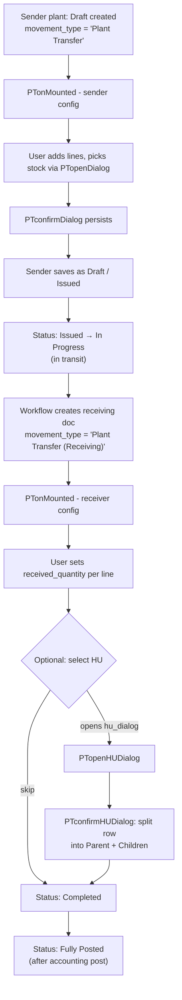

# Plant Transfer — HU Integration Guide

> **Audience:** mobile engineers who have already implemented GD ([Goods Delivery/GD_HU_AND_AUTO_ALLOCATION_GUIDE.md](../../Goods%20Delivery/GD_HU_AND_AUTO_ALLOCATION_GUIDE.md)), MSI ([Misc Issue/MSI_HU_GUIDE.md](../Misc%20Issue/MSI_HU_GUIDE.md)), and LOT ([Location Transfer/LOT_HU_GUIDE.md](../Location%20Transfer/LOT_HU_GUIDE.md)). PT is the most complex of the four because it is a **two-sided workflow**: a sender plant issues stock, then a receiver plant accepts it into Handling Units. The two sides share a form but use entirely different dialogs.
>
> **Source files covered (full code in Part 9):**
> 1. `PTonMounted.js` — initialization (sender/receiver, by status + page state)
> 2. `PTopenDialog.js` — sender-side stock picker
> 3. `PTconfirmDialog.js` — sender-side Confirm
> 4. `PTopenHUDialog.js` — receiver-side HU picker
> 5. `PTconfirmHUDialog.js` — receiver-side Confirm (row-splitting)
> 6. `PTonChangeItem.js` — sender row category filter

---

## Table of Contents

1. [Orientation](#part-1--orientation)
2. [Lifecycle and Movement Types](#part-2--lifecycle-and-movement-types)
3. [What's the Same as LOT (Sender Side)](#part-3--whats-the-same-as-lot-sender-side)
4. [What's Different from LOT (Sender Side)](#part-4--whats-different-from-lot-sender-side)
5. [Receiver Side (the PT-only mechanic)](#part-5--receiver-side-the-pt-only-mechanic)
6. [PTonMounted — Page Initialization](#part-6--ptonmounted--page-initialization)
7. [Mobile Cheat Sheet](#part-7--mobile-cheat-sheet)
8. [Edge Cases](#part-8--edge-cases)
9. [Full Source Code](#part-9--full-source-code)

---

## Part 1 — Orientation

Plant Transfer (PT) moves inventory between **two different plants** (within the same organization). It is fundamentally different from LOT — LOT is one document on one plant; PT involves two plants with a handoff in between.

Conceptually, one PT document has **two faces**:

- **Sender face** (`movement_type: "Plant Transfer"`) — the source plant issues stock. Looks and feels like LOT: pick stock from loose + HU, NO_SPLIT, no-mixed-item rule, etc.
- **Receiver face** (`movement_type: "Plant Transfer (Receiving)"`) — the destination plant accepts stock. The user sets `received_quantity` per line, then optionally assigns received qty to one or more destination HUs via a *separate* dialog system that can SPLIT a single line into Parent + multiple Child rows.

The form is the same document; `movement_type` determines which face is rendered. `PTonMounted.js` is responsible for showing/hiding the right fields and buttons based on `movement_type + stock_movement_status + page_status`.

### The six files

| File | Side | Role |
|---|---|---|
| [PTonMounted.js](PTonMounted.js) | Both | On-mount initialization. Reads `page_status` (Add / Edit / View / Clone), `movement_type`, `stock_movement_status`, and configures fields + buttons accordingly. Loads movement reasons, accounting integration type, default storage location/bin, batch generation policy. |
| [PTopenDialog.js](PTopenDialog.js) | Sender | Stock picker for `sm_quantity`. Loads loose balance + HUs, applies NO_SPLIT + no-mixed-item + 5000-cap bypass + cross-GD reservation exclusion. **Same shape as LOTopenDialog.js.** |
| [PTconfirmDialog.js](PTconfirmDialog.js) | Sender | On Confirm: validate, persist `temp_qty_data` + `temp_hu_data` + `stock_summary`, ALSO write a flat `balance_index` array on the form. |
| [PTopenHUDialog.js](PTopenHUDialog.js) | Receiver | Receiver-only HU picker. Opens a different dialog (`hu_dialog`), fetches HUs in the **loading bay** of the receiving plant, lets user assign `store_in_quantity` per HU. |
| [PTconfirmHUDialog.js](PTconfirmHUDialog.js) | Receiver | On Confirm of `hu_dialog`: if user picked multiple HUs or there's remaining qty without HU → **SPLIT the stock_movement row** into a Parent (summary) + N Children (one per HU + one for remaining). |
| [PTonChangeItem.js](PTonChangeItem.js) | Sender | When item is selected on a sender row: filter category dropdown to only `Unrestricted` and `Blocked` (no Reserved / QI / In Transit on sender side). Differs from LOT which allows all five. |

### End-to-end flow



---

## Part 2 — Lifecycle and Movement Types

### Movement types

The form's `movement_type` field has two PT-relevant values:

| `movement_type` | When | Who | Form face |
|---|---|---|---|
| `"Plant Transfer"` | Sender's view of the document | Sender plant user | Stock pick fields visible (sender face) |
| `"Plant Transfer (Receiving)"` | Receiver's view of the document | Receiver plant user | Receive fields visible (receiver face) |

`PTonMounted.js` `CONFIG.hideFields` maps these two values to different field-hide lists. Examples from [PTonMounted.js line 50-73](PTonMounted.js#L50-L73):

- **Plant Transfer** hides: `received_quantity`, `received_quantity_uom`, `category`, `to_recv_qty`, `batch_id`, `batch_no`, `location_id`, `storage_location_id`, `view_hu`, `select_hu`, `parent_id`.
- **Plant Transfer (Receiving)** hides: `transfer_stock`, `total_quantity`, `quantity_uom`, `delivery_method`, `receiving_operation_faci`, `stock_summary`, `item_remark`, `item_remark_2`, `item_remark_3`.

### Status lifecycle

| `stock_movement_status` | Meaning | Side that acts |
|---|---|---|
| `Draft` | Sender just created, can edit freely | Sender |
| `Issued` | Sender finalized, stock allocated, in-transit ETA established | Sender (read-only after) |
| `In Progress` | In transit between plants | Workflow / read-only on UI |
| `Created` | Receiving doc spawned, receiver can edit `received_quantity` | Receiver |
| `Completed` | Receiver confirmed; stock landed in destination plant | Both (read-only) |
| `Fully Posted` | Accounting integration has posted the journal entry | Both (read-only) |
| `Cancelled` | Document terminated | n/a |

Each status maps to a different button set in `CONFIG.buttonConfig` ([PTonMounted.js line 75-83](PTonMounted.js#L75-L83)):

| Status | Visible buttons |
|---|---|
| `Add` or `Draft` | `button_save_as_draft`, `button_issued_ift` |
| `Issued` | `button_inprogress_ift` |
| `Created` (Receiving only) | `button_complete_receive` |
| `Completed` or `Fully Posted` | `button_post` (hidden if no accounting integration) |

### Page state

`PTonMounted` also reads `this.isAdd / this.isEdit / this.isView / this.isCopy` to compute a string `pageStatus` of `Add / Edit / View / Clone`. Field disablement depends on the cross-product of `pageStatus × stock_movement_status × movement_type`. The full matrix lives in `editDisabledField()`, `displayManufacturingAndExpiredDate()`, and the Edit/View branches of the main IIFE.

---

## Part 3 — What's the Same as LOT (Sender Side)

The sender side of PT is structurally a clone of LOT, with two small additions covered in Part 4. Everything below points back to the LOT guide:

| Concept | LOT reference |
|---|---|
| `stock_movement` form key, `sm_quantity` field, `item_selection`, `quantity_uom`, `issuing_operation_faci`, `stock_summary`, `error_message` | LOT guide Δ5 |
| Loose tab loading (with HU-qty deduction + GD-reservation subtraction) | LOT guide Part 4, step 5 |
| HU tab loading: 5000-cap bypass via `handling_unit_atu7sreg_sub`, then scoped parent fetch | LOT guide Part 4, step 6 |
| **NO_SPLIT** behavior: `hu_select` column visible, header checkbox is the picker, item-row `sm_quantity` disabled | LOT guide Δ1 |
| **No-mixed-item HU rule**: skip HU if any active item is foreign material | LOT guide Δ2 |
| Per-row disable: `sm_quantity` disabled on every row, `hu_select` disabled on item rows | LOT guide Δ1 |
| Restore both `sm_quantity` AND `hu_select` from `temp_hu_data` on reopen | LOT guide Δ3 |
| Category dimension on loose rows; HU items hardcoded to `Unrestricted` | LOT guide Δ2 (via MSI Δ2) |
| UOM dual-universe + dialog UOM back-conversion on Confirm | GD guide Part 6 |
| Cross-row serial duplicate detection on Confirm | LOT guide Δ4 (via MSI Δ4) |

In short: **if you have LOT working on mobile, you can copy 90% of it for the sender side of PT.** The remaining 10% is in Part 4.

---

## Part 4 — What's Different from LOT (Sender Side)

### Δ1 — Sender-side category restriction: only Unrestricted + Blocked

LOT's category dropdown allows all five (Unrestricted / Reserved / Quality Inspection / Blocked / In Transit). PT's sender restricts it to **just two**.

From [PTonChangeItem.js line 1](PTonChangeItem.js#L1):

```js
const ALLOWED_CATEGORIES = ["Unrestricted", "Blocked"];
```

When the user picks an item on a sender row, `handleInvCategory` ([PTonChangeItem.js line 3-22](PTonChangeItem.js#L3-L22)) defaults `category` to `Unrestricted` and sets the dropdown options to only those two. Reserved / QI / In Transit stock cannot be transferred between plants via the sender flow.

### Δ2 — `balance_index` form-level array

LOT/MSI persist `temp_qty_data` (per row, JSON). PT does that AND also writes a **flat array `balance_index`** at the form level. Every row's loose + HU entries are flattened into one list keyed by `row_index`. The save workflow consumes this.

[PTconfirmDialog.js line 192-237](PTconfirmDialog.js#L192-L237):

```js
const currentBalanceIndex = this.getValues().balance_index || [];

// Remove entries for the current rowIndex (we'll re-add them below)
let updatedBalanceIndex = currentBalanceIndex.filter(
  (item) => String(item.row_index) !== String(rowIndex),
);

// Push loose entries (cleaned: dialog_xxx_date → xxx_date)
rowsToUpdate.forEach((newRow) => {
  const newEntry = { ...newRow, row_index: rowIndex };
  delete newEntry.id;
  /* date field renames */
  updatedBalanceIndex.push(newEntry);
});

// Push HU entries (as balance-shape rows, category: "Unrestricted")
huAsBalanceRowsBase.forEach((huRow) => {
  updatedBalanceIndex.push({ ...huRow, row_index: rowIndex });
});
```

Then ([line 448-478](PTconfirmDialog.js#L448-L478)) numeric fields are converted with `.toFixed(3)` (strings, not numbers — important for the workflow), `is_deleted` is coerced to 1/0, and `balance_index` is written with a **clear-then-set pattern with a 50ms delay** to force the form to re-render:

```js
this.setData({ balance_index: [] });
await new Promise((resolve) => setTimeout(resolve, 50));
this.setData({ balance_index: convertedBalanceIndex });
```

**Mobile implementation note:** maintain `balance_index` as a derived view over `stock_movement[].temp_qty_data`. Re-derive whenever any row's Confirm fires. Numeric fields as strings (3-decimal) so the save workflow gets the shape it expects.

### Δ3 — Serial dup check runs on `balance_index`, not on persisted `temp_qty_data`

In MSI/LOT, the cross-row serial dup check scans every OTHER row's `temp_qty_data` plus the current row's pending entries. In PT, the check runs on the freshly-built `updatedBalanceIndex` ([PTconfirmDialog.js line 240-281](PTconfirmDialog.js#L240-L281)) — which already includes every other row's prior entries (since `balance_index` is the source of truth) plus the current row's new entries. Same effect, but the data source is different. Honor this when porting to mobile: if you maintain `balance_index` correctly, the dup check is trivial.

### Δ4 — Stale "LOT" copy-paste leftovers

[PTopenDialog.js line 451-452](PTopenDialog.js#L451-L452) has comments saying "LOT enforces NO_SPLIT" and [line 788](PTopenDialog.js#L788) has `console.error("Error in LOT inventory dialog:", error);`. These are copy-paste leftovers from the LOT file — PT actually does enforce NO_SPLIT the same way, but the strings are misleading. Cosmetic; flag if you copy the file.

### Δ5 — No Optimized variant currently in use

PT has both `PTopenDialog.js` (in use) and `PTopenDialogOptimized.js` (created in a prior session, not yet adopted). This guide documents the in-use file, same as LOT.

---

## Part 5 — Receiver Side (the PT-only mechanic)

This is the half of PT that has no analog in any other module. It exists because crossing plant boundaries means the receiver has to decide how to physically store the incoming stock — possibly across multiple destination HUs.

### Triggering

After the sender issues the doc, a workflow creates the receiving record. Receiver opens it with `movement_type === "Plant Transfer (Receiving)"` and `stock_movement_status === "Created"`. `PTonMounted` configures the receiving face:

- Hides sender fields (transfer_stock, total_quantity, quantity_uom, delivery_method, etc.).
- Filters category to **Unrestricted / Quality Inspection / Blocked** ([PTonMounted.js line 197-218](PTonMounted.js#L197-L218)) — note this differs from sender's Unrestricted+Blocked (receiver gets QI too).
- Sets default storage_location and bin from the receiving plant ([PTonMounted.js line 351-413](PTonMounted.js#L351-L413)).
- Reads `plant_transfer_setup.generate_new_batch` to decide which batch column is shown ([PTonMounted.js line 415-450](PTonMounted.js#L415-L450)):
  - `generate_new_batch === true` → show `batch_no` (auto-generated), hide `batch_id`.
  - else → show `batch_id` (source's batch reused), hide `batch_no`.
- Shows `view_hu`, hides `select_hu` (the platform-side "Select HU" button is rendered separately via a row-level action that calls `PTopenHUDialog.js`).
- Disables `received_quantity` field (set via column editor).

### The receive flow

1. Receiver enters `received_quantity` per line.
2. Receiver clicks a row-level "Select HU" button → calls **`PTopenHUDialog.js`**.

### PTopenHUDialog walkthrough

[PTopenHUDialog.js](PTopenHUDialog.js):

1. Reads `received_quantity` from the row. If <= 0 → `$message.error` + abort.
2. **Find the loading-bay bin** ([line 27-44](PTopenHUDialog.js#L27-L44)):
   ```js
   db.collection("storage_location")
     .where({
       plant_id: data.plant_id,
       storage_status: 1,
       location_type: "Loading Bay",
       is_default: 1,
     })
     .get();
   ```
   Then read the default bin off its `table_bin_location` sub-array.
3. **If no loading bay**: open `hu_dialog`, show only the user's previously-created HUs from `temp_hu_data` (if any). The user can create new HUs from scratch.
4. **If loading bay exists**: fetch all HUs at that location ([line 69-76](PTopenHUDialog.js#L69-L76)):
   ```js
   db.collection("handling_unit")
     .where({ plant_id, organization_id, location_id: loadingBayLocationId })
     .get();
   ```
   Then merge with `tempHUdata`: existing HUs (with `handling_unit_id`) keep their stored `store_in_quantity`; new user-created HUs (no `handling_unit_id`) are appended at the end.
5. Push merged list to `hu_dialog.table_hu` + carry `item_id`, `item_name`, `received_qty`, `storage_location_id`, `location_id`, `rowIndex` for the confirm step.

User then edits `store_in_quantity` per HU row in the dialog. Sum can be less than `received_quantity` (the remainder becomes a "no HU" line on Confirm).

### PTconfirmHUDialog walkthrough — the row-split mechanic

This is where PT diverges fundamentally from MSI/LOT. **A single `stock_movement` row can become a Parent + N Children.** Each child represents either one HU's worth of received qty, or the remaining qty with no HU.

[PTconfirmHUDialog.js](PTconfirmHUDialog.js):

1. **Read state** ([line 75-81](PTconfirmHUDialog.js#L75-L81)): `tableHU` from `hu_dialog`, `receivedQty`, `rowIndex`, `storageLocationId`, `locationId`.

2. **Validation**:
   - Every confirmed HU must have an `hu_material_id` ([line 124-130](PTconfirmHUDialog.js#L124-L130)).
   - `totalStoreInQty` cannot exceed `receivedQty` ([line 133-138](PTconfirmHUDialog.js#L133-L138)).

3. **Compute split shape**:
   - `confirmedHUs = tableHU.filter(hu.store_in_quantity > 0)`.
   - `remainingQty = receivedQty - totalStoreInQty`.
   - `needsSplit = confirmedHUs.length > 1 || remainingQty > 0`.
   - If `remainingQty > 0 && totalStoreInQty > 0` → `$confirm` dialog asking user to acknowledge a "no HU" line will be created ([line 149-162](PTconfirmHUDialog.js#L149-L162)).

4. **No split** (`!needsSplit`, [line 372-385](PTconfirmHUDialog.js#L372-L385)) — exactly one HU consuming all of receivedQty:
   - Just write `temp_hu_data` + `view_hu` on the row.
   - Close dialog.

5. **Split path** ([line 165-371](PTconfirmHUDialog.js#L165-L371)):
   - Two sub-cases: current row is already a `parent_or_child === "Child"`, or it's a regular row.
   - **Child path**: don't create a new parent. Add sibling children for each HU + one for remaining qty. Find existing children of the same parent_index, continue numbering from there.
   - **Regular path**: rewrite current row as **Parent** (summary line with receivedQty, blank location). Add N children, one per HU, with sub-numbered `line_index` like `"3 - 1"`, `"3 - 2"`. Add a final child for remaining qty (no HU).

6. **`buildSmRow` helper** ([line 1-71](PTconfirmHUDialog.js#L1-L71)) — builds a complete row with every field explicitly assigned (no spread). This is to **prevent shared reactive references** between rows in the low-code platform. Critical for the split: if two children share an object reference, editing one corrupts the other.

7. **Field state per row** ([line 337-360](PTconfirmHUDialog.js#L337-L360)):
   - **Parent** (`is_split: "Yes" && parent_or_child: "Parent"`): disable `received_quantity`, `storage_location_id`, `location_id`, `select_serial_number`, `category`, `button_hu`. Parent is read-only / summary.
   - **Child** (`parent_or_child: "Child"`): disable `batch_id`, `manufacturing_date`, `expired_date`. Children inherit batch from parent's source; user only edits HU/location.

8. **Persist** — `setData({ stock_movement: latestTableSM })`, close dialog, success toast with HU count and remaining-qty note.

### Row shape additions (receiver only)

| Field | Meaning |
|---|---|
| `line_index` | Display ordering. Parent uses integer (e.g. `3`); children use string like `"3 - 1"`, `"3 - 2"`. |
| `is_split` | `"Yes"` on a parent, `"No"` on a non-split row or a child. |
| `parent_or_child` | `"Parent"` or `"Child"` or undefined (regular non-split row). |
| `parent_index` | On a child: the rowIndex of its parent. Used to group siblings during further splits. |
| `view_hu` | Formatted HU label for display, e.g. `HU-001: 5 qty\n[HU Material: MAT-A]`. Built by `formatViewHU` in `PTconfirmHUDialog.js`. |
| `temp_hu_data` | JSON string of one HU object (for child rows) or empty `"[]"` (for parent / no-HU child). Different shape from sender's `temp_hu_data`. |

> **Mobile callout:** the parent row is **purely visual** — no stock is allocated to it. The actual quantities live on the children. When you render the stock_movement list on mobile, group children under their parent (use `parent_index`) and show the parent as an expandable summary.

### Auto-generated HUs

A user can ADD a new HU directly inside `hu_dialog` (one without a `handling_unit_id`). On Confirm, those user-created HUs flow through `temp_hu_data` and downstream save logic will *create* the `handling_unit` record server-side. The sender's HU is consumed; a new receiver-side HU is born. This is intentional — when you cross plant boundaries, the physical HU also "crosses" by being recreated at the destination.

---

## Part 6 — PTonMounted — Page Initialization

The main mount IIFE ([line 474-608](PTonMounted.js#L474-L608)) branches on `pageStatus`:

### Add (new doc)

1. Set `organization_id`, `issued_by` (from `nickname`), `issue_date`, `movement_type: "Plant Transfer"`.
2. Show `draft_status` panel.
3. `configureFields("Plant Transfer")` — show sender fields, hide receiver fields.
4. `configureButtons` — show Draft buttons.
5. `setPlant` — auto-set `issuing_operation_faci` if user's dept differs from organization.
6. Hide serial number records tab.
7. Load movement reason dropdown from `blade_dict` parented by the "Plant Transfer" key.
8. Check accounting integration type — hide post buttons if "No Accounting Integration".

### Edit (existing doc)

Branches on `stock_movement_status`:
- **`Created` + Receiving**: filter category options, configure manufacturing/expired date columns, set default storage location, handle bin location, set batch column visibility (`isGenerateBatch`).
- **`Completed` / `Fully Posted`**: `editDisabledField` disables almost every field; show batch dates for receiver lines.
- **`Issued`**: disable `issuing_operation_faci`, `issue_date`, `movement_reason`, `stock_movement` (read-only after issue).
- **`Draft`**: same as Add for `setPlant`.

Always at the end: `showStatusHTML`, `displayDeliveryField`, hide serial-number-records tab, accounting check.

### View

Similar to Edit but read-only — no field enables, just configure visibility.

### Helpers worth knowing

| Helper | Purpose |
|---|---|
| `showStatusHTML(status)` | Maps status string to status-panel id (draft_status, issued_status, etc.) and displays it. |
| `initMovementReason()` | Loads movement reasons from `blade_dict` filtered by parent dict_key "Plant Transfer". |
| `configureFields(movementType)` | Display all base fields, hide form-level extras, then apply `hideFields[movementType]`. |
| `configureButtons(pageStatus, stockMovementStatus, movementType)` | Hide all buttons, then show only the relevant ones for the status. |
| `checkAccIntegrationType(organizationId)` | Read `accounting_integration` row; if `acc_integration_type === "No Accounting Integration"` hide `button_post` and `comp_post_button`. |
| `displayDeliveryField()` | Show one of self_pickup / courier_service / company_truck / shipping_service / third_party_transporter based on `delivery_method`. |
| `filterPTReceivingCategory()` | Restrict receiver category dropdown to Unrestricted / QI / Blocked. |
| `displayManufacturingAndExpiredDate(status, pageStatus)` | Show/disable manufacturing + expired date columns based on batch presence. |
| `editDisabledField()` | Big bulk disable for Completed/Fully Posted status. |
| `hideSerialNumberRecordTab()` | DOM-level: hide the tab if `table_sn_records` is empty. |
| `setPlant(organizationId, pageStatus)` | Lock/unlock `issuing_operation_faci` based on user's dept. |
| `setStorageLocation(plantID)` | Find default Common storage location + default bin for receiving plant. |
| `handleBinLocation(defaultBin, defaultStorageLocation)` | Apply defaults to `stock_movement.storage_location_id` and `location_id`. |
| `isGenerateBatch(organizationId)` | Read `plant_transfer_setup.generate_new_batch` to pick batch column visibility. |
| `hideBatchAdd()` | DOM-level: hide row-action buttons via CSS injection. |

There's also a trailing `setTimeout` block ([line 610-641](PTonMounted.js#L610-L641)) that polls for the stock_movement_no dropdown component and configures it once available. Sets default value and adds "Manual Input" if `canManualInput`.

---

## Part 7 — Mobile Cheat Sheet

### Sender side (Plant Transfer)

- [ ] Reuse your LOT sender-side implementation almost verbatim.
- [ ] Category dropdown on sender rows: only `Unrestricted` and `Blocked` (NOT 5 options like LOT).
- [ ] Maintain a form-level `balance_index` array as a derived view over all rows' `temp_qty_data`. Update on every Confirm.
- [ ] Numeric fields in `balance_index` must be 3-decimal strings (`.toFixed(3)`), not numbers — the save workflow expects this shape.
- [ ] Coerce `is_deleted` to literal `0` or `1` (number), not boolean.
- [ ] Cross-row serial dup check reads from `balance_index` (post-merge), not from per-row `temp_qty_data`.

### Receiver side (Plant Transfer (Receiving))

- [ ] Receiver-side category dropdown: `Unrestricted`, `Quality Inspection`, `Blocked` (three values, NOT including Reserved or In Transit).
- [ ] Read `plant_transfer_setup.generate_new_batch` once per session. If true → show `batch_no` column; else → show `batch_id` column.
- [ ] Look up the receiving plant's default Common storage_location + default bin, prefill `storage_location_id` + `location_id` on every receiving row.
- [ ] "Select HU" button on a receiving row opens a separate `hu_dialog` populated from HUs in the **loading bay** (`storage_location.location_type = "Loading Bay" && is_default = 1`).
- [ ] On hu_dialog Confirm: if `confirmedHUs.length > 1 || remainingQty > 0`, **SPLIT the row into Parent + Children**.
- [ ] Parent row: `is_split: "Yes"`, `parent_or_child: "Parent"`, all received_quantity/locations/category disabled.
- [ ] Child rows: `parent_or_child: "Child"`, `parent_index = original rowIndex`, `line_index = "${parentIndex+1} - ${childNum}"`. `batch_id` / `manufacturing_date` / `expired_date` disabled.
- [ ] When the user touches a Child row's HU button later (re-split scenario), don't create a new parent — find siblings under the same `parent_index` and add more.
- [ ] Build rows with every field explicitly assigned (no `{...spread}`) to avoid shared reactive references that corrupt sibling children.
- [ ] User-created HUs (no `handling_unit_id`) are allowed inside `hu_dialog`. Save workflow creates the DB record server-side.

### Both sides

- [ ] `PTonMounted` configures the form on every mount — port the matrix of `pageStatus × stock_movement_status × movement_type` carefully.
- [ ] Check `accounting_integration.acc_integration_type`. If `"No Accounting Integration"`, hide post buttons.
- [ ] Movement reasons come from `blade_dict` with parent = the row whose `dict_key === "Plant Transfer"`.
- [ ] `delivery_method` selection drives visibility of one of 5 sub-blocks (self_pickup / courier_service / company_truck / shipping_service / third_party_transporter).
- [ ] All status-panel HTML elements are id-driven: `draft_status`, `issued_status`, `processing_status`, `created_status`, `completed_status`, `fullyposted_status`, `cancel_status`.

---

## Part 8 — Edge Cases

- **Re-split a child row.** If the receiver picks an HU on a row that's already a child, `PTconfirmHUDialog` adds *sibling* children under the same parent. Don't accidentally create a nested parent. The check is at [PTconfirmHUDialog.js line 168](PTconfirmHUDialog.js#L168-L253) — `currentItem.parent_or_child === "Child"` path.

- **Sub-numbered `line_index`.** A child's `line_index` is a string like `"3 - 1"`, not a number. Don't try to parse it as int for ordering — use `parent_index` for grouping and `line_index` only for display.

- **Parent has receivedQty but no HU.** A regular row that's split keeps its receivedQty on the Parent (visual), but `temp_hu_data` on Parent is `"[]"` and locations are blank. The Parent's qty is the SUM of children's quantities. Treat Parent as a derived summary; never persist stock to it.

- **No Loading Bay**. If the receiving plant has no `storage_location` of type `"Loading Bay" + is_default=1`, the HU dialog opens with only user-created HUs (the DB query is skipped). Document this so users know they can still use the receiver flow.

- **`balance_index` clear+set with 50ms delay.** [PTconfirmDialog.js line 476-478](PTconfirmDialog.js#L476-L478) — the desktop uses this pattern to force the platform to re-render. Mobile probably doesn't need this if it doesn't have the same reactive quirk; just `setState` once.

- **`hu_material_id` on receiver HUs.** Every confirmed HU on the receiver side must carry an `hu_material_id` ([PTconfirmHUDialog.js line 124-130](PTconfirmHUDialog.js#L124-L130)). The HU's *containing* material can differ from the item being received — e.g. a wooden pallet HU contains widgets. Validate this at row level.

- **`generate_new_batch` semantics**. If on, every receiving line generates a NEW batch number at the destination (not reusing the source's batch_id). Useful when destination warehouse has its own batch-traceability scheme. Affects column visibility on the receiving form.

- **`displayManufacturingAndExpiredDate` row-by-row.** When status is `Created + Edit`, manufacturing/expired date are editable only on rows whose `batch_no` is set and not "-". Each row gets its own enable/disable call. Replicate this row-by-row check on mobile.

- **Copy-paste "LOT" leftovers in PTopenDialog.js.** Comments and `console.error` references still say "LOT" — cosmetic, no behaviour impact, easy to fix if you mirror the file.

- **Two HU dialog systems coexist.** The sender uses the standard `sm_item_balance` drawer (same as MSI/LOT). The receiver uses an entirely separate `hu_dialog`. Don't conflate them in your mobile navigation.

- **`uom_options` is preserved per row** so reopen restores the alt-UOM dropdown ([PTonChangeItem.js line 33-40](PTonChangeItem.js#L33-L40), [PTconfirmHUDialog.js line 60](PTconfirmHUDialog.js#L60)). Cache UOM options on the row state, don't re-fetch each render.

- **Item clear cascade.** [PTonChangeItem.js line 83-106](PTonChangeItem.js#L83-L106) — clearing an item resets quantity / locations / batch / category / stock_summary / temp_qty_data / temp_hu_data / item_name / item_desc. Mirror this so stale state from a previous item doesn't leak.

- **Sender vs Receiver category overlap.** Sender allows `{Unrestricted, Blocked}`; Receiver allows `{Unrestricted, Quality Inspection, Blocked}`. The intersection is `{Unrestricted, Blocked}` — that's why Reserved and In Transit can never appear on a PT document end-to-end.

---

## Part 9 — Full Source Code

### File 1 — `Stock Movement/Plant Transfer/PTonMounted.js`

```js
const showStatusHTML = (status) => {
  const statusMap = {
    Draft: "draft_status",
    Issued: "issued_status",
    "In Progress": "processing_status",
    Created: "created_status",
    Completed: "completed_status",
    "Fully Posted": "fullyposted_status",
    Cancelled: "cancel_status",
  };

  if (statusMap[status]) {
    this.display([statusMap[status]]);
  }
};

const CONFIG = {
  fields: {
    all: [
      "stock_movement.item_selection",
      "stock_movement.transfer_stock",
      "stock_movement.total_quantity",
      "stock_movement.to_recv_qty",
      "stock_movement.received_quantity",
      "stock_movement.received_quantity_uom",
      "stock_movement.quantity_uom",
      "stock_movement.category",
      "stock_movement.stock_summary",
      "movement_reason",
      "delivery_method",
      "receiving_operation_faci",
    ],
    buttons: [
      "button_post",
      "comp_post_button",
      "button_inprogress_ift",
      "button_complete_receive",
      "button_save_as_draft",
      "button_issued_ift",
    ],
    hide: [
      "stock_movement.view_stock",
      "stock_movement.edit_stock",
      "stock_movement.unit_price",
      "stock_movement.amount",
      "is_production_order",
    ],
  },
  hideFields: {
    "Plant Transfer": [
      "stock_movement.received_quantity",
      "stock_movement.received_quantity_uom",
      "stock_movement.category",
      "stock_movement.to_recv_qty",
      "stock_movement.batch_id",
      "stock_movement.batch_no",
      "stock_movement.location_id",
      "stock_movement.storage_location_id",
      "stock_movement.view_hu",
      "stock_movement.select_hu",
      "parent_id",
    ],
    "Plant Transfer (Receiving)": [
      "stock_movement.transfer_stock",
      "stock_movement.total_quantity",
      "stock_movement.quantity_uom",
      "delivery_method",
      "receiving_operation_faci",
      "stock_movement.stock_summary",
      "stock_movement.item_remark",
      "stock_movement.item_remark_2",
      "stock_movement.item_remark_3",
    ],
  },
  buttonConfig: {
    Add: ["button_save_as_draft", "button_issued_ift"],
    Draft: ["button_save_as_draft", "button_issued_ift"],
    Issued: ["button_inprogress_ift"],
    Created: {
      "Plant Transfer (Receiving)": ["button_complete_receive"],
    },
    Completed: ["button_post"],
  },
};

const initMovementReason = async () => {
  const resType = await db
    .collection("blade_dict")
    .where({ dict_key: "Plant Transfer" })
    .get();

  const movementTypeId = resType.data[0]?.id;

  if (movementTypeId) {
    const resReason = await db
      .collection("blade_dict")
      .where({ parent_id: movementTypeId })
      .get();
    this.setOptionData("movement_reason", resReason.data);
  }
};

const configureFields = (movementType) => {
  this.display(CONFIG.fields.all);
  this.hide(CONFIG.fields.hide);

  if (CONFIG.hideFields[movementType]) {
    this.hide(CONFIG.hideFields[movementType]);
  }

  if (movementType === "Plant Transfer (Receiving)") {
    this.disabled(["stock_movement.received_quantity_uom"], true);
    this.disabled(["stock_movement.category"], false);
  }
};

const configureButtons = (pageStatus, stockMovementStatus, movementType) => {
  this.hide(CONFIG.fields.buttons);

  if (pageStatus === "Add" || stockMovementStatus === "Draft") {
    this.display(CONFIG.buttonConfig.Draft);
  } else if (stockMovementStatus === "Issued") {
    this.display(CONFIG.buttonConfig.Issued);
  } else if (
    stockMovementStatus === "Created" &&
    movementType === "Plant Transfer (Receiving)"
  ) {
    this.display(CONFIG.buttonConfig.Created["Plant Transfer (Receiving)"]);
  } else if (
    stockMovementStatus === "Completed" ||
    stockMovementStatus === "Fully Posted"
  ) {
    this.display(CONFIG.buttonConfig.Completed);
  }
};

const checkAccIntegrationType = async (organizationId) => {
  if (organizationId) {
    const resAI = await db
      .collection("accounting_integration")
      .where({ organization_id: organizationId })
      .get();

    if (resAI && resAI.data.length > 0) {
      const aiData = resAI.data[0];

      this.setData({ acc_integration_type: aiData.acc_integration_type });
      if (aiData.acc_integration_type === "No Accounting Integration") {
        this.hide(["button_post", "comp_post_button"]);
      }
    }
  }
};

const displayDeliveryField = async () => {
  const deliveryMethodName = this.getValue("delivery_method");

  const fields = [
    "self_pickup",
    "courier_service",
    "company_truck",
    "shipping_service",
    "third_party_transporter",
  ];

  if (
    deliveryMethodName &&
    typeof deliveryMethodName === "string" &&
    deliveryMethodName.trim() !== "" &&
    deliveryMethodName !== "{}"
  ) {
    this.setData({ delivery_method_text: deliveryMethodName });

    const visibilityMap = {
      "Self Pickup": "self_pickup",
      "Courier Service": "courier_service",
      "Company Truck": "company_truck",
      "Shipping Service": "shipping_service",
      "3rd Party Transporter": "third_party_transporter",
    };

    const selectedField = visibilityMap[deliveryMethodName] || null;

    if (!selectedField) {
      this.hide(fields);
    } else {
      fields.forEach((field) => {
        field === selectedField ? this.display(field) : this.hide(field);
      });
    }
  } else {
    this.setData({ delivery_method_text: "" });
    this.hide(fields);
  }
};

const filterPTReceivingCategory = async () => {
  const data = this.getValues();
  const stockMovement = data.stock_movement;

  const categoryObjectResponse = await db
    .collection("blade_dict")
    .where({ code: "inventory_category" })
    .get();

  const allowedCategories = ["Unrestricted", "Quality Inspection", "Blocked"];

  const filteredCategories = categoryObjectResponse.data.filter((category) =>
    allowedCategories.includes(category.dict_key),
  );

  for (const [rowIndex, _sm] of stockMovement.entries()) {
    await this.setOptionData(
      [`stock_movement.${rowIndex}.category`],
      filteredCategories,
    );
  }
};

const displayManufacturingAndExpiredDate = async (status, pageStatus) => {
  const tableSM = this.getValue("stock_movement");

  if (pageStatus === "Edit" && status === "Created") {
    for (const [index, item] of tableSM.entries()) {
      if (item.batch_no && item.batch_no !== "-") {
        await this.display([
          "stock_movement.manufacturing_date",
          "stock_movement.expired_date",
        ]);
        await this.disabled(
          [
            `stock_movement.${index}.manufacturing_date`,
            `stock_movement.${index}.expired_date`,
          ],
          false,
        );
      } else {
        await this.disabled(
          [
            `stock_movement.${index}.manufacturing_date`,
            `stock_movement.${index}.expired_date`,
          ],
          true,
        );
        if (!item.batch_no)
          await this.disabled(`stock_movement.${index}.batch_no`, false);
      }
    }
  } else if (pageStatus === "View" || status === "Completed") {
    for (const [_index, item] of tableSM.entries()) {
      if (item.batch_no && item.batch_no !== "-") {
        await this.display([
          "stock_movement.manufacturing_date",
          "stock_movement.expired_date",
        ]);
      }
    }
  }
};

const editDisabledField = () => {
  this.disabled(
    [
      "issue_date",
      "stock_movement_no",
      "movement_type",
      "movement_reason",
      "issued_by",
      "issuing_operation_faci",
      "remarks",
      "remark",
      "remark2",
      "remark3",
      "delivery_method",
      "reference_documents",
      "receiving_operation_faci",
      "movement_id",

      "cp_driver_name",
      "cp_ic_no",
      "cp_driver_contact_no",
      "cp_vehicle_number",
      "cp_pickup_date",
      "cp_validity_collection",

      "cs_courier_company",
      "cs_shipping_date",
      "cs_tracking_number",
      "cs_est_arrival_date",
      "cs_freight_charges",

      "ct_driver_name",
      "ct_driver_contact_no",
      "ct_ic_no",
      "ct_vehicle_number",
      "ct_est_delivery_date",
      "ct_delivery_cost",

      "ss_shipping_company",
      "ss_shipping_date",
      "ss_freight_charges",
      "ss_shipping_method",
      "ss_est_arrival_date",
      "ss_tracking_number",

      "tpt_vehicle_number",
      "tpt_transport_name",
      "tpt_ic_no",
      "tpt_driver_contact_no",

      "stock_movement",
      "stock_movement.item_selection",
      "stock_movement.total_quantity",
      "stock_movement.category",
      "stock_movement.received_quantity",
      "stock_movement.received_quantity_uom",
    ],
    true,
  );
  hideBatchAdd();

  this.hide(["stock_movement.transfer_stock"]);
};

const hideSerialNumberRecordTab = () => {
  setTimeout(() => {
    const tableSerialNumber = this.getValue("table_sn_records");
    if (!tableSerialNumber || tableSerialNumber.length === 0) {
      const tab = document.querySelector(
        '.el-drawer[role="dialog"] .el-tabs__item#tab-serial_number_records',
      );
      if (tab) {
        tab.style.display = "none";
      }
    }
  }, 10);
};

const setPlant = (organizationId, pageStatus) => {
  const currentDept = this.getVarSystem("deptIds").split(",")[0];
  const isSameDept = currentDept === organizationId;

  this.disabled("issuing_operation_faci", !isSameDept);

  if (pageStatus === "Add" && !isSameDept) {
    this.setData({ issuing_operation_faci: currentDept });
  }
  return currentDept;
};

const setStorageLocation = async (plantID) => {
  try {
    if (plantID) {
      let defaultStorageLocationID = "";

      const resStorageLocation = await db
        .collection("storage_location")
        .where({
          plant_id: plantID,
          is_deleted: 0,
          is_default: 1,
          storage_status: 1,
          location_type: "Common",
        })
        .get();

      if (resStorageLocation.data && resStorageLocation.data.length > 0) {
        defaultStorageLocationID = resStorageLocation.data[0].id;
        this.setData({
          default_storage_location: defaultStorageLocationID,
        });
      }

      if (defaultStorageLocationID && defaultStorageLocationID !== "") {
        const resBinLocation = await db
          .collection("bin_location")
          .where({
            plant_id: plantID,
            storage_location_id: defaultStorageLocationID,
            is_deleted: 0,
            is_default: 1,
            bin_status: 1,
          })
          .get();

        if (resBinLocation.data && resBinLocation.data.length > 0) {
          this.setData({
            default_bin: resBinLocation.data[0].id,
          });
        }
      }
    }
  } catch (error) {
    console.error(error);
    this.$message.error(error.message || "An error occurred");
  }
};

const handleBinLocation = async (defaultBin, defaultStorageLocation) => {
  try {
    if (defaultBin && defaultStorageLocation) {
      this.setData({
        [`stock_movement.storage_location_id`]: defaultStorageLocation,
        [`stock_movement.location_id`]: defaultBin,
      });
    }
    this.disabled(`stock_movement.storage_location_id`, false);
    this.disabled(`stock_movement.location_id`, false);
  } catch (error) {
    console.error(error);
    this.$message.error(error.message || "An error occurred");
  }
};

const isGenerateBatch = async (organizationId) => {
  try {
    const resPlantTransferSetup = await db
      .collection("plant_transfer_setup")
      .where({
        organization_id: organizationId,
      })
      .get();

    if (
      !resPlantTransferSetup.data ||
      resPlantTransferSetup.data.length === 0
    ) {
      return;
    }

    const isGenerateBatch = resPlantTransferSetup.data[0].generate_new_batch;

    // view_hu always visible on receiving form so user can see source HU info per line
    this.display(["stock_movement.view_hu"]);
    // select_hu kept hidden for now (workflow auto-generates HU on Branch B); revisit if/when
    // we want the receiving user to override the auto-generated HU
    this.hide(["stock_movement.select_hu"]);

    if (isGenerateBatch) {
      this.display(["stock_movement.batch_no"]);
      this.hide(["stock_movement.batch_id"]);
    } else {
      this.display(["stock_movement.batch_id"]);
      this.hide(["stock_movement.batch_no"]);
    }
  } catch (error) {
    console.error(error);
    this.$message.error(error.message || "An error occurred");
  }
};

const hideBatchAdd = () => {
  setTimeout(() => {
    const editButtons = document.querySelectorAll(
      ".el-row .el-col.el-col-12.el-col-xs-24 .el-button.el-button--primary.el-button--default.is-link",
    );
    editButtons.forEach((button) => {
      button.style.display = "none";
    });

    const styleId = "pt-hide-row-actions";
    if (!document.getElementById(styleId)) {
      const style = document.createElement("style");
      style.id = styleId;
      style.textContent = `
        .fm-virtual-table__row-cell .scope-action { display: none !important; }
        .fm-virtual-table__row-cell .scope-index { display: flex !important; }
      `;
      document.head.appendChild(style);
    }
  }, 500);
};

(async () => {
  try {
    const data = this.getValues();
    let pageStatus = "";

    if (this.isAdd) pageStatus = "Add";
    else if (this.isEdit) pageStatus = "Edit";
    else if (this.isView) pageStatus = "View";
    else if (this.isCopy) pageStatus = "Clone";
    else throw new Error("Invalid page state");

    let organizationId = this.getVarGlobal("deptParentId");
    if (organizationId === "0") {
      organizationId = this.getVarSystem("deptIds").split(",")[0];
    }

    this.setData({ page_status: pageStatus });

    switch (pageStatus) {
      case "Add":
        const nickName = this.getVarGlobal("nickname");
        this.setData({
          organization_id: organizationId,
          issued_by: nickName,
          issue_date: new Date().toISOString().split("T")[0],
          movement_type: "Plant Transfer",
        });

        this.display(["draft_status"]);

        configureFields("Plant Transfer");
        configureButtons(pageStatus, null, "Plant Transfer");
        setPlant(organizationId, pageStatus);
        hideSerialNumberRecordTab();
        await initMovementReason();
        await checkAccIntegrationType(organizationId);
        break;

      case "Edit":
        const movementType = data.movement_type;

        this.disabled("movement_type", true);

        configureFields(movementType);
        configureButtons(pageStatus, data.stock_movement_status, movementType);

        if (
          data.stock_movement_status === "Created" &&
          movementType === "Plant Transfer (Receiving)"
        ) {
          this.disabled(
            ["issuing_operation_faci", "stock_movement.received_quantity"],
            true,
          );
          await filterPTReceivingCategory();
          await displayManufacturingAndExpiredDate(
            data.stock_movement_status,
            pageStatus,
          );
          await setStorageLocation(data.issuing_operation_faci);
          setTimeout(async () => {
            await handleBinLocation(
              this.getValue("default_bin"),
              this.getValue("default_storage_location"),
            );
            hideBatchAdd();
          }, 500);
          await isGenerateBatch(organizationId);
        }

        if (
          data.stock_movement_status === "Completed" ||
          data.stock_movement_status === "Fully Posted"
        ) {
          editDisabledField();
          if (movementType === "Plant Transfer (Receiving)") {
            await displayManufacturingAndExpiredDate(
              data.stock_movement_status,
              pageStatus,
            );
          }
        }

        if (data.stock_movement_status === "Issued") {
          this.disabled(
            [
              "issuing_operation_faci",
              "issue_date",
              "movement_reason",
              "stock_movement",
            ],
            true,
          );
        }

        if (data.stock_movement_status === "Draft") {
          setPlant(organizationId, pageStatus);
        }

        showStatusHTML(data.stock_movement_status);
        displayDeliveryField();
        hideSerialNumberRecordTab();
        await checkAccIntegrationType(organizationId);
        break;

      case "View":
        const viewMovementType = data.movement_type;

        configureFields(viewMovementType);
        configureButtons(
          pageStatus,
          data.stock_movement_status,
          viewMovementType,
        );
        this.hide(["stock_movement.transfer_stock"]);

        if (viewMovementType === "Plant Transfer (Receiving)") {
          await displayManufacturingAndExpiredDate(
            data.stock_movement_status,
            pageStatus,
          );
          await isGenerateBatch(organizationId);
        }

        showStatusHTML(data.stock_movement_status);
        displayDeliveryField();
        hideSerialNumberRecordTab();
        await checkAccIntegrationType(organizationId);
        break;
    }
  } catch (error) {
    console.error(error);
    this.$message.error(error.message || "An error occurred");
  }
})();

setTimeout(async () => {
  const maxRetries = 10;
  const interval = 500;
  for (let i = 0; i < maxRetries; i++) {
    const op = await this.onDropdownVisible("stock_movement_no_type", true);
    if (op != null) break;
    await new Promise((resolve) => setTimeout(resolve, interval));
  }
  function getDefaultItem(arr) {
    return arr?.find((item) => item?.item?.is_default === 1);
  }
  var params = this.getComponent("stock_movement_no");
  const { options } = params;

  const optionsData = this.getOptionData("stock_movement_no_type") || [];
  const defaultData = getDefaultItem(optionsData);
  if (options?.canManualInput) {
    this.setOptionData("stock_movement_no_type", [
      { label: "Manual Input", value: -9999 },
      ...optionsData,
    ]);
    if (this.isAdd) {
      this.setData({
        stock_movement_no_type: defaultData ? defaultData.value : -9999,
      });
    }
  } else if (defaultData) {
    if (this.isAdd) {
      this.setData({ stock_movement_no_type: defaultData.value });
    }
  }
}, 200);
```

### File 2 — `Stock Movement/Plant Transfer/PTopenDialog.js`

```js
(async () => {
  this.showLoading("Loading inventory data...");
  try {
    const allData = this.getValues();
    const lineItemData = arguments[0]?.row;
    const rowIndex = arguments[0]?.rowIndex;
    const plant_id = allData.issuing_operation_faci;
    const materialId = lineItemData.item_selection;
    const tempQtyData = lineItemData.temp_qty_data;
    const tempHuData = lineItemData.temp_hu_data;
    const quantityUOM = lineItemData.quantity_uom;
    const organizationId = allData.organization_id;

    if (!materialId) return;

    // ============= HELPERS =============

    const fetchUomData = async (uomIds) => {
      if (!uomIds || uomIds.length === 0) return [];
      try {
        const resUOM = await Promise.all(
          uomIds.map((id) =>
            db.collection("unit_of_measurement").where({ id }).get(),
          ),
        );
        return resUOM.map((response) => response.data[0]).filter(Boolean);
      } catch (error) {
        console.error("Error fetching UOM data:", error);
        return [];
      }
    };

    const convertBaseToAlt = (baseQty, itemData, altUOM) => {
      if (
        !baseQty ||
        !Array.isArray(itemData.table_uom_conversion) ||
        itemData.table_uom_conversion.length === 0 ||
        !altUOM
      ) {
        return baseQty || 0;
      }
      const uomConversion = itemData.table_uom_conversion.find(
        (c) => c.alt_uom_id === altUOM,
      );
      if (!uomConversion || !uomConversion.base_qty) return baseQty;
      return Math.round((baseQty / uomConversion.base_qty) * 1000) / 1000;
    };

    const parseJSON = (str) => {
      if (
        !str ||
        str === "[]" ||
        (typeof str === "string" && str.trim() === "")
      )
        return [];
      try {
        const parsed = JSON.parse(str);
        return Array.isArray(parsed) ? parsed : [];
      } catch {
        return [];
      }
    };

    const filterZeroQuantityRecords = (data, itemData) => {
      return data.filter((record) => {
        if (itemData.serial_number_management === 1) {
          const hasValidSerial =
            record.serial_number && record.serial_number.trim() !== "";
          if (!hasValidSerial) return false;
          return (
            (record.block_qty && record.block_qty > 0) ||
            (record.reserved_qty && record.reserved_qty > 0) ||
            (record.unrestricted_qty && record.unrestricted_qty > 0) ||
            (record.qualityinsp_qty && record.qualityinsp_qty > 0) ||
            (record.intransit_qty && record.intransit_qty > 0) ||
            (record.balance_quantity && record.balance_quantity > 0)
          );
        }
        return (
          (record.block_qty && record.block_qty > 0) ||
          (record.reserved_qty && record.reserved_qty > 0) ||
          (record.unrestricted_qty && record.unrestricted_qty > 0) ||
          (record.qualityinsp_qty && record.qualityinsp_qty > 0) ||
          (record.intransit_qty && record.intransit_qty > 0) ||
          (record.balance_quantity && record.balance_quantity > 0)
        );
      });
    };

    const generateKey = (item, itemData) => {
      if (itemData.serial_number_management === 1) {
        if (itemData.item_batch_management === 1) {
          return `${item.location_id || "no_location"}-${
            item.serial_number || "no_serial"
          }-${item.batch_id || "no_batch"}`;
        }
        return `${item.location_id || "no_location"}-${
          item.serial_number || "no_serial"
        }`;
      }
      if (itemData.item_batch_management === 1) {
        return `${item.location_id || "no_location"}-${
          item.batch_id || "no_batch"
        }`;
      }
      return `${item.location_id || item.balance_id || "no_key"}`;
    };

    const mergeWithTempData = (freshDbData, tempDataArray, itemData) => {
      if (!tempDataArray || tempDataArray.length === 0) {
        return freshDbData;
      }

      const tempDataMap = new Map(
        tempDataArray.map((tempItem) => [
          generateKey(tempItem, itemData),
          tempItem,
        ]),
      );

      const mergedData = freshDbData.map((dbItem) => {
        const key = generateKey(dbItem, itemData);
        const tempItem = tempDataMap.get(key);

        if (tempItem) {
          return {
            ...dbItem,
            ...tempItem,
            id: dbItem.id,
            balance_id: dbItem.id,
            fm_key: tempItem.fm_key,
            category: tempItem.category,
            sm_quantity: tempItem.sm_quantity,
            remarks: tempItem.remarks || dbItem.remarks,
          };
        }

        return {
          ...dbItem,
          balance_id: dbItem.id,
        };
      });

      tempDataArray.forEach((tempItem) => {
        const key = generateKey(tempItem, itemData);
        const existsInDb = freshDbData.some(
          (dbItem) => generateKey(dbItem, itemData) === key,
        );

        if (!existsInDb) {
          mergedData.push({
            ...tempItem,
            balance_id: tempItem.balance_id || tempItem.id,
          });
        }
      });

      return mergedData;
    };

    const mapBalanceData = (itemBalanceData) => {
      return Array.isArray(itemBalanceData)
        ? itemBalanceData.map((item) => {
            const { id, ...itemWithoutId } = item;
            return {
              ...itemWithoutId,
              balance_id: id,
            };
          })
        : (() => {
            const { id, ...itemWithoutId } = itemBalanceData;
            return { ...itemWithoutId, balance_id: id };
          })();
    };

    // Sum HU-bound qty by location/batch for current material — used to subtract
    // from loose item_balance display so the same physical stock isn't pickable both ways
    const fetchHuQtyByLocation = async (
      matId,
      plantId,
      orgId,
      isBatchManaged,
    ) => {
      try {
        // Query sub-collection by material — bypasses 5000-row cap on handling_unit
        const subRes = await db
          .collection("handling_unit_atu7sreg_sub")
          .where({ material_id: matId, is_deleted: 0 })
          .get();

        const subRows = subRes.data || [];
        if (subRows.length === 0) return new Map();

        // Fetch the relevant parent HUs (scoped by plant/org, for location fallback)
        const candidateHuIds = [
          ...new Set(subRows.map((r) => r.handling_unit_id).filter(Boolean)),
        ];

        const huRes = await db
          .collection("handling_unit")
          .filter([
            {
              type: "branch",
              operator: "all",
              children: [
                { prop: "id", operator: "in", value: candidateHuIds },
                { prop: "plant_id", operator: "equal", value: plantId },
                {
                  prop: "organization_id",
                  operator: "equal",
                  value: orgId,
                },
                { prop: "is_deleted", operator: "equal", value: 0 },
              ],
            },
          ])
          .get();

        const huLocationMap = new Map();
        for (const hu of huRes.data || []) {
          huLocationMap.set(hu.id, hu.location_id);
        }

        const huQtyMap = new Map();
        for (const item of subRows) {
          // Skip sub-rows whose parent HU isn't in this plant/org (or deleted)
          if (!huLocationMap.has(item.handling_unit_id)) continue;

          const locationId =
            item.location_id || huLocationMap.get(item.handling_unit_id);
          const key = isBatchManaged
            ? `${locationId}-${item.batch_id || "no_batch"}`
            : `${locationId}`;
          const qty = parseFloat(item.quantity) || 0;
          huQtyMap.set(key, (huQtyMap.get(key) || 0) + qty);
        }
        return huQtyMap;
      } catch (error) {
        console.error("Error fetching HU quantities:", error);
        return new Map();
      }
    };

    // Fetch HUs for the material. "No mixed item HU" rule: only show HUs whose every
    // active item matches the current row's material (foreign-item HUs are skipped).
    const fetchHandlingUnits = async (
      plantId,
      orgId,
      matId,
      tempHuStr,
      itemData,
      altUOM,
      otherLinesHuAllocations,
      reservedHuIdSet,
    ) => {
      try {
        // Find HU IDs containing this material via the flat sub-collection.
        // Avoids the 5000-row default cap on `handling_unit` when many HUs exist.
        const subRes = await db
          .collection("handling_unit_atu7sreg_sub")
          .where({ material_id: matId, is_deleted: 0 })
          .get();

        const candidateHuIds = [
          ...new Set(
            (subRes.data || []).map((r) => r.handling_unit_id).filter(Boolean),
          ),
        ];

        if (candidateHuIds.length === 0) {
          return [];
        }

        // Fetch only the HUs that contain this material — scoped by plant/org
        const responseHU = await db
          .collection("handling_unit")
          .filter([
            {
              type: "branch",
              operator: "all",
              children: [
                { prop: "id", operator: "in", value: candidateHuIds },
                { prop: "plant_id", operator: "equal", value: plantId },
                {
                  prop: "organization_id",
                  operator: "equal",
                  value: orgId,
                },
                { prop: "is_deleted", operator: "equal", value: 0 },
              ],
            },
          ])
          .get();

        const allHUs = responseHU.data || [];
        const huTableData = [];

        for (const hu of allHUs) {
          // Full HU exclusion: skip any HU with an active reservation in on_reserved_gd
          if (reservedHuIdSet && reservedHuIdSet.has(hu.id)) continue;

          const allActiveItems = (hu.table_hu_items || []).filter(
            (item) => item.is_deleted !== 1,
          );
          if (allActiveItems.length === 0) continue;

          // No mixed-item HUs: skip if any active item is a different material
          const allMatch = allActiveItems.every(
            (item) => item.material_id === matId,
          );
          if (!allMatch) continue;

          // Header row placeholder — item_quantity updated after items are added
          const headerRow = {
            row_type: "header",
            handling_unit_id: hu.id,
            handling_no: hu.handling_no,
            material_id: "",
            material_name: "",
            storage_location_id: hu.storage_location_id,
            location_id: hu.location_id,
            batch_id: null,
            item_quantity: 0,
            sm_quantity: 0,
            remark: hu.remark || "",
            balance_id: "",
          };
          huTableData.push(headerRow);

          let headerItemTotal = 0;
          for (const huItem of allActiveItems) {
            const baseQty = parseFloat(huItem.quantity) || 0;
            let displayQty = convertBaseToAlt(baseQty, itemData, altUOM);

            // Deduct other stock_movement lines' HU allocations for same HU+material+batch
            const otherLineAlloc = otherLinesHuAllocations.find(
              (a) =>
                a.handling_unit_id === hu.id &&
                a.material_id === huItem.material_id &&
                (a.batch_id || "") === (huItem.batch_id || ""),
            );
            if (otherLineAlloc) {
              displayQty = Math.max(
                0,
                displayQty - (otherLineAlloc.sm_quantity || 0),
              );
            }

            if (displayQty <= 0) continue;

            headerItemTotal += displayQty;
            huTableData.push({
              row_type: "item",
              handling_unit_id: hu.id,
              handling_no: "",
              material_id: huItem.material_id,
              material_name: huItem.material_name,
              storage_location_id: hu.storage_location_id,
              location_id: huItem.location_id || hu.location_id,
              batch_id: huItem.batch_id || null,
              item_quantity: displayQty,
              item_quantity_base: baseQty,
              sm_quantity: 0,
              remark: "",
              balance_id: huItem.balance_id || "",
              expired_date: huItem.expired_date || null,
              manufacturing_date: huItem.manufacturing_date || null,
              create_time: huItem.create_time || hu.create_time,
            });
          }

          headerRow.item_quantity = Math.round(headerItemTotal * 1000) / 1000;
        }

        // Drop header rows whose items were all fully allocated by other lines
        const huIdsWithItems = new Set(
          huTableData
            .filter((r) => r.row_type === "item")
            .map((r) => r.handling_unit_id),
        );
        const filtered = huTableData.filter(
          (r) =>
            r.row_type === "item" || huIdsWithItems.has(r.handling_unit_id),
        );

        // Restore sm_quantity from existing temp_hu_data on re-open, and re-check
        // hu_select on the matching header rows so the UI reflects prior selection.
        const parsedTempHu = parseJSON(tempHuStr);
        const huIdsWithAllocation = new Set();
        for (const tempItem of parsedTempHu) {
          if (tempItem.row_type !== "item") continue;
          const match = filtered.find(
            (row) =>
              row.row_type === "item" &&
              row.handling_unit_id === tempItem.handling_unit_id &&
              row.material_id === tempItem.material_id &&
              (row.batch_id || "") === (tempItem.batch_id || ""),
          );
          if (match) {
            match.sm_quantity = tempItem.sm_quantity || 0;
            if (match.sm_quantity > 0) {
              huIdsWithAllocation.add(tempItem.handling_unit_id);
            }
          }
        }

        // LOT enforces NO_SPLIT: set hu_select = 1 on headers whose HU has any
        // restored allocation, so the checkbox state matches the item rows.
        if (huIdsWithAllocation.size > 0) {
          for (const row of filtered) {
            if (
              row.row_type === "header" &&
              huIdsWithAllocation.has(row.handling_unit_id)
            ) {
              row.hu_select = 1;
            }
          }
        }

        return filtered;
      } catch (error) {
        console.error("Error fetching handling units:", error);
        return [];
      }
    };

    // Drawer-scoped selectors so we don't collide with same-id tabs on the parent page
    const TAB_SCOPE = `.el-drawer[role="dialog"] .el-tabs__item`;

    const hideTab = (tabName) => {
      const tab = document.querySelector(`${TAB_SCOPE}#tab-${tabName}`);
      if (tab) tab.style.display = "none";
    };

    const showTab = (tabName) => {
      const tab = document.querySelector(`${TAB_SCOPE}#tab-${tabName}`);
      if (tab) {
        tab.style.display = "flex";
        tab.setAttribute("aria-disabled", "false");
        tab.classList.remove("is-disabled");
      }
    };

    const activateTab = (tabName) => {
      const tab = document.querySelector(`${TAB_SCOPE}#tab-${tabName}`);
      if (tab) tab.click();
    };

    // ============= MAIN =============

    // Hide category-from/to + serial column. hu_select stays visible — LOT enforces
    // NO_SPLIT (whole-HU pick) and the checkbox on header rows is the picker.
    this.hide([
      "sm_item_balance.table_item_balance.category_from",
      "sm_item_balance.table_item_balance.category_to",
      "sm_item_balance.table_item_balance.serial_number",
    ]);

    // Reset tables and clear category default
    this.setData({
      "sm_item_balance.table_item_balance": [],
      "sm_item_balance.table_hu": [],
      "sm_item_balance.table_item_balance.category": undefined,
    });

    let itemData;
    try {
      const itemResponse = await db
        .collection("Item")
        .where({ id: materialId })
        .get();
      itemData = itemResponse.data?.[0];
    } catch (error) {
      console.error("Error fetching item data:", error);
      return;
    }
    if (!itemData) return;

    const altUoms =
      itemData.table_uom_conversion?.map((data) => data.alt_uom_id) || [];
    const uomOptions = await fetchUomData(altUoms);

    this.setOptionData([`sm_item_balance.material_uom`], uomOptions);
    this.setData({
      sm_item_balance: {
        material_id: itemData.material_code,
        material_name: itemData.material_name,
        row_index: rowIndex,
        material_uom: quantityUOM,
      },
    });

    const isBatchManaged = itemData.item_batch_management === 1;
    const isSerial = itemData.serial_number_management === 1;

    // Active GD reservations for this material. Used to:
    //   (a) Hide whole HUs that have any item reserved (full HU exclusion).
    //   (b) Subtract loose-stock reservations (no handling_unit_id) from the
    //       item_balance display so LOT doesn't pick stock already committed to GD.
    let activeReservations = [];
    try {
      const reservationRes = await db
        .collection("on_reserved_gd")
        .where({
          plant_id: plant_id,
          organization_id: organizationId,
          material_id: materialId,
          is_deleted: 0,
        })
        .get();
      activeReservations = (reservationRes.data || []).filter(
        (r) => parseFloat(r.open_qty || 0) > 0 && r.status !== "Cancelled",
      );
    } catch (error) {
      console.error("Error fetching on_reserved_gd:", error);
    }

    const convertReservedToBase = (qty, item_uom) => {
      if (!item_uom || item_uom === itemData.based_uom) return qty;
      const conv = itemData.table_uom_conversion?.find(
        (c) => c.alt_uom_id === item_uom,
      );
      if (conv && conv.base_qty) return qty * conv.base_qty;
      return qty;
    };

    const reservedHuIds = new Set();
    const looseReservedMap = new Map();
    for (const r of activeReservations) {
      if (r.handling_unit_id) {
        reservedHuIds.add(r.handling_unit_id);
      } else {
        const locId = r.bin_location;
        if (!locId) continue;
        const key = isBatchManaged
          ? `${locId}-${r.batch_id || "no_batch"}`
          : `${locId}`;
        const qtyBase = convertReservedToBase(
          parseFloat(r.open_qty || 0),
          r.item_uom,
        );
        looseReservedMap.set(key, (looseReservedMap.get(key) || 0) + qtyBase);
      }
    }

    let looseRowCount = 0;

    // Filter out HU-bound records from temp_qty_data — those belong to table_hu.
    // Final filter drops rows with no transferable stock: only rows with
    // unrestricted_qty > 0 OR block_qty > 0 are kept (Reserved / QI / InTransit
    // categories aren't transferable via LOT).
    const processBalanceData = (itemBalanceData, itemDataLocal) => {
      const mappedData = mapBalanceData(itemBalanceData);
      let finalData = mappedData;

      if (tempQtyData) {
        try {
          const tempArr = JSON.parse(tempQtyData).filter(
            (it) => !it.handling_unit_id,
          );
          finalData = mergeWithTempData(mappedData, tempArr, itemDataLocal);
        } catch (error) {
          console.error("Error parsing temp_qty_data:", error);
        }
      }

      return filterZeroQuantityRecords(finalData, itemDataLocal).filter(
        (r) =>
          (parseFloat(r.unrestricted_qty) || 0) > 0 ||
          (parseFloat(r.block_qty) || 0) > 0,
      );
    };

    // item_balance includes stock physically inside HUs and stock reserved by other
    // GDs — deduct both so loose display reflects what's actually available to LOT.
    // Skip serialized items: HU items don't carry serial_number.
    const applyLooseDeduction = async (freshDbData) => {
      if (isSerial) return freshDbData;
      const huQtyMap = await fetchHuQtyByLocation(
        materialId,
        plant_id,
        organizationId,
        isBatchManaged,
      );
      for (const row of freshDbData) {
        const key = isBatchManaged
          ? `${row.location_id}-${row.batch_id || "no_batch"}`
          : `${row.location_id}`;
        const huQty = huQtyMap.get(key) || 0;
        const reservedQty = looseReservedMap.get(key) || 0;
        const totalDeduct = huQty + reservedQty;
        if (totalDeduct > 0) {
          row.unrestricted_qty = Math.max(
            0,
            (row.unrestricted_qty || 0) - totalDeduct,
          );
          row.balance_quantity = Math.max(
            0,
            (row.balance_quantity || 0) - totalDeduct,
          );
        }
      }
      return freshDbData;
    };

    if (isSerial) {
      this.display([
        "sm_item_balance.table_item_balance.serial_number",
        "sm_item_balance.search_serial_number",
        "sm_item_balance.confirm_search",
        "sm_item_balance.reset_search",
      ]);

      if (isBatchManaged) {
        this.display([
          "sm_item_balance.table_item_balance.batch_id",
          "sm_item_balance.table_item_balance.dialog_expired_date",
          "sm_item_balance.table_item_balance.dialog_manufacturing_date",
        ]);
      } else {
        this.hide([
          "sm_item_balance.table_item_balance.batch_id",
          "sm_item_balance.table_item_balance.dialog_expired_date",
          "sm_item_balance.table_item_balance.dialog_manufacturing_date",
        ]);
      }

      try {
        const response = await db
          .collection("item_serial_balance")
          .where({ material_id: materialId, plant_id: plant_id })
          .get();
        const filteredData = processBalanceData(response.data || [], itemData);
        looseRowCount = filteredData.length;

        this.setData({
          [`sm_item_balance.table_item_balance`]: filteredData,
          [`sm_item_balance.table_item_balance_raw`]:
            JSON.stringify(filteredData),
        });
      } catch (error) {
        console.error("Error fetching item serial balance data:", error);
      }
    } else if (isBatchManaged) {
      this.display([
        "sm_item_balance.table_item_balance.batch_id",
        "sm_item_balance.table_item_balance.dialog_expired_date",
        "sm_item_balance.table_item_balance.dialog_manufacturing_date",
      ]);
      this.hide("sm_item_balance.table_item_balance.serial_number");

      try {
        const response = await db
          .collection("item_batch_balance")
          .where({ material_id: materialId, plant_id: plant_id })
          .get();
        const itemBalanceData = response.data || [];
        const mappedData = Array.isArray(itemBalanceData)
          ? itemBalanceData.map((item) => {
              const { id, ...itemWithoutId } = item;
              return {
                ...itemWithoutId,
                balance_id: id,
                dialog_expired_date: item.expired_date,
                dialog_manufacturing_date: item.manufacturing_date,
              };
            })
          : (() => {
              const { id, ...itemWithoutId } = itemBalanceData;
              return {
                ...itemWithoutId,
                balance_id: id,
                dialog_expired_date: itemBalanceData.expired_date,
                dialog_manufacturing_date: itemBalanceData.manufacturing_date,
              };
            })();

        const deducted = await applyLooseDeduction(mappedData);
        const filteredData = processBalanceData(deducted, itemData);
        looseRowCount = filteredData.length;

        this.setData({
          [`sm_item_balance.table_item_balance`]: filteredData,
        });
      } catch (error) {
        console.error("Error fetching item batch balance data:", error);
      }
    } else {
      this.hide([
        "sm_item_balance.table_item_balance.batch_id",
        "sm_item_balance.table_item_balance.dialog_expired_date",
        "sm_item_balance.table_item_balance.dialog_manufacturing_date",
        "sm_item_balance.table_item_balance.serial_number",
      ]);

      try {
        const response = await db
          .collection("item_balance")
          .where({ material_id: materialId, plant_id: plant_id })
          .get();
        const dbData = response.data || [];
        const deducted = await applyLooseDeduction(dbData);
        const filteredData = processBalanceData(deducted, itemData);
        looseRowCount = filteredData.length;

        this.setData({
          [`sm_item_balance.table_item_balance`]: filteredData,
          [`sm_item_balance.table_item_balance.unit_price`]:
            itemData.purchase_unit_price,
        });
      } catch (error) {
        console.error("Error fetching item balance data:", error);
      }
    }

    // ============= HU TABLE =============

    // Other stock_movement lines' HU allocations for same material — to deduct
    const otherLinesHuAllocations = [];
    if (Array.isArray(allData.stock_movement)) {
      allData.stock_movement.forEach((line, idx) => {
        if (idx === rowIndex) return;
        if (line.item_selection !== materialId) return;
        const huStr = line.temp_hu_data;
        if (!huStr || huStr === "[]") return;
        try {
          const parsed = JSON.parse(huStr);
          if (Array.isArray(parsed)) {
            parsed.forEach((alloc) => {
              if (
                alloc.row_type === "item" &&
                parseFloat(alloc.sm_quantity) > 0
              ) {
                otherLinesHuAllocations.push(alloc);
              }
            });
          }
        } catch (e) {
          console.warn(
            `Failed to parse temp_hu_data for stock_movement row ${idx}`,
          );
        }
      });
    }

    const huTableData = await fetchHandlingUnits(
      plant_id,
      organizationId,
      materialId,
      tempHuData,
      itemData,
      quantityUOM,
      otherLinesHuAllocations,
      reservedHuIds,
    );

    // Reset both tabs to visible — clears any stale hide from a previous open
    showTab("handling_unit");
    showTab("loose");

    const hasHu = huTableData.length > 0;
    const hasLoose = looseRowCount > 0;

    if (hasHu) {
      await this.setData({ "sm_item_balance.table_hu": huTableData });

      // NO_SPLIT UI: sm_quantity is auto-driven by hu_select on the header,
      // never user-editable on any row. hu_select is only clickable on headers.
      huTableData.forEach((row, idx) => {
        this.disabled([`sm_item_balance.table_hu.${idx}.sm_quantity`], true);
        if (row.row_type === "item") {
          this.disabled([`sm_item_balance.table_hu.${idx}.hu_select`], true);
        }
      });
    }

    if (!hasHu) hideTab("handling_unit");
    if (!hasLoose) hideTab("loose");

    if (hasHu && hasLoose) {
      activateTab("loose");
    } else if (hasHu) {
      activateTab("handling_unit");
    } else if (hasLoose) {
      activateTab("loose");
    }
  } catch (error) {
    console.error("Error in LOT inventory dialog:", error);
  } finally {
    this.hideLoading();
  }
})();
```

### File 3 — `Stock Movement/Plant Transfer/PTconfirmDialog.js`

```js
(async () => {
  const allData = this.getValues();
  const temporaryData = allData.sm_item_balance.table_item_balance;
  const huData = allData.sm_item_balance.table_hu || [];
  const rowIndex = allData.sm_item_balance.row_index;
  const quantityUOM = allData.stock_movement[rowIndex].quantity_uom;
  const selectedUOM = allData.sm_item_balance.material_uom;

  let isValid = true;

  const gdUOM = await db
    .collection("unit_of_measurement")
    .where({ id: quantityUOM })
    .get()
    .then((res) => res.data[0]?.uom_name || "");

  const materialId = allData.stock_movement[rowIndex].item_selection;
  let itemData = null;
  try {
    const itemResponse = await db
      .collection("Item")
      .where({ id: materialId })
      .get();
    itemData = itemResponse.data[0];
  } catch (error) {
    console.error("Error fetching item data:", error);
  }

  let processedTemporaryData = temporaryData;
  let processedHuData = huData;

  if (selectedUOM !== quantityUOM && itemData) {
    const tableUOMConversion = itemData.table_uom_conversion;
    const baseUOM = itemData.based_uom;

    const convertQuantityFromTo = (
      value,
      table_uom_conversion,
      fromUOM,
      toUOM,
      baseUOM,
    ) => {
      if (!value || fromUOM === toUOM) return value;

      let baseQty = value;
      if (fromUOM !== baseUOM) {
        const fromConversion = table_uom_conversion.find(
          (conv) => conv.alt_uom_id === fromUOM,
        );
        if (fromConversion && fromConversion.base_qty) {
          baseQty = value * fromConversion.base_qty;
        }
      }

      if (toUOM !== baseUOM) {
        const toConversion = table_uom_conversion.find(
          (conv) => conv.alt_uom_id === toUOM,
        );
        if (toConversion && toConversion.base_qty) {
          return Math.round((baseQty / toConversion.base_qty) * 1000) / 1000;
        }
      }

      return baseQty;
    };

    const balanceFields = [
      "block_qty",
      "reserved_qty",
      "unrestricted_qty",
      "qualityinsp_qty",
      "intransit_qty",
      "balance_quantity",
      "sm_quantity",
    ];

    processedTemporaryData = temporaryData.map((record) => {
      const convertedRecord = { ...record };
      balanceFields.forEach((field) => {
        if (convertedRecord[field]) {
          convertedRecord[field] = convertQuantityFromTo(
            convertedRecord[field],
            tableUOMConversion,
            selectedUOM,
            quantityUOM,
            baseUOM,
          );
        }
      });
      return convertedRecord;
    });

    processedHuData = huData.map((record) => {
      if (record.row_type !== "item") return { ...record };
      const convertedRecord = { ...record };
      ["item_quantity", "sm_quantity"].forEach((field) => {
        if (convertedRecord[field]) {
          convertedRecord[field] = convertQuantityFromTo(
            convertedRecord[field],
            tableUOMConversion,
            selectedUOM,
            quantityUOM,
            baseUOM,
          );
        }
      });
      return convertedRecord;
    });
  }

  // HU items the user actually wants to sm
  const filteredHuData = processedHuData.filter(
    (item) => item.row_type === "item" && parseFloat(item.sm_quantity || 0) > 0,
  );

  // Validate HU rows: sm_quantity must not exceed available item_quantity.
  // HU items are always treated as Unrestricted, so no category check applies.
  for (const huItem of filteredHuData) {
    const smQty = parseFloat(huItem.sm_quantity || 0);
    const availableQty = parseFloat(huItem.item_quantity || 0);
    if (smQty > availableQty) {
      const huHeader = huData.find(
        (row) =>
          row.row_type === "header" &&
          row.handling_unit_id === huItem.handling_unit_id,
      );
      const huName = huHeader?.handling_no || huItem.handling_unit_id;
      this.setData({
        error_message: `HU ${huName}: sm quantity (${smQty}) exceeds available (${availableQty}).`,
      });
      isValid = false;
      break;
    }
  }
  if (!isValid) return;

  const totalSmQuantity = processedTemporaryData
    .filter((item) => (item.sm_quantity || 0) > 0)
    .reduce((sum, item) => {
      const category_type = item.category ?? item.category_from;
      const quantity = item.sm_quantity || 0;

      if (quantity > 0) {
        let selectedField;

        switch (category_type) {
          case "Unrestricted":
            selectedField = item.unrestricted_qty;
            break;
          case "Reserved":
            selectedField = item.reserved_qty;
            break;
          case "Quality Inspection":
            selectedField = item.qualityinsp_qty;
            break;
          case "Blocked":
            selectedField = item.block_qty;
            break;
          case "In Transit":
            selectedField = item.intransit_qty;
            break;
          default:
            this.setData({ error_message: "Invalid category type" });
            isValid = false;
            return sum;
        }

        if (selectedField < quantity) {
          this.setData({
            error_message: `Quantity in ${category_type} is not enough.`,
          });
          isValid = false;
          return sum;
        }
      }

      return sum + quantity;
    }, 0);

  if (!isValid) return;

  const totalHuQuantity = filteredHuData.reduce(
    (sum, item) => sum + parseFloat(item.sm_quantity || 0),
    0,
  );
  const totalCombined = totalSmQuantity + totalHuQuantity;

  this.setData({
    [`stock_movement.${rowIndex}.total_quantity`]: totalCombined,
  });

  const currentBalanceIndex = this.getValues().balance_index || [];
  const rowsToUpdate = processedTemporaryData.filter(
    (item) => (item.sm_quantity || 0) > 0,
  );

  let updatedBalanceIndex = currentBalanceIndex.filter((item) => {
    return String(item.row_index) !== String(rowIndex);
  });

  rowsToUpdate.forEach((newRow) => {
    const newEntry = { ...newRow, row_index: rowIndex };
    delete newEntry.id;

    if (newEntry.dialog_manufacturing_date !== undefined) {
      newEntry.manufacturing_date = newEntry.dialog_manufacturing_date;
      delete newEntry.dialog_manufacturing_date;
    }
    if (newEntry.dialog_expired_date !== undefined) {
      newEntry.expired_date = newEntry.dialog_expired_date;
      delete newEntry.dialog_expired_date;
    }

    updatedBalanceIndex.push(newEntry);
  });

  // Convert HU items to balance-shape so they flow through the same persistence path.
  // sm_quantity carries the picked qty; category is always "Unrestricted" for HU items.
  const huAsBalanceRowsBase = filteredHuData.map((huItem) => ({
    material_id: huItem.material_id,
    location_id: huItem.location_id,
    storage_location_id: huItem.storage_location_id || null,
    batch_id: huItem.batch_id || null,
    balance_id: huItem.balance_id || "",
    sm_quantity: parseFloat(huItem.sm_quantity) || 0,
    category: "Unrestricted",
    handling_unit_id: huItem.handling_unit_id,
    plant_id: allData.issuing_operation_faci,
    organization_id: allData.organization_id,
    is_deleted: 0,
    expired_date: huItem.expired_date || null,
    manufacturing_date: huItem.manufacturing_date || null,
  }));

  huAsBalanceRowsBase.forEach((huRow) => {
    updatedBalanceIndex.push({ ...huRow, row_index: rowIndex });
  });

  // Detect duplicate serials across loose + HU within the same location/batch
  const serialLocationBatchMap = new Map();

  updatedBalanceIndex.forEach((entry) => {
    if (entry.serial_number && entry.serial_number.trim() !== "") {
      const serialNumber = entry.serial_number.trim();
      const locationId = entry.location_id || "no-location";
      const batchId = entry.batch_id || "no-batch";

      const combinationKey = `${serialNumber}|${locationId}|${batchId}`;

      if (!serialLocationBatchMap.has(combinationKey)) {
        serialLocationBatchMap.set(combinationKey, []);
      }

      serialLocationBatchMap.get(combinationKey).push({
        serialNumber: serialNumber,
        locationId: locationId,
        batchId: batchId,
      });
    }
  });

  const duplicates = [];
  for (const [combinationKey, entries] of serialLocationBatchMap.entries()) {
    if (entries.length > 1) {
      duplicates.push({
        combinationKey: combinationKey,
        serialNumber: entries[0].serialNumber,
      });
    }
  }

  if (duplicates.length > 0) {
    const duplicateMessages = duplicates
      .map((dup) => `• Serial Number "${dup.serialNumber}".`)
      .join("\n");

    this.$message.error(
      `Duplicate serial numbers detected in the same location/batch combination:\n\n${duplicateMessages}\n\nThe same serial number cannot be allocated multiple times to the same location and batch. Please remove the duplicates and try again.`,
    );
    return;
  }

  const formatLooseDetails = async (filteredData) => {
    const locationIds = [
      ...new Set(filteredData.map((item) => item.location_id)),
    ];

    const batchIds = [
      ...new Set(
        filteredData
          .map((item) => item.batch_id)
          .filter((batchId) => batchId != null && batchId !== ""),
      ),
    ];

    const locationPromises = locationIds.map(async (locationId) => {
      try {
        const resBinLocation = await db
          .collection("bin_location")
          .where({ id: locationId })
          .get();
        return {
          id: locationId,
          name:
            resBinLocation.data?.[0]?.bin_location_combine ||
            `Location ID: ${locationId}`,
        };
      } catch (error) {
        console.error(`Error fetching location ${locationId}:`, error);
        return { id: locationId, name: `${locationId} (Error)` };
      }
    });

    const batchPromises = batchIds.map(async (batchId) => {
      try {
        const resBatch = await db
          .collection("batch")
          .where({ id: batchId })
          .get();
        return {
          id: batchId,
          name: resBatch.data?.[0]?.batch_number || `Batch ID: ${batchId}`,
        };
      } catch (error) {
        console.error(`Error fetching batch ${batchId}:`, error);
        return { id: batchId, name: `${batchId} (Error)` };
      }
    });

    const [locations, batches] = await Promise.all([
      Promise.all(locationPromises),
      Promise.all(batchPromises),
    ]);

    const categoryMap = {
      Blocked: "BLK",
      Reserved: "RES",
      Unrestricted: "UNR",
      "Quality Inspection": "QIP",
      "In Transit": "INT",
    };

    const locationMap = locations.reduce((map, loc) => {
      map[loc.id] = loc.name;
      return map;
    }, {});

    const batchMap = batches.reduce((map, batch) => {
      map[batch.id] = batch.name;
      return map;
    }, {});

    return filteredData
      .map((item, index) => {
        const locationName = locationMap[item.location_id] || item.location_id;
        const qty = item.sm_quantity || 0;
        const category = item.category;
        const categoryAbbr = categoryMap[category] || category || "UNR";

        let itemDetail = `${
          index + 1
        }. ${locationName}: ${qty} ${gdUOM} (${categoryAbbr})`;

        if (itemData?.serial_number_management === 1 && item.serial_number) {
          itemDetail += `\nSerial: ${item.serial_number}`;
        }

        if (item.batch_id) {
          const batchName = batchMap[item.batch_id] || item.batch_id;
          itemDetail += `\n${
            itemData?.serial_number_management === 1 ? "Batch: " : "["
          }${batchName}${itemData?.serial_number_management === 1 ? "" : "]"}`;
        }

        if (item.remarks && item.remarks.trim() !== "") {
          itemDetail += `\nRemarks: ${item.remarks}`;
        }

        return itemDetail;
      })
      .join("\n");
  };

  const formatHuDetails = (filteredHuList) =>
    filteredHuList
      .map((item, index) => {
        const huHeader = huData.find(
          (row) =>
            row.row_type === "header" &&
            row.handling_unit_id === item.handling_unit_id,
        );
        const huName = huHeader?.handling_no || item.handling_unit_id;
        let detail = `${index + 1}. ${huName}: ${item.sm_quantity} ${gdUOM}`;
        if (item.batch_id) {
          detail += `\n   [Batch: ${item.batch_id}]`;
        }
        return detail;
      })
      .join("\n");

  const filteredLoose = processedTemporaryData.filter(
    (item) => (item.sm_quantity || 0) > 0,
  );
  const looseDetails = await formatLooseDetails(filteredLoose);
  const hasHu = filteredHuData.length > 0;
  const hasLoose = filteredLoose.length > 0;

  let formattedString;
  if (hasHu && hasLoose) {
    formattedString = `Total: ${totalCombined} ${gdUOM}\n\nLOOSE STOCK:\n${looseDetails}\n\nHANDLING UNIT:\n${formatHuDetails(
      filteredHuData,
    )}`;
  } else if (hasHu) {
    formattedString = `Total: ${totalHuQuantity} ${gdUOM}\n\nHANDLING UNIT:\n${formatHuDetails(
      filteredHuData,
    )}`;
  } else {
    formattedString = `Total: ${totalSmQuantity} ${gdUOM}\n\nDETAILS:\n${looseDetails}`;
  }

  // temp_qty_data carries loose + HU rows in balance shape; HU rows are
  // distinguishable via handling_unit_id. temp_hu_data carries the raw HU table
  // rows so the dialog can re-hydrate sm_quantity on next open.
  const cleanedLooseTempData = processedTemporaryData
    .filter((tempData) => tempData.sm_quantity > 0)
    .map((item) => {
      const cleaned = { ...item };
      if (cleaned.dialog_manufacturing_date !== undefined) {
        cleaned.manufacturing_date = cleaned.dialog_manufacturing_date;
        delete cleaned.dialog_manufacturing_date;
      }
      if (cleaned.dialog_expired_date !== undefined) {
        cleaned.expired_date = cleaned.dialog_expired_date;
        delete cleaned.dialog_expired_date;
      }
      return cleaned;
    });

  const combinedTempQty = [...cleanedLooseTempData, ...huAsBalanceRowsBase];

  this.setData({
    [`stock_movement.${rowIndex}.temp_qty_data`]:
      JSON.stringify(combinedTempQty),
    [`stock_movement.${rowIndex}.temp_hu_data`]: JSON.stringify(filteredHuData),
    [`stock_movement.${rowIndex}.stock_summary`]: formattedString,
  });

  const convertedBalanceIndex = updatedBalanceIndex.map((item) => {
    const converted = { ...item };

    const numericFields = [
      "unrestricted_qty",
      "reserved_qty",
      "qualityinsp_qty",
      "block_qty",
      "intransit_qty",
      "balance_quantity",
      "sm_quantity",
      "unit_price",
    ];

    numericFields.forEach((field) => {
      if (converted[field] !== null && converted[field] !== undefined) {
        const num = parseFloat(converted[field]) || 0;
        converted[field] = num.toFixed(3);
      }
    });

    if (converted.is_deleted !== undefined) {
      converted.is_deleted = converted.is_deleted ? 1 : 0;
    }

    return converted;
  });

  this.setData({ balance_index: [] });
  await new Promise((resolve) => setTimeout(resolve, 50));
  this.setData({ balance_index: convertedBalanceIndex });

  this.models["previous_material_uom"] = undefined;
  this.setData({ error_message: "" });
  this.closeDialog("sm_item_balance");
})();
```

### File 4 — `Stock Movement/Plant Transfer/PTopenHUDialog.js`

```js
(async () => {
  const data = this.getValues();

  const rowIndex = arguments[0].rowIndex;
  const ptItem = data.stock_movement[rowIndex];
  const tempHUdata = JSON.parse(ptItem.temp_hu_data || "[]");

  let receivedQty = ptItem.received_quantity || 0;

  if (receivedQty <= 0) {
    receivedQty = ptItem.received_quantity || 0;
    this.setData({
      [`stock_movement.${rowIndex}.received_quantity`]: receivedQty,
    });
  }

  if (receivedQty <= 0) {
    this.$message.error(
      "Unable to select handling unit when received quantity is 0 or less.",
    );
    return;
  }

  // Determine loading bay location for HU filtering
  let loadingBayLocationId = "";

  const resStorageLocation = await db
    .collection("storage_location")
    .where({
      plant_id: data.plant_id,
      storage_status: 1,
      location_type: "Loading Bay",
      is_default: 1,
    })
    .get();

  if (resStorageLocation?.data?.length > 0) {
    const defaultBin = resStorageLocation.data[0].table_bin_location?.find(
      (bin) => bin.is_default_bin === 1,
    );
    if (defaultBin) {
      loadingBayLocationId = defaultBin.bin_location_id;
    }
  }

  // Step 3: If still no loading bay, skip HU fetch
  if (!loadingBayLocationId) {
    await this.openDialog("hu_dialog");

    const combinedHUdata = tempHUdata.length > 0 ? tempHUdata : [];

    if (combinedHUdata.length > 0) {
      this.setData({ [`hu_dialog.table_hu`]: combinedHUdata });
    }

    this.setData({
      [`hu_dialog.item_id`]: ptItem.item_selection,
      [`hu_dialog.item_name`]: ptItem.item_name,
      [`hu_dialog.received_qty`]: receivedQty,
      [`hu_dialog.storage_location_id`]: ptItem.storage_location_id,
      [`hu_dialog.location_id`]: ptItem.location_id,
      [`hu_dialog.rowIndex`]: rowIndex,
    });
    return;
  }

  await this.openDialog("hu_dialog");

  const responseHU = await db
    .collection("handling_unit")
    .where({
      plant_id: data.plant_id,
      organization_id: data.organization_id,
      location_id: loadingBayLocationId,
    })
    .get();

  console.log("responseHU", responseHU.data);

  const huData = responseHU.data.map((item, index) => {
    return {
      handling_unit_id: item.id,
      store_in_quantity: 0,
      line_index: index,
      ...item,
    };
  });

  // Combine huData (existing HUs from DB) with tempHUdata (user's selections)
  // Order: [existing HUs from DB, newly created HUs from user]
  let combinedHUdata = [];

  if (tempHUdata.length > 0) {
    // Separate tempHUdata into existing HUs (has handling_unit_id) and new HUs (no handling_unit_id)
    const existingHUsFromTemp = tempHUdata.filter((hu) => hu.handling_unit_id);
    const newHUsFromUser = tempHUdata.filter((hu) => !hu.handling_unit_id);

    // Create a map of existing HUs from tempHUdata for quick lookup
    const tempHUMap = {};
    existingHUsFromTemp.forEach((hu) => {
      tempHUMap[hu.handling_unit_id] = hu;
    });

    // Start with huData, but use tempHUdata values if they exist (preserves store_in_quantity)
    combinedHUdata = huData.map((hu, index) => {
      if (tempHUMap[hu.handling_unit_id]) {
        // Use tempHUdata version (preserves user's store_in_quantity)
        return { ...tempHUMap[hu.handling_unit_id], line_index: index };
      }
      return { ...hu, line_index: index };
    });

    // Add newly created HUs at the end with proper line_index
    let maxLineIndex = combinedHUdata.length;
    newHUsFromUser.forEach((hu) => {
      combinedHUdata.push({ ...hu, line_index: maxLineIndex });
      maxLineIndex++;
    });
  } else {
    combinedHUdata = huData;
  }

  if (combinedHUdata.length > 0) {
    this.setData({ [`hu_dialog.table_hu`]: combinedHUdata });
  }

  this.setData({
    [`hu_dialog.item_id`]: ptItem.item_selection,
    [`hu_dialog.item_name`]: ptItem.item_name,
    [`hu_dialog.received_qty`]: receivedQty,
    [`hu_dialog.storage_location_id`]: ptItem.storage_location_id,
    [`hu_dialog.location_id`]: ptItem.location_id,
    [`hu_dialog.rowIndex`]: rowIndex,
  });
})();
```

### File 5 — `Stock Movement/Plant Transfer/PTconfirmHUDialog.js`

```js
// Helper to build a stock_movement row with all fields explicitly assigned (no spread)
// This prevents shared reactive references between rows in the platform
const buildSmRow = (
  sourceItem,
  lineIndex,
  receivedQty,
  storageLocationId,
  locationId,
  isSplit,
  parentOrChild,
  parentIndex,
  tempHuData,
  viewHu,
) => {
  return {
    line_index: lineIndex,

    // Item information
    item_selection: sourceItem.item_selection,
    item_name: sourceItem.item_name,
    item_desc: sourceItem.item_desc,

    // Quantity
    received_quantity: receivedQty,
    received_quantity_uom: sourceItem.received_quantity_uom,

    // Pricing
    unit_price: sourceItem.unit_price || 0,
    amount: receivedQty * (sourceItem.unit_price || 0),

    // Location
    storage_location_id: storageLocationId,
    location_id: locationId,

    // Batch
    batch_id: sourceItem.batch_id,
    manufacturing_date: sourceItem.manufacturing_date,
    expired_date: sourceItem.expired_date,

    // Category
    category: sourceItem.category,

    // Serial number
    is_serialized_item: sourceItem.is_serialized_item,
    select_serial_number: sourceItem.select_serial_number
      ? [...sourceItem.select_serial_number]
      : [],

    // Remarks
    item_remark: sourceItem.item_remark || "",
    item_remark2: sourceItem.item_remark2 || "",
    item_remark3: sourceItem.item_remark3 || "",

    // Stock
    stock_summary: sourceItem.stock_summary || "",
    balance_id: sourceItem.balance_id || "",
    temp_qty_data: sourceItem.temp_qty_data || "",

    // UOM options (needed for dropdown)
    uom_options: sourceItem.uom_options ? [...sourceItem.uom_options] : [],

    // HU data
    temp_hu_data: tempHuData,
    view_hu: viewHu,

    // Split tracking
    is_split: isSplit,
    parent_or_child: parentOrChild,
    parent_index: parentIndex,
  };
};

(async () => {
  try {
    const data = this.getValues();
    const tableHU = this.getValue("hu_dialog.table_hu") || [];
    const receivedQty =
      parseFloat(this.getValue("hu_dialog.received_qty")) || 0;
    const rowIndex = this.getValue("hu_dialog.rowIndex");
    const storageLocationId = this.getValue("hu_dialog.storage_location_id");
    const locationId = this.getValue("hu_dialog.location_id");

    // Helper function to format HU data for view_hu display
    const formatViewHU = async (huArray) => {
      if (!huArray || huArray.length === 0) return "";

      const hu = huArray[0];
      const huName = hu.handling_no || hu.handling_unit_id || "New HU";
      const qty = hu.store_in_quantity || 0;

      let materialCode = "";
      if (hu.hu_material_id) {
        try {
          const res = await db
            .collection("Item")
            .where({ id: hu.hu_material_id })
            .get();
          materialCode = res.data?.[0]?.material_code || hu.hu_material_id;
        } catch (error) {
          console.error(`Error fetching material ${hu.hu_material_id}:`, error);
          materialCode = hu.hu_material_id;
        }
      }

      let result = `${huName}: ${qty} qty`;
      if (materialCode) {
        result += `\n[HU Material: ${materialCode}]`;
      }
      return result;
    };

    // Filter rows with store_in_quantity > 0
    const confirmedHUs = tableHU.filter(
      (hu) => parseFloat(hu.store_in_quantity) > 0,
    );

    // Calculate total store_in_quantity
    const totalStoreInQty = confirmedHUs.reduce(
      (sum, hu) => sum + (parseFloat(hu.store_in_quantity) || 0),
      0,
    );

    // Validate hu_material_id is not empty for all confirmed HUs
    const missingMaterialHUs = confirmedHUs.filter((hu) => !hu.hu_material_id);
    if (missingMaterialHUs.length > 0) {
      this.$message.warning(
        `Please select a material for all handling units with store in quantity.`,
      );
      return;
    }

    // Validate total does not exceed received_qty
    if (totalStoreInQty > receivedQty) {
      this.$message.warning(
        `Total store in quantity (${totalStoreInQty}) cannot exceed received quantity (${receivedQty}).`,
      );
      return;
    }

    const tableSM = data.stock_movement;
    const currentItem = tableSM[rowIndex];
    const remainingQty = parseFloat((receivedQty - totalStoreInQty).toFixed(3));
    const parentIndex = currentItem.parent_index ?? rowIndex;

    // Determine if split is needed
    const needsSplit = confirmedHUs.length > 1 || remainingQty > 0;

    // Warn user if there's remaining qty without HU
    if (remainingQty > 0 && totalStoreInQty > 0) {
      try {
        await this.$confirm(
          `Total HU quantity (${totalStoreInQty}) is less than received quantity (${receivedQty}). A new line with ${remainingQty} without HU will be created. Continue?`,
          "Remaining Quantity",
          {
            confirmButtonText: "Yes",
            cancelButtonText: "No",
            type: "warning",
          },
        );
      } catch {
        return;
      }
    }

    if (needsSplit && totalStoreInQty > 0) {
      const latestTableSM = [];

      if (currentItem.parent_or_child === "Child") {
        // Scenario: Child row - add sibling children for each HU
        const existingChildren = tableSM.filter(
          (row) =>
            row.parent_or_child === "Child" && row.parent_index === parentIndex,
        );
        let nextChildNum = existingChildren.length + 1;

        for (const [index, item] of tableSM.entries()) {
          if (index === rowIndex) {
            // First HU goes to current child row
            const firstHU = confirmedHUs[0];
            const firstHUQty = parseFloat(firstHU.store_in_quantity) || 0;

            latestTableSM.push(
              buildSmRow(
                item,
                item.line_index,
                firstHUQty,
                item.storage_location_id,
                item.location_id,
                item.is_split || "No",
                "Child",
                parentIndex,
                JSON.stringify([firstHU]),
                await formatViewHU([firstHU]),
              ),
            );

            // Create sibling children for remaining HUs
            for (let i = 1; i < confirmedHUs.length; i++) {
              const hu = confirmedHUs[i];
              const huQty = parseFloat(hu.store_in_quantity) || 0;

              latestTableSM.push(
                buildSmRow(
                  item,
                  `${parentIndex + 1} - ${nextChildNum}`,
                  huQty,
                  storageLocationId,
                  locationId,
                  "No",
                  "Child",
                  parentIndex,
                  JSON.stringify([hu]),
                  await formatViewHU([hu]),
                ),
              );
              nextChildNum++;
            }

            // Sibling for remaining qty (no HU)
            if (remainingQty > 0) {
              latestTableSM.push(
                buildSmRow(
                  item,
                  `${parentIndex + 1} - ${nextChildNum}`,
                  remainingQty,
                  storageLocationId,
                  locationId,
                  "No",
                  "Child",
                  parentIndex,
                  "[]",
                  "",
                ),
              );
            }
          } else {
            // Preserve existing row (rebuild to avoid shared references)
            latestTableSM.push(
              buildSmRow(
                item,
                item.line_index,
                item.received_quantity,
                item.storage_location_id,
                item.location_id,
                item.is_split || "No",
                item.parent_or_child || "Parent",
                item.parent_index ?? index,
                item.temp_hu_data || "[]",
                item.view_hu || "",
              ),
            );
          }
        }
      } else {
        // Scenario: Regular row - create Parent + N Children + remaining
        for (const [index, item] of tableSM.entries()) {
          if (index === rowIndex) {
            // Parent row (summary)
            latestTableSM.push(
              buildSmRow(
                item,
                parentIndex + 1,
                receivedQty,
                "",
                "",
                "Yes",
                "Parent",
                parentIndex,
                "[]",
                "",
              ),
            );

            // One child per HU
            let childNum = 1;
            for (const hu of confirmedHUs) {
              const huQty = parseFloat(hu.store_in_quantity) || 0;

              latestTableSM.push(
                buildSmRow(
                  item,
                  `${parentIndex + 1} - ${childNum}`,
                  huQty,
                  storageLocationId,
                  locationId,
                  "No",
                  "Child",
                  parentIndex,
                  JSON.stringify([hu]),
                  await formatViewHU([hu]),
                ),
              );
              childNum++;
            }

            // Child for remaining qty (no HU)
            if (remainingQty > 0) {
              latestTableSM.push(
                buildSmRow(
                  item,
                  `${parentIndex + 1} - ${childNum}`,
                  remainingQty,
                  storageLocationId,
                  locationId,
                  "No",
                  "Child",
                  parentIndex,
                  "[]",
                  "",
                ),
              );
            }
          } else {
            // Preserve existing row (rebuild to avoid shared references)
            latestTableSM.push(
              buildSmRow(
                item,
                item.line_index,
                item.received_quantity,
                item.storage_location_id,
                item.location_id,
                item.is_split || "No",
                item.parent_or_child || "Parent",
                item.parent_index ?? index,
                item.temp_hu_data || "[]",
                item.view_hu || "",
              ),
            );
          }
        }
      }

      await this.setData({ stock_movement: latestTableSM });

      // Apply field states after split
      const updatedTableSM = this.getValue("stock_movement");
      for (const [index, item] of updatedTableSM.entries()) {
        if (item.is_split === "Yes" && item.parent_or_child === "Parent") {
          this.disabled(
            [
              `stock_movement.${index}.received_quantity`,
              `stock_movement.${index}.storage_location_id`,
              `stock_movement.${index}.location_id`,
              `stock_movement.${index}.select_serial_number`,
              `stock_movement.${index}.category`,
              `stock_movement.${index}.button_hu`,
            ],
            true,
          );
        } else if (item.parent_or_child === "Child") {
          this.disabled(
            [
              `stock_movement.${index}.batch_id`,
              `stock_movement.${index}.manufacturing_date`,
              `stock_movement.${index}.expired_date`,
            ],
            true,
          );
        }
      }

      // Reset dialog table before closing
      await this.setData({ "hu_dialog.table_hu": [] });
      await this.closeDialog("hu_dialog");

      const huCount = confirmedHUs.length;
      const message =
        remainingQty > 0
          ? `Split created: ${huCount} HU(s) with ${totalStoreInQty}, ${remainingQty} without HU.`
          : `Split created: ${huCount} HU(s) with ${totalStoreInQty} total.`;
      this.$message.success(message);
    } else {
      // No split needed - single HU matches received qty
      await this.setData({
        [`stock_movement.${rowIndex}.temp_hu_data`]:
          JSON.stringify(confirmedHUs),
        [`stock_movement.${rowIndex}.view_hu`]:
          await formatViewHU(confirmedHUs),
      });

      // Reset dialog table before closing
      await this.setData({ "hu_dialog.table_hu": [] });
      await this.closeDialog("hu_dialog");
      this.$message.success("Handling unit selection confirmed.");
    }
  } catch (error) {
    this.$message.error(error.message || String(error));
  }
})();
```

### File 6 — `Stock Movement/Plant Transfer/PTonChangeItem.js`

```js
const ALLOWED_CATEGORIES = ["Unrestricted", "Blocked"];

const handleInvCategory = async (rowIndex) => {
  this.setData({
    [`stock_movement.${rowIndex}.category`]: "Unrestricted",
  });
  this.disabled([`stock_movement.${rowIndex}.category`], false);

  const categoryObjectResponse = await db
    .collection("blade_dict")
    .where({ code: "inventory_category" })
    .get();

  const filteredCategories = categoryObjectResponse.data.filter((category) =>
    ALLOWED_CATEGORIES.includes(category.dict_key),
  );

  this.setOptionData(
    [`stock_movement.${rowIndex}.category`],
    filteredCategories,
  );
};

const handleUOM = async (itemData, rowIndex) => {
  const altUoms = itemData.table_uom_conversion.map((data) => data.alt_uom_id);

  const uomPromises = altUoms.map((uomId) =>
    db.collection("unit_of_measurement").where({ id: uomId }).get(),
  );
  const uomResults = await Promise.all(uomPromises);
  const uomOptions = uomResults.map((res) => res.data[0]).filter(Boolean);

  this.setOptionData(
    [`stock_movement.${rowIndex}.received_quantity_uom`],
    uomOptions,
  );

  this.setData({
    [`stock_movement.${rowIndex}.uom_options`]: uomOptions,
  });
};

(async () => {
  const rowIndex = arguments[0].rowIndex;

  if (arguments[0].value) {
    const itemData = arguments[0]?.fieldModel?.item;

    if (itemData) {
      await handleInvCategory(rowIndex);
      await handleUOM(itemData, rowIndex);

      this.setData({
        [`stock_movement.${rowIndex}.stock_summary`]: "",
        [`stock_movement.${rowIndex}.received_quantity_uom`]:
          itemData.based_uom,
        [`stock_movement.${rowIndex}.item_name`]: itemData.material_name,
        [`stock_movement.${rowIndex}.item_desc`]: itemData.material_desc,
        [`stock_movement.${rowIndex}.quantity_uom`]: itemData.based_uom,
        [`stock_movement.${rowIndex}.unit_price`]: itemData.purchase_unit_price,
        // Clear prior item's stock picks so the dialog opens fresh for the new item
        [`stock_movement.${rowIndex}.requested_qty`]: 0,
        [`stock_movement.${rowIndex}.total_quantity`]: 0,
        [`stock_movement.${rowIndex}.to_recv_qty`]: 0,
        [`stock_movement.${rowIndex}.received_quantity`]: 0,
        [`stock_movement.${rowIndex}.balance_id`]: "",
        [`stock_movement.${rowIndex}.temp_qty_data`]: "",
        [`stock_movement.${rowIndex}.temp_hu_data`]: "",
      });
    } else {
      const tableSM = this.getValue("stock_movement");
      for (const [idx, sm] of tableSM.entries()) {
        this.setOptionData(
          [`stock_movement.${idx}.quantity_uom`],
          sm.uom_options,
        );
        this.setOptionData(
          [`stock_movement.${idx}.received_quantity_uom`],
          sm.uom_options,
        );
      }
    }
  } else {
    this.setData({
      [`stock_movement.${rowIndex}.requested_qty`]: 0,
      [`stock_movement.${rowIndex}.total_quantity`]: 0,
      [`stock_movement.${rowIndex}.to_recv_qty`]: 0,
      [`stock_movement.${rowIndex}.received_quantity`]: 0,
      [`stock_movement.${rowIndex}.received_quantity_uom`]: "",
      [`stock_movement.${rowIndex}.quantity_uom`]: "",
      [`stock_movement.${rowIndex}.unit_price`]: 0,
      [`stock_movement.${rowIndex}.amount`]: 0,
      [`stock_movement.${rowIndex}.storage_location_id`]: "",
      [`stock_movement.${rowIndex}.location_id`]: "",
      [`stock_movement.${rowIndex}.batch_id`]: "-",
      [`stock_movement.${rowIndex}.category`]: "",
      [`stock_movement.${rowIndex}.stock_summary`]: "",
      [`stock_movement.${rowIndex}.balance_id`]: "",
      [`stock_movement.${rowIndex}.temp_qty_data`]: "",
      [`stock_movement.${rowIndex}.temp_hu_data`]: "",
      [`stock_movement.${rowIndex}.item_name`]: "",
      [`stock_movement.${rowIndex}.item_desc`]: "",
    });

    this.disabled([`stock_movement.${rowIndex}.category`], true);
  }
})();
```
